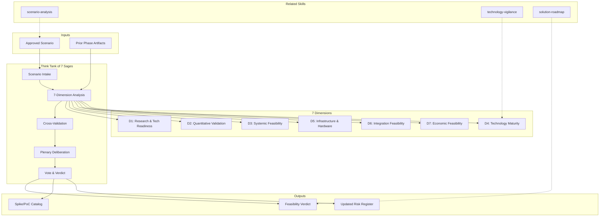

# Multidimensional Feasibility: Think Tank of 7 Sages

Validates approved modernization scenarios with postdoctoral-level research rigor across 7 dimensions.
The Think Tank operates as a council of 7 specialized researchers — each bringing deep expertise in their
dimension — who deliberate collectively to produce a feasibility verdict that is evidence-based, not opinion-based.

**This is NOT a rubber stamp. This is the last line of defense before committing resources.**

## Grounding Guideline

**If there is no evidence, there is no feasibility. If there is no feasibility, there is no roadmap.**

Every claim must carry evidence classified by strength:
- **Level 1 (Strongest)**: [CÓDIGO], [CONFIG], [BENCHMARK] — verifiable, reproducible
- **Level 2**: [DOC], [VENDOR-DOC], [ACADEMIC] — documented, cited
- **Level 3**: [STAKEHOLDER] — reported by identifiable person
- **Level 4 (Weakest)**: [INFERENCIA] — deduced from patterns
- **Level 5 (Requires Validation)**: [SUPUESTO] — assumed, requires spike/PoC

### Think Tank Philosophy

1. **7 dimensions are indivisible.** A technically brilliant project that ignores technology maturity or infrastructure limits fails just the same. Partial feasibility is false feasibility.
2. **Dissent is value, not noise.** Minority positions are documented with the same rigor as majority positions. Often, the dissenting sage is right.
3. **The verdict is collective.** Requires agreement from 5 out of 7 sages minimum. The conductor facilitates, does not vote.
4. **Cross-validation is mandatory.** Each finding reviewed by at least 2 sages from other dimensions. Prevents silos and blind spots.
5. **Unanimous risk = BLOCKER.** If all 7 sages identify the same risk, it is a showstopper until validated.

## The 7 Think Tank Dimensions

### D1: Research & Technology Readiness (research-scientist)
- Do the technical claims have documented academic or industrial backing?
- What is the TRL (Technology Readiness Level) of each proposed component?
- Do case studies of similar successful migrations exist?
- What does the literature say about the proposed patterns at the required scale?
- For claims without evidence: what is the experimental design (spike/PoC) to validate?

### D2: Quantitative Validation (data-scientist)
- Do the scenario numbers withstand sensitivity analysis (plus or minus 25%)?
- Are the performance projections statistically credible?
- Are the cited benchmarks comparable (same scale, same domain)?
- Is there optimism bias in the estimates?
- Are the confidence intervals acceptable for the decision?

### D3: Systemic Feasibility (systems-theorist)
- Does the proposed architecture as a complex system have undesired emergent behaviors?
- What are the possible failure cascades?
- Are the feedback loops stabilizing or destabilizing?
- Is the team topology compatible with the architecture topology (Conway's Law)?
- Are there tipping points where the system changes behavior?

### D4: Technology Maturity (technology-scout)
- Is each proposed technology in an appropriate adoption cycle phase?
- Is the ecosystem (community, releases, corporate backing) healthy?
- What is the vendor lock-in risk and its exit cost?
- Do viable alternatives exist if the chosen technology does not deliver?
- Is the technology trajectory growth, plateau, or decline?

### D5: Infrastructure & Hardware (hardware-systems-engineer)
- Do the infrastructure assumptions respect the provider's limits?
- What is the theoretical scaling ceiling before degradation?
- Is the physical latency between regions compatible with the proposed SLAs?
- Is data gravity (where data lives vs. where it is computed) considered?
- Do the cloud provider's service limits and quotas permit the proposed design?

### D6: Integration Feasibility (integration-researcher)
- Are the protocols at each integration point compatible (current to proposed)?
- Are the required data transformations viable?
- Is backward compatibility during transition achievable?
- Are there integrations requiring simultaneous cross-team or cross-vendor changes?
- Are the API contracts stable or in flux?

### D7: Economic Feasibility (economics-researcher)
- Are the effort estimates consistent with ISBSG benchmarks?
- Have the main cost drivers been identified and quantified?
- Is the learning curve (team ramp-up) included in the estimates?
- Does the compound cost of technical debt justify the investment?
- Does the Monte Carlo cost simulation produce an acceptable range?
- **FTE-months ONLY. NEVER prices.**

## Delivery Structure

### S1: Executive Summary
- Verdict, confidence level, top risks, top validations
- 3-5 bullets for the executive (Level 0 progressive disclosure)

### S2: Claim Evidence Matrix
Full inventory of claims with evidence strength, cross-validation, and status.

### S3: Dimensional Analysis (7 sections)
One section per sage: findings, evidence, risks, score 1-5, mitigations.

### S4: Systemic Risk Map
Dependency graph with failure cascades. Conway's Law assessment diagram.

### S5: Spike & PoC Catalog
MUST-DO / SHOULD-DO / COULD-DO with measurable success criteria.

### S6: Think Tank Verdict
Collective verdict with voting record, conditions, dissenting positions.

### S7: Updated Risk Register
Cumulative risk register with Think Tank findings merged.

## Think Tank Deliberation Protocol

```
PHASE 1: INDIVIDUAL ANALYSIS (parallel)
  → Each sage analyzes their dimension independently
  → Produces dimensional report with evidence tags

PHASE 2: CROSS-VALIDATION (round-robin)
  → Each report reviewed by at least 2 sages from other dimensions
  → Contradictions, gaps, and blind spots identified

PHASE 3: PLENARY DELIBERATION
  → Presentation of findings with evidence tags
  → Debate on identified contradictions
  → Identification of consensus vs dissent

PHASE 4: VOTE
  → FEASIBLE / FEASIBLE WITH CONDITIONS / NOT FEASIBLE
  → Requires agreement from at least 5 out of 7
  → Dissent documented with complete rationale

PHASE 5: VERDICT
  → Composite score (weighted average of 7 dimensions)
  → Confidence level based on average evidence strength
  → Mandatory conditions and spikes
  → Recommendation: PROCEED / HOLD / PIVOT
```

## Trade-off Matrix

| Decision | Enables | Constrains | When to Use |
|---|---|---|---|
| Full 7-dimension Think Tank | Maximum confidence, postdoc rigor | 3-5 days effort | High-investment transformations |
| 4-dimension fast track (D1+D3+D5+D7) | Focused validation | Misses maturity/integration/stats | Medium projects, time pressure |
| Single-dimension deep dive | Expert-level depth | No systemic view | Targeted validation of specific concern |
| Paper analysis only | Fastest | Lower confidence | Time-constrained, low-risk projects |

## When to Use
- After Gate 1 (scenario approval), before Phase 4 (roadmap)
- When investment exceeds 50 FTE-months
- When proposal involves unproven technology at scale
- When stakeholders need "postdoctoral confidence" in feasibility
- When prior projects in similar domain have failed

## When NOT to Use
- Express discovery (time constraint overrides depth)
- Pure infrastructure migrations with no architecture change
- Projects under 10 FTE-months (overhead exceeds value)

## Edge Cases

| Scenario | Response |
|---|---|
| All 7 sages agree: FEASIBLE | Rare. Document evidence strength. Reduce contingency. |
| 4-3 split vote | Document both positions. Recommend targeted spike for contested dimension. |
| 3 or more sages flag same risk | Automatic BLOCKER. Must-validate before Phase 4. |
| No codebase access | All D1 claims marked [INFERENCIA]. Increase uncertainty. Recommend code access as condition. |
| Vendor refuses to share benchmarks | Flag as [VENDOR-DOC: UNAVAILABLE]. Increase risk score for D4. |
| Conway's Law violation detected | CRITICAL FLAG. Architecture feasible but org structure incompatible. Requires org change or architecture adjustment. |

## Validation Gate
- [ ] 7 dimensional analyses complete with evidence tags
- [ ] Cross-validation: each finding reviewed by at least 2 other sages
- [ ] Unanimous risks documented as BLOCKERs
- [ ] MUST-DO spikes defined with measurable success criteria
- [ ] Verdict with agreement from at least 5 out of 7
- [ ] Risk register updated with Think Tank findings
- [ ] Mermaid diagrams: dependency graph + risk heatmap

## Output Format Protocol

| Format | Default | Description |
|--------|---------|-------------|
| `markdown` | Yes | Rich Markdown + Mermaid diagrams. Token-efficient. |
| `html` | On demand | Branded HTML (Design System). Visual impact. |
| `dual` | On demand | Both formats. |

## Output Configuration

- **Language**: Spanish (Latin American, business register — simple, clear, concise, direct)
- **Attribution**: Expert committee of the MetodologIA Discovery Framework
- **Tagline**: *"Construido por profesionales, potenciado por la red agéntica de MetodologIA."*

## Output Artifact
**Primary:** `05b_Feasibility_ThinkTank_{project}.md`

### Diagrams (Mermaid)
- Flowchart TD: system dependency graph with failure cascade paths
- QuadrantChart: risk positioning (probability x impact) by dimension

## Assumptions & Limits
- Requires approved scenario from Phase 3 (or candidate for pre-approval)
- Cannot replace actual spike/PoC execution — designs the validation, does not execute it
- Economic analysis produces magnitudes and intervals, NEVER prices
- Academic evidence limited to what is searchable — may miss proprietary research

## Edge Cases

| Case | Handling Strategy |
|------|---------------------|
| No codebase access available for D1 (Research & Technology Readiness) validation | Mark all D1 technical claims as [INFERENCIA]; increase uncertainty margins by 30%; add "codebase access" as a mandatory condition in the verdict; recommend code-level spike as MUST-DO |
| Vendor refuses to share benchmarks or internal documentation for D4 assessment | Flag as [VENDOR-DOC: UNAVAILABLE]; increase D4 risk score by 1 point; recommend independent benchmarking PoC; add vendor transparency as a contractual condition |
| Think Tank vote results in a 4-3 split (minimum 5 required for verdict) | Document both majority and minority positions with full evidence; recommend targeted spike on the contested dimension(s); schedule re-vote after spike results are available |
| All 7 sages agree FEASIBLE with high confidence — unanimous positive verdict | Rare case. Verify evidence strength across all dimensions; reduce contingency budget by 10-15%; document as "high confidence" but maintain standard governance gates |

## Decisions & Trade-offs

| Decision | Discarded Alternative | Justification |
|----------|----------------------|---------------|
| Require 5-of-7 sage agreement for a binding verdict | Simple majority (4-of-7) or unanimous (7-of-7) | Simple majority allows too-narrow margins on critical decisions; unanimity is unrealistic for complex multi-dimensional analysis; 5-of-7 ensures strong consensus while allowing productive dissent |
| Cross-validate every finding with at least 2 sages from other dimensions | Allow each sage to work independently without peer review | Independent analysis creates dimensional silos; cross-validation catches blind spots where one dimension's assumption is another dimension's risk |
| Document dissenting positions with equal rigor as majority positions | Suppress minority opinions in favor of clean recommendations | Dissenting sages are often the first to detect risks that the majority overlooks; suppressing dissent reduces the value of the multi-dimensional approach |
| Economic analysis produces FTE-months and magnitude ranges, NEVER prices | Include specific pricing for vendor comparisons | Pricing is volatile, context-dependent, and becomes stale; FTE-months and magnitude ranges provide stable decision inputs that remain valid across geographies and market conditions |

## Knowledge Graph



## Output Templates

### Markdown (default)
- Filename: `05b_Feasibility_ThinkTank_{cliente}_{WIP}.md`
- Structure: TL;DR > Executive Summary (verdict + confidence) > Claim Evidence Matrix > 7 Dimensional Analysis sections > Systemic Risk Map > Spike/PoC Catalog > Think Tank Verdict with voting record > Updated Risk Register > Mermaid dependency graph + quadrant chart > ghost menu

### HTML
- Filename: `05b_Feasibility_ThinkTank_{cliente}_{WIP}.html`
- Structure: MetodologIA Design System v4; verdict banner at top with confidence indicator; collapsible dimensional sections; interactive risk heatmap; evidence strength color coding; Mermaid embedded diagrams; print-ready

### DOCX (bajo demanda)
- Filename: `{fase}_Feasibility_ThinkTank_{cliente}_{WIP}.docx`
- Generado via python-docx con MetodologIA Design System v5. Portada con logo y metadatos, TOC automatico, headers/footers con nombre del skill y numeracion, tablas zebra, titulos Poppins navy, cuerpo Trebuchet MS, acentos gold.

### XLSX (bajo demanda)
- Filename: `{fase}_Feasibility_ThinkTank_{cliente}_{WIP}.xlsx`
- Generado via openpyxl con MetodologIA Design System v5. Headers navy con texto blanco Poppins, formato condicional por nivel de evidencia (L1–L5) y veredicto dimensional, auto-filtros en todas las columnas, valores calculados sin formulas. Hojas: Claim Evidence Matrix, 7-Dimension Scores, Risk Register, Spike Catalog.

### PPTX (bajo demanda)
- Filename: `{fase}_Feasibility_ThinkTank_{cliente}_{WIP}.pptx`
- Generado via python-pptx con MetodologIA Design System v5. Slide master navy gradient, titulos Poppins, cuerpo Trebuchet MS, acentos gold. Max 20 slides variante ejecutiva / 30 variante tecnica. Speaker notes con referencias de evidencia [DOC]/[INFERENCIA]/[SUPUESTO].

## Evaluacion

| Dimension | Peso | Criterio |
|-----------|------|----------|
| Trigger Accuracy | 10% | Descripcion activa triggers correctos sin falsos positivos |
| Completeness | 25% | Todos los entregables cubren el dominio sin huecos |
| Clarity | 20% | Instrucciones ejecutables sin ambiguedad |
| Robustness | 20% | Maneja edge cases y variantes de input |
| Efficiency | 10% | Proceso no tiene pasos redundantes |
| Value Density | 15% | Cada seccion aporta valor practico directo |

**Umbral minimo**: 7/10 en cada dimension para considerar el skill production-ready.

---
**Autor:** Javier Montaño | **Ultima actualizacion:** 15 de marzo de 2026