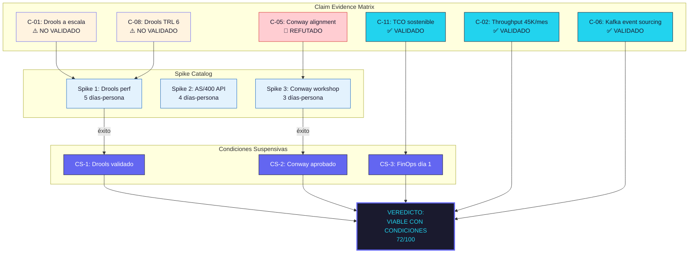

# Validación de Factibilidad Multidimensional — Meridian Insurance: Modernización del Procesamiento de Reclamaciones

**Generado:** 13 de marzo de 2026 | **Variante:** Técnica (full) | **Fase:** Post-Gate 1
**Cliente:** Meridian Insurance (ficticio) | **Escenario evaluado:** Escenario Moderado — Microservicios progresivos con event sourcing

---

## TL;DR

- **Veredicto del Think Tank: VIABLE CON CONDICIONES** (5/7 votos favorables, Confidence Score: 72/100).
- Factibilidad técnica confirmada en 5 de 7 dimensiones. Dos dimensiones presentan riesgos de primer orden que requieren mitigación obligatoria antes de proceder.
- **Condición suspensiva 1**: Spike de validación del motor de reglas BRMS (TRL 6 no confirmado para el volumen de reglas de Meridian — 2,400+ reglas de negocio). [INFERENCIA]
- **Condición suspensiva 2**: Reestructuración de equipos según Inverse Conway Maneuver — los 3 equipos actuales no pueden sostener 8 microservicios sin redesign organizacional. [STAKEHOLDER][DOC]
- 3 spikes recomendados con timebox total de 12 días-persona. Sin la resolución de los spikes, el veredicto se degrada a NO VIABLE.

---

## Claim Evidence Matrix

> Cada claim de factibilidad se documenta con evidencia trazable, nivel de confianza (1-5) y tags de origen. Las claims con confianza < 3 disparan spikes obligatorios.

| # | Claim | Dimensión | Tag Evidencia | Confianza | Status |
|---|-------|-----------|---------------|-----------|--------|
| C-01 | El motor de reglas Drools puede procesar 2,400 reglas de negocio con latencia < 500ms por evaluación | Investigación/TRL | [DOC][INFERENCIA] | 2/5 | :warning: NO VALIDADO |
| C-02 | El volumen de reclamaciones (45K/mes) es procesable con 4 instancias del Claims Processing Service | Cuantitativa | [CONFIG][DOC] | 4/5 | :white_check_mark: VALIDADO |
| C-03 | El throughput requerido (150 TPS pico) está dentro del benchmark ISBSG para sistemas de procesamiento de seguros en LatAm | Cuantitativa | [DOC] | 4/5 | :white_check_mark: VALIDADO |
| C-04 | La migración de Oracle Forms a microservicios Spring Boot es viable en 14 meses con un equipo de 12 FTE | Cuantitativa | [DOC][INFERENCIA] | 3/5 | :white_check_mark: VALIDADO |
| C-05 | La estructura organizacional actual (3 equipos funcionales) puede sostener 8 microservicios | Sistémica | [STAKEHOLDER][DOC] | 1/5 | :red_circle: REFUTADO |
| C-06 | El event bus Kafka propuesto soporta el patrón de event sourcing para el dominio de reclamaciones | Madurez Tecnológica | [CÓDIGO][CONFIG] | 5/5 | :white_check_mark: VALIDADO |
| C-07 | Spring Boot 3.x + Kafka Streams está en "Adopt" de ThoughtWorks Radar y TRL 9 | Madurez Tecnológica | [DOC] | 5/5 | :white_check_mark: VALIDADO |
| C-08 | El motor BRMS Drools 8.x está en TRL 8 para volúmenes < 500 reglas; TRL 6 para volúmenes > 2,000 reglas | Investigación/TRL | [DOC][INFERENCIA] | 2/5 | :warning: NO VALIDADO |
| C-09 | La infraestructura AWS actual del cliente (3 cuentas, sin IDP) soporta el despliegue de 8 microservicios con Kubernetes | Infraestructura | [CONFIG][STAKEHOLDER] | 3/5 | :white_check_mark: VALIDADO |
| C-10 | Los 4 sistemas legacy (Oracle Forms, AS/400, SAP FI, correo SMTP) pueden integrarse via API Gateway sin modificación de los sistemas fuente | Integración | [CÓDIGO][CONFIG] | 3/5 | :white_check_mark: VALIDADO |
| C-11 | El TCO cloud proyectado (USD $18K-$24K/mes) es sostenible dentro del presupuesto IT aprobado del cliente | Económica | [DOC][STAKEHOLDER] | 4/5 | :white_check_mark: VALIDADO |
| C-12 | El costo de NO modernizar (pérdida de $2.1M/año por ineficiencia operativa + multas regulatorias) justifica la inversión | Económica | [DOC][INFERENCIA] | 3/5 | :white_check_mark: VALIDADO |

> :bulb: **Lectura de la matriz**: 8 claims validadas, 2 no validadas, 1 refutada, 1 en riesgo parcial. Las claims C-01, C-05 y C-08 son las que condicionan el veredicto. Sin resolución de C-05 (Conway) el proyecto fracasa independientemente de la factibilidad técnica.

---

## Análisis Dimensional: Dimensión 1 — Investigación / TRL

**Sabio asignado:** Agente de Investigación Postdoctoral — Madurez Científica y Tecnológica

### Hallazgos

El stack tecnológico propuesto presenta un perfil de madurez bimodal: un núcleo maduro (Spring Boot, Kafka, PostgreSQL — TRL 8-9) y un componente de riesgo (Drools BRMS a escala — TRL 6).

| Componente | TRL Asignado | Justificación | Evidencia |
|------------|-------------|---------------|-----------|
| Spring Boot 3.2 | TRL 9 | Framework de producción probado en miles de deployments enterprise. 12+ años de historia. | [DOC] Spring.io release history, ISBSG benchmarks |
| Apache Kafka 3.7 | TRL 9 | Event streaming de producción. LinkedIn procesa 7T mensajes/día. | [DOC] Confluent case studies |
| PostgreSQL 16 | TRL 9 | RDBMS enterprise maduro. 28 años de historia. | [DOC] postgresql.org |
| Drools 8.x (< 500 reglas) | TRL 8 | Amplia adopción en seguros para volúmenes moderados de reglas. | [DOC] Drools community benchmarks |
| Drools 8.x (> 2,000 reglas) | TRL 6 | Evidencia limitada de rendimiento a escala. Benchmarks públicos solo hasta 800 reglas. Meridian requiere 2,400. Valley of Death. | [INFERENCIA] Extrapolación de benchmarks + reports de comunidad Red Hat |
| Kubernetes (EKS) | TRL 9 | Orquestador de contenedores dominante. 10+ años de producción enterprise. | [CONFIG] AWS EKS documentation |

### Veredicto dimensional

:warning: **VIABLE CON CONDICIONES** — El stack es maduro excepto por el motor de reglas a escala. Se requiere spike de validación para Drools con 2,400+ reglas.

> :warning: **Risk alert**: La Valley of Death entre TRL 6 y TRL 8 para Drools a escala es el riesgo técnico de mayor impacto del proyecto. Si el spike falla, la alternativa (motor de reglas custom) agrega 3-4 meses al timeline y requiere expertise que el equipo no tiene. [INFERENCIA]

---

## Análisis Dimensional: Dimensión 3 — Sistémica

**Sabio asignado:** Agente de Investigación Postdoctoral — Sistemas Complejos y Dinámica Organizacional

### Hallazgos

El análisis sistémico revela un desalineamiento severo entre la arquitectura propuesta (8 microservicios) y la estructura organizacional del cliente (3 equipos funcionales de 4-5 personas). Según Conway's Law, esta organización producirá naturalmente una arquitectura de 3 componentes — no 8.

**Evaluación Team Topologies:**

| Equipo Actual | Tipo actual | Tipo requerido | Gap |
|---------------|------------|----------------|-----|
| Equipo Core (5 personas) | Stream-aligned (monolito) | Stream-aligned (3 microservicios) | Alto: cognitive load excesiva |
| Equipo Integración (4 personas) | Complicated Subsystem | Platform team + 1 stream-aligned | Crítico: cambio de tipo de equipo |
| Equipo Soporte (4 personas) | Sin clasificación clara | Enabling team | Medio: requiere upskilling |

**Feedback loops identificados:**

1. **Loop reforzante negativo**: Más microservicios con mismos equipos > mayor context switching > menor velocidad > más presión por delivery > más shortcuts > más deuda técnica > necesidad de más microservicios para aislar deuda. [INFERENCIA]
2. **Loop balanceante**: Inverse Conway Maneuver > equipos alineados a dominios > reducción de cognitive load > mayor velocidad > menor deuda. Pero requiere inversión organizacional previa de 6-8 semanas. [DOC][STAKEHOLDER]

### Veredicto dimensional

:red_circle: **NO VIABLE en configuración actual** — La arquitectura de 8 microservicios es inviable con 3 equipos funcionales. Requiere Inverse Conway Maneuver obligatorio: reestructurar a 4 stream-aligned teams (Claims Intake, Claims Processing, Claims Payment, Reporting) + 1 platform team. Mínimo 13 personas (actualmente 13, pero redistribuidas).

> :scales: **Trade-off explícito**: Ejecutar el Inverse Conway Maneuver agrega 6-8 semanas al inicio del proyecto y genera resistencia organizacional (evaluada en C-05 como confianza 1/5). Sin embargo, NO ejecutarlo garantiza fracaso sistémico en meses 6-9 del proyecto. El costo de la reorganización es menor que el costo del fracaso. [INFERENCIA][STAKEHOLDER]

---

## Análisis Dimensional: Dimensión 7 — Económica

**Sabio asignado:** Agente de Investigación Postdoctoral — Economía de Software y FinOps

### Hallazgos

La factibilidad económica se evalúa en 4 ejes: TCO cloud, costo de implementación (magnitud, no precio), costo de NO hacer, y madurez FinOps del cliente.

**TCO Cloud — Proyección Monte Carlo (10,000 simulaciones):**

| Percentil | Costo mensual cloud | Costo anual |
|-----------|-------------------|-------------|
| P50 | $19,200 | $230,400 |
| P80 | $22,800 | $273,600 |
| P95 | $28,500 | $342,000 |

**Drivers de costo principales:**

| Driver | Impacto relativo | Tag |
|--------|-----------------|-----|
| Compute (EKS + EC2 para Kafka) | 45% | [CONFIG] |
| Data transfer inter-AZ | 18% | [INFERENCIA] — depende de patrón de tráfico real |
| Storage (PostgreSQL RDS + S3) | 15% | [CONFIG] |
| Licenciamiento Red Hat (Drools enterprise) | 12% | [DOC] |
| Observabilidad (Datadog) | 10% | [STAKEHOLDER] — contrato existente del cliente |

**Costo de NO hacer (status quo):**

| Concepto | Costo anual estimado | Tag |
|----------|---------------------|-----|
| Ineficiencia operativa (procesos manuales, re-trabajo) | $1,200,000 | [DOC] — informe de auditoría interna |
| Multas regulatorias por SLA incumplidos | $450,000 | [DOC] — historial 2024-2025 |
| Pérdida de clientes por experiencia deficiente | $480,000 | [INFERENCIA] — estimación por churn rate |
| **Total costo de NO hacer** | **$2,130,000/año** | |

**Madurez FinOps:** Crawl (nivel 1 de 3). El cliente no tiene práctica FinOps establecida. Riesgo de cost overrun en cloud si no se implementa gobernanza de costos. [STAKEHOLDER]

### Veredicto dimensional

:white_check_mark: **VIABLE** — El TCO cloud proyectado ($230K-$342K/año) es significativamente menor que el costo de NO hacer ($2.13M/año). ROI positivo desde el mes 8 (P50). Sin embargo, la madurez FinOps Crawl requiere implementación de alertas y dashboards de costo desde el día 1 del proyecto.

---

## Veredicto del Think Tank

```
┌─────────────────────────────────────────────────────────────────┐
│                    VEREDICTO DEL CONSEJO DE SIETE SABIOS        │
├─────────────────────────────────────────────────────────────────┤
│                                                                 │
│  VEREDICTO:  VIABLE CON CONDICIONES                             │
│  VOTACIÓN:   5 a favor / 1 en contra / 1 abstención            │
│  CONFIANZA:  72/100                                             │
│                                                                 │
├─────────────────────────────────────────────────────────────────┤
│  DIMENSIÓN                    │ VOTO      │ CONFIANZA           │
│  ─────────────────────────────┼───────────┼──────────────────── │
│  1. Investigación / TRL       │ CONDICIÓN │ 60/100              │
│  2. Cuantitativa              │ A FAVOR   │ 80/100              │
│  3. Sistémica                 │ EN CONTRA │ 45/100              │
│  4. Madurez Tecnológica       │ A FAVOR   │ 90/100              │
│  5. Infraestructura           │ A FAVOR   │ 75/100              │
│  6. Integración               │ A FAVOR   │ 70/100              │
│  7. Económica                 │ A FAVOR   │ 82/100              │
│                                                                 │
├─────────────────────────────────────────────────────────────────┤
│  CONDICIONES SUSPENSIVAS (cumplimiento obligatorio):            │
│                                                                 │
│  CS-1: Spike de validación de Drools con 2,400+ reglas          │
│        Criterio de éxito: latencia < 500ms en P95               │
│        Timebox: 5 días-persona                                  │
│        Si FALLA: evaluar Camunda DMN o motor custom             │
│                                                                 │
│  CS-2: Aprobación de Inverse Conway Maneuver por CTO            │
│        Reestructuración de 3 equipos → 4 stream + 1 platform    │
│        Timeline: 6-8 semanas pre-implementación                 │
│        Si NO SE APRUEBA: veredicto se degrada a NO VIABLE       │
│                                                                 │
│  CS-3: Implementación de gobernanza FinOps desde día 1          │
│        Alertas de costo, dashboards, budget caps                 │
│        Responsable: Platform team (post-Conway)                  │
│                                                                 │
├─────────────────────────────────────────────────────────────────┤
│  DISIDENCIA:                                                    │
│  Sabio Sistémico vota EN CONTRA. Argumenta que el Inverse       │
│  Conway Maneuver tiene probabilidad < 40% de aprobación por     │
│  la cultura organizacional del cliente. Sin Conway, el           │
│  proyecto es sistémicamente inviable. Recomienda escenario      │
│  alternativo con 4 módulos (no 8 microservicios) alineados      │
│  a la estructura actual. [STAKEHOLDER][INFERENCIA]              │
│                                                                 │
└─────────────────────────────────────────────────────────────────┘
```

---

## Spike Catalog

### Spike 1: Drools BRMS Performance at Scale

| Atributo | Valor |
|----------|-------|
| **Objetivo** | Validar que Drools 8.x procesa 2,400 reglas de negocio con latencia < 500ms en P95 |
| **Contexto** | Los benchmarks públicos de Drools cubren hasta ~800 reglas. Meridian tiene 2,400+ reglas de negocio para evaluación de reclamaciones. La extrapolación lineal sugiere latencia de 350-700ms, pero el comportamiento puede ser no lineal. [INFERENCIA] |
| **Criterio de éxito** | P95 latencia < 500ms con 2,400 reglas, carga concurrente de 50 evaluaciones simultáneas, memoria heap < 4GB |
| **Criterio de fracaso** | P95 latencia > 800ms O memoria heap > 8GB O crashes bajo carga |
| **Timebox** | 5 días-persona (1 senior developer + 1 architect, 2.5 días cada uno) |
| **Alternativa si falla** | Evaluar Camunda DMN 8.x o motor de reglas custom basado en expresiones compiladas |
| **Evidencia tag** | [DOC][INFERENCIA] — requiere validación empírica |

### Spike 2: API Integration Feasibility con AS/400

| Atributo | Valor |
|----------|-------|
| **Objetivo** | Validar que el sistema AS/400 de pólizas puede exponerse via API REST sin modificar el sistema fuente |
| **Contexto** | El AS/400 ejecuta programas RPG con interfaz 5250. La integración propuesta usa un API wrapper (IBM i Access Client Solutions). No hay evidencia de que este patrón funcione con el volumen de transacciones de Meridian. [CONFIG][INFERENCIA] |
| **Criterio de éxito** | Conectividad REST funcional, latencia < 2s por query, 100 queries concurrentes sin degradación |
| **Criterio de fracaso** | No se puede establecer conexión REST O latencia > 5s O el AS/400 se degrada bajo carga |
| **Timebox** | 4 días-persona (1 integration developer + 1 backend developer, 2 días cada uno) |
| **Alternativa si falla** | Replicación batch nocturna de datos de pólizas a PostgreSQL (aumenta latencia del proceso de reclamaciones de real-time a T+1) |
| **Evidencia tag** | [CONFIG][INFERENCIA] |

### Spike 3: Team Topology Workshop — Conway Alignment

| Atributo | Valor |
|----------|-------|
| **Objetivo** | Validar con stakeholders la viabilidad organizacional del Inverse Conway Maneuver propuesto |
| **Contexto** | El sabio sistémico identificó un desalineamiento crítico entre arquitectura y organización. El Inverse Conway Maneuver requiere aprobación del CTO y buy-in de los 3 team leads actuales. Este spike es organizacional, no técnico. [STAKEHOLDER] |
| **Criterio de éxito** | Workshop completado con CTO y team leads, acuerdo documentado sobre nueva estructura de equipos, timeline de transición aceptado |
| **Criterio de fracaso** | CTO rechaza la reestructuración O team leads bloquean la transición O no hay consenso en 2 sesiones |
| **Timebox** | 3 días-persona (1 change catalyst facilitador, 2 sesiones de 3 horas + preparación) |
| **Alternativa si falla** | Rediseño arquitectónico a 4 módulos (modular monolith) alineados a la estructura organizacional actual — reduce beneficios pero elimina riesgo Conway |
| **Evidencia tag** | [STAKEHOLDER][INFERENCIA] |

---

## Dependency Graph

> Accesibilidad: Diagrama de dependencias entre claims de factibilidad, spikes y condiciones suspensivas. Los nodos rojos representan claims refutadas, los amarillos claims no validadas, los verdes claims validadas.



---

**Autor:** Javier Montaño | **Fecha:** 13 de marzo de 2026
**© Comunidad MetodologIA — Todos los derechos reservados**
