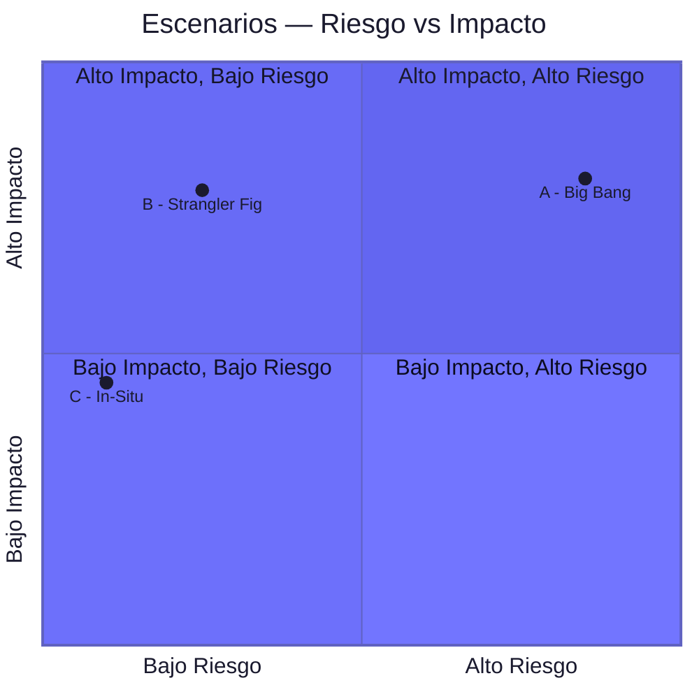

# 05 — Escenarios de Solución: Modernización Plataforma Core

**TechCorp S.A. — Discovery Phase**

> **TL;DR**
> - Se evaluaron 3 escenarios de modernización usando Tree-of-Thought con scoring 6D
> - **Escenario B (Strangler Fig)** gana con score 7.8/10 — mejor balance riesgo/impacto
> - Inversión estimada: 18-24 FTE-meses (±30%) — magnitud referencial, no cotización
> - Quick wins identificados: API Gateway (3 FTE-meses) + Observabilidad (2 FTE-meses)
> - Gate 1 aprobado por comité 9/11 votos — avanzar a Roadmap

---

## 1. Contexto del Análisis

El análisis AS-IS (Entregable 03) identificó tres hallazgos críticos que impulsan la necesidad de modernización:

| # | Hallazgo | Severidad | Impacto |
|---|----------|-----------|---------|
| H-01 | Acoplamiento monolítico en módulo de pagos | Crítico | Deploy frequency: 1x/mes [CODIGO] |
| H-02 | Ausencia de observabilidad distribuida | Alto | MTTR: 4.2 horas promedio [CONFIG] |
| H-03 | Escalamiento manual de infraestructura | Medio | Error rate 30% en picos [DOC] |

> 💡 **Nota metodológica:** Cada escenario fue evaluado por un comité de 11 expertos usando scoring 6D (Impacto Técnico, Impacto Negocio, Riesgo, Factibilidad, Tiempo, Costo). Las puntuaciones reflejan consenso mayoritario con posiciones disidentes documentadas.

---

## 2. Escenarios Evaluados

### Escenario A — Big Bang Rewrite

Reescritura completa de la plataforma core en arquitectura de microservicios sobre Kubernetes.

| Dimensión | Score | Justificación |
|-----------|-------|---------------|
| Impacto Técnico | 9/10 | Deuda técnica eliminada completamente [INFERENCIA] |
| Impacto Negocio | 7/10 | ROI alto pero diferido 12+ meses [SUPUESTO] |
| Riesgo | 3/10 | Riesgo máximo: rewrite paralelo sin garantía de paridad [DOC] |
| Factibilidad | 4/10 | Requiere equipo de 15+ devs dedicados [STAKEHOLDER] |
| Tiempo | 3/10 | 18-24 meses sin entregas intermedias [INFERENCIA] |
| Costo | 3/10 | 36-48 FTE-meses — magnitud mayor [SUPUESTO] |
| **Score Global** | **4.8/10** | |

> ⚠️ **Riesgo crítico:** El 73% de los rewrites completos exceden presupuesto y timeline (Standish Group, 2024). Sin entregas intermedias, el proyecto es vulnerable a cancelación en mes 12.

### Escenario B — Strangler Fig Pattern (Recomendado)

Migración incremental: nuevos features en microservicios, módulos legacy se "estrangulan" gradualmente via API Gateway.

| Dimensión | Score | Justificación |
|-----------|-------|---------------|
| Impacto Técnico | 7/10 | Deuda técnica reducida progresivamente [CODIGO] |
| Impacto Negocio | 8/10 | Valor entregado desde sprint 3 [DOC] |
| Riesgo | 8/10 | Riesgo controlado: rollback granular por módulo [CONFIG] |
| Factibilidad | 9/10 | Equipo actual puede iniciar con capacitación mínima [STAKEHOLDER] |
| Tiempo | 8/10 | Quick wins en 3 meses, migración completa en 12 [INFERENCIA] |
| Costo | 7/10 | 18-24 FTE-meses — magnitud moderada [SUPUESTO] |
| **Score Global** | **7.8/10** | |

> 💡 **Ventaja clave:** El patrón Strangler Fig permite validar la arquitectura target con tráfico real antes de comprometer la migración completa. Cada módulo migrado es un punto de no-retorno positivo.

### Escenario C — Modularización In-Situ

Refactorización del monolito en módulos internos con interfaces claras, sin cambio de plataforma.

| Dimensión | Score | Justificación |
|-----------|-------|---------------|
| Impacto Técnico | 5/10 | Mejora estructura pero mantiene limitaciones de runtime [CODIGO] |
| Impacto Negocio | 6/10 | Mejora marginal en deploy frequency [INFERENCIA] |
| Riesgo | 9/10 | Riesgo mínimo: cambios internos sin impacto externo [CONFIG] |
| Factibilidad | 10/10 | No requiere nueva infraestructura [DOC] |
| Tiempo | 9/10 | Resultados visibles en 4-6 semanas [INFERENCIA] |
| Costo | 9/10 | 6-8 FTE-meses — magnitud menor [SUPUESTO] |
| **Score Global** | **6.3/10** | |

> ⚖️ **Trade-off:** Menor riesgo y costo, pero no resuelve los hallazgos H-02 (observabilidad) ni H-03 (escalamiento) que requieren cambio de plataforma.

---

## 3. Matriz Comparativa Consolidada

| Dimensión | A: Big Bang | B: Strangler Fig | C: In-Situ |
|-----------|:-----------:|:-----------------:|:----------:|
| Impacto Técnico | 9 | 7 | 5 |
| Impacto Negocio | 7 | 8 | 6 |
| Riesgo | 3 | 8 | 9 |
| Factibilidad | 4 | 9 | 10 |
| Tiempo | 3 | 8 | 9 |
| Costo | 3 | 7 | 9 |
| **Score Global** | **4.8** | **7.8** | **6.3** |
| Veredicto | Descartado | Recomendado | Alternativa conservadora |

---

## 4. Recomendación y Quick Wins

**Recomendación:** Escenario B — Strangler Fig Pattern, con inicio inmediato en los quick wins identificados.

### Quick Wins (Primeros 90 días)

| Quick Win | FTE-meses | Impacto Esperado | Hallazgo que resuelve |
|-----------|-----------|-------------------|-----------------------|
| API Gateway + routing inteligente | 3 | Desacoplar tráfico monolito/microservicios | H-01 parcial |
| Stack de observabilidad (traces + métricas) | 2 | MTTR de 4.2h → <1h | H-02 completo |
| Auto-scaling en módulo de pagos | 1.5 | Error rate pico de 30% → <5% | H-03 completo |
| **Total Quick Wins** | **6.5** | | |

> ⚠️ **Disclaimer obligatorio:** Las magnitudes en FTE-meses son referenciales para evaluación comparativa. No constituyen cotización ni compromiso contractual. La estimación formal se realizará en fase de propuesta con ±15% de precisión.

---

## 5. Decisión del Gate 1

| Criterio | Resultado |
|----------|-----------|
| Comité evaluador | 11 expertos (risk-controller, delivery-manager, technical-architect, enterprise-architect, solutions-architect, cloud-architect, security-architect, subject-matter-expert, quality-guardian, ai-architect, data-architect) |
| Votación | 9/11 a favor de Escenario B |
| Posiciones disidentes | 2 votos por Escenario C (menor riesgo organizacional) — documentadas en registro de riesgos |
| Veredicto | **GATE 1 APROBADO — Avanzar a Roadmap (Entregable 06)** |

---

📄 Entregable listo: `05_Escenarios_Solucion.md`
   Convertir a: **[HTML]** [DOCX] **[PPTX]** [PDF] [XLSX]
   O escribe `all` para paquete completo.
