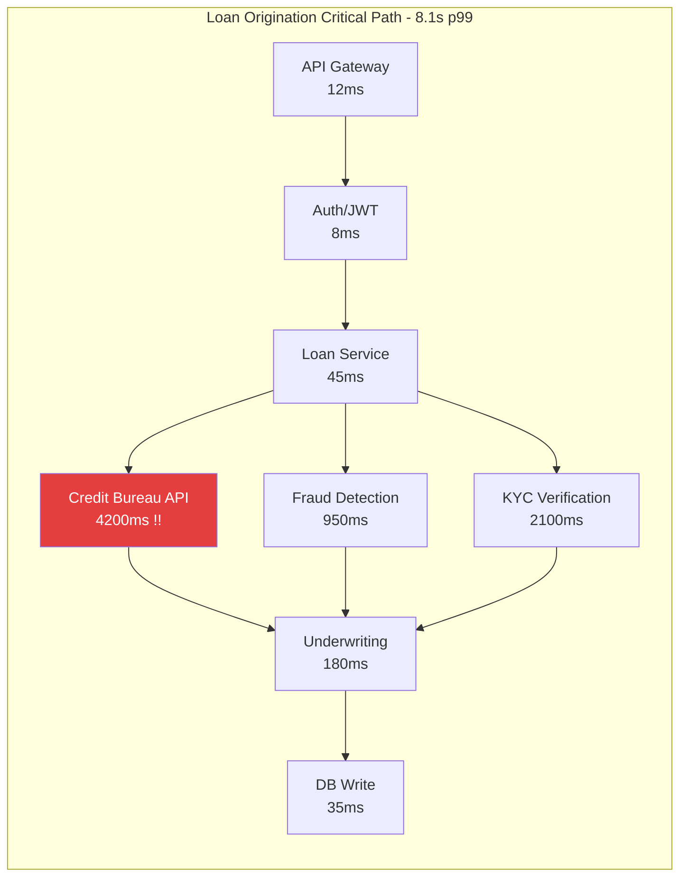
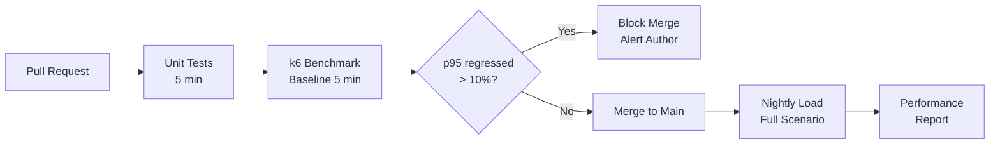

# A-01 Performance Engineering — Acme Corp Banking Modernization

> **Proyecto:** Acme Corp Banking Modernization | **Fecha:** 12 de marzo de 2026
> **Modo:** piloto-auto | **Variante:** tecnica (full)

---

## Executive Summary

Acme Corp's core banking platform processes 12M transactions daily across loan origination, payments, account management, and fraud detection. This assessment establishes performance baselines, designs load testing strategies for peak banking periods (month-end, tax season), builds USL-based capacity models, and defines SLO targets aligned with OCC regulatory requirements. Current p99 latency for loan origination (8.1s) exceeds the 5s target, requiring immediate optimization of the credit bureau integration.

---

## S1: Performance Baseline

### Latency Distribution — Critical Endpoints

| Endpoint | p50 | p90 | p95 | p99 | Target p99 | Status |
|----------|-----|-----|-----|-----|------------|--------|
| POST /loans/apply | 1.2s | 2.8s | 3.8s | 8.1s | 5s | FAIL |
| POST /payments/process | 85ms | 190ms | 290ms | 620ms | 1s | PASS |
| GET /accounts/{id} | 42ms | 120ms | 180ms | 450ms | 500ms | PASS |
| POST /fraud/evaluate | 120ms | 280ms | 380ms | 950ms | 1.5s | PASS |
| POST /kyc/verify | 2.1s | 3.8s | 5.2s | 9.8s | 10s | PASS |
| GET /loans/{id}/status | 18ms | 45ms | 72ms | 180ms | 500ms | PASS |

### Bottleneck Analysis

**Root cause:** Credit Bureau API (Equifax) contributes 4.2s p99 to the loan origination path. This is a synchronous external dependency with no caching layer and no circuit breaker. Timeout set at 15s (too high).

### Resource Utilization

| Component | CPU avg | CPU peak | Memory avg | Connections | Disk I/O |
|-----------|---------|----------|------------|-------------|----------|
| Loan Service (3 pods) | 45% | 78% | 62% | 180/500 | Low |
| Payment Service (5 pods) | 38% | 65% | 48% | 320/1000 | Low |
| Account Service (3 pods) | 22% | 41% | 35% | 90/500 | Low |
| PostgreSQL Primary | 55% | 82% | 71% | 420/500 | Medium |
| PostgreSQL Read Replica | 48% | 73% | 68% | 380/500 | Medium |
| Redis Cache | 12% | 25% | 45% | 210/10000 | N/A |

---

## S2: Load Testing Strategy

### Tool Selection

**Selected: Grafana k6** — JavaScript-based, CI-native, cloud execution option for distributed load. Team already uses Grafana for observability.

### Test Scenarios — Banking Calendar

| Scenario | Type | Load Profile | Duration | Trigger |
|----------|------|-------------|----------|---------|
| Daily baseline | Baseline | 140 TPS steady | 30 min | Every release candidate |
| Month-end peak | Ramp | 140 -> 420 TPS linear | 45 min | Monthly, pre-month-end |
| Tax season surge | Stress | 140 -> 700 TPS | 60 min | Quarterly |
| Wire transfer burst | Spike | 140 -> 1400 TPS for 5 min | 20 min | Pre-release |
| Overnight batch soak | Soak | 80 TPS + batch jobs | 8 hours | Weekly |

### CI/CD Performance Gating

### Regression Thresholds

| Metric | Acceptable | Warning | Block |
|--------|-----------|---------|-------|
| p95 latency change | <5% | 5-10% | >10% |
| Error rate change | <0.1% | 0.1-0.5% | >0.5% |
| Throughput change | <-3% | -3% to -5% | <-5% |
| Memory per request | <2% increase | 2-5% | >5% |

---

## S3: Capacity Planning

### USL Model — Loan Origination Service

Throughput measurements at varying concurrency:

| Concurrent Users | Throughput (TPS) | Latency p95 |
|-----------------|-----------------|-------------|
| 1 | 42 | 180ms |
| 2 | 78 | 195ms |
| 4 | 140 | 220ms |
| 8 | 245 | 310ms |
| 16 | 380 | 520ms |
| 32 | 410 | 1.2s |
| 64 | 350 | 3.8s |

**USL Parameters:** alpha=0.028 (contention), beta=0.0012 (coherency)
**Peak throughput:** ~420 TPS at N=24 concurrent users
**Retrograde point:** Beyond N=32, throughput degrades due to database connection pool contention and distributed lock coordination.

### Capacity Runway

| Component | Current Load | Max Capacity | Runway (months) | Growth Rate |
|-----------|-------------|-------------|-----------------|-------------|
| Loan Service | 45 TPS | 420 TPS | 18 months | 15%/quarter |
| Payment Service | 890 TPS | 2400 TPS | 12 months | 20%/quarter |
| PostgreSQL | 420 connections | 500 max | 3 months | 8%/month |
| Redis Cache | 45% memory | 100% | 14 months | 4%/month |

**Critical alert:** PostgreSQL connection pool reaches capacity in 3 months at current growth. Recommended: implement PgBouncer connection pooling (reduce active connections 60%) and add read replica for reporting queries.

### Scaling Strategy

| Component | Strategy | Trigger | Action |
|-----------|----------|---------|--------|
| Loan Service | Horizontal (HPA) | CPU >60% for 5 min | Add pod (max 8) |
| Payment Service | Horizontal (HPA) | CPU >60% for 5 min | Add pod (max 12) |
| PostgreSQL | Vertical + read replicas | Connections >80% | Scale up instance, add replica |
| Redis | Vertical | Memory >70% | Scale up instance class |
| Kafka | Partition scaling | Consumer lag >5000 | Add partitions + consumers |

---

## S4: Caching Architecture

### Cache Layers

| Layer | Target | Strategy | TTL | Hit Ratio Target |
|-------|--------|----------|-----|-----------------|
| CDN (CloudFront) | Static assets, public pages | Cache-Control headers | 24h | >95% |
| API Gateway | Rate limit counters | In-memory | 1 min | N/A |
| Redis L2 | Account details, product catalog | Cache-aside | 5 min | >85% |
| Application L1 | Configuration, reference data | In-process (Caffeine) | 15 min | >95% |
| Database | Query plan cache | PostgreSQL native | Session | N/A |

### Cache Strategy — Banking-Specific Decisions

| Data Type | Strategy | Invalidation | Rationale |
|-----------|----------|-------------|-----------|
| Account balance | No cache | N/A | Regulatory: must show real-time balance |
| Transaction history | Cache-aside | Event-driven on new transaction | Read-heavy, eventual consistency acceptable for history |
| Product catalog (rates) | Write-through | On rate change event | Rates change daily; consistency critical for loan pricing |
| Customer profile | Cache-aside, 5 min TTL | Event-driven on profile update | Read-heavy, infrequent updates |
| Credit scores | Cache-aside, 24h TTL | Manual invalidation | External data, expensive API call, changes infrequently |

---

## S5: CDN & Edge Strategy

### Content Classification

| Content Type | CDN Cache | TTL | Purge Strategy |
|-------------|-----------|-----|---------------|
| Static assets (JS, CSS, images) | Yes | 30 days | Version hash in filename |
| Public marketing pages | Yes | 1 hour | Surrogate-key purge |
| Authenticated API responses | No | N/A | N/A |
| Document downloads (statements) | Edge-generated | 0 (no-store) | N/A |
| Rate/pricing pages | Yes | 5 min | Event-driven purge on rate change |

### Origin Shield Configuration

CloudFront origin shield enabled in us-east-1 (primary) to reduce origin load. Expected origin request reduction: 65-75% for cacheable content.

---

## S6: SLA/SLO Design

### Percentile-Based SLOs

| Service | Tier | p50 | p95 | p99 | Availability | Error Rate |
|---------|------|-----|-----|-----|-------------|------------|
| Loan Origination | Critical | <1.5s | <4s | <5s | 99.95% | <0.3% |
| Payment Processing | Critical | <100ms | <300ms | <1s | 99.95% | <0.1% |
| Account Service | Standard | <50ms | <200ms | <500ms | 99.9% | <0.5% |
| Fraud Detection | Critical | <150ms | <400ms | <1.5s | 99.95% | <0.05% |
| Reporting/Batch | Best-effort | <2s | <5s | <15s | 99% | <1% |

### Error Budgets

| Service | SLO | Monthly Budget | Budget Consumed (MTD) | Status |
|---------|-----|---------------|----------------------|--------|
| Loan Origination | 99.95% | 21.6 min | 8.2 min (38%) | Healthy |
| Payment Processing | 99.95% | 21.6 min | 14.1 min (65%) | Warning |
| Account Service | 99.9% | 43.2 min | 12.8 min (30%) | Healthy |
| Fraud Detection | 99.95% | 21.6 min | 3.4 min (16%) | Healthy |

**Policy:** When error budget >50% consumed by mid-month, trigger reliability review. When exhausted: feature freeze, mandatory reliability sprint.

### Regulatory SLA Compliance

| Regulation | Requirement | Current | Compliant |
|-----------|------------|---------|-----------|
| OCC Guidance | Core banking availability >99.9% | 99.94% | Yes |
| Reg E | Payment dispute resolution <10 business days | 7 days avg | Yes |
| FFIEC | Incident notification <36 hours | <4 hours | Yes |
| Internal SLA | Loan decision <24 hours | 18 hours avg | Yes |

---

## Validation Checklist

- [x] Baseline uses percentile distribution (p50/p90/p95/p99) for all critical endpoints
- [x] Load test scenarios cover baseline, ramp, stress, spike, and soak conditions
- [x] CI/CD performance gating with 10% p95 regression threshold
- [x] USL-based capacity model with alpha/beta parameters fitted
- [x] Caching strategy respects banking regulatory constraints (no balance caching)
- [x] CDN rules content-type specific with origin shielding
- [x] SLOs are percentile-based with per-service tier classification
- [x] Error budgets tracked with exhaustion policy defined
- [x] PostgreSQL connection pool identified as 3-month critical risk
- [x] Credit Bureau API identified as primary latency bottleneck (4.2s p99)

---
**Autor:** Javier Montano | **Generado por:** metodologia-performance-engineering | **Fecha:** 12 de marzo de 2026
