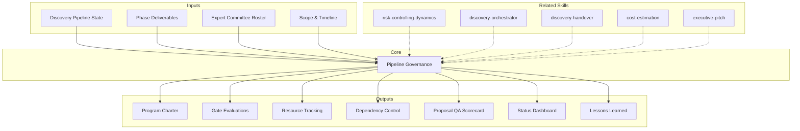

# Pipeline Governance: Discovery Pipeline Governance Backbone

Structural governance layer that manages the discovery pipeline as a formal program —
tracking phases, gates, resources, dependencies, risks, and proposal readiness. Operates
as the connective tissue between all 48 skills, ensuring nothing falls through cracks,
phases do not skip prerequisites, and the final proposal is validated before client delivery.

## Guiding Principle

**Discovery without governance is improvisation disguised as methodology.** This skill
imposes program discipline on the pipeline: every phase has prerequisites, every gate
has criteria, every deliverable has an owner and a date. It is not bureaucracy — it is the difference
between "we did a discovery" and "we executed a reliable discovery program."

### Governance Philosophy

1. **Governance is not bureaucracy.** Governance exists to enable speed with confidence,
   not to slow things down. Every control must justify its existence with a risk it mitigates.

2. **Total traceability.** Every decision, scope change, materialized risk, and
   resolved dependency is recorded. The program can be audited at any time.

3. **Proposal QA = Final Quality Gate.** Proposal v1 does not go out until it passes a
   multidimensional validation that verifies technical coherence, viability, completeness, and
   alignment with discovery findings.

## Inputs

Parse `$1` as **project/program name**. Detect discovery context from repo.

**Parameters:**
- `{MODO}`: `piloto-auto` (default) | `desatendido` | `supervisado` | `paso-a-paso`
  - **piloto-auto**: Auto for routine tracking, HITL for gate decisions, scope changes, and proposal validation.
  - **desatendido**: Zero interruptions. Gates auto-evaluated. Assumptions documented.
  - **supervisado**: Autonomous with reports at milestones. Questions only at gates and proposal QA.
  - **paso-a-paso**: Confirms before each gate evaluation and each QA section.
- `{FORMATO}`: `markdown` (default) | `html` | `dual`
- `{VARIANTE}`: `ejecutiva` (~40%) | `técnica` (full, default)
- `{MODO_OPERACIONAL}`: `integral` (default, full governance across all 7 sections) | `seguimiento` (phase state tracking, gate readiness, scope changes, dependency monitoring, status dashboard) | `validacion-propuesta` (proposal QA across coherence, completeness, viability, alignment — final quality gate)

## When to Use

- At program initiation (before Phase 0)
- At every phase gate (G1, G2, G3, 3b checkpoint)
- When tracking cross-phase dependencies
- During proposal QA validation (pre-client delivery)
- When resource conflicts arise across phases
- For status reporting to stakeholders
- When scope changes threaten timeline or quality

## When NOT to Use

- Single-phase quick assessments (< 2 phases)
- Pure technical analysis (use domain-specific skills)
- Post-delivery — use metodologia-discovery-handover instead

## Delivery Structure: 7 Sections

### S1: Program Charter & Governance Framework

- Program scope: which discovery phases are in scope, which are deferred
- Governance model: decision rights matrix (who decides what, at what level)
- Communication plan: cadence, channels, escalation paths
- Phase dependency map: prerequisite chain across all 8 phases

| Phase | Prerequisites | Gate | Gate Criteria | Owner |
|---|---|---|---|---|
| Phase 0: Stakeholder Mapping | Project kickoff | — | Map complete, power grid populated | Domain Analyst |
| Phase 1: AS-IS | Phase 0 complete | — | 10-section analysis delivered | Technical Architect |
| Phase 2: Flow Mapping | Phase 1 complete | — | Domain taxonomy + 8-12 flows | Domain Analyst |
| Phase 3: Scenarios | Phase 2 complete | G1 | Scenario approved by committee | Full-Stack Generalist |
| Phase 3b: Feasibility | G1 passed | 3b checkpoint | Feasibility verdict + viability scorecard | Quality Guardian |
| Phase 4: Roadmap + Cost | Phase 3b passed | — | Roadmap + cost drivers delivered | Delivery Manager |
| Phase 4b: Commercial Model | Phase 4 complete | G2 | Commercial structure approved | Data Strategist |
| Phase 5a: Functional Spec | G2 passed | — | Spec complete + use cases validated | Technical Architect |
| Phase 5b: Executive Pitch | G2 passed | G3 | Pitch approved, investment case clear | Change Catalyst |
| Phase 6: Handover | G3 passed | — | Handover package complete | Delivery Manager |

**Required diagram**: Gantt chart (Mermaid) with complete program timeline, gates as milestones

### S2: Phase Gate Management

For each quality gate, evaluate:

**Gate Evaluation Protocol:**
```
GATE EVALUATION: {gate_name}
════════════════════════════
Phase Completing: {phase}
Date: {date}

ENTRY CRITERIA:
  [ ] {criterion_1} — {status: ✅/⚠️/🔴}
  [ ] {criterion_2} — {status}
  ...

DELIVERABLES CHECK:
  [ ] {deliverable_1} — {completeness: complete/partial/missing}
  [ ] {deliverable_2} — {completeness}

EVIDENCE CHAIN:
  - {deliverable} → {finding} → {implication for next phase}

DEPENDENCIES RESOLVED:
  [ ] {dependency_1} — {status}

RISKS CARRIED FORWARD:
  - {risk_1}: {mitigation status}

VERDICT: PASS / CONDITIONAL PASS / FAIL
  Conditions (if conditional):
    1. {condition}
    2. {condition}

  Fail reasons (if fail):
    1. {reason} → {remediation}
```

- **G1 (Post-Scenarios)**: Scenario approved, risks acceptable, feasibility presumed
- **3b Checkpoint**: Feasibility FEASIBLE or FEASIBLE WITH CONDITIONS, viability green/yellow
- **G2 (Post-Commercial)**: Roadmap viable, cost drivers identified, commercial model selected
- **G3 (Pre-Handover)**: Proposal v1 approved, pitch ready, spec complete

### S3: Resource & Capacity Orchestration

- Expert committee allocation: who is on which phase, % dedication
- Bottleneck detection: when an expert is prerequisite for >2 simultaneous phases
- Skill activation tracking: which skills from the 48-skill catalog have been activated, which are pending

| Expert | Current Phase | % Allocated | Bottleneck Risk | Next Phase Needed |
|---|---|---|---|---|
| Technical Architect | Phase 1 | 100% | Yellow — Phase 3 needs same expert | Phase 3 (50%) |
| Domain Analyst | Phase 0 | 80% | Green — Available for Phase 2 | Phase 2 (100%) |

- Capacity alerts: flag when a resource is over-allocated (>100%)
- Skill gap identification: if a phase needs a skill that no expert masters

**Required diagram**: Flowchart (Mermaid) showing resource flow between phases

### S4: Cross-Phase Dependency Control

- Input/output dependency matrix: what each phase produces, what the next consumes
- Data contract verification: are inter-phase contracts being fulfilled?
- Scope change impact: if something changes in Phase 1, which downstream phases are affected?

| Source Phase | Output | Consumer Phase | Contract | Status |
|---|---|---|---|---|
| Phase 1: AS-IS | Stack inventory | Phase 3b: Feasibility | technology_inventory.json | Delivered |
| Phase 2: Flow Mapping | Domain taxonomy | Phase 4: Cost | scope_decomposition base | Pending |
| Phase 3: Scenarios | Approved scenario | Phase 3b: Feasibility | scenario_claims.json | In Progress |

- Scope change log: every change to scope, with impact assessment
- Dependency blockers: what is waiting for what, and who unblocks it

**Required diagram**: Sequence diagram (Mermaid) showing data flow between phases

### S5: Proposal QA Validation (Final Quality Gate)

**CRITICAL SECTION — the final validator before the proposal reaches the client.**

Proposal v1 is built from the outputs of Phases 4-5b. Before sending to the client,
it passes through a multidimensional validation:

**QA Failure Traceability to Source Phase:**
If a QA dimension fails, remediation is traced directly to the responsible phase(s):
- Coherence fails → re-verify Phase 3b (feasibility) and Phase 4 (roadmap)
- Completeness fails → re-verify the phase that produced the missing deliverable
- Viability fails → re-verify Phase 4 (magnitudes) and Phase 5b (pitch claims)
- Alignment fails → re-verify Phase 1 (AS-IS) and Phase 3 (scenarios)

**5a. Technical Coherence**
- Is the roadmap coherent with the AS-IS and approved scenario?
- Do the cost drivers reflect the real scope (not the original pre-changes)?
- Does the functional spec cover all mapped flows?
- Did the feasibility approve what the proposal proposes?

**5b. Completeness**
- Are all deliverables in the manifest present?
- Does each section have sufficient depth (no stubs or placeholders)?
- Are the diagrams consistent across deliverables?
- Do cross-references between documents resolve correctly?

**5c. Proposal Viability**
- Is what the pitch promises supported by the spec and the roadmap?
- Are the cost magnitudes reasonable given the scope?
- Is the proposed timeline realistic given the dependencies?
- Are the risks documented and mitigated?

**5d. Alignment with Findings**
- Does the proposal address the problems identified in AS-IS?
- Are the discarded scenarios justified?
- Are the feasibility/viability findings reflected in guardrails?
- Is the commercial model coherent with the identified value?

```
PROPOSAL QA SCORECARD
═════════════════════
Proyecto: {nombre}
Propuesta v1 — Validación Pre-Envío

| Dimensión | Score | Hallazgos | Acción |
|---|---|---|---|
| Coherencia Técnica | [X]/5 | {findings} | {action if <4} |
| Completitud | [X]/5 | {findings} | {action if <4} |
| Viabilidad | [X]/5 | {findings} | {action if <4} |
| Alineación | [X]/5 | {findings} | {action if <4} |

COMPOSITE: [X.X]/5.0

VEREDICTO: APROBADA / APROBADA CON CONDICIONES / RECHAZADA
  Threshold mínimo: 3.5/5.0 composite, ninguna dimensión <3

Condiciones (si aplica):
  1. {condición}

LISTA PARA ENVÍO A CLIENTE: SÍ / NO
```

### S6: Status Reporting & Dashboard

- Program health dashboard: RAG status per phase
- Milestone tracking: planned vs actual per phase
- Risk burn-down: open vs closed risks throughout the program
- Decision log: all decisions made at gates, with rationale

| Phase | Status | Planned End | Actual/Forecast | Variance | RAG |
|---|---|---|---|---|---|
| Phase 0 | Complete | Day 2 | Day 2 | 0 | Green |
| Phase 1 | In Progress | Day 5 | Day 6 (forecast) | +1 day | Yellow |
| Phase 3b | Not Started | Day 10 | — | — | Not Started |

**Required diagram**: Timeline/Gantt (Mermaid) with current program state

### S7: Continuous Governance & Lessons Learned

- Retrospective per phase: what worked, what did not, what to improve
- Governance effectiveness: did the gates catch problems? How many issues detected in QA vs post-delivery?
- Process improvement recommendations for future discoveries
- Metric collection: cycle time per phase, gate pass rate, proposal QA score trends

## Prompt Integration Protocol

The project manager is the governance backbone that accompanies ALL prompts. It is implicitly activated in every prompt execution.

### Role in Each Prompt

| Prompt | PM Role | Section Activated |
|--------|-----------|-----------------|
| `00-plan-discovery` | Co-author: Program Charter | S1 (Charter) |
| `01-stakeholder-map` | Receiver: RACI for tracking | S3 (Resources) |
| `02-brief-tecnico` | Monitor: phase status update | S6 (Dashboard) |
| `03-asis-analysis` | Monitor: dependency tracking | S4 (Dependencies) |
| `04-mapeo-flujos` | Monitor: data contract validation | S4 (Dependencies) |
| `05-escenarios` | Gate evaluator: G1 | S2 (Gate Management) |
| `06-solution-roadmap` | Gate evaluator: G2, scope tracking | S2 + S4 |
| `07-spec-funcional` | Monitor: completeness tracking | S6 (Dashboard) |
| `08-pitch-ejecutivo` | QA validator: proposal coherence | S5 (Proposal QA) |
| `09-handover` | Gate evaluator: G3, final QA | S2 + S5 + S7 |
| `revisar` | Primary executor: full QA audit | S5 (Proposal QA) |
| `evolucionar` | Re-validator: post-improvement QA | S5 + S6 |
| `rescatar` | Triage: gate status assessment | S2 + S6 |

### Skill Inventory (48 managed skills)

| Domain | Skills | Count |
|---------|--------|----------|
| Discovery Pipeline | metodologia-discovery-orchestrator, metodologia-stakeholder-mapping, metodologia-workshop-design, metodologia-asis-analysis, metodologia-sector-intelligence, metodologia-flow-mapping, metodologia-scenario-analysis, metodologia-technical-feasibility, metodologia-software-viability, metodologia-solution-roadmap, metodologia-cost-estimation, metodologia-commercial-model, metodologia-functional-spec, metodologia-executive-pitch, metodologia-discovery-handover | 15 |
| Architecture Design | metodologia-software-architecture, metodologia-architecture-tobe, metodologia-enterprise-architecture, metodologia-solutions-architecture, metodologia-infrastructure-architecture, metodologia-devsecops-architecture, metodologia-design-system | 7 |
| Data Strategy | metodologia-data-science-architecture, metodologia-bi-architecture, metodologia-data-engineering, metodologia-database-architecture, metodologia-data-governance, metodologia-analytics-engineering, metodologia-data-mesh-strategy | 7 |
| Cloud & Mobile | metodologia-cloud-native-architecture, metodologia-cloud-migration, metodologia-mobile-platform-assessment, metodologia-finops | 4 |
| Engineering Excellence | metodologia-api-architecture, metodologia-event-architecture, metodologia-security-architecture, metodologia-performance-engineering, metodologia-observability | 5 |
| Consulting & Quality | metodologia-quality-engineering, metodologia-testing-strategy, metodologia-user-representative | 3 |
| Governance & Risk | metodologia-pipeline-governance, metodologia-risk-controlling-dynamics | 2 |
| Change Management | metodologia-change-readiness-assessment, metodologia-adoption-strategy | 2 |
| Delivery & UX | metodologia-ux-writing, metodologia-roadmap-poc | 2 |
| Delivery & Brand | html-brand, metodologia-ux-writing, metodologia-roadmap-poc | 3 |
| **TOTAL** | | **48** |

### Asset Inventory

All 48 skills have `examples/` with:
- `sample-output.md` — Reference markdown output (Acme Corp Banking Modernization)
- `sample-output.html` — Branded HTML output (Design System CSS)
- `README.md` — Asset index

Location: `plugins/metodologia-discovery-framework/skills/{skill-name}/examples/`

## Trade-off Matrix

| Decision | Enables | Constrains | When to Use |
|---|---|---|---|
| **Full governance** (all sections) | Maximum confidence, auditable | Overhead on small programs | Discovery >3 phases, high-stakes |
| **Lite governance** (S1+S2+S5) | Fast tracking | Loses detailed traceability | Discovery with 3 or fewer phases, fast-track |
| **QA-only** (S5) | Focused proposal validation | No tracking history | When proposal exists, need validation |
| **Gate-only** (S2) | Phase transition control | No resource or dependency tracking | Simple sequential pipeline |

## Assumptions & Limits

- Requires discovery pipeline context (phases, deliverables, expert committee)
- Gate criteria assume full pipeline variant; Quick Reference variant has fewer gates
- Resource tracking is planning-level, not actual time tracking
- Proposal QA validates coherence and completeness, NOT domain correctness (that is each skill's job)

## Edge Cases

| Scenario | Response |
|---|---|
| Discovery runs out of order (phase skip) | Flag as governance violation. Document rationale. Assess impact on downstream phases |
| Scope change mid-discovery | Impact assessment across all remaining phases. Re-estimate if >10% scope change |
| Expert unavailable for gate review | Designate alternate. If no alternate, escalate with documented risk |
| Proposal QA fails multiple dimensions | Do NOT send to client. Identify remediation per dimension. Re-run QA after fixes |
| Client requests deliverables before QA | Flag risk. Offer "draft" watermark. Never mark as final pre-QA |
| Pipeline variant = Quick Reference | Adapt to 3-phase subset. QA still mandatory for proposal |

## Validation Gate

- [ ] Program charter with phase dependency map
- [ ] Gate evaluation protocol applied at each quality gate
- [ ] Resource allocation tracked with bottleneck alerts
- [ ] Cross-phase dependencies mapped and monitored
- [ ] Proposal QA scorecard complete (composite of 3.5/5.0 or higher)
- [ ] Status dashboard current with RAG indicators
- [ ] Decision log maintained throughout program
- [ ] Scope change log with impact assessments
- [ ] Mermaid diagrams: Gantt (program), flowchart (resources), sequence (data)

## Knowledge Graph



## Output Templates

**Formato MD (default):**

```
# Pipeline Governance: {project_name}
## S1: Program Charter & Governance Framework
### Phase Dependency Map | Decision Rights | Communication Plan

## S2: Phase Gate Management
### Gate Evaluation Protocol (G1, 3b, G2, G3)

## S3: Resource & Capacity Orchestration
### Expert Allocation | Bottleneck Detection | Skill Activation

## S4: Cross-Phase Dependency Control
### Input/Output Matrix | Data Contracts | Scope Change Log

## S5: Proposal QA Validation
### Coherencia | Completitud | Viabilidad | Alineacion | Composite Score

## S6: Status Reporting & Dashboard
### RAG Status | Milestone Tracking | Risk Burn-Down | Decision Log

## S7: Continuous Governance & Lessons Learned
### Retrospective | Governance Effectiveness | Process Improvement
```

**Formato DOCX:**
Reporte de gobernanza de programa en formato documento formal: charter ejecutivo, evaluaciones de gate con firmas de aprobacion, scorecard de propuesta, y dashboard de estado con graficos de varianza y tendencia de riesgos.

**Formato XLSX (bajo demanda):**
- Filename: `{fase}_Pipeline_Governance_{cliente}_{WIP}.xlsx`
- Generado via openpyxl con MetodologIA Design System v5. Headers navy con texto blanco Poppins, formato condicional por RAG status (verde/amarillo/rojo) y veredicto de gate (PASS/CONDITIONAL/FAIL), auto-filtros en todas las columnas, valores calculados sin formulas. Hojas: Phase Gate Status, Resource Allocation, Dependency Matrix, Proposal QA Scorecard.

**Formato PPTX (bajo demanda):**
- Filename: `{fase}_Pipeline_Governance_{cliente}_{WIP}.pptx`
- Generado via python-pptx con MetodologIA Design System v5. Slide master navy gradient, titulos Poppins, cuerpo Montserrat, acentos gold. Max 20 slides variante ejecutiva / 30 variante tecnica. Speaker notes con referencias de evidencia [DOC]/[INFERENCIA]/[SUPUESTO].

## Evaluacion

| Dimension | Peso | Criterio (7/10 minimo) |
|---|---|---|
| Trigger Accuracy | 10% | Se activa ante keywords de governance, pipeline, gate, proposal QA; no se confunde con PM generico |
| Completeness | 25% | Las 7 secciones cubren charter, gates, recursos, dependencias, QA de propuesta, dashboard, y lecciones |
| Clarity | 20% | Gate criteria, QA scorecard, y RAG status son inequivocos; verdicts son PASS/CONDITIONAL/FAIL |
| Robustness | 20% | Edge cases (phase skip, scope change, expert unavailable, QA fail) tienen protocolo definido |
| Efficiency | 10% | Modos operacionales (integral, seguimiento, validacion-propuesta) permiten activacion parcial |
| Value Density | 15% | Cada gate produce veredicto accionable; QA scorecard traza fallas a fase origen con remediacion |

**Umbral minimo:** 7/10 en cada dimension. Composite ponderado >= 7.0 para considerar el output aceptable.

---

## Output Format Protocol

| Format | Default | Description |
|--------|---------|-------------|
| `markdown` | Yes | Rich Markdown + Mermaid diagrams. Token-efficient. |
| `html` | On demand | Branded HTML (Design System). Visual impact. |
| `dual` | On demand | Both formats. |
| **HTML** | `{fase}_Pipeline_Governance_{proyecto}_{WIP}.html` | Mismo contenido en HTML branded (Design System MetodologIA v5). Self-contained, WCAG AA, responsive. Tipo: Dark-First Executive. Incluye Gantt interactivo de programa, gate scorecard con RAG status, y proposal QA dashboard. |

Default output is Markdown with embedded Mermaid diagrams. HTML generation requires explicit `{FORMATO}=html` parameter.

## Output Configuration

- **Language**: Spanish (Latin American, business register — simple, clear, concise, direct)
- **Attribution**: Expert committee of the MetodologIA Discovery Framework
- **Tagline**: *"Construido por profesionales, potenciado por la red agéntica de MetodologIA."*

## Output Artifact

**Primary:** `P-01_Program_Governance_{project}.md` (or `.html` if `{FORMATO}=html|dual`) — Program charter, gate evaluations, resource tracking, dependency control, proposal QA scorecard, status dashboard, lessons learned.

**Included diagrams:**
- Gantt chart: program timeline with gate milestones
- Flowchart: resource flow between phases
- Sequence diagram: inter-phase data flow

## Operational Modes

Formerly separate sub-agents (`governance-tracker`, `proposal-qa-validator`) are now operational modes:

| Mode | Focus | Best For |
|---|---|---|
| `integral` (default) | Full pipeline governance: charter, gates, resources, dependencies, proposal QA, dashboard, lessons learned | End-to-end discovery program governance |
| `seguimiento` | Phase state tracking, gate readiness evaluation, scope change monitoring, cross-phase dependency control, RAG status dashboard | Ongoing governance during active discovery phases |
| `validacion-propuesta` | Multidimensional proposal QA: technical coherence, completeness audit, viability verification, alignment with discovery findings, composite scoring and verdict | Pre-client delivery quality gate on proposal v1 |

Invoke with `{MODO_OPERACIONAL}=seguimiento` or `{MODO_OPERACIONAL}=validacion-propuesta`.

---
