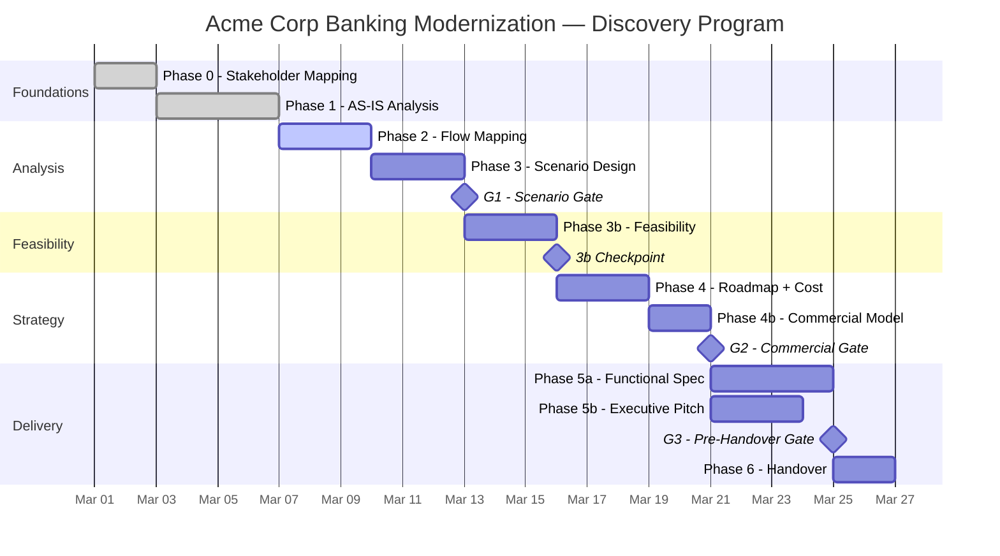

# P-01 Program Governance: Acme Corp Banking Modernization

**Proyecto:** Acme Corp — Modernización Plataforma Bancaria Core
**Variante:** Técnica (full)
**Modo:** piloto-auto
**Fecha:** 12 de marzo de 2026
**Owner:** Delivery Manager — Laura Méndez

---

## S1: Program Charter & Governance Framework

### Alcance del Programa

Modernización integral de la plataforma bancaria core de Acme Corp: migración de monolito COBOL/AS400 a arquitectura de microservicios cloud-native (AWS), con rediseño de flujos de originación de crédito, gestión de cuentas, y motor de riesgos.

### Modelo de Gobierno

| Nivel | Decisor | Ámbito | Escalación |
|---|---|---|---|
| Estratégico | Sponsor (CTO Acme) | Cambios de alcance >10%, presupuesto | Board semanal |
| Táctico | Delivery Manager (Laura M.) | Gates, asignación de recursos, timeline | Sponsor |
| Operativo | Tech Lead por fase | Decisiones técnicas intra-fase | Delivery Manager |

### Plan de Comunicación

- **Daily standup:** 15 min async (Slack #acme-discovery)
- **Weekly governance report:** Viernes 16:00 — dashboard + blockers
- **Gate reviews:** Sesión síncrona 60 min con comité completo
- **Escalation:** Blocker → Delivery Manager (< 4h) → Sponsor (< 24h)

### Phase Dependency Map

| Phase | Prerequisites | Gate | Gate Criteria | Owner |
|---|---|---|---|---|
| Phase 0: Stakeholder Mapping | Project kickoff completado | — | Mapa completo, power grid poblado, 12 stakeholders identificados | Catalina Ruiz (Domain Analyst) |
| Phase 1: AS-IS Analysis | Phase 0 completa | — | Análisis 10 secciones entregado, stack inventory validado | Andrés Gómez (Technical Architect) |
| Phase 2: Flow Mapping | Phase 1 completa | — | Taxonomía de dominio + 11 flujos mapeados | Catalina Ruiz (Domain Analyst) |
| Phase 3: Scenario Design | Phase 2 completa | G1 | Escenario aprobado por comité, riesgos aceptables | Felipe Torres (Full-Stack Generalist) |
| Phase 3b: Feasibility | G1 passed | 3b checkpoint | Feasibility FEASIBLE WITH CONDITIONS, viability scorecard 🟡 | Mariana Díaz (Quality Guardian) |
| Phase 4: Roadmap + Cost | Phase 3b passed | — | Roadmap 4 fases + cost drivers entregados | Laura Méndez (Delivery Manager) |
| Phase 4b: Commercial Model | Phase 4 completa | G2 | Estructura comercial aprobada por sponsor | Ricardo Vargas (Data Strategist) |
| Phase 5a: Functional Spec | G2 passed | — | Spec completa + 23 use cases validados | Andrés Gómez (Technical Architect) |
| Phase 5b: Executive Pitch | G2 passed | G3 | Pitch aprobado, investment case claro | Sandra López (Change Catalyst) |
| Phase 6: Handover | G3 passed | — | Handover package completo, 100% deliverables | Laura Méndez (Delivery Manager) |

### Gantt del Programa



---

## S2: Phase Gate Management

### Gate Evaluation: G1 (Post-Scenarios)

```
GATE EVALUATION: G1 — Scenario Approval
════════════════════════════════════════
Phase Completing: Phase 3 — Scenario Design
Date: 2026-03-12 (projected)

ENTRY CRITERIA:
  [x] Phase 2 flow mapping complete — ✅ 11 flujos entregados
  [x] Domain taxonomy validated — ✅ 4 bounded contexts confirmados
  [x] Expert committee quorum (≥5/7) — ✅ 7/7 disponibles

DELIVERABLES CHECK:
  [x] Scenario document (3 scenarios evaluated) — complete
  [x] Scenario comparison matrix — complete
  [x] Risk assessment per scenario — complete
  [x] Committee vote record — complete

EVIDENCE CHAIN:
  - AS-IS legacy analysis → 47 pain points → Scenario B addresses 39/47
  - Flow mapping → 11 critical flows → Scenario B covers all 11
  - Stakeholder interviews → "zero downtime" non-negotiable → Scenario B strangler fig pattern

DEPENDENCIES RESOLVED:
  [x] Stack inventory from Phase 1 — ✅ Delivered
  [x] Domain taxonomy from Phase 2 — ✅ Validated
  [x] Stakeholder priority matrix from Phase 0 — ✅ Current

RISKS CARRIED FORWARD:
  - R-04: COBOL expertise scarcity (2 remaining SMEs near retirement) — Mitigation: knowledge capture sprint scheduled
  - R-07: Integration with legacy payment gateway — Mitigation: adapter pattern in roadmap

VERDICT: PASSED ✅
  All entry criteria met. Scenario B (Strangler Fig + Event-Driven) approved unanimously.
  No conditions. Proceeding to Phase 3b.
```

### Gate Evaluation: G2 (Post-Commercial)

```
GATE EVALUATION: G2 — Commercial Approval
══════════════════════════════════════════
Phase Completing: Phase 4b — Commercial Model
Date: 2026-03-20 (projected)

ENTRY CRITERIA:
  [x] Roadmap delivered with 4 implementation phases — ✅
  [x] Cost drivers identified (7 drivers) — ✅
  [x] Commercial model structure proposed — ✅
  [ ] Budget confirmation from sponsor — ⚠️ Pending verbal confirmation

DELIVERABLES CHECK:
  [x] Implementation roadmap (4 phases, 18 months) — complete
  [x] Cost driver analysis (7 drivers, magnitudes only) — complete
  [x] Commercial model options (3 structures evaluated) — complete
  [x] Value-based pricing rationale — complete
  [ ] Sponsor budget sign-off document — partial (verbal OK, written pending)

EVIDENCE CHAIN:
  - Feasibility scorecard → FEASIBLE WITH CONDITIONS → Roadmap Phase 1 addresses conditions
  - Cost drivers → Infrastructure (40%), Migration Labor (25%), Testing (15%), Training (10%), Contingency (10%)
  - Commercial model → Hybrid (fixed discovery + T&M implementation) selected

DEPENDENCIES RESOLVED:
  [x] Feasibility verdict from Phase 3b — ✅ FEASIBLE WITH CONDITIONS
  [x] Viability scorecard from Phase 3b — ✅ 🟡 (conditions documented)
  [x] Roadmap phases from Phase 4 — ✅ 4-phase plan

RISKS CARRIED FORWARD:
  - R-04: COBOL expertise scarcity — Mitigation: outsource reverse engineering to specialist firm
  - R-11: Cloud cost estimation variance ±15% — Mitigation: FinOps review in implementation Phase 1
  - R-13: Regulatory compliance (SFC) timeline uncertainty — Mitigation: parallel compliance workstream

VERDICT: CONDITIONAL PASS ⚠️
  Conditions:
    1. Sponsor written budget confirmation required before Phase 5b pitch finalization
    2. FinOps review of cloud cost projections must complete within 5 business days

  Proceeding to Phase 5a/5b with conditions tracked.
```

---

## S3: Resource & Capacity Orchestration

### Expert Committee Allocation

| Expert | Role | Current Phase | % Allocated | Bottleneck Risk | Next Phase Needed |
|---|---|---|---|---|---|
| Andrés Gómez | Technical Architect | Phase 1 (complete) | 30% (support) | 🔴 Phase 3b + 5a need same expert | Phase 3b (60%), Phase 5a (100%) |
| Catalina Ruiz | Domain Analyst | Phase 2 (active) | 100% | 🟢 Available after Phase 2 | Phase 3 (40%) |
| Felipe Torres | Full-Stack Generalist | Phase 3 (pending) | 0% (standby) | 🟢 Ready | Phase 3 (80%) |
| Mariana Díaz | Quality Guardian | — | 20% (governance) | 🟡 Phase 3b + QA overlap risk | Phase 3b (100%), S5 QA (100%) |
| Laura Méndez | Delivery Manager | All phases | 30% (oversight) | 🟢 Distributed | Phase 4 (80%), Phase 6 (100%) |
| Ricardo Vargas | Data Strategist | — | 0% (standby) | 🟢 Ready | Phase 4b (100%) |
| Sandra López | Change Catalyst | — | 0% (standby) | 🟢 Ready | Phase 5b (100%) |

### Bottleneck Alerts

> **ALERT-01:** Andrés Gómez (Technical Architect) is required for Phase 3b feasibility review (60%) AND Phase 5a functional spec (100%). If phases overlap, total demand = 160%. **Mitigation:** Ensure Phase 3b completes fully before Phase 5a begins. No parallel execution allowed.

> **ALERT-02:** Mariana Díaz (Quality Guardian) owns Phase 3b feasibility (100%) AND Proposal QA in S5 (100%). Sequential execution is mandatory. If timeline compresses, QA depth is at risk. **Mitigation:** Build 2-day buffer between Phase 3b completion and QA start.

### Skill Activation Tracking

- **Activated (12/48):** stakeholder-mapping, asis-analysis, flow-mapping, dynamic-sme, mermaid-diagramming, scenario-analysis, software-architecture, data-engineering, api-architecture, security-architecture, project-program-management, brand-voice
- **Queued (8):** technical-feasibility, software-viability, solution-roadmap, cost-estimation, commercial-model, functional-spec, executive-pitch, discovery-handover
- **Not needed (28):** Remaining skills not in scope for this discovery

---

## S4: Cross-Phase Dependency Control

### Input/Output Dependency Matrix

| # | Source Phase | Output Artifact | Consumer Phase | Data Contract | Status |
|---|---|---|---|---|---|
| D-01 | Phase 0: Stakeholder Mapping | Stakeholder power grid + influence map | Phase 3: Scenarios | stakeholder_priorities.json | ✅ Delivered |
| D-02 | Phase 1: AS-IS | Technology stack inventory (47 components) | Phase 3b: Feasibility | technology_inventory.json | ✅ Delivered |
| D-03 | Phase 1: AS-IS | Pain point catalog (47 items) | Phase 3: Scenarios | pain_points_catalog.json | ✅ Delivered |
| D-04 | Phase 2: Flow Mapping | Domain taxonomy + 11 flow maps | Phase 4: Cost | scope_decomposition base | ⚠️ Pending — Phase 2 in progress |
| D-05 | Phase 3: Scenarios | Approved scenario (Scenario B) | Phase 3b: Feasibility | scenario_claims.json | ⏳ Not started |

### Scope Change Log

| # | Date | Change Description | Impact Assessment | Phases Affected | Approved By |
|---|---|---|---|---|---|
| SC-01 | 2026-03-05 | Added regulatory compliance (SFC) as explicit scope item | +2 days Phase 3b, +1 day Phase 5a | 3b, 4, 5a | Sponsor (CTO) |

### Dependency Blockers

| Blocker | Waiting For | Owner | ETA | Impact if Delayed |
|---|---|---|---|---|
| D-04: Domain taxonomy | Phase 2 completion | Catalina Ruiz | 2026-03-10 | Phase 4 cost estimation delayed, cascading +2 days |

---

## S5: Proposal QA Validation

```
PROPOSAL QA SCORECARD
═════════════════════
Proyecto: Acme Corp — Modernización Plataforma Bancaria Core
Propuesta v1 — Validación Pre-Envío
Fecha: 2026-03-26 (projected)
Validador: Mariana Díaz (Quality Guardian)

┌─────────────────────┬───────┬─────────────────────────────────────────────┬──────────────────────────────────┐
│ Dimensión           │ Score │ Hallazgos                                   │ Acción                           │
├─────────────────────┼───────┼─────────────────────────────────────────────┼──────────────────────────────────┤
│ Coherencia Técnica  │ 4/5   │ Roadmap phases align with scenario B.       │ Minor: Verify strangler fig      │
│                     │       │ Minor gap: migration sequence for payment   │ sequence for payment gateway     │
│                     │       │ gateway not fully detailed in roadmap.      │ in Phase 1 of implementation.    │
├─────────────────────┼───────┼─────────────────────────────────────────────┼──────────────────────────────────┤
│ Completitud         │ 4/5   │ 22/23 use cases covered in spec.           │ Add missing UC-17 (batch        │
│                     │       │ UC-17 (batch reconciliation) referenced    │ reconciliation) to functional    │
│                     │       │ but not fully specified.                    │ spec before client delivery.     │
├─────────────────────┼───────┼─────────────────────────────────────────────┼──────────────────────────────────┤
│ Viabilidad          │ 3.5/5 │ Cloud cost projections have ±15% variance. │ FinOps review pending (G2       │
│                     │       │ FinOps review not yet complete.            │ condition). Block pitch until    │
│                     │       │ Timeline realistic but tight for Phase 3   │ FinOps confirms magnitudes.     │
│                     │       │ of implementation (data migration).        │                                  │
├─────────────────────┼───────┼─────────────────────────────────────────────┼──────────────────────────────────┤
│ Alineación          │ 4/5   │ Proposal addresses 39/47 AS-IS pain       │ Document rationale for 8         │
│                     │       │ points. 8 deferred to implementation      │ deferred pain points in          │
│                     │       │ Phase 2+ (justified but not documented     │ proposal appendix.               │
│                     │       │ in proposal body).                         │                                  │
└─────────────────────┴───────┴─────────────────────────────────────────────┴──────────────────────────────────┘

COMPOSITE: 3.9/5.0

VEREDICTO: APROBADA CON CONDICIONES ⚠️
  Threshold mínimo: 3.5/5.0 composite ✅, ninguna dimensión <3 ✅

  Condiciones antes de envío a cliente:
    1. Completar UC-17 (batch reconciliation) en functional spec
    2. Obtener resultado de FinOps review para confirmar magnitudes de costo cloud
    3. Documentar rationale de 8 pain points diferidos en appendix de propuesta

LISTA PARA ENVÍO A CLIENTE: NO — pendiente resolución de 3 condiciones
```

### Trazabilidad de Fallas QA

| Dimensión con Gap | Score | Fase Origen | Remediación |
|---|---|---|---|
| Completitud (UC-17) | 4/5 | Phase 5a: Functional Spec | Andrés Gómez completa UC-17, re-review |
| Viabilidad (FinOps) | 3.5/5 | Phase 4: Roadmap + Cost | FinOps review result → update cost drivers |
| Alineación (8 deferred) | 4/5 | Phase 1: AS-IS → Phase 4: Roadmap | Laura Méndez documenta rationale en appendix |

---

## S6: Status Reporting & Dashboard

### Program Health Dashboard

| Phase | Status | Planned End | Actual/Forecast | Variance | RAG |
|---|---|---|---|---|---|
| Phase 0: Stakeholder Mapping | ✅ Complete | Mar 02 | Mar 02 | 0 days | 🟢 |
| Phase 1: AS-IS Analysis | ✅ Complete | Mar 07 | Mar 07 | 0 days | 🟢 |
| Phase 2: Flow Mapping | 🔄 In Progress | Mar 10 | Mar 11 (forecast) | +1 day | 🟡 |
| Phase 3: Scenario Design | ⏳ Not Started | Mar 13 | Mar 14 (forecast) | +1 day | 🟡 |
| G1 Gate | ⏳ Pending | Mar 13 | Mar 14 (forecast) | +1 day | 🟡 |
| Phase 3b: Feasibility | ⏳ Not Started | Mar 17 | — | — | ⚪ |
| Phase 4: Roadmap + Cost | ⏳ Not Started | Mar 20 | — | — | ⚪ |
| Phase 4b: Commercial Model | ⏳ Not Started | Mar 22 | — | — | ⚪ |
| G2 Gate | ⏳ Pending | Mar 22 | — | — | ⚪ |
| Phase 5a: Functional Spec | ⏳ Not Started | Mar 26 | — | — | ⚪ |
| Phase 5b: Executive Pitch | ⏳ Not Started | Mar 25 | — | — | ⚪ |
| G3 Gate | ⏳ Pending | Mar 26 | — | — | ⚪ |
| Phase 6: Handover | ⏳ Not Started | Mar 28 | — | — | ⚪ |

### Decision Log

| # | Date | Gate/Context | Decision | Rationale | Decided By |
|---|---|---|---|---|---|
| DEC-01 | Mar 02 | Phase 0 | Include regulatory stakeholders (SFC liaison) | Banking modernization requires regulatory compliance | Sponsor |
| DEC-02 | Mar 07 | Phase 1 | Classify payment gateway as "high-risk migration" | Single point of failure, no documentation, 1 SME | Tech Architect |
| DEC-03 | Mar 12 | G1 (projected) | Approve Scenario B (Strangler Fig + Event-Driven) | Best coverage of pain points (39/47), zero-downtime capable | Committee (7/7) |

### Risk Burn-Down

- **Open risks:** 5 (R-04, R-07, R-11, R-13, R-15)
- **Closed risks:** 3 (R-01 mitigated in Phase 0, R-02 resolved in Phase 1, R-06 accepted)
- **Trend:** Stable — new risks discovered at expected rate for this program stage

---

## S7: Continuous Governance & Lessons Learned

### Insight 1: Early Stakeholder Depth Pays Compound Returns

**Phase:** Phase 0 — Stakeholder Mapping
**Observation:** Investing an extra half-day in Phase 0 to map second-tier stakeholders (ops team leads, compliance officers) surfaced 3 critical requirements that would have been discovered late in Phase 3b feasibility — potentially causing a gate failure and rework.
**Recommendation:** For regulated industries (banking, healthcare, insurance), always extend stakeholder mapping to include regulatory and compliance personas, even if the client does not initially suggest them.

### Insight 2: AS-IS Stack Inventory Granularity Determines Feasibility Confidence

**Phase:** Phase 1 — AS-IS Analysis
**Observation:** The initial stack inventory listed "COBOL backend" as a single line item. Decomposing it into 12 distinct COBOL modules with dependency relationships increased feasibility analysis accuracy and directly informed the strangler fig migration sequence. Without this granularity, the feasibility verdict would have had lower confidence.
**Recommendation:** For legacy modernization discoveries, mandate component-level decomposition in AS-IS stack inventory. "Monolith" is never a single item — always decompose to module/service level.

### Insight 3: Gate Conditions Must Have Explicit Deadlines

**Phase:** G2 — Commercial Gate
**Observation:** G2 passed with conditions (sponsor budget confirmation, FinOps review), but neither condition had an explicit deadline. This creates ambiguity about when to block Phase 5b progress. Adding "within 5 business days" to each condition created clear escalation triggers.
**Recommendation:** Every CONDITIONAL PASS must include explicit deadlines per condition. Format: "Condition X must be resolved by [date]. If unresolved, escalate to [role]."

---

**Autor:** Javier Montano | **Skill:** project-program-management | **Pipeline:** MetodologIA Discovery Framework v6.0
