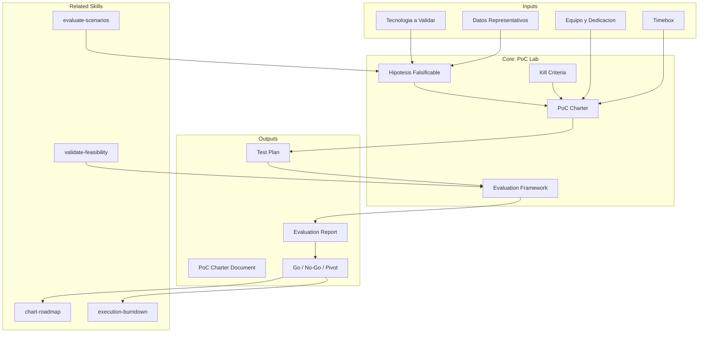

# Laboratorio de Pruebas de Concepto

Framework para diseno, ejecucion y evaluacion de pruebas de concepto (PoC),
con definicion de criterios de exito y metodologia de evaluacion rigurosa.

## TL;DR

- Disena PoCs con hipotesis claras, criterios de exito medibles y kill criteria
- Define alcance minimo viable para validar cada hipotesis con esfuerzo controlado
- Establece metodologia de evaluacion objetiva y reproducible
- Genera templates de charter, plan de pruebas y reporte de evaluacion
- Previene PoC theater (demos que no validan nada real)

## Inputs

Parse `$1` como **nombre del proyecto**, `$2` como **tecnologia o concepto a validar**.

**Parameters:**
- `{MODO}`: `piloto-auto` (default) | `desatendido` | `supervisado` | `paso-a-paso`
- `{FORMATO}`: `markdown` (default) | `html` | `dual`
- `{VARIANTE}`: `ejecutiva` (~40%) | `tecnica` (full, default)

## Entregables

1. **PoC Charter** — Hipotesis, alcance, criterios de exito, kill criteria, timeline, equipo
2. **Test Plan** — Escenarios de prueba, datos requeridos, metricas a capturar
3. **Evaluation Report Template** — Template para documentar resultados y veredicto
4. **Risk Register** — Riesgos del PoC y mitigacion
5. **Decision Framework** — Criterios para go/no-go post-PoC

## Proceso

1. **Definicion de Hipotesis** — Formular hipotesis claras y falsificables:
   - "La tecnologia X puede procesar Y transacciones/segundo con latencia <Z ms"
   - "El modelo AI alcanza precision >X% en datos representativos del dominio"
   - "La migracion de componente A a plataforma B se completa en <N sprints"
2. **Diseno de PoC Charter**:
   | Elemento | Descripcion |
   |---|---|
   | Hipotesis | Que se quiere validar (falsificable) |
   | Alcance | Scope minimo para validar la hipotesis |
   | Success Criteria | Metricas cuantitativas para declarar exito |
   | Kill Criteria | Condiciones para abortar temprano |
   | Timeline | Timebox estricto (1-4 semanas) |
   | Equipo | Roles y dedicacion requerida |
   | Datos | Datos reales (no mock) representativos |
   | Entorno | Infraestructura necesaria |
3. **Plan de Pruebas** — Disenar escenarios que cubran happy path, edge cases y failure modes
4. **Definicion de Metricas** — Especificar que se mide, como se mide, baseline de comparacion
5. **Template de Evaluacion** — Estructura para documentar resultados objetivamente:
   - Resultados cuantitativos vs criterios de exito
   - Observaciones cualitativas
   - Riesgos descubiertos
   - Veredicto: GO / NO-GO / PIVOT
6. **Decision Framework** — Arbol de decision post-PoC con opciones claras

## Criterios de Calidad

- [ ] Hipotesis formuladas como afirmaciones falsificables
- [ ] Criterios de exito cuantitativos y medibles
- [ ] Kill criteria definidos para evitar sunk cost fallacy
- [ ] Timeline con timebox estricto (no scope creep)
- [ ] Datos de prueba representativos (no datos demo/synthetic)
- [ ] Evaluacion objetiva con metricas, no opiniones
- [ ] Veredicto con opciones claras (GO, NO-GO, PIVOT)

## Anti-patrones a Evitar

| Anti-patron | Sintoma | Mitigacion |
|---|---|---|
| PoC Theater | Demo bonita que no valida nada real | Hipotesis falsificable + datos reales |
| Scope Creep | PoC se convierte en MVP | Timebox estricto + kill criteria |
| Cherry Picking | Solo se prueban happy paths | Plan de pruebas con edge cases |
| Sunk Cost | Se continua PoC fallido por inversion | Kill criteria claros y respetados |
| Vendor Demo | Vendor ejecuta el PoC con su equipo | Equipo propio ejecuta con soporte |

## Supuestos y Limites

- El equipo tiene acceso a datos representativos (no sinteticos) para ejecutar la PoC.
- El timebox de la PoC no excede 4 semanas; si requiere mas, considerar un MVP.
- Esta skill NO produce codigo ni ejecuta la PoC; genera los artefactos de planificacion y evaluacion.
- NUNCA incluir precios; solo magnitudes en FTE-meses y cost drivers.

## Casos Borde

| Caso Borde | Estrategia de Manejo |
|---|---|
| No hay datos reales disponibles para la PoC | Disenar fase previa de obtencion de datos con timeline propio. Documentar como prerequisito bloqueante en el charter. Usar datos sinteticos SOLO para validacion de infraestructura, nunca para resultados funcionales. |
| El stakeholder quiere evaluar >3 tecnologias simultaneamente | Disenar PoCs secuenciales con kill criteria compartidos. Priorizar por riesgo/impacto. Establecer evaluacion comparativa con criterios normalizados. Maximo 2 PoCs en paralelo por equipo. |
| La PoC tiene exito parcial (algunos criterios pasan, otros no) | Aplicar decision framework con pesos por criterio. Documentar que paso, que no, y el gap. Proponer PIVOT: redefinir alcance de adopcion basado en los criterios exitosos. |
| El timebox se agota sin resultados concluyentes | Evaluar si la causa es scope creep, impedimentos tecnicos, o hipotesis mal formulada. Documentar hallazgos parciales. Proponer extension acotada (max 1 semana) O pivote de hipotesis. |

## Decisiones y Trade-offs

| Decision | Justificacion | Alternativa Descartada |
|---|---|---|
| Timebox estricto (1-4 semanas) en lugar de tiempo abierto | Previene sunk cost fallacy y scope creep. Fuerza priorizacion de hipotesis criticas. | Tiempo abierto: genera PoC Theater y pierde urgencia. |
| Kill criteria obligatorios en el charter | Fuerza decision explicita de cuando abortar. Reduce sesgo de confirmacion. | Sin kill criteria: equipos persisten en PoCs fallidas por inercia. |
| Evaluacion cuantitativa sobre cualitativa | Objetividad reproducible. Multiples evaluadores llegan al mismo veredicto. | Evaluacion cualitativa: genera sesgo de opinion y no es reproducible. |
| Datos reales sobre datos sinteticos | Valida hipotesis en condiciones reales. Evita falsos positivos por datos idealizados. | Datos sinteticos: mas faciles de obtener pero no validan viabilidad real. |

## Knowledge Graph



## Output Templates

### Template 1: PoC Charter (Markdown)

**Filename:** `PoC_Charter_{project}_{WIP|Aprobado}.md`

```markdown
# PoC Charter: {project}

## Hipotesis
{Afirmacion falsificable con metricas de exito}

## Alcance
{Scope minimo para validar la hipotesis}

## Criterios de Exito
| Criterio | Metrica | Umbral | Metodo de Medicion |
|---|---|---|---|
| ... | ... | ... | ... |

## Kill Criteria
| Condicion | Accion |
|---|---|
| ... | Abortar / Escalar |

## Timeline
| Semana | Actividad | Responsable | Entregable |
|---|---|---|---|
| S1 | ... | ... | ... |

## Equipo
| Rol | Persona | Dedicacion |
|---|---|---|

## Riesgos
| Riesgo | Probabilidad | Impacto | Mitigacion |
|---|---|---|---|
```

### Template 2: Evaluation Report (Markdown)

**Filename:** `PoC_Evaluation_{project}_{WIP|Aprobado}.md`

```markdown
# Evaluacion PoC: {project}

## Resumen Ejecutivo
{Veredicto en 3 lineas: GO / NO-GO / PIVOT}

## Resultados vs Criterios
| Criterio | Target | Resultado | Delta | Veredicto |
|---|---|---|---|---|

## Observaciones Cualitativas
{Hallazgos no cuantificables relevantes}

## Riesgos Descubiertos
| Riesgo | Severidad | Mitigacion Propuesta |
|---|---|---|

## Veredicto y Recomendacion
{GO / NO-GO / PIVOT con justificacion basada en evidencia}

## Proximos Pasos
{Acciones concretas con responsable y fecha}
```

## Evaluacion

| Dimension | Peso | Criterio |
|---|---|---|
| Trigger Accuracy | 10% | La skill se activa correctamente ante solicitudes de PoC, spike, o prototipo |
| Completeness | 25% | Charter incluye hipotesis, criterios de exito, kill criteria, timeline, equipo, y riesgos |
| Clarity | 20% | Hipotesis son falsificables; criterios de exito son cuantitativos y no ambiguos |
| Robustness | 20% | Maneja casos borde (datos parciales, exito parcial, timebox agotado) con estrategias claras |
| Efficiency | 10% | Genera artefactos completos sin requerir multiples iteraciones del usuario |
| Value Density | 15% | Cada seccion del charter aporta informacion accionable; cero filler |

**Umbral minimo: 7/10**

## Cross-References

- `metodologia-evaluate-scenarios` — Alimenta hipotesis desde escenarios evaluados
- `metodologia-validate-feasibility` — Complementa evaluacion tecnica de la PoC
- `metodologia-chart-roadmap` — Recibe resultado GO para planificar ejecucion
- `metodologia-execution-burndown` — Dimensiona esfuerzo post-PoC

## Output Artifact

**Primary:** `PoC_Lab_{project}.md` — Charter, test plan, evaluation template.

### HTML (bajo demanda)
- Filename: `{fase}_PoC_Lab_{project}_{WIP}.html`
- Estructura: HTML self-contained branded (Design System MetodologIA v5). Tipo: Light-First Technical. Incluye PoC Charter con criterios de éxito/kill criteria tabulados, evaluation report template, y árbol de decisión GO/NO-GO/PIVOT. WCAG AA, responsive, print-ready.

### DOCX (bajo demanda)
- Filename: `{fase}_poc_lab_{cliente}_{WIP}.docx`
- Generado via python-docx con MetodologIA Design System v5. Portada, TOC automático, encabezados en Poppins (navy), cuerpo en Montserrat, acentos en gold. Tablas de hipótesis, criterios de éxito y kill criteria con zebra striping. Encabezados y pies de página con branding MetodologIA.

### XLSX (bajo demanda)
- Filename: `{fase}_poc_lab_{cliente}_{WIP}.xlsx`
- Generado via openpyxl con MetodologIA Design System v5. Headers navy con texto blanco Poppins, formato condicional por veredicto (GO/NO-GO/PIVOT) y estado de criterio de exito, auto-filtros en todas las columnas, valores calculados sin formulas. Hojas: PoC Charter, Test Plan, Results vs Criteria, Risk Register.

### PPTX (bajo demanda)
- Filename: `{fase}_poc_lab_{cliente}_{WIP}.pptx`
- Generado via python-pptx con MetodologIA Design System v5. Slide master con gradiente navy, títulos en Poppins, cuerpo en Montserrat, acentos en gold. Máx 20 slides ejecutivo / 30 técnico. Notas del presentador con referencias de evidencia. Slides: PoC Charter, Hipótesis y criterios de éxito, Kill criteria, Timeline y equipo, Risk Register, Veredicto GO/NO-GO/PIVOT.

### Diagramas (Mermaid)
- Flowchart: proceso de PoC (design -> execute -> evaluate -> decide)
- Decision tree: framework de decision post-PoC
- Gantt: timeline del PoC

---
**Autor:** Javier Montaño · Comunidad MetodologIA | **Version:** 1.0.0
