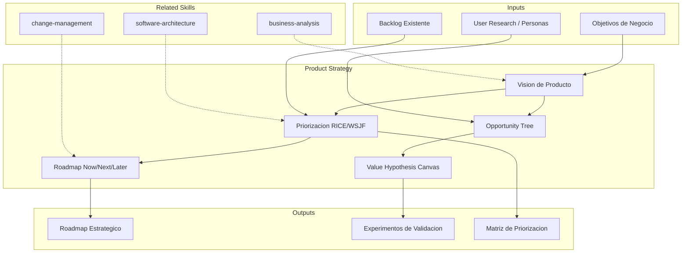

# Product Strategy: Roadmap, Prioritization & Value Stream Design

Product strategy translates business objectives into actionable product plans. The skill produces product vision documents, prioritization matrices, and value hypothesis canvases that align development effort with measurable customer and business outcomes.

## TL;DR

- Define producto vision y estrategia de roadmap alineada con objetivos de negocio
- Prioriza backlog con frameworks cuantitativos (RICE, WSJF, Opportunity Scoring)
- Mapea value streams para identificar desperdicio y oportunidades de optimizacion
- Valida product-market fit con hypothesis canvas y metricas de traccion
- Estructura dual-track agile: discovery continuo + delivery disciplinado

## Inputs

The user provides a product or initiative name as `$ARGUMENTS`. Parse `$1` as the **product/initiative name**.

**Parameters:**
- `{MODO}`: `piloto-auto` (default) | `desatendido` | `supervisado` | `paso-a-paso`
- `{FORMATO}`: `markdown` (default) | `html` | `dual`
- `{VARIANTE}`: `ejecutiva` (~40%) | `tecnica` (full, default)
- `{ETAPA}`: `inception` | `growth` | `maturity` | `auto` (default — detected from context)

## Entregables

1. **Documento de vision de producto** — North star, target personas, value proposition, success metrics
2. **Matriz de priorizacion** — RICE/WSJF scored backlog with effort-impact quadrants
3. **Value hypothesis canvas** — Assumptions, experiments, validation criteria per feature area
4. **Mapa de value stream** — End-to-end flow from idea to customer value with waste identification
5. **Roadmap estrategico** — Now/Next/Later roadmap with outcome-based milestones

## Proceso

1. **Establecer vision y north star** — Define product vision statement, north star metric, and strategic guardrails
2. **Identificar personas y jobs-to-be-done** — Map target user segments and their core jobs, pains, and gains
3. **Construir opportunity tree** — Decompose desired outcomes into opportunities, then into solution ideas
4. **Priorizar con framework cuantitativo** — Score each opportunity using RICE (Reach, Impact, Confidence, Effort) or WSJF
5. **Mapear value stream actual** — Document current flow from idea to production, measure lead times and wait times
6. **Identificar desperdicio** — Flag handoffs, wait states, rework loops, and gold plating in the value stream
7. **Disenar roadmap por outcomes** — Structure roadmap around outcomes (not features) with Now/Next/Later horizons
8. **Definir hipotesis de valor** — For each major bet, document assumption, experiment, success criteria, and pivot trigger
9. **Establecer metricas de traccion** — Define leading and lagging indicators for product-market fit validation

## Criterios de Calidad

- [ ] Vision statement is specific, measurable, and time-bound
- [ ] Prioritization uses quantitative framework with documented scores
- [ ] Value stream map includes cycle time and wait time measurements
- [ ] Roadmap is outcome-based, not feature-based
- [ ] Each major initiative has explicit value hypothesis with validation plan
- [ ] Personas are based on research or documented assumptions [SUPUESTO]
- [ ] Roadmap distinguishes committed vs. speculative items
- [ ] Product metrics include both leading and lagging indicators

## Supuestos y Limites

- Assumes product team exists or will be formed with clear ownership
- Does not replace user research — flags where primary research is needed
- Financial projections are directional estimates, not forecasts
- Market analysis relies on available data and documented assumptions

## Casos Borde

| Escenario | Estrategia de Manejo |
|---|---|
| Producto sin usuarios actuales (greenfield) | Usar Lean Canvas en lugar de data historica; todas las hipotesis marcadas [SUPUESTO]; enfasis en experimentos de validacion rapida |
| Multiples stakeholders con visiones conflictivas | Ejecutar ejercicio de alignment (vision statement vote) antes de priorizar; documentar desacuerdos como riesgos |
| Producto legacy con backlog heredado de +500 items | Aplicar triage agresivo: archivar items >12 meses sin actividad, re-score solo los top 50 por volumen de solicitud |
| Pivot en curso — cambio de mercado objetivo | Generar two-track roadmap (current + pivot), con decision gate y criterios explicitos de go/no-go |

## Decisiones y Trade-offs

| Decision | Habilita | Restringe | Justificacion |
|---|---|---|---|
| RICE como framework default | Comparabilidad cuantitativa entre iniciativas | Requiere estimaciones de Reach y Confidence que pueden ser imprecisas | RICE es el mas adoptado y entendido; se complementa con WSJF para contextos SAFe |
| Roadmap Now/Next/Later en lugar de Gantt | Flexibilidad ante cambios, enfoque en outcomes | Menor precision temporal para stakeholders que piden fechas | Evita compromisos de fecha prematuros; se acompana de milestones medibles |
| Dual-track agile como default | Discovery continuo alimenta delivery | Requiere capacidad dedicada a discovery (minimo 20% del equipo) | Reduce riesgo de construir features sin validar; escalable con equipo pequeno |

## Knowledge Graph

## Output Templates

**Formato 1 — Markdown (default)**
- Filename: `Product_Strategy_{producto}_{WIP|Aprobado}.md`
- Estructura: Vision > Personas > Opportunity Tree > Priorizacion > Value Hypotheses > Roadmap > Metricas
- Incluye tablas de scoring y diagramas Mermaid inline

**Formato 2 — HTML (presentacion ejecutiva)**
- Filename: `Product_Strategy_{producto}_{WIP|Aprobado}.html`
- Estructura: Executive summary (1 pagina) > Roadmap visual > Priorizacion highlights > Appendix con datos completos
- Optimizado para compartir con stakeholders no tecnicos

**Formato 3 — DOCX (bajo demanda)**
- Filename: `{fase}_product_strategy_{cliente}_{WIP}.docx`
- Generado via python-docx con MetodologIA Design System v5. Portada, TOC automático, encabezados en Poppins (navy), cuerpo en Montserrat, acentos en gold. Tablas de scoring RICE/WSJF y value hypotheses con zebra striping. Encabezados y pies de página con branding MetodologIA.

**Formato 4 — XLSX (bajo demanda)**
- Filename: `{fase}_product_strategy_{cliente}_{WIP}.xlsx`
- Generado via openpyxl con MetodologIA Design System v5. Headers navy con texto blanco Poppins, formato condicional por score RICE/WSJF y horizonte de roadmap (Now/Next/Later), auto-filtros en todas las columnas, valores calculados sin formulas. Hojas: Prioritization Matrix, Value Hypotheses, Value Stream Map, Roadmap.

**Formato 5 — PPTX (bajo demanda)**
- Filename: `{fase}_product_strategy_{cliente}_{WIP}.pptx`
- Generado via python-pptx con MetodologIA Design System v5. Slide master con gradiente navy, títulos en Poppins, cuerpo en Montserrat, acentos en gold. Máx 20 slides ejecutivo / 30 técnico. Notas del presentador con referencias de evidencia. Slides: Vision y North Star, Personas y JTBD, Opportunity Tree, Prioritization Matrix RICE/WSJF, Value Hypotheses, Roadmap Now/Next/Later, Métricas de tracción.

## Evaluacion

| Dimension | Peso | Criterio |
|-----------|------|----------|
| Trigger Accuracy | 10% | Activa triggers correctos sin falsos positivos ante keywords de producto y estrategia |
| Completeness | 25% | Todos los entregables cubren vision, priorizacion, value stream, roadmap y metricas |
| Clarity | 20% | Instrucciones ejecutables sin ambiguedad; vision statement es especifica y medible |
| Robustness | 20% | Maneja edge cases (greenfield, pivot, backlog masivo) con estrategias documentadas |
| Efficiency | 10% | Proceso no tiene pasos redundantes; escala con variante ejecutiva al 40% |
| Value Density | 15% | Cada seccion aporta valor practico directo; metricas son actionable |

**Umbral minimo**: 7/10 en cada dimension para considerar el skill production-ready.

## Cross-References

- **metodologia-business-analysis:** Business requirements that feed product backlog
- **metodologia-software-architecture:** Technical feasibility constraints on product decisions
- **metodologia-change-management:** Organizational readiness for product changes

---
**Autor:** Javier Montaño · Comunidad MetodologIA | **Version:** 1.0.0
