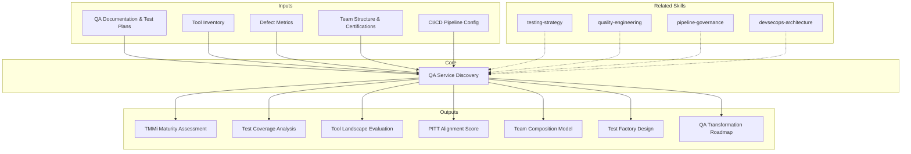

# QA Service Discovery — Quality Maturity Assessment & Transformation Roadmap

Genera un assessment de 7 secciones para servicios de QA: evaluacion de madurez de calidad (TMMi), analisis de cobertura de testing, evaluacion del landscape de herramientas, alineacion con metodologia PITT, modelado de composicion de equipo, diseno de test factory, y roadmap de transformacion de QA. Orientado a construir servicios de calidad que prevengan defectos, no solo los detecten.

## Principio Rector

> *La calidad no se inspecciona al final — se construye desde el principio. Un servicio de QA que solo encuentra bugs es un servicio incompleto; el verdadero valor esta en prevenirlos.*

1. **Shift-left no es un eslogan — es una estrategia medible.** Cada defecto encontrado en produccion costo 100x mas que uno encontrado en requerimientos. El assessment mide donde se encuentran los defectos en el ciclo de vida y cuanto se puede mover hacia la izquierda.
2. **La automatizacion de tests sin estrategia es un costo, no una inversion.** Tests automatizados fragiles, lentos o irrelevantes consumen mas de lo que aportan. El assessment evalua no solo el ratio de automatizacion sino la calidad y mantenibilidad del suite automatizado.
3. **El testing independiente (PITT) es un habilitador, no un obstaculo.** La separacion de responsabilidades entre desarrollo y QA no crea friction — crea accountability. El modelo PITT correctamente implementado acelera releases, no los frena.

## Inputs

- `$1` — Path to QA documentation or project workspace (default: current working directory)
- `$2` — Analysis depth: `full` (default), `executive` (S1, S2, S7 only)

Parse from `$ARGUMENTS`.

**Parameters:**
- `{MODO}`: `piloto-auto` (default) | `desatendido` | `supervisado` | `paso-a-paso`
  - **piloto-auto**: Auto para analisis de cobertura y herramientas, HITL para evaluacion de madurez y decisiones de equipo.
  - **desatendido**: Cero interrupciones. Analisis completo automatizado. Supuestos documentados.
  - **supervisado**: Autonomo con reportes al completar cada seccion.
  - **paso-a-paso**: Confirma antes de cada seccion del analisis.
- `{FORMATO}`: `markdown` (default) | `html` | `dual`
- `{VARIANTE}`: `ejecutiva` (~40% — S1, S2, S7 only) | `tecnica` (full, default)
- `{TIPO_SERVICIO}`: `QA` (fixed for this skill)

## Input Requirements

**Mandatory:**
- Documentacion de procesos de QA (test plans, test strategies)
- Inventario de herramientas de testing actuales
- Metricas de defectos (detection rate, escape rate, density)
- Estructura del equipo de QA actual

**Recommended:**
- Test automation suite (acceso a repositorio de tests)
- CI/CD pipeline configuration
- Historico de releases y defectos (12+ meses)
- Resultados de auditorias de calidad previas
- Certificaciones del equipo (ISTQB, etc.)

## Assumptions & Limits

**Assumptions:**
- Existe un proceso de testing definido (aunque sea informal)
- Hay acceso a metricas basicas de defectos
- El equipo de QA es identificable (roles dedicados o compartidos)
- La organizacion busca mejorar su capacidad de quality engineering

**Cannot do:**
- Ejecutar tests en el ambiente del cliente (requiere acceso a infraestructura)
- Evaluar performance de herramientas en uso (requiere benchmarking en vivo)
- Realizar auditorias formales de certificacion TMMi (requiere assessor certificado)
- Entrevistar individualmente a cada miembro del equipo

## Workarounds When Inputs Missing

| Missing Input | Impact | Workaround |
|---|---|---|
| No test plans | Cannot assess test strategy maturity | Inferir de codigo de tests y CI/CD config; flag como [INFERENCIA] |
| No defect metrics | Cannot quantify quality baseline | Analisis de code quality como proxy; recomendar implementacion de metricas |
| No tool inventory | Cannot evaluate tool landscape | Detectar de CI/CD pipelines y repositorios; flag como [INFERENCIA] |
| No team structure | Cannot model composition | Inferir de commits, PR reviews, tool access; flag como [SUPUESTO] |
| No automation suite | Cannot assess automation maturity | Flag como gap critico; recomendar estrategia de automatizacion |

## Edge Cases

- **No hay equipo de QA dedicado:** Evaluar testing como responsabilidad distribuida en desarrollo. Flag como riesgo y oportunidad.
- **Solo testing manual:** Calcular costo de oportunidad. Priorizar automatizacion por riesgo de regresion.
- **Multiples equipos de QA (por producto):** Evaluar consistencia entre equipos. Identificar oportunidades de estandarizacion.
- **Outsourcing de QA existente:** Evaluar vendor actual vs MetodologIA. Analizar gaps y transicion.
- **Regulacion especifica (pharma, fintech):** Elevar requisitos de documentacion, trazabilidad y validacion. Mapear compliance requirements.
- **>500 test cases sin mantenimiento:** Flag deuda de tests. Evaluar relevancia vs costo de mantenimiento. Recomendar rationalizacion.

## Trade-off Matrix

| Decision | Enables | Constrains | When to Use |
|---|---|---|---|
| **Full 7-section analysis** | Maximum depth, complete transformation plan | 5-7 dias, alto consumo de tokens | QA transformation programs, test factory setup |
| **Executive variant** (S1+S2+S7) | Quick maturity snapshot, decision-ready | No incluye herramientas, equipo ni factory design | Business case para QA investment |
| **TMMi-focused** (S1 deep) | Certification roadmap | Menor profundidad en cobertura y herramientas | Organizaciones buscando certificacion TMMi |
| **Automation-focused** (S2+S3 deep) | Automation strategy and tool selection | Menos contexto de madurez organizacional | Kick-off de programa de test automation |

## 7-Section Framework

### S1: Quality Maturity Model Assessment (TMMi)

Evaluacion contra los 5 niveles de TMMi (Test Maturity Model integration).

**Niveles TMMi:**

| Nivel | Nombre | Caracteristicas |
|---|---|---|
| L1 | Initial | Testing ad-hoc, no proceso definido, dependiente de individuos |
| L2 | Managed | Testing planificado por proyecto, test plans basicos, defect tracking |
| L3 | Defined | Proceso de testing organizacional, test design techniques, peer reviews |
| L4 | Measured | Metricas de calidad cuantitativas, statistical process control, product quality evaluation |
| L5 | Optimization | Mejora continua basada en datos, defect prevention, quality control |

**Assessment por area de proceso:**
- Test Policy & Strategy
- Test Planning
- Test Monitoring & Control
- Test Design & Execution
- Test Environment
- Non-functional Testing
- Peer Reviews

**Entregable:** Nivel actual con evidencia por area de proceso. Gap analysis hacia nivel objetivo.

### S2: Test Coverage Analysis

Analisis de cobertura de testing por multiples dimensiones.

**Cobertura por tipo:**

| Tipo | Cobertura Actual | Target | Gap |
|---|---|---|---|
| Functional | ...% | ...% | ... |
| Non-functional | ...% | ...% | ... |
| Regression | ...% | ...% | ... |
| Performance | ...% | ...% | ... |
| Security | ...% | ...% | ... |

**Cobertura por capa:**

| Capa | Tests | Automatizados | Manual | Ratio |
|---|---|---|---|---|
| Unit | ... | ... | ... | ...% |
| Integration | ... | ... | ... | ...% |
| API | ... | ... | ... | ...% |
| E2E | ... | ... | ... | ...% |

**Cobertura por nivel de riesgo:**
- Critico: ...% cobertura
- Alto: ...% cobertura
- Medio: ...% cobertura
- Bajo: ...% cobertura

**Automation ratio:** % de tests automatizados vs total. Trend analysis si hay historico.

### S3: Tool Landscape Assessment

Evaluacion de herramientas actuales vs recomendadas.

**Categorias de herramientas:**

| Categoria | Herramienta Actual | Madurez (1-5) | Adopcion (%) | Recomendacion |
|---|---|---|---|---|
| Test Management | ... | ... | ... | ... |
| Automation Framework | ... | ... | ... | ... |
| CI/CD Integration | ... | ... | ... | ... |
| Performance Testing | ... | ... | ... | ... |
| Security Testing | ... | ... | ... | ... |
| API Testing | ... | ... | ... | ... |
| Mobile Testing | ... | ... | ... | ... |
| Accessibility Testing | ... | ... | ... | ... |

**Criterios de evaluacion:**
- Madurez del producto (estabilidad, roadmap, comunidad)
- Integracion con stack existente
- Curva de aprendizaje
- Costo de propiedad (licencias, infraestructura, mantenimiento)
- Soporte y ecosistema

### S4: PITT Methodology Alignment

Evaluacion de readiness para Equipos de Testing Independientes (PITT).

**Dimensiones de evaluacion:**

| Dimension | Score (1-5) | Evidencia |
|---|---|---|
| Separacion de concerns (dev vs QA) | ... | ... |
| Governance model | ... | ... |
| Communication protocols | ... | ... |
| Defect management process | ... | ... |
| Test artifact independence | ... | ... |
| Reporting & metrics | ... | ... |

**Modelo de interaccion PITT:**
- Punto de contacto entre equipos de desarrollo y testing
- Flujo de comunicacion para requerimientos, defectos y releases
- Escalation path para bloqueos
- Cadencia de reporting y review

**Readiness score:** Promedio ponderado de dimensiones. >3.5 = ready for PITT. <3.5 = requiere preparacion previa.

### S5: QA Team Composition Model

Modelado de perfiles necesarios y analisis de gaps.

**Perfiles requeridos:**

| Perfil | Cantidad | Seniority | Certificaciones | Rol |
|---|---|---|---|---|
| Test Analyst | ... | Jr/Mid/Sr | ISTQB FL/AL | Diseno y ejecucion de tests funcionales |
| Automation Engineer | ... | Mid/Sr | ISTQB TAE | Desarrollo y mantenimiento de framework de automatizacion |
| Performance Tester | ... | Sr | ISTQB Performance | Diseno y ejecucion de tests de performance |
| Security Tester | ... | Sr | ISTQB Security/CEH | Testing de seguridad y vulnerability assessment |
| Test Manager | ... | Sr/Lead | ISTQB TM-AL | Gestion del equipo, planning, reporting |
| Quality Mobilizer | ... | Lead | Multiple | Transformacion de calidad, coaching, mejora continua |

**Mapeo de certificaciones:**
- ISTQB Foundation Level (FL) — baseline para todos
- ISTQB Advanced Level Test Analyst (AL-TA)
- ISTQB Advanced Level Test Manager (AL-TM)
- ISTQB Technical Test Analyst (AL-TTA)
- ISTQB Agile Tester Extension
- ISTQB Test Automation Engineer (TAE)
- ISTQB Performance Testing
- ISTQB Security Testing

**Modelo de allocation:** FTE distribution por tipo de testing y fase del proyecto.

### S6: Test Factory Design

Diseno del modelo de test factory para industrializacion del testing.

**Componentes del Test Factory:**

1. **Procesos estandarizados**
   - Test strategy template
   - Test plan template
   - Test case design standards
   - Defect lifecycle management
   - Release qualification checklist

2. **Governance**
   - Quality gates por fase
   - Entry/exit criteria
   - Escalation matrix
   - Review board (periodicidad, participantes, scope)

3. **Metrics Dashboard**
   - Test execution progress
   - Defect density & trend
   - Automation ratio evolution
   - Test coverage by risk
   - Escape rate (defectos en produccion post-release)
   - Cost of quality (prevention vs detection vs failure)

4. **Frameworks estandarizados**
   - Automation framework architecture (Page Object, Screenplay, etc.)
   - Data management strategy (test data, environments)
   - Reporting templates

5. **Knowledge Base**
   - Lessons learned repository
   - Reusable test assets
   - Best practices documentation
   - Onboarding guide para nuevos testers

6. **Mejora continua**
   - Retrospectivas de calidad (periodicidad)
   - Innovation time (exploratory testing, new tools evaluation)
   - Benchmarking interno y externo

### S7: QA Transformation Roadmap

Hoja de ruta de transformacion de QA en 3 horizontes.

**Horizonte 1 — Quick Wins (0-3 meses):**
- Establecer metricas baseline
- Implementar defect management process
- Quick automation wins (smoke tests, regression critica)
- Estandarizar test plans y templates

**Horizonte 2 — Medium-term (3-9 meses):**
- Implementar automation framework
- Shift-left initiatives (unit test coaching, static analysis)
- Performance testing baseline
- Modelo PITT operativo
- Training y certificacion ISTQB

**Horizonte 3 — Strategic (9-18 meses):**
- Test Factory operativo y maduro
- TMMi nivel objetivo alcanzado
- AI-augmented testing (test generation, visual testing, self-healing)
- QA as enabler de continuous delivery
- Quality engineering culture (calidad como responsabilidad de todos)

**Indicadores de magnitud de inversion (NOT prices):**
- FTE-meses por horizonte
- Licencias requeridas (cantidad, tipo)
- Infraestructura de testing (ambientes, datos)
- Capacitacion (horas-persona, certificaciones)

> **Disclaimer obligatorio:** Las magnitudes presentadas son estimaciones basadas en drivers identificados. Los valores finales dependen de negociacion comercial, condiciones de mercado y contexto especifico del cliente.

## Escalation to Human Architect

- Requisitos regulatorios especificos del sector (pharma validation, fintech compliance)
- Conflictos organizacionales entre desarrollo y QA
- Decisiones de outsourcing vs insourcing de QA
- Evaluacion de herramientas con licenciamiento complejo
- Integracion con procesos de seguridad corporativos
- Transicion de vendor de QA existente

## Validation Gate

- [ ] Nivel TMMi actual identificado con evidencia por area de proceso
- [ ] Cobertura de testing analizada por tipo, capa y nivel de riesgo
- [ ] Landscape de herramientas evaluado con scores de madurez y adopcion
- [ ] Alineacion PITT evaluada con readiness score
- [ ] Modelo de composicion de equipo con perfiles, certificaciones y allocation
- [ ] Test factory disenado con procesos, governance, metricas y frameworks
- [ ] Roadmap en 3 horizontes con milestones de madurez por fase
- [ ] Magnitudes de inversion documentadas (NUNCA precios) con disclaimer
- [ ] Evidencia tagueada con [CODIGO], [CONFIG], [DOC], [INFERENCIA], [SUPUESTO]
- [ ] Cross-references entre secciones (TMMi S1 informa roadmap S7)

## Knowledge Graph



## Output Templates

**Formato MD (default):**

```
# QA Service Discovery: {project_name}
## S1: Quality Maturity Model Assessment (TMMi)
### Nivel Actual | Assessment por Area de Proceso | Gap Analysis

## S2: Test Coverage Analysis
### Cobertura por Tipo | por Capa | por Nivel de Riesgo | Automation Ratio

## S3: Tool Landscape Assessment
### Herramientas por Categoria | Madurez | Adopcion | Recomendaciones

## S4: PITT Methodology Alignment
### Dimensiones | Modelo de Interaccion | Readiness Score

## S5: QA Team Composition Model
### Perfiles | Certificaciones ISTQB | Allocation

## S6: Test Factory Design
### Procesos | Governance | Metrics Dashboard | Frameworks | Knowledge Base

## S7: QA Transformation Roadmap
### H1 Quick Wins (0-3m) | H2 Medium-term (3-9m) | H3 Strategic (9-18m)
```

**Formato XLSX:**
Dashboard de madurez QA en hoja de calculo: radar chart de TMMi por area de proceso, heatmap de cobertura por tipo y capa, matriz de herramientas con scoring, y roadmap de transformacion con milestones y dependencias.

**Formato PPTX (bajo demanda):**
- Filename: `{fase}_qa_service_discovery_{cliente}_{WIP}.pptx`
- Generado via python-pptx con MetodologIA Design System v5. Slide master con gradiente navy, títulos en Poppins, cuerpo en Montserrat, acentos en gold. Máx 20 slides ejecutivo / 30 técnico. Notas del presentador con referencias de evidencia. Slides: TMMi Maturity Assessment, Test Coverage Heatmap, Tool Landscape, PITT Readiness Score, Team Composition Model, Test Factory Design, QA Transformation Roadmap (3 horizontes).

## Evaluacion

| Dimension | Peso | Criterio (7/10 minimo) |
|---|---|---|
| Trigger Accuracy | 10% | Se activa ante keywords de QA maturity, TMMi, PITT, test factory, QA transformation; no ante testing tecnico |
| Completeness | 25% | Las 7 secciones cubren madurez, cobertura, herramientas, PITT, equipo, factory, y roadmap con evidencia |
| Clarity | 20% | Niveles TMMi, readiness scores, y horizontes de roadmap son autoexplicativos con criterios medibles |
| Robustness | 20% | Edge cases (sin equipo QA, solo manual, multi-equipo, outsourcing, regulacion) tienen workarounds |
| Efficiency | 10% | Variante ejecutiva (S1+S2+S7) entrega snapshot de madurez y roadmap sin overhead de 7 secciones |
| Value Density | 15% | Cada seccion produce scores accionables, gaps cuantificados, y recomendaciones con magnitudes de inversion |

**Umbral minimo:** 7/10 en cada dimension. Composite ponderado >= 7.0 para considerar el output aceptable.

---

## Output Artifact

**Primary:** `QA_Service_Discovery_{project}.md` — Assessment completo de 7 secciones con evaluacion de madurez TMMi, analisis de cobertura, landscape de herramientas, alineacion PITT, composicion de equipo, diseno de test factory, y roadmap de transformacion de QA.

| **HTML** | `{fase}_QA_Service_Discovery_{cliente}_{WIP}.html` | Mismo contenido en HTML branded (Design System MetodologIA v5). Self-contained, WCAG AA, responsive. Tipo: Light-First Technical. Incluye radar chart de madurez TMMi, heatmap de cobertura por capa, y roadmap de transformacion en 3 horizontes. |
| **DOCX** | `{fase}_qa_service_discovery_{cliente}_{WIP}.docx` | Generado via python-docx con MetodologIA Design System v5. Portada, TOC automático, encabezados en Poppins (navy), cuerpo en Montserrat, acentos en gold. Tablas de assessment TMMi, cobertura por capa y landscape de herramientas con zebra striping. Encabezados y pies de página con branding MetodologIA. |

**Diagramas incluidos:**
- Radar chart de madurez TMMi por area de proceso
- Heatmap de cobertura por tipo y capa
- Modelo de interaccion PITT (flowchart)
- Roadmap de transformacion (gantt)

---
**Autor:** Javier Montaño · Comunidad MetodologIA | **Ultima actualizacion:** 14 de marzo de 2026
