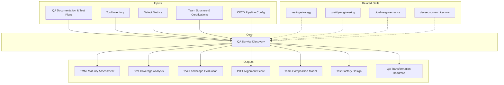

# QA Service Discovery — Quality Maturity Assessment & Transformation Roadmap

Generates a 7-section assessment for QA services: quality maturity evaluation (TMMi), testing coverage analysis, tool landscape evaluation, PITT methodology alignment, team composition modeling, test factory design, and QA transformation roadmap. Oriented toward building quality services that prevent defects, not just detect them.

## Grounding Guideline

> *Quality is not inspected at the end — it is built from the start. A QA service that only finds bugs is an incomplete service; the real value lies in preventing them.*

1. **Shift-left is not a slogan — it is a measurable strategy.** Every defect found in production costs 100x more than one found in requirements. The assessment measures where defects are found in the lifecycle and how far left they can be moved.
2. **Test automation without strategy is a cost, not an investment.** Fragile, slow, or irrelevant automated tests consume more than they contribute. The assessment evaluates not only the automation ratio but the quality and maintainability of the automated suite.
3. **Independent testing (PITT) is an enabler, not an obstacle.** The separation of responsibilities between development and QA does not create friction — it creates accountability. The PITT model correctly implemented accelerates releases, not slows them down.

## Inputs

- `$1` — Path to QA documentation or project workspace (default: current working directory)
- `$2` — Analysis depth: `full` (default), `executive` (S1, S2, S7 only)

Parse from `$ARGUMENTS`.

**Parameters:**
- `{MODO}`: `piloto-auto` (default) | `desatendido` | `supervisado` | `paso-a-paso`
  - **piloto-auto**: Auto for coverage and tool analysis, HITL for maturity evaluation and team decisions.
  - **desatendido**: Zero interruptions. Fully automated analysis. Assumptions documented.
  - **supervisado**: Autonomous with reports upon completing each section.
  - **paso-a-paso**: Confirms before each analysis section.
- `{FORMATO}`: `markdown` (default) | `html` | `dual`
- `{VARIANTE}`: `ejecutiva` (~40% — S1, S2, S7 only) | `tecnica` (full, default)
- `{TIPO_SERVICIO}`: `QA` (fixed for this skill)

## Input Requirements

**Mandatory:**
- QA process documentation (test plans, test strategies)
- Current testing tool inventory
- Defect metrics (detection rate, escape rate, density)
- Current QA team structure

**Recommended:**
- Test automation suite (access to test repository)
- CI/CD pipeline configuration
- Release and defect history (12+ months)
- Previous quality audit results
- Team certifications (ISTQB, etc.)

## Assumptions & Limits

**Assumptions:**
- A defined testing process exists (even if informal)
- Access to basic defect metrics is available
- The QA team is identifiable (dedicated or shared roles)
- The organization seeks to improve its quality engineering capability

**Cannot do:**
- Execute tests in the client's environment (requires infrastructure access)
- Evaluate performance of tools in use (requires live benchmarking)
- Perform formal TMMi certification audits (requires certified assessor)
- Individually interview each team member

## Workarounds When Inputs Missing

| Missing Input | Impact | Workaround |
|---|---|---|
| No test plans | Cannot assess test strategy maturity | Infer from test code and CI/CD config; flag as [INFERENCE] |
| No defect metrics | Cannot quantify quality baseline | Code quality analysis as proxy; recommend metrics implementation |
| No tool inventory | Cannot evaluate tool landscape | Detect from CI/CD pipelines and repositories; flag as [INFERENCE] |
| No team structure | Cannot model composition | Infer from commits, PR reviews, tool access; flag as [ASSUMPTION] |
| No automation suite | Cannot assess automation maturity | Flag as critical gap; recommend automation strategy |

## Edge Cases

- **No dedicated QA team:** Evaluate testing as distributed responsibility within development. Flag as risk and opportunity.
- **Manual testing only:** Calculate opportunity cost. Prioritize automation by regression risk.
- **Multiple QA teams (by product):** Evaluate consistency across teams. Identify standardization opportunities.
- **Existing QA outsourcing:** Evaluate current vendor vs MetodologIA. Analyze gaps and transition.
- **Specific regulation (pharma, fintech):** Elevate documentation, traceability, and validation requirements. Map compliance requirements.
- **>500 unmaintained test cases:** Flag test debt. Evaluate relevance vs maintenance cost. Recommend rationalization.

## Trade-off Matrix

| Decision | Enables | Constrains | When to Use |
|---|---|---|---|
| **Full 7-section analysis** | Maximum depth, complete transformation plan | 5-7 days, high token consumption | QA transformation programs, test factory setup |
| **Executive variant** (S1+S2+S7) | Quick maturity snapshot, decision-ready | Does not include tools, team, or factory design | Business case for QA investment |
| **TMMi-focused** (S1 deep) | Certification roadmap | Less depth in coverage and tools | Organizations seeking TMMi certification |
| **Automation-focused** (S2+S3 deep) | Automation strategy and tool selection | Less organizational maturity context | Test automation program kick-off |

## 7-Section Framework

### S1: Quality Maturity Model Assessment (TMMi)

Assessment against the 5 TMMi (Test Maturity Model integration) levels.

**TMMi Levels:**

| Level | Name | Characteristics |
|---|---|---|
| L1 | Initial | Ad-hoc testing, no defined process, individual-dependent |
| L2 | Managed | Testing planned per project, basic test plans, defect tracking |
| L3 | Defined | Organizational testing process, test design techniques, peer reviews |
| L4 | Measured | Quantitative quality metrics, statistical process control, product quality evaluation |
| L5 | Optimization | Data-driven continuous improvement, defect prevention, quality control |

**Assessment per process area:**
- Test Policy & Strategy
- Test Planning
- Test Monitoring & Control
- Test Design & Execution
- Test Environment
- Non-functional Testing
- Peer Reviews

**Deliverable:** Current level with evidence per process area. Gap analysis toward target level.

### S2: Test Coverage Analysis

Test coverage analysis across multiple dimensions.

**Coverage by type:**

| Type | Current Coverage | Target | Gap |
|---|---|---|---|
| Functional | ...% | ...% | ... |
| Non-functional | ...% | ...% | ... |
| Regression | ...% | ...% | ... |
| Performance | ...% | ...% | ... |
| Security | ...% | ...% | ... |

**Coverage by layer:**

| Layer | Tests | Automated | Manual | Ratio |
|---|---|---|---|---|
| Unit | ... | ... | ... | ...% |
| Integration | ... | ... | ... | ...% |
| API | ... | ... | ... | ...% |
| E2E | ... | ... | ... | ...% |

**Coverage by risk level:**
- Critical: ...% coverage
- High: ...% coverage
- Medium: ...% coverage
- Low: ...% coverage

**Automation ratio:** % of automated tests vs total. Trend analysis if historical data available.

### S3: Tool Landscape Assessment

Evaluation of current vs recommended tools.

**Tool categories:**

| Category | Current Tool | Maturity (1-5) | Adoption (%) | Recommendation |
|---|---|---|---|---|
| Test Management | ... | ... | ... | ... |
| Automation Framework | ... | ... | ... | ... |
| CI/CD Integration | ... | ... | ... | ... |
| Performance Testing | ... | ... | ... | ... |
| Security Testing | ... | ... | ... | ... |
| API Testing | ... | ... | ... | ... |
| Mobile Testing | ... | ... | ... | ... |
| Accessibility Testing | ... | ... | ... | ... |

**Evaluation criteria:**
- Product maturity (stability, roadmap, community)
- Integration with existing stack
- Learning curve
- Total cost of ownership (licenses, infrastructure, maintenance)
- Support and ecosystem

### S4: PITT Methodology Alignment

Readiness evaluation for Independent Testing Teams (PITT).

**Evaluation dimensions:**

| Dimension | Score (1-5) | Evidence |
|---|---|---|
| Separation of concerns (dev vs QA) | ... | ... |
| Governance model | ... | ... |
| Communication protocols | ... | ... |
| Defect management process | ... | ... |
| Test artifact independence | ... | ... |
| Reporting & metrics | ... | ... |

**PITT interaction model:**
- Contact point between development and testing teams
- Communication flow for requirements, defects, and releases
- Escalation path for blockers
- Reporting and review cadence

**Readiness score:** Weighted average of dimensions. >3.5 = ready for PITT. <3.5 = requires prior preparation.

### S5: QA Team Composition Model

Profile modeling and gap analysis.

**Required profiles:**

| Profile | Quantity | Seniority | Certifications | Role |
|---|---|---|---|---|
| Test Analyst | ... | Jr/Mid/Sr | ISTQB FL/AL | Functional test design and execution |
| Automation Engineer | ... | Mid/Sr | ISTQB TAE | Automation framework development and maintenance |
| Performance Tester | ... | Sr | ISTQB Performance | Performance test design and execution |
| Security Tester | ... | Sr | ISTQB Security/CEH | Security testing and vulnerability assessment |
| Test Manager | ... | Sr/Lead | ISTQB TM-AL | Team management, planning, reporting |
| Quality Mobilizer | ... | Lead | Multiple | Quality transformation, coaching, continuous improvement |

**Certification mapping:**
- ISTQB Foundation Level (FL) — baseline para todos
- ISTQB Advanced Level Test Analyst (AL-TA)
- ISTQB Advanced Level Test Manager (AL-TM)
- ISTQB Technical Test Analyst (AL-TTA)
- ISTQB Agile Tester Extension
- ISTQB Test Automation Engineer (TAE)
- ISTQB Performance Testing
- ISTQB Security Testing

**Allocation model:** FTE distribution by testing type and project phase.

### S6: Test Factory Design

Test factory model design for testing industrialization.

**Test Factory Components:**

1. **Standardized processes**
   - Test strategy template
   - Test plan template
   - Test case design standards
   - Defect lifecycle management
   - Release qualification checklist

2. **Governance**
   - Quality gates per phase
   - Entry/exit criteria
   - Escalation matrix
   - Review board (frequency, participants, scope)

3. **Metrics Dashboard**
   - Test execution progress
   - Defect density & trend
   - Automation ratio evolution
   - Test coverage by risk
   - Escape rate (defects in production post-release)
   - Cost of quality (prevention vs detection vs failure)

4. **Standardized frameworks**
   - Automation framework architecture (Page Object, Screenplay, etc.)
   - Data management strategy (test data, environments)
   - Reporting templates

5. **Knowledge Base**
   - Lessons learned repository
   - Reusable test assets
   - Best practices documentation
   - Onboarding guide for new testers

6. **Continuous improvement**
   - Quality retrospectives (frequency)
   - Innovation time (exploratory testing, new tools evaluation)
   - Internal and external benchmarking

### S7: QA Transformation Roadmap

QA transformation roadmap across 3 horizons.

**Horizon 1 — Quick Wins (0-3 months):**
- Establish baseline metrics
- Implement defect management process
- Quick automation wins (smoke tests, critical regression)
- Standardize test plans and templates

**Horizon 2 — Medium-term (3-9 months):**
- Implement automation framework
- Shift-left initiatives (unit test coaching, static analysis)
- Performance testing baseline
- Operational PITT model
- ISTQB training and certification

**Horizon 3 — Strategic (9-18 months):**
- Operational and mature Test Factory
- Target TMMi level achieved
- AI-augmented testing (test generation, visual testing, self-healing)
- QA as continuous delivery enabler
- Quality engineering culture (quality as everyone's responsibility)

**Investment magnitude indicators (NOT prices):**
- FTE-months per horizon
- Required licenses (quantity, type)
- Testing infrastructure (environments, data)
- Training (person-hours, certifications)

> **Mandatory disclaimer:** The magnitudes presented are estimates based on identified drivers. Final values depend on commercial negotiation, market conditions, and client-specific context.

## Escalation to Human Architect

- Sector-specific regulatory requirements (pharma validation, fintech compliance)
- Organizational conflicts between development and QA
- QA outsourcing vs insourcing decisions
- Tool evaluation with complex licensing
- Integration with corporate security processes
- Transition from existing QA vendor

## Validation Gate

- [ ] Current TMMi level identified with evidence per process area
- [ ] Test coverage analyzed by type, layer, and risk level
- [ ] Tool landscape evaluated with maturity and adoption scores
- [ ] PITT alignment evaluated with readiness score
- [ ] Team composition model with profiles, certifications, and allocation
- [ ] Test factory designed with processes, governance, metrics, and frameworks
- [ ] 3-horizon roadmap with maturity milestones per phase
- [ ] Investment magnitudes documented (NEVER prices) with disclaimer
- [ ] Evidence tagged with [CODE], [CONFIG], [DOC], [INFERENCE], [ASSUMPTION]
- [ ] Cross-references between sections (TMMi S1 informs roadmap S7)

## Knowledge Graph



## Output Templates

**MD format (default):**

```
# QA Service Discovery: {project_name}
## S1: Quality Maturity Model Assessment (TMMi)
### Current Level | Assessment per Process Area | Gap Analysis

## S2: Test Coverage Analysis
### Coverage by Type | by Layer | by Risk Level | Automation Ratio

## S3: Tool Landscape Assessment
### Tools by Category | Maturity | Adoption | Recommendations

## S4: PITT Methodology Alignment
### Dimensions | Interaction Model | Readiness Score

## S5: QA Team Composition Model
### Profiles | ISTQB Certifications | Allocation

## S6: Test Factory Design
### Processes | Governance | Metrics Dashboard | Frameworks | Knowledge Base

## S7: QA Transformation Roadmap
### H1 Quick Wins (0-3m) | H2 Medium-term (3-9m) | H3 Strategic (9-18m)
```

**XLSX format:**
QA maturity dashboard in spreadsheet: TMMi radar chart by process area, coverage heatmap by type and layer, tool matrix with scoring, and transformation roadmap with milestones and dependencies.

**PPTX format (on demand):**
- Filename: `{phase}_qa_service_discovery_{client}_{WIP}.pptx`
- Generated via python-pptx with MetodologIA Design System v5. Slide master with navy gradient, Poppins titles, Trebuchet MS body, gold accents. Max 20 slides executive / 30 technical. Presenter notes with evidence references. Slides: TMMi Maturity Assessment, Test Coverage Heatmap, Tool Landscape, PITT Readiness Score, Team Composition Model, Test Factory Design, QA Transformation Roadmap (3 horizons).

## Evaluation

| Dimension | Weight | Criterion (7/10 minimum) |
|---|---|---|
| Trigger Accuracy | 10% | Activates on QA maturity, TMMi, PITT, test factory, QA transformation keywords; not on technical testing |
| Completeness | 25% | All 7 sections cover maturity, coverage, tools, PITT, team, factory, and roadmap with evidence |
| Clarity | 20% | TMMi levels, readiness scores, and roadmap horizons are self-explanatory with measurable criteria |
| Robustness | 20% | Edge cases (no QA team, manual only, multi-team, outsourcing, regulation) have workarounds |
| Efficiency | 10% | Executive variant (S1+S2+S7) delivers maturity snapshot and roadmap without 7-section overhead |
| Value Density | 15% | Each section produces actionable scores, quantified gaps, and recommendations with investment magnitudes |

**Minimum threshold:** 7/10 per dimension. Weighted composite >= 7.0 to consider output acceptable.

---

## Output Artifact

**Primary:** `QA_Service_Discovery_{project}.md` — Complete 7-section assessment with TMMi maturity evaluation, coverage analysis, tool landscape, PITT alignment, team composition, test factory design, and QA transformation roadmap.

| **HTML** | `{fase}_QA_Service_Discovery_{cliente}_{WIP}.html` | Mismo contenido en HTML branded (Design System MetodologIA v5). Self-contained, WCAG AA, responsive. Tipo: Light-First Technical. Incluye radar chart de madurez TMMi, heatmap de cobertura por capa, y roadmap de transformacion en 3 horizontes. |
| **DOCX** | `{phase}_qa_service_discovery_{client}_{WIP}.docx` | Generated via python-docx with MetodologIA Design System v5. Cover page, auto-generated TOC, Poppins headings (navy), Trebuchet MS body, gold accents. TMMi assessment tables, coverage by layer and tool landscape with zebra striping. Branded headers and footers. |

**Included diagrams:**
- TMMi maturity radar chart by process area
- Coverage heatmap by type and layer
- PITT interaction model (flowchart)
- Transformation roadmap (gantt)

---
**Author:** Javier Montano · Comunidad MetodologIA | **Last updated:** March 14, 2026
