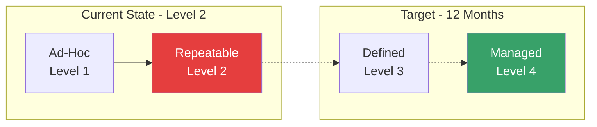
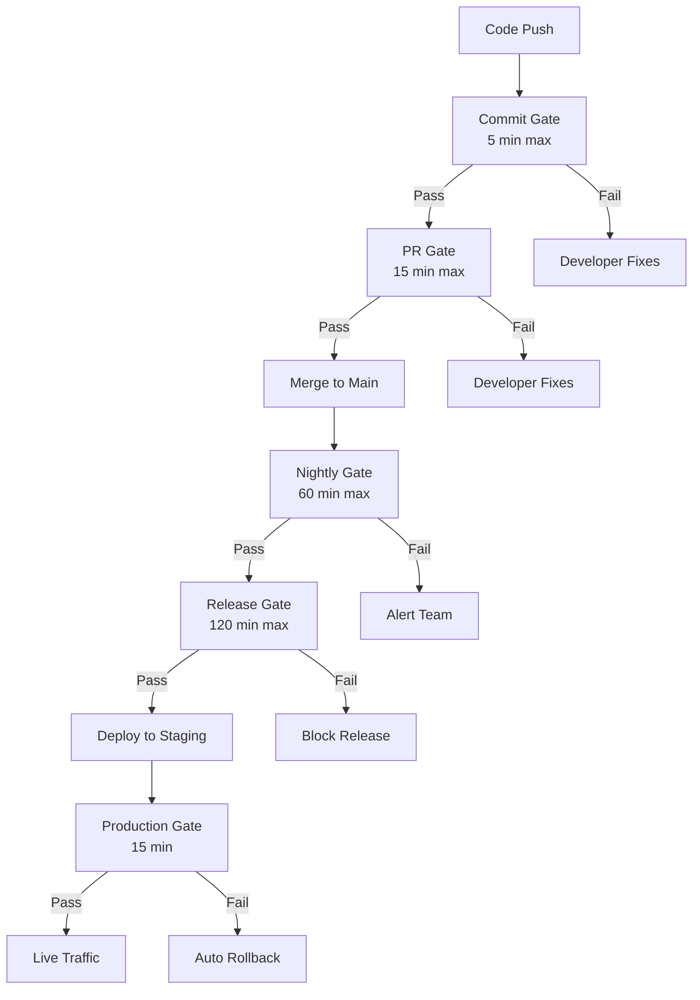

# A-01 Quality Engineering — Acme Corp Banking Modernization

> **Proyecto:** Acme Corp Banking Modernization | **Fecha:** 12 de marzo de 2026
> **Modo:** piloto-auto | **Variante:** tecnica (full)

---

## Executive Summary

Acme Corp is migrating its core banking platform from a COBOL mainframe to Java/Spring Boot microservices. This quality engineering framework establishes maturity assessment, test strategy aligned with the microservices diamond shape, automation architecture, CI/CD quality gates, and quality metrics. Current maturity: Level 2 (Repeatable). Target: Level 4 (Managed) within 12 months. Critical gap: zero contract testing between 14 services and no automated regression suite for the loan origination workflow.

---

## S1: Quality Maturity Assessment

### Current Maturity: Level 2 (Repeatable)

### Assessment Scorecard

| Dimension | Current Score | Target (12mo) | Gap Analysis |
|-----------|-------------|---------------|-------------|
| Test Strategy & Planning | 35% | 80% | No formal strategy document; ad-hoc pyramid; ownership unclear between dev and QA |
| Test Automation | 40% | 85% | JUnit unit tests exist (55% coverage); no integration or E2E automation |
| Quality Gates & CI/CD | 25% | 80% | Only lint check in CI; no PR gate; manual release approval |
| Test Data Management | 15% | 70% | Shared staging database; no synthetic data; PII in test environments |
| Quality Metrics & Dashboards | 20% | 75% | Basic SonarQube coverage; no defect tracking dashboard; no DORA metrics |
| Shift-Left Practices | 30% | 80% | Developers write unit tests; no pre-commit hooks; code review does not include quality criteria |

### DORA Benchmark Comparison

| Metric | Acme Corp Current | Industry Medium | Target (Elite) |
|--------|------------------|----------------|---------------|
| Deployment Frequency | 1x/month | 1x/week | Multiple/day |
| Lead Time for Changes | 3 weeks | 1 week | <1 day |
| Change Failure Rate | 18% | 15% | <5% |
| MTTR | 4 hours | 1 hour | <1 hour |

---

## S2: Test Strategy

### Architecture-Driven Shape: Test Diamond

Acme Corp's microservices architecture (14 services, 6 Kafka topics, 3 external integrations) requires the **test diamond** shape. Integration tests across service boundaries provide the highest confidence-to-cost ratio.

| Test Level | Ratio | Count Target | Owner | Frequency |
|-----------|-------|-------------|-------|-----------|
| Unit | 20% | ~800 tests | Developer | Every commit |
| Integration | 40% | ~1,600 tests | Developer + QA | Every PR |
| Contract | 30% | ~1,200 tests | Both teams | Every PR |
| E2E | 10% | ~400 tests | QA Automation | Nightly + pre-release |

### Test Types — Banking-Specific

| Type | Owner | Frequency | Banking Examples |
|------|-------|-----------|-----------------|
| Unit | Developer | Every commit | Interest calculation, amortization schedule, fee computation |
| Integration | Developer | Every PR | Loan service -> PostgreSQL, Payment -> Kafka -> Fraud |
| Contract | Both teams | Every PR | Account API consumers (mobile, web, partner) |
| API | QA | PR + nightly | REST endpoint validation, schema compliance |
| E2E | QA | Nightly | Full loan origination flow, payment processing end-to-end |
| Regulatory | Compliance | Pre-release | TILA disclosure accuracy, BSA/AML rule validation |
| Security | Security | SAST per commit, DAST weekly | OWASP Top 10, PCI-DSS controls |
| Performance | Perf Eng | Weekly + pre-release | Throughput under month-end load, p99 latency |

### Test Data Strategy

| Concern | Current State | Target State |
|---------|-------------|-------------|
| Generation | Manual SQL scripts | Faker-based factories with banking domain (account types, loan products) |
| PII handling | Real customer data in staging | Fully synthetic; PII masking pipeline for integration test data |
| Isolation | Shared database, tests interfere | Per-test transaction rollback; Testcontainers for integration |
| Regulatory data | Mixed with real data | Tagged, versioned test scenarios for each regulation |

---

## S3: Automation Architecture

### Framework Selection

| Level | Framework | Rationale |
|-------|-----------|-----------|
| Unit | JUnit 5 + Mockito | Team expertise, Spring Boot native |
| Integration | Spring Boot Test + Testcontainers | Real database, real Kafka in containers |
| Contract | Pact (JVM) | Consumer-driven contracts for 14 services |
| API | REST Assured | Fluent API testing, JSON schema validation |
| E2E | Playwright (Java) | Cross-browser, reliable waits, CI-friendly |
| Performance | Grafana k6 | JavaScript-based, CI-native, existing Grafana stack |

### CI/CD Quality Gates

| Gate | Tests Included | Pass Criteria | Timeout |
|------|---------------|---------------|---------|
| Commit | Unit + lint + SAST | 100% pass, 0 critical vulns | 5 min |
| PR | Integration + contract + coverage | All pass, coverage >70%, no regressions | 15 min |
| Nightly | Full E2E + API regression + DAST + perf | E2E >95% pass, no critical findings | 60 min |
| Release | Full load test + regulatory + manual sign-off | SLA met, compliance passed | 120 min |
| Production | Smoke + canary metrics | Canary within 2-sigma of baseline | 15 min |

---

## S4: Quality Gates — Banking-Specific

### Gate Enforcement Rules

| Rule | Policy | Banking Rationale |
|------|--------|------------------|
| No bypass for security gates | SAST/DAST cannot be bypassed | PCI-DSS, SOC 2 compliance |
| Regulatory test suite | Mandatory pre-release | OCC examination readiness |
| Flaky test policy | >2 failures/week -> quarantine | Cannot risk false confidence in payment flows |
| Bypass audit trail | Every bypass logged with approver | SOX audit requirements |
| Data masking verification | Pre-release gate | PII in test environments is a regulatory violation |

---

## S5: Quality Metrics

### Leading Indicators

| Metric | Current | Target | Trend |
|--------|---------|--------|-------|
| Code review catch rate | 28% | >50% | Needs improvement |
| Test coverage (line) | 55% | 75% | Growing 3%/month |
| PR review time | 48 hours | <24 hours | Needs process change |
| Build stability | 82% | >95% | Flaky tests causing failures |
| Flaky test rate | 8% | <2% | Critical — quarantine needed |
| PR gate execution time | 22 min | <15 min | Parallelization needed |
| Deployment frequency | 1x/month | >1x/week | Blocked by manual gates |

### Lagging Indicators

| Metric | Current | Target | Trend |
|--------|---------|--------|-------|
| Production incidents | 3/week | <1/week | Decreasing |
| Escaped defects | 12% | <5% | Integration tests will reduce |
| MTTR | 4 hours | <1 hour | Runbook automation needed |
| Regression rate | 4% | <1% | Contract testing will address |
| Compliance findings | 2/quarter | 0 | Regulatory test suite needed |

---

## S6: Implementation Plan

### 12-Month Phased Roadmap

| Phase | Weeks | Focus | Key Deliverables | Success Criteria |
|-------|-------|-------|-----------------|-----------------|
| Foundations | 1-4 | CI gates + strategy | Commit gate, test strategy doc, framework setup, metrics dashboard | 90%+ build pass; strategy approved |
| Automation | 5-12 | PR gate + integration | 800+ integration tests, Testcontainers, Pact contracts for 6 critical services | PR gate >90% pass; integration coverage >60% |
| Advanced | 13-20 | E2E + compliance | Playwright E2E for 5 critical journeys, regulatory test suite, DAST integration | E2E >70% critical paths; regulatory suite complete |
| Optimization | 21-52 | Continuous improvement | Flaky elimination, monthly metric review, test data factories, chaos engineering | Flaky <2%; DORA metrics at "high" tier |

### Quick Wins (Weeks 1-4)

1. Enable SonarQube quality gate in CI (existing tool, just enforce)
2. Quarantine 15 known flaky tests (immediate build stability improvement)
3. Add pre-commit hooks for lint + unit tests
4. Create test data factory for loan domain (eliminate shared test data)
5. Dashboard: deploy Grafana quality metrics panel alongside existing observability

---

## Validation Checklist

- [x] Architecture type identified (microservices) and test diamond shape selected
- [x] All 5 pipeline stages have defined pass criteria and timeouts
- [x] Metrics include both leading (7) and lagging (5) indicators with targets
- [x] Banking-specific edge cases: regulatory testing, PII masking, compliance gates
- [x] Implementation plan phased over 12 months with realistic effort estimates
- [x] PCI-DSS and SOC 2 requirements explicitly layered into quality gates
- [x] DORA metrics baselined with improvement targets

---
**Autor:** Javier Montaño — MetodologIA Discovery Framework v6.0
