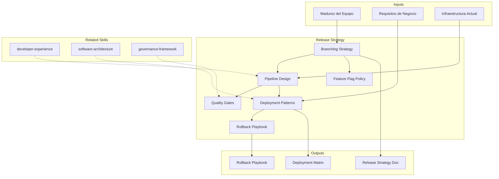

# Release Strategy

Design of release management strategy, deployment patterns, and rollback procedures
aligned with team maturity and business requirements.

## Grounding Guideline

> *A release without strategy is a deploy with crossed fingers.*

1. **Controlled risk.** Feature flags, canary releases, and blue-green deployments exist to reduce the blast radius.
2. **Rollback as a first-class citizen.** If you cannot revert in minutes, you are not ready to deploy.
3. **Post-release observability.** The first 30 minutes after deploy define success — metrics must be ready before the release.

## TL;DR

- Evaluates current release management and CI/CD pipeline maturity
- Selects optimal branching strategy (trunk-based, GitFlow, GitHub Flow) based on context
- Defines deployment patterns (blue-green, canary, rolling, recreate) per service
- Designs rollback playbook with automatic activation criteria
- Generates complete strategy document with decision matrix

## Inputs

Parse `$1` as **project name**, `$2` as **target system or platform**.

**Parameters:**
- `{MODO}`: `piloto-auto` (default) | `desatendido` | `supervisado` | `paso-a-paso`
- `{FORMATO}`: `markdown` (default) | `html` | `dual`
- `{VARIANTE}`: `ejecutiva` (~40%) | `tecnica` (full, default)

## Deliverables

1. **Release Strategy Document** — Branching model, release cadence, versioning policy
2. **Deployment Matrix** — Deployment pattern per service/component with justification
3. **Rollback Playbook** — Step-by-step procedures with activation criteria
4. **Pipeline Design** — CI/CD pipeline architecture with quality gates
5. **Feature Flag Strategy** — Feature flag policy, lifecycle, cleanup

## Process

1. **Current State Assessment** — Evaluate existing pipeline, branching model, release frequency, incident history
2. **Branching Strategy Selection**:
   | Strategy | Best For | Requires |
   |---|---|---|
   | Trunk-based | Mature teams, CD | Feature flags, high test coverage |
   | GitHub Flow | Medium teams | PR reviews, solid CI |
   | GitFlow | Planned releases | Branch discipline, dedicated QA |
3. **Deployment Pattern Design** — For each service:
   - Blue-Green: zero-downtime, instant rollback, requires 2x infra
   - Canary: progressive rollout, early detection, requires observability
   - Rolling: resource-efficient, gradual, requires backward compatibility
4. **Rollback Definition** — Automatic criteria (error rate >X%, latency >Yms), manual procedure, communication
5. **Quality Gates** — Define pipeline gates: lint, test, security scan, performance, approval
6. **Feature Flag Policy** — Lifecycle (create, enable, monitor, cleanup), ownership, technical debt prevention

## Quality Criteria

- [ ] Branching strategy justificada con contexto del equipo y negocio
- [ ] Patron de deployment definido por servicio con trade-offs documentados
- [ ] Playbook de rollback con pasos reproducibles y criterios de activacion claros
- [ ] Pipeline design con quality gates y tiempos estimados por stage
- [ ] Feature flag policy con cleanup schedule
- [ ] Metricas de release health definidas (DORA metrics como referencia)
- [ ] Diagrama Mermaid del pipeline y flujo de release

## Assumptions & Limits

- Asume que existe al menos un repositorio de codigo con versionamiento (Git)
- No implementa pipelines — disena la estrategia y arquitectura para que el equipo la ejecute
- Feature flag strategy requiere infraestructura de flags (LaunchDarkly, Unleash, custom); si no existe, se recomienda como prerequisito
- Estimaciones de tiempo de pipeline son referenciales y dependen de infraestructura real

## Edge Cases

| Escenario | Estrategia de Manejo |
|---|---|
| Sistema legacy sin tests automatizados | Recomendar estrategia de release conservadora (GitFlow + manual QA gates) con plan paralelo de test automation |
| Microservicios con interdependencias de release | Disenar contract testing + independent deployability assessment por servicio; orquestar releases solo cuando hay breaking changes |
| Regulacion que exige aprobacion manual por release | Incorporar approval gate en pipeline sin eliminar automatizacion; documentar audit trail requerido |
| Equipo de 2 personas sin capacidad para mantener branches | Recomendar trunk-based simplificado con feature flags basicos; evitar overhead de GitFlow |

## Decisions & Trade-offs

| Decision | Habilita | Restringe | Justificacion |
|---|---|---|---|
| Trunk-based como recomendacion default para equipos maduros | Continuous delivery, menos merge conflicts | Requiere feature flags y test coverage alto | Maximiza velocidad de delivery y reduce riesgo de integracion |
| Canary como patron de deployment preferido | Deteccion temprana de problemas en produccion | Requiere observabilidad madura y rollback automatico | Equilibrio entre velocidad y seguridad; blue-green es fallback si no hay observabilidad |
| Feature flags con lifecycle obligatorio | Previene acumulacion de flags como deuda tecnica | Overhead de gestion de flags | Sin lifecycle, los flags se convierten en condicionales permanentes que degradan el codigo |

## Knowledge Graph

## Output Templates

**Formato 1 — Markdown (default)**
- Filename: `Release_Strategy_{project}_{WIP|Aprobado}.md`
- Estructura: Assessment actual > Branching strategy > Deployment matrix > Pipeline design > Rollback playbook > Feature flag policy > Metricas
- Incluye diagramas Mermaid de pipeline y sequence de rollback

**Formato 2 — DOCX (playbook operativo)**
- Filename: `Release_Playbook_{project}_{WIP|Aprobado}.docx`
- Estructura: Procedimientos step by step de deployment y rollback, checklist pre-release, contactos de escalation
- Optimizado para uso operativo por equipos de SRE/DevOps

**Formato 3 — HTML (bajo demanda)**
- Filename: `{fase}_Release_Strategy_{project}_{WIP}.html`
- Estructura: HTML self-contained branded (Design System MetodologIA v5). Tipo: Light-First Technical. Incluye matriz de deployment patterns por servicio, pipeline design con quality gates, y rollback playbook navegable. WCAG AA, responsive, print-ready.

**Formato 4 — XLSX (bajo demanda)**
- Filename: `{fase}_release_strategy_{cliente}_{WIP}.xlsx`
- Generado via openpyxl con MetodologIA Design System v5. Headers navy con texto blanco Poppins, formato condicional por patron de deployment y estado de quality gate, auto-filtros en todas las columnas, valores calculados sin formulas. Hojas: Deployment Matrix, Pipeline Design, Rollback Playbook, Feature Flag Inventory.

**Formato 5 — PPTX (bajo demanda)**
- Filename: `{fase}_release_strategy_{cliente}_{WIP}.pptx`
- Generado via python-pptx con MetodologIA Design System v5. Slide master con gradiente navy, títulos en Poppins, cuerpo en Trebuchet MS, acentos en gold. Máx 20 slides ejecutivo / 30 técnico. Notas del presentador con referencias de evidencia. Slides: Release Maturity Assessment, Branching Strategy, Deployment Patterns Matrix, Pipeline Design con Quality Gates, Rollback Playbook, Feature Flag Policy, DORA Metrics.

## Evaluacion

| Dimension | Peso | Criterio |
|-----------|------|----------|
| Trigger Accuracy | 10% | Activa triggers correctos ante keywords de release, deployment, CI/CD, rollback |
| Completeness | 25% | Cubre branching, deployment patterns, rollback, pipeline, feature flags y metricas |
| Clarity | 20% | Playbook de rollback es ejecutable step by step sin ambiguedad |
| Robustness | 20% | Maneja legacy sin tests, microservicios interdependientes, regulacion estricta |
| Efficiency | 10% | Pipeline design no incluye gates redundantes; proceso escala con variante ejecutiva |
| Value Density | 15% | Cada patron de deployment tiene trade-offs documentados y criterios de seleccion |

**Umbral minimo**: 7/10 en cada dimension para considerar el skill production-ready.

## Cross-References

- **metodologia-developer-experience:** Inner loop metrics impactadas por pipeline design
- **metodologia-software-architecture:** Restricciones arquitectonicas que determinan deployment patterns
- **metodologia-governance-framework:** Quality gates alineados con politicas de gobernanza

---
**Autor:** Javier Montaño · Comunidad MetodologIA | **Version:** 1.0.0
