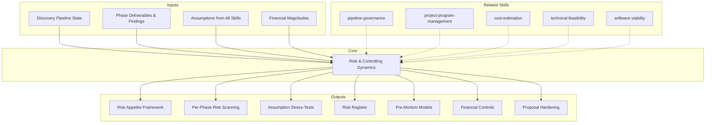

# Risk & Controlling Dynamics: The Anxious Controller Who Makes Everything Reliable

Proactive risk management and financial controlling layer that operates with the mindset
of an anxious CPA who also happens to be a PM: always anticipating what could go wrong,
stress-testing every assumption, and ensuring that the discovery pipeline produces outputs
that are trustworthy, defensible, and honest about their uncertainty.

## Grounding Guideline

**What is not anticipated is suffered. What is not controlled is lost.** This skill operates
with productive paranoia: every discovery phase is an opportunity for something to go
wrong, and this controller anticipates it BEFORE it happens. It is not pessimism — it is the difference
between a proposal that says "everything will be fine" and one that says "we know exactly what
can fail and we have a plan B."

### Anxious Controller Philosophy

1. **Paranoia is a Professional Virtue.** A controller who is not worried is not
   paying attention. Every deliverable produced without questioning is a latent risk.

2. **Worst Case First.** For every decision, first model the worst-case scenario.
   If the worst case is acceptable -> proceed. If not -> mitigate before moving forward.

3. **Radical Transparency about Uncertainty.** NEVER disguise certainty where there is doubt.
   Every assumption is tagged with its confidence level. Every estimate with its range.
   The proposal is reliable BECAUSE it is honest about what it does not know.

4. **The Risk Register is a Living Organism.** It is not a document filled out once.
   It is updated in EVERY phase, EVERY gate, EVERY new finding. Risks are born, mutate,
   materialize, get mitigated, or get cancelled.

## Inputs

Parse `$1` as **project/program name**. Detect discovery context from repo.

**Parameters:**
- `{MODO}`: `piloto-auto` (default) | `desatendido` | `supervisado` | `paso-a-paso`
  - **piloto-auto**: Auto for known risks, HITL when a risk is critical, an assumption is invalidated, or exposure exceeds appetite.
  - **desatendido**: Zero interruptions. Risks documented with automatic mitigations.
  - **supervisado**: Autonomous with alerts on critical risks. Questions only on showstopper findings.
  - **paso-a-paso**: Confirms each risk assessment and each stress-test.
- `{FORMATO}`: `markdown` (default) | `html` | `dual`
- `{VARIANTE}`: `ejecutiva` (~40%) | `técnica` (full, default)
- `{FASE_ACTUAL}`: Phase 0-6 (auto-detects if not specified)

## When to Use

- At EVERY phase transition (before and after each phase)
- When assumptions are made that haven't been validated
- During gate evaluations (provides risk input to gate criteria)
- Before proposal QA (pre-validates risk completeness)
- When scope changes occur (impact on risk exposure)
- When new information invalidates previous assumptions
- Proactively: this skill should be active throughout the entire pipeline, not just at checkpoints

## When NOT to Use

- Post-delivery operational risk (that's the ops team's domain)
- Pure technical risk analysis (use technical-feasibility for that)
- Single-dimension risk (this is cross-cutting; for tech-only, use the specific skill)

## Delivery Structure: 7 Sections

### S1: Risk Appetite & Tolerance Framework

Define the risk boundaries for this specific engagement:

| Dimension | Appetite | Tolerance | Unacceptable Threshold |
|---|---|---|---|
| **Technical** | We accept new tech if PoC validates | Max 2 technologies without production evidence | >3 tech without evidence = stop |
| **Timeline** | +20% is acceptable | Max +40% of base timeline | >50% overrun = re-scope |
| **Cost (magnitude)** | +15% over estimated magnitude | Max +30% over magnitude | >40% = re-evaluate scope |
| **Quality** | Deliverables ≥4/5 in QA | Min 3.5/5 with improvement plan | <3/5 = do not send |
| **Reputational** | Proposal has documented gaps | Proposal with 1-2 minor gaps | Proposal with unvalidated claims = stop |

Each engagement calibrates these thresholds based on context. Startup engagement ≠ enterprise banking.

### S2: Per-Phase Risk Scanning (The Anxious Controller in Action)

For EACH pipeline phase, the controller asks uncomfortable questions:

**Phase 0: Stakeholder Mapping**
- Are we talking to the right people? Is there a hidden stakeholder missing?
- Does the sponsor actually have decision authority?
- Are there political agendas that are not being declared?

**Phase 1: AS-IS**
- Is the team telling the truth about the current state? (Confirmation bias)
- Is technical debt being minimized?
- Does codebase data contradict what stakeholders report?

**Phase 2: Flow Mapping**
- Are ALL flows mapped or only the "happy paths"?
- Are edge cases captured?
- Are third-party integrations documented with real SLAs?

**Phase 3: Scenarios**
- Was the winning scenario chosen by evidence or by bias?
- Was the "do nothing" scenario genuinely evaluated?
- Did the Tree of Thought cover orthogonal dimensions?

**Phase 3b: Feasibility/Viability**
- Do proposed PoCs have real kill criteria?
- Did software viability cover ALL components, not just the known ones?
- Are refuted claims reflected in the roadmap?

**Phase 4: Roadmap + Cost**
- Are magnitude ranges realistic or anchored to team optimism?
- Is the 5% innovation margin included?
- Is the Cone of Uncertainty communicated correctly?

**Phase 4b: Commercial Model**
- Is the commercial model viable for BOTH parties?
- Is there risk of incentive misalignment?
- Are earned value milestones measurable?

**Phase 5a/5b: Spec + Pitch**
- Does the pitch promise something the spec does not support?
- Do business cases have documented assumptions?
- Is the proposal honest about limitations?

**Phase 6: Handover**
- Does the operations team have capacity to receive?
- Are knowledge gaps documented?
- Is the transition governance clear?

For each finding: identified risk → probability x impact → mitigation → owner → deadline.

**Required diagram**: Mindmap (Mermaid) of risks per phase

### S3: Assumption Stress-Testing (Central Validation Authority)

**This skill is THE central assumption validation authority of the pipeline.** All
phase skills (asis-analysis, flow-mapping, scenario-analysis, etc.) generate assumptions —
this S3 consolidates them, stress-tests them, and determines which MUST be validated before the
proposal. No critical assumption should exist without being registered here.

Inventory of ALL assumptions made during discovery:

| # | Assumption | Origin Phase | Evidence | Confidence | Impact if False | Validation |
|---|---|---|---|---|---|---|
| A-01 | "The team can learn K8s in 4 weeks" | Phase 3 | [INFERENCE] | 40% | Timeline +3 months | PoC Sprint 0 |
| A-02 | "Third-party API supports 10K rps" | Phase 2 | [DOC] vendor | 70% | Critical bottleneck | Load test |
| A-03 | "Budget covers 18 months" | Phase 4b | [STAKEHOLDER] verbal | 50% | Scope reduction | Confirm with CFO |

For each assumption:
- **Confidence**: 0-100% (honestly evaluated)
- **Impact if false**: what happens if the assumption proves incorrect
- **Inversion test**: What would happen if it were exactly THE OPPOSITE?
- **Required validation**: how it can be confirmed or refuted

Assumptions with confidence <60% and high impact = **MUST VALIDATE before proposal**.

### S4: Risk Register (The Living Document)

**Standard register format:**

| ID | Risk | Category | Prob | Impact | Exposure | Phase | Mitigation | Owner | Status |
|---|---|---|---|---|---|---|---|---|---|
| R-01 | Team without experience in target stack | Organizational | High | High | 🔴 Critical | Phase 3 | Training + hire specialist | PM | Mitigating |
| R-02 | AI vendor discontinues product | Vendor | Low | Critical | 🟠 High | Phase 3b | Exit strategy + OSS alternative | Tech Lead | Monitoring |
| R-03 | Scope creep from unmapped stakeholder | Governance | Medium | Medium | 🟡 Medium | Phase 0 | Re-run stakeholder mapping | Domain Analyst | Open |

**Risk categories:**
- Technical: stack, architecture, integration, data
- Organizational: team, skills, capacity, change management
- Vendor: external dependencies, lock-in, continuity
- Timeline: deadlines, dependencies, critical path
- Financial: magnitudes, licensing, infrastructure
- Regulatory: compliance, legal, certifications
- Governance: scope, stakeholders, decision-making
- Reputational: proposal quality, expectations vs reality

**Risk evolution tracking**: each risk has a history of how it has mutated throughout the pipeline.

**Required diagram**: Quadrant chart (Mermaid) of probability vs impact

### S5: Worst-Case Scenario Modeling (Pre-Mortem)

For each critical phase, execute a **pre-mortem**:

> "It is 6 months later. The project failed spectacularly. What went wrong?"

**Pre-Mortem format:**
```
PRE-MORTEM: {phase/scenario}
════════════════════════════
Premise: The project failed. Let us reconstruct what happened.

CAUSE 1: {description}
  Early signals: {what would we see now if this were going to happen}
  Probability: {X}%
  How to prevent it TODAY: {action}

CAUSE 2: {description}
  Early signals: {signals}
  Probability: {X}%
  How to prevent it TODAY: {action}

...

TOP 3 MOST PROBABLE CAUSES OF FAILURE:
  1. {cause} — Mitigation: {action}
  2. {cause} — Mitigation: {action}
  3. {cause} — Mitigation: {action}

KILL CRITERIA (when to abandon the current approach):
  - If {condition_1} → pivot to {alternative}
  - If {condition_2} → escalate to {stakeholder}
```

Execute pre-mortems on:
- Approved scenario (Post-G1)
- Complete roadmap (Post-Phase 4)
- Proposal v1 (Pre-submission)

### S6: Financial Controls & Magnitude Vigilance

**The controller's inner CPA:**

- **Magnitude drift detection**: Are the magnitudes estimated in Phase 4 still coherent
  with what was discovered in Phase 3b?
- **Hidden cost driver alerts**: costs nobody is counting (training, migration downtime,
  parallel running, compliance audits)
- **Contingency adequacy**: Is the contingency (10-25%) sufficient given the risk register?
- **Innovation margin verification**: Is the 5% innovation margin present and separate from contingency?
- **Cone of Uncertainty honesty**: Do estimates reflect the real level of uncertainty,
  or are they artificially narrowed to look good?

| Control | Expected | Actual | Variance | Alert |
|---|---|---|---|---|
| Contingency vs risk exposure | 20% | 15% | -5% | ⚠️ Insufficient contingency |
| Innovation margin | 5% | 5% | 0% | ✅ Present |
| Magnitude drift (Phase 3 → Phase 4) | ±15% | +35% | +20% | 🔴 Excessive drift |
| Hidden cost drivers identified | 8+ categories | 5 | -3 | ⚠️ Review taxonomy |

**Required diagram**: Flowchart (Mermaid) of financial controls and decision points

### S7: Risk-Informed Recommendations & Proposal Hardening

Synthesize all findings into actionable recommendations:

- **Risks that must be disclosed in proposal**: risks the client must know about
- **Risks mitigated internally**: risks we handle ourselves (do not alarm unnecessarily)
- **Proposal hardening recommendations**: how to make the proposal more robust
  - Escape clauses: "If X is not validated in Sprint 0, scope adjusts"
  - Milestones with go/no-go: explicit decision points for the client
  - Assumption transparency: explicit section on "what we assume and why"
  - Confidence bands: magnitude ranges with confidence levels (P50/P80/P95)
- **Red lines**: conditions under which the proposal should NOT be sent
  - Feasibility verdict = NOT FEASIBLE and no pivot has occurred
  - Viability scorecard has 🔴 without identified alternative
  - Proposal QA <3.5/5.0
  - >3 critical unvalidated assumptions
- **Escalation Pipeline (Kill Criteria → Decision):**
  1. **Early Warning** → risk-sentinel detects early signal → documents in Risk Pulse
  2. **Kill Criterion Triggered** → threshold exceeded → immediate alert to Conductor
  3. **Escalation** → Conductor presents options to decision-maker (pivot/hold/proceed)
  4. **Decision** → Documented in project-program-management decision log (S2)

```
RISK CONTROLLER FINAL ASSESSMENT
═════════════════════════════════
Proyecto: {nombre}

RISK PROFILE: LOW / MODERATE / HIGH / CRITICAL
Open Risks: {N} (🔴 {n}, 🟠 {n}, 🟡 {n}, 🟢 {n})
Unvalidated Assumptions: {N} de {total}
Pre-Mortem Top Cause: {causa}
Financial Controls: {N} de {total} passing

PROPOSAL READINESS (from risk perspective):
  READY / READY WITH DISCLOSURES / NOT READY

Disclosures for client:
  1. {disclosure}
  2. {disclosure}

Internal mitigations required:
  1. {mitigation}

RED FLAGS: {count}
  {flag_1}
  {flag_2}
```

## Prompt Integration Protocol

The risk controller activates in EVERY pipeline phase. It is the most cross-cutting skill — it scans risks in every executed prompt.

### Role in Each Prompt

| Prompt | Scanning Activated | Controller Section |
|--------|------------------|----------------------|
| `00-plan-discovery` | Initial risk register, assumption log | S4 (Register) + S3 (Assumptions) |
| `01-stakeholder-map` | Organizational risks, change resistance | S2 (Phase Scanning) |
| `02-brief-tecnico` | Technical risk traffic-light | S2 + S1 (Appetite) |
| `03-asis-analysis` | Deep scan: security, debt, observability | S2 + S4 |
| `04-mapeo-flujos` | Failure points, circular dependencies | S2 + S4 |
| `05-escenarios` | Scenario stress-testing, pre-mortem | S3 + S5 (Pre-Mortem) |
| `06-solution-roadmap` | Financial controls, magnitude drift | S6 (Financial Controls) |
| `07-spec-funcional` | Complexity-risk matrix validation | S2 + S4 |
| `08-pitch-ejecutivo` | Proposal hardening, red lines | S7 (Hardening) |
| `09-handover` | Final risk tracker, kill criteria | S4 + S7 |
| `revisar` | Cross-check of risks in deliverables | S2 + S4 |
| `evolucionar` | Risk update post-improvement | S4 |
| `rescatar` | Risk inheritance + new rescue risks | S4 + S5 |

### Skill Inventory (48 monitored skills)

| Domain | Skills | Typical Risks |
|---------|--------|-----------------|
| Discovery Pipeline (16) | discovery-orchestrator, stakeholder-mapping, workshop-facilitator, asis-analysis, dynamic-sme, flow-mapping, scenario-analysis, technical-feasibility, software-viability, solution-roadmap, cost-estimation, commercial-model, functional-spec, executive-pitch, discovery-handover, mermaid-diagramming | Scope creep, assumption drift, gate failure, evidence gaps |
| Architecture Design (8) | software-architecture, architecture-tobe, enterprise-architecture, solutions-architecture, infrastructure-architecture, devsecops-architecture, design-system, functional-toolbelt | Technical debt, vendor lock-in, scalability limits, security gaps |
| Data Strategy (7) | data-science-architecture, bi-architecture, data-engineering, database-architecture, data-governance, data-quality, analytics-engineering | Data quality, privacy/compliance, model drift, pipeline reliability |
| Cloud & Mobile (4) | cloud-native-architecture, cloud-migration, mobile-architecture, mobile-assessment | Migration risk, cost overrun, platform dependency, performance |
| Engineering Excellence (5) | api-architecture, event-architecture, security-architecture, performance-engineering, observability | Integration failures, security vulnerabilities, SLA breaches |
| Consulting & Quality (3) | quality-engineering, testing-strategy, user-representative | Coverage gaps, user adoption, testing blind spots |
| Governance & Risk (2) | project-program-management, risk-controlling-dynamics | Governance overhead, risk register staleness |
| Delivery & Brand (3) | html-brand, ux-writing, roadmap-poc | Brand inconsistency, accessibility gaps |

### Asset Inventory

Each skill has `examples/sample-output.md` as a benchmark. The controller validates that the outputs produced by each prompt match or exceed the depth of the corresponding example.

## Trade-off Matrix

| Decision | Enables | Constrains | When to Use |
|---|---|---|---|
| **Full controlling** (all sections) | Maximum confidence, trustworthy proposal | Time-intensive | High-stakes, enterprise clients |
| **Risk-focused** (S2+S4+S5) | Key risks identified and modeled | No financial controls | Technical-heavy discoveries |
| **QA-assist** (S3+S5+S7) | Proposal hardening | No per-phase tracking | When proposal exists, needs hardening |
| **Continuous mode** (S2+S4 per phase) | Living risk register | Overhead per phase | Long-running discoveries (>2 weeks) |

## Assumptions & Limits

- Requires discovery pipeline context (phases, deliverables, findings)
- Risk assessment is based on available evidence — unknown unknowns remain unknown
- Financial controlling validates magnitudes, not prices (consistent with cost-estimation philosophy)
- Pre-mortem effectiveness depends on team honesty about failure modes
- Cannot replace actual risk management during execution — this is discovery-phase risk

## Edge Cases

| Scenario | Response |
|---|---|
| Client says "skip risk analysis" | Document the meta-risk of skipping. Flag in proposal as limitation |
| All risks are low | Suspicious. Re-examine assumptions. Low-risk assessments are often optimism bias |
| Risk register has >30 items | Prioritize top 10 by exposure. Group minor risks into categories |
| New showstopper found late in pipeline | Immediate escalation. Pre-mortem on impact. May require Phase 3b re-run |
| Magnitude drift >40% between phases | Trigger re-estimation. Flag governance violation if not addressed |
| Assumptions all have <50% confidence | Discovery findings are insufficient. Recommend additional investigation before proposal |

## Validation Gate

- [ ] Risk appetite framework defined for engagement
- [ ] Per-phase risk scanning completed (all active phases)
- [ ] Assumption inventory with confidence levels and validation plan
- [ ] Risk register complete, categorized, with mitigations and owners
- [ ] Pre-mortem executed for approved scenario and proposal
- [ ] Financial controls passing (contingency, innovation margin, drift)
- [ ] Proposal hardening recommendations delivered
- [ ] Red lines evaluated — no active red flags blocking proposal
- [ ] Evidence tags on all risk assertions
- [ ] Mermaid diagrams: mindmap (risks), quadrant (prob/impact), flowchart (controls)

## Knowledge Graph



## Output Templates

**MD format (default):**

```
# Risk & Controlling: {project_name}
## S1: Risk Appetite & Tolerance Framework
### Dimensions | Appetite | Tolerance | Unacceptable Threshold

## S2: Per-Phase Risk Scanning
### Phase 0-6 | Uncomfortable Questions | Findings (Mindmap)

## S3: Assumption Stress-Testing
### Assumption Inventory | Confidence | Impact if False | Validation

## S4: Risk Register
### ID | Risk | Category | Prob x Impact | Mitigation | Owner (Quadrant Chart)

## S5: Worst-Case Scenario Modeling
### Pre-Mortem | Top 3 Causes | Kill Criteria

## S6: Financial Controls & Magnitude Vigilance
### Contingency | Innovation Margin | Magnitude Drift | Hidden Costs (Flowchart)

## S7: Risk-Informed Recommendations
### Disclosures | Hardening | Red Lines | Final Assessment
```

**DOCX format:**
Formal risk and controlling report: risk register with evolution history, documented pre-mortems, financial controls with variances, and final assessment with proposal readiness verdict. Auditable format with evidence traceability.

**XLSX format (on demand):**
- Filename: `{phase}_risk_controlling_{client}_{WIP}.xlsx`
- Generated via openpyxl with MetodologIA Design System v5. Headers with navy background and white Poppins text, body in Trebuchet MS, zebra striping on rows. Sheets: Risk Register (ID, category, prob, impact, exposure, mitigation, owner, status), Assumption Tracker (assumption, confidence, impact if false, required validation), Financial Controls (control, expected, actual, variance), Pre-Mortem Log (phase, cause, early signals, prevention). Conditional formatting by exposure level (🔴/🟠/🟡/🟢). Auto-filters on all sheets. Direct values without formulas.

**PPTX format (on demand):**
- Filename: `{phase}_risk_controlling_{client}_{WIP}.pptx`
- Generated via python-pptx with MetodologIA Design System v5. Slide master with navy gradient, Poppins titles, Trebuchet MS body, gold accents. Max 20 slides executive / 30 technical. Presenter notes with evidence references. Slides: Risk Appetite Framework, Per-Phase Risk Scanning, Assumption Stress-Test Inventory, Risk Register Quadrant (prob/impact), Pre-Mortem Top 3 Causes, Financial Controls Dashboard, Proposal Readiness Assessment.

## Evaluation

| Dimension | Weight | Criterion (7/10 minimum) |
|---|---|---|
| Trigger Accuracy | 10% | Activates on risk, stress-test, worst-case, assumption validation keywords; not on pure technical risk |
| Completeness | 25% | All 7 sections cover appetite, per-phase scanning, assumptions, register, pre-mortem, financial, and hardening |
| Clarity | 20% | Risk register uses standard format with categories; pre-mortem has explicit causes and kill criteria |
| Robustness | 20% | Edge cases (skip risk, all-low, >30 risks, late showstopper, drift >40%) have defined response |
| Efficiency | 10% | Modes (full, risk-focused, QA-assist, continuous) allow proportional activation to context |
| Value Density | 15% | Each section produces concrete actions: mitigations with owner, required validations, red lines |

**Minimum threshold:** 7/10 per dimension. Weighted composite >= 7.0 to consider output acceptable.

---

## Output Format Protocol

| Format | Default | Description |
|--------|---------|-------------|
| `markdown` | Yes | Rich Markdown + Mermaid diagrams. Token-efficient. |
| `html` | On demand | Branded HTML (Design System). Visual impact. |
| `dual` | On demand | Both formats. |

Default output is Markdown with embedded Mermaid diagrams. HTML generation requires explicit `{FORMATO}=html` parameter.

## Output Artifact

**Primary:** `P-02_Risk_Controlling_{project}.md` (or `.html` if `{FORMATO}=html|dual`) — Risk appetite, per-phase scanning, assumption stress-tests, risk register, pre-mortems, financial controls, proposal hardening.

| **HTML** | `{fase}_Risk_Controlling_{proyecto}_{WIP}.html` | Mismo contenido en HTML branded (Design System MetodologIA v5). Self-contained, WCAG AA, responsive. Tipo: Dark-First Executive. Incluye risk register interactivo con quadrant chart probabilidad/impacto, assumption tracker con niveles de confianza, y final assessment con proposal readiness. |

**Included diagrams:**
- Mindmap: risks per pipeline phase
- Quadrant chart: probability vs impact
- Flowchart: financial controls and decision points

---
**Author:** Javier Montano | **Last updated:** March 12, 2026
