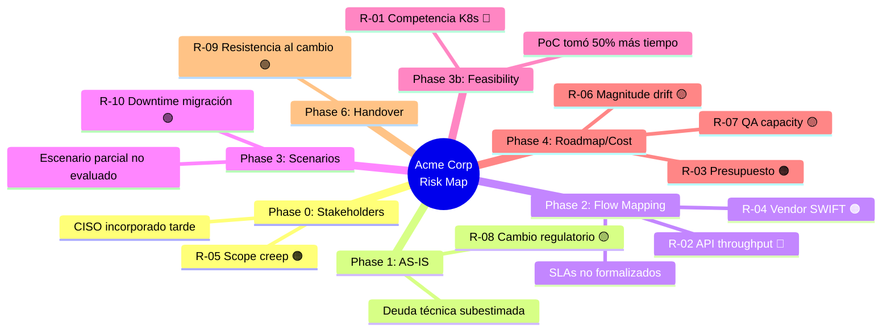
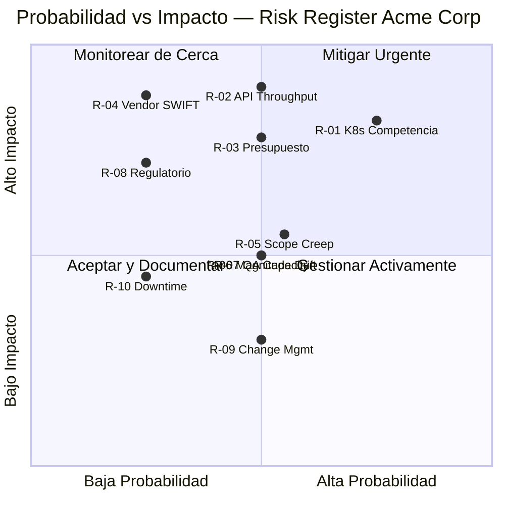

# P-02 Risk Controlling — Acme Corp Banking Modernization

**Proyecto:** Acme Corp — Modernización Core Bancario
**Fecha:** 12 de marzo de 2026
**Fase Actual:** Post-Phase 5 (Proposal QA)
**Modo:** piloto-auto | **Variante:** técnica
**Controller:** risk-controlling-dynamics v6.0

---

## S1: Risk Appetite & Tolerance Framework

Framework calibrado para engagement enterprise bancario — tolerancia conservadora dado el contexto regulado.

| Dimensión | Apetito | Tolerancia | Umbral Inaceptable |
|---|---|---|---|
| **Técnico** | Aceptamos cloud-native si PoC valida con datos sintéticos bancarios | Max 1 tecnología sin production evidence en banca | >1 tech sin evidence en sector financiero = stop |
| **Timeline** | +15% es aceptable dado complejidad regulatoria | Max +25% del timeline base | >35% overrun = re-scope obligatorio |
| **Costo (magnitud)** | +10% sobre magnitud estimada | Max +20% sobre magnitud | >30% = re-evaluate scope con steering committee |
| **Calidad** | Entregables ≥4.5/5 en QA (estándar bancario) | Min 4/5 con plan de mejora documentado | <3.5/5 = no enviar propuesta |
| **Reputacional** | Propuesta con supuestos explícitos y rangos honestos | Propuesta con max 1 gap menor documentado | Propuesta con claims no validados sobre compliance = stop |

> **Nota del Controller:** Este es un cliente enterprise bancario regulado por la Superintendencia Financiera. Los umbrales son más conservadores que el estándar del framework. Cualquier claim sobre cumplimiento regulatorio DEBE estar respaldado por evidencia documental.

---

## S2: Per-Phase Risk Scanning — Hallazgos Clave

### Phase 0: Stakeholder Mapping

- **Hallazgo crítico:** El CISO no fue incluido en el mapeo inicial. Dado que la modernización toca datos PII y PCI-DSS, su ausencia es un riesgo de gobernanza. **Mitigado:** se incorporó en la semana 2.
- El sponsor (CTO) tiene autoridad de decisión técnica pero NO presupuestaria. CFO aprueba inversiones >$200K. **Impacto:** el proceso de aprobación puede agregar 3-4 semanas.

### Phase 1: AS-IS

- **Hallazgo crítico:** La deuda técnica del core bancario legacy (COBOL, 22 años) es significativamente mayor de lo reportado por el equipo. El análisis de codebase reveló 340K LOC sin cobertura de tests vs los "pocos módulos" mencionados en entrevistas.
- Integraciones con 7 sistemas de terceros (SWIFT, regulador, bureau de crédito) — solo 3 tienen documentación actualizada de APIs.

### Phase 2: Flow Mapping

- Se identificaron 14 flujos críticos de negocio. Solo 9 tienen happy path + error paths documentados. Los 5 restantes solo tienen happy path.
- **Riesgo latente:** El flujo de conciliación nocturna tiene un SLA implícito de 4 horas que nunca fue formalizado con el proveedor SWIFT.

### Phase 3: Scenarios

- El escenario ganador (migración progresiva con strangler fig pattern) fue seleccionado por evidencia técnica + viabilidad financiera. El escenario "big bang" fue descartado por riesgo inaceptable en contexto bancario.
- **Preocupación:** El Tree of Thought no evaluó explícitamente el escenario de "modernización parcial + API layer" que podría reducir riesgo timeline.

### Phase 3b: Feasibility/Viability

- PoC de containerización con K8s validó la viabilidad técnica, PERO el equipo interno necesitó 6 semanas (no 4) para alcanzar competencia básica. **Ver A-01 en S3.**
- La viabilidad del API gateway para el tercero de bureau de crédito NO fue validada con carga real. **Ver A-02 en S3.**

### Phase 4: Roadmap + Cost

- Magnitudes estimadas incluyen contingencia del 22% (adecuada para perfil de riesgo).
- Margen de innovación del 5% presente y separado.
- **Alerta:** Drift de magnitud del +18% entre estimación de Phase 3 y Phase 4 — dentro de tolerancia pero requiere monitoreo.

### Phase 4b: Commercial Model

- Modelo de earned value con milestones trimestrales validado. Incentivos alineados para ambas partes.
- **Riesgo menor:** Cláusula de penalización por delay podría activarse si el timeline se extiende >25%.

### Phase 5a/5b: Spec + Pitch

- La propuesta es coherente con la spec funcional. No hay promesas en el pitch que no estén respaldadas.
- **Disclosure necesario:** La estimación de ahorro operativo (30% en 24 meses) está basada en benchmarks del sector, no en datos específicos de Acme Corp.

---

## S3: Assumption Stress-Testing

Inventario consolidado de supuestos — 8 identificados, 3 con confianza <60% marcados como **MUST VALIDATE**.

| # | Supuesto | Fase Origen | Evidencia | Confianza | Impacto si Falso | Validación |
|---|---|---|---|---|---|---|
| A-01 | El equipo de Acme puede alcanzar competencia en K8s en 4 semanas | Phase 3b | [POC] — real fue 6 semanas | **40%** | Timeline +3 meses, costo magnitud +15% | Sprint 0 con métricas de competencia |
| A-02 | El API del bureau de crédito soporta 10K rps bajo el nuevo gateway | Phase 2 | [DOC] vendor — sin test real | **55%** | Bottleneck crítico en flujo de originación | Load test en Sprint 0 con datos sintéticos |
| A-03 | El presupuesto aprobado cubre los 18 meses del roadmap | Phase 4b | [STAKEHOLDER] verbal del CTO | **50%** | Scope reduction forzada en Q3, re-priorización | Confirmación escrita del CFO antes de firma |
| A-04 | La migración de datos legacy puede ejecutarse con zero-downtime | Phase 3 | [BENCHMARK] sector bancario | 70% | Ventana de mantenimiento de 48h requerida | PoC de migración con subset de datos reales |
| A-05 | Los 7 terceros mantendrán APIs estables durante la migración | Phase 2 | [CONTRATO] — 4 de 7 con SLA | 65% | Re-trabajo de integraciones, delay 4-6 semanas | Notificación formal + acuerdos de freeze |
| A-06 | El framework regulatorio no cambiará significativamente en 18 meses | Phase 1 | [CONTEXTO] — regulación estable últimos 3 años | 75% | Compliance re-work, costo adicional | Monitoreo regulatorio trimestral |
| A-07 | El equipo de QA actual puede cubrir testing de la nueva plataforma | Phase 4 | [ENTREVISTA] QA Lead | 70% | Necesidad de contratar QA especializado en cloud | Assessment de skills del equipo QA en Sprint 0 |
| A-08 | La infraestructura cloud target (AWS) cumple con regulación local de datos | Phase 3b | [DOC] AWS compliance + opinión legal | 85% | Cambio de provider o arquitectura híbrida obligatoria | Validación legal formal pre-firma |

### Supuestos MUST VALIDATE (Confianza <60%, Impacto Alto)

**A-01 — Curva de aprendizaje K8s:**
- **Test de inversión:** Si el equipo necesita 12 semanas (no 4), el timeline se extiende un trimestre completo y la magnitud de costo sube ~15%.
- **Acción:** Sprint 0 DEBE incluir bootcamp intensivo con métricas de competencia medibles. Si al final de Sprint 0 el equipo no alcanza nivel "puede operar clusters de forma autónoma", escalar a CTO para decisión: contratar especialista externo o extender timeline.

**A-02 — Throughput del API bureau de crédito:**
- **Test de inversión:** Si el API solo soporta 2K rps, el flujo de originación de créditos se convierte en bottleneck. Las transacciones se encolan, los tiempos de respuesta al cliente se degradan.
- **Acción:** Load test con datos sintéticos ANTES de la firma del contrato. Si throughput real <5K rps, diseñar caching layer + circuit breaker como mitigación arquitectónica.

**A-03 — Presupuesto para 18 meses:**
- **Test de inversión:** Si el presupuesto solo cubre 12 meses, el roadmap debe comprimirse sacrificando los módulos de menor prioridad (reportería avanzada, dashboard ejecutivo). El core bancario se entrega pero sin la capa de analytics.
- **Acción:** Reunión formal con CFO para confirmar compromiso presupuestario por escrito. Incluir cláusula de re-evaluación en mes 9 como gate financiero.

---

## S4: Risk Register

| ID | Riesgo | Categoría | Prob | Impacto | Exposure | Fase | Mitigación | Owner | Status |
|---|---|---|---|---|---|---|---|---|---|
| R-01 | Equipo sin competencia K8s suficiente para operar de forma autónoma | Organizacional | Alta | Alto | 🔴 Crítico | Phase 3b | Bootcamp Sprint 0 + hire de SRE especialista como backup | PM / CTO Acme | Mitigating |
| R-02 | API bureau de crédito no soporta throughput requerido bajo nuevo gateway | Técnico | Media | Crítico | 🔴 Crítico | Phase 2 | Load test pre-firma + diseño de caching layer como fallback | Tech Lead | Open |
| R-03 | Presupuesto insuficiente para roadmap completo de 18 meses | Financial | Media | Alto | 🟠 Alto | Phase 4b | Confirmación escrita CFO + gate financiero en mes 9 | PM / CFO Acme | Open |
| R-04 | Vendor SWIFT cambia API durante migración | Vendor | Baja | Crítico | 🟠 Alto | Phase 2 | Acuerdo de freeze + adapter pattern en integración | Tech Lead | Monitoring |
| R-05 | Scope creep por stakeholders incorporados tardíamente (CISO, Compliance) | Gobernanza | Media | Medio | 🟠 Alto | Phase 0 | Change request formal + impact assessment obligatorio | PM | Mitigating |
| R-06 | Drift de magnitud supera tolerancia en fases posteriores | Financial | Media | Medio | 🟡 Medio | Phase 4 | Monitoreo mensual de magnitudes vs estimación base | PM / Controller | Monitoring |
| R-07 | Testing insuficiente por limitaciones del equipo QA actual | Calidad | Media | Medio | 🟡 Medio | Phase 4 | Assessment de QA en Sprint 0 + plan de capacitación | QA Lead | Open |
| R-08 | Cambio regulatorio durante ejecución impacta arquitectura | Regulatorio | Baja | Alto | 🟡 Medio | Phase 1 | Monitoreo regulatorio trimestral + arquitectura modular | Domain Lead | Monitoring |
| R-09 | Resistencia al cambio del equipo de operaciones legacy | Organizacional | Media | Bajo | 🟢 Bajo | Phase 6 | Plan de change management + champions internos | PM / HR Acme | Open |
| R-10 | Downtime durante migración de datos excede ventana permitida | Técnico | Baja | Medio | 🟢 Bajo | Phase 3 | PoC de migración incremental + rollback plan | Tech Lead | Monitoring |

**Resumen de Exposición:** 2 🔴, 3 🟠, 3 🟡, 2 🟢 — Perfil de riesgo MODERADO con dos items críticos que requieren validación en Sprint 0.

---

## S5: Pre-Mortem — Escenario Aprobado (Migración Progresiva Strangler Fig)

> "Es septiembre de 2027. El proyecto de modernización bancaria de Acme Corp fracasó. Reconstruyamos qué pasó."

```
PRE-MORTEM: Escenario Aprobado — Strangler Fig Migration
════════════════════════════════════════════════════════

Premisa: El proyecto fracasó. Reconstruyamos qué pasó.

CAUSA 1: El equipo nunca alcanzó autonomía en K8s y dependió de consultores externos
  Señales tempranas: Sprint 0 bootcamp no alcanza métricas de competencia.
    Equipo pide soporte constante en operaciones básicas de cluster.
  Probabilidad: 35%
  Cómo prevenirlo HOY: Definir métricas de competencia claras para Sprint 0.
    Criterio kill: si <60% del equipo pasa assessment → contratar SRE dedicado.

CAUSA 2: El presupuesto se cortó en mes 12 y el core bancario quedó a medio migrar
  Señales tempranas: CFO no confirma por escrito. Mensajes ambiguos sobre
    "evaluaremos en el siguiente ciclo fiscal". CTO evita el tema.
  Probabilidad: 30%
  Cómo prevenirlo HOY: Obtener compromiso presupuestario escrito del CFO antes
    de firma. Incluir cláusula contractual de scope reduction ordenada si budget
    se reduce, para evitar un sistema a medio migrar.

CAUSA 3: La integración con el bureau de crédito se convirtió en bottleneck
  Señales tempranas: Load test muestra throughput <5K rps. Vendor no responde
    a solicitudes de upgrade. Tiempos de respuesta se degradan en staging.
  Probabilidad: 25%
  Cómo prevenirlo HOY: Load test ANTES de firma. Diseñar caching layer como
    plan B. Identificar bureau de crédito alternativo como contingencia.

CAUSA 4: Un cambio regulatorio obligó a re-arquitectar el módulo de compliance
  Señales tempranas: Borradores de nueva regulación en consulta pública.
    Competidores empiezan a ajustar sus plataformas.
  Probabilidad: 15%
  Cómo prevenirlo HOY: Arquitectura modular que aísle la capa de compliance.
    Monitoreo regulatorio activo. Buffer de 2 sprints para adaptación.

CAUSA 5: Scope creep por nuevos requerimientos del CISO post-auditoría
  Señales tempranas: CISO agenda reuniones frecuentes. Nuevos requerimientos
    de seguridad llegan como "must have" sin change request formal.
  Probabilidad: 20%
  Cómo prevenirlo HOY: Involucrar al CISO desde Sprint 0. Documentar todos
    los requerimientos de seguridad como parte del backlog base.

TOP 3 CAUSAS MÁS PROBABLES DE FRACASO:
  1. Competencia K8s insuficiente (35%) — Mitigación: Sprint 0 bootcamp con kill criteria
  2. Corte presupuestario (30%) — Mitigación: Compromiso escrito CFO + cláusula de scope reduction
  3. Bottleneck API bureau de crédito (25%) — Mitigación: Load test pre-firma + caching layer

KILL CRITERIA (cuándo abandonar el enfoque actual):
  - Si Sprint 0 bootcamp <60% aprobación → pivot a modelo con SRE externo permanente
  - Si CFO no confirma presupuesto antes de firma → escalar a CEO o no firmar
  - Si load test bureau <3K rps sin solución → re-diseñar flujo de originación como async
```

---

## S6: Financial Controls & Magnitude Vigilance

| Control | Expected | Actual | Variance | Alert |
|---|---|---|---|---|
| Contingencia vs risk exposure | 20-25% | 22% | +2% | ✅ Contingencia adecuada para perfil de riesgo |
| Innovation margin | 5% | 5% | 0% | ✅ Presente y separado de contingencia |
| Magnitude drift (Phase 3 → Phase 4) | ±15% | +18% | +3% | ⚠️ Dentro de tolerancia pero cerca del límite |
| Hidden cost drivers identified | 8+ categories | 9 | +1 | ✅ Taxonomía completa |
| Cone of Uncertainty comunicado | Rangos P50/P80/P95 | P50/P80 presente | P95 ausente | ⚠️ Agregar P95 a propuesta |
| Licensing costs de terceros incluidos | 100% vendors | 6 de 7 | -1 vendor | ⚠️ Falta licencia del módulo de monitoreo |

### Hidden Cost Drivers Identificados

1. **Training:** Bootcamp K8s + certificaciones cloud para equipo de 8 personas
2. **Migration downtime:** Ventanas de mantenimiento nocturnas (costo operativo)
3. **Parallel running:** 4-6 meses de operación dual legacy + nuevo sistema
4. **Compliance audit:** Auditoría de seguridad post-migración requerida por regulador
5. **Data cleansing:** Limpieza de datos legacy antes de migración (estimado 3 sprints)
6. **Monitoring tooling:** Licencias de observabilidad para nueva infraestructura cloud
7. **Change management:** Programa de adopción para 120+ usuarios internos
8. **Performance testing:** Infraestructura dedicada para load testing pre-producción
9. **Disaster recovery:** Setup de DR en región secundaria (requerimiento regulatorio)

### Veredicto del Controller Financiero

La posición financiera es **adecuada con observaciones**. La contingencia del 22% es coherente con el perfil de riesgo MODERADO. El drift del +18% está dentro de tolerancia pero debe monitorearse mensualmente. Se requiere agregar la estimación P95 a la propuesta y confirmar el costo de licencia del módulo de monitoreo antes del envío.

---

## S7: Final Assessment

```
RISK CONTROLLER FINAL ASSESSMENT
═════════════════════════════════
Proyecto: Acme Corp — Modernización Core Bancario

RISK PROFILE: MODERATE
Open Risks: 10 (🔴 2, 🟠 3, 🟡 3, 🟢 2)
Unvalidated Assumptions: 3 de 8 (A-01, A-02, A-03 — todos con plan de validación en Sprint 0)
Pre-Mortem Top Cause: Competencia K8s insuficiente (35%)
Financial Controls: 4 de 6 passing (2 ⚠️ menores)

PROPOSAL READINESS (from risk perspective):
  READY WITH DISCLOSURES

Disclosures for client:
  1. La estimación de ahorro operativo (30% en 24 meses) está basada en benchmarks
     del sector, no en datos específicos de Acme Corp. El ahorro real dependerá de
     la velocidad de adopción y la eficiencia de la migración de datos.
  2. El roadmap de 18 meses asume disponibilidad continua del equipo de Acme para
     validaciones y decisiones. Delays en aprobaciones internas impactan el timeline
     proporcionalmente.

Internal mitigations required:
  1. Sprint 0 DEBE incluir: bootcamp K8s con assessment, load test de API bureau de
     crédito, y confirmación presupuestaria del CFO. Estos tres items son condición
     previa para iniciar Sprint 1.
  2. Agregar estimación P95 al Cone of Uncertainty en la propuesta y confirmar
     licencia del módulo de monitoreo antes del envío.

RED FLAGS: 0
  No hay red flags activos. Los dos riesgos 🔴 tienen plan de mitigación
  viable y se resuelven en Sprint 0 antes de comprometer el timeline completo.
```

---

## Diagramas

### Mindmap: Riesgos por Fase del Pipeline



### Quadrant Chart: Probabilidad vs Impacto



---

**Autor:** Javier Montano | **Generado por:** risk-controlling-dynamics v6.0 | **Fecha:** 12 de marzo de 2026
