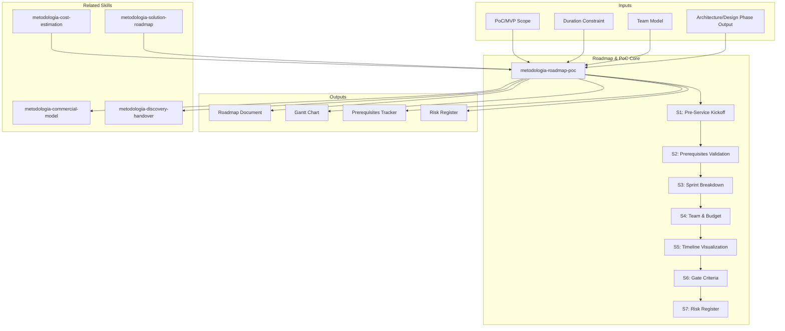

# Roadmap & PoC Execution Planning: Sprint-Level Delivery Architecture

Generates 4-8 week execution roadmaps with sprint-level planning, prerequisite validation, measurable go/no-go gate criteria, team composition, budget ranges, and risk registers.

## Grounding Guideline

**A PoC without kill criteria is a prototype disguised as validation.** Execution planning is not an exercise in optimism — it is an engineering act where every sprint has measurable deliverables, every gate has binary criteria (pass/fail), and every risk has a quantified cost.

### Execution Planning Philosophy

1. **Sprints with gates, not just demos.** Every gate exists to make a concrete decision: continue, pivot, or stop. If there is no measurable criterion, it is not a gate — it is a meeting.
2. **Prerequisites before Sprint 1.** The most talented team in the world cannot compensate for a blocked prerequisite. Validating prerequisites in Week 0 is investment; discovering them in Sprint 2 is waste.
3. **Team + budget realistic from Day 1.** A roadmap with an undefined team and a "TBD" budget is not a plan — it is a hope. FTE allocation and budget ranges are requirements, not optional.

## Inputs

The user provides a scope and duration as `$ARGUMENTS`. Parse `$1` as the **PoC/MVP scope**, `$2` as **duration**, `$3` as **team model**.

**Parameters:**
- `{MODO}`: `piloto-auto` (default) | `desatendido` | `supervisado` | `paso-a-paso`
  - **piloto-auto**: Auto para sprint breakdown y prerequisites, HITL para gate criteria y budget decisions.
  - **desatendido**: Zero interruptions. Roadmap completo con supuestos documentados.
  - **supervisado**: Autonomo con checkpoint en gate criteria y risk register.
  - **paso-a-paso**: Confirma cada sprint plan, gate criterion, budget range, y risk mitigation.
- `{FORMATO}`: `markdown` (default) | `html` | `dual`
- `{VARIANTE}`: `ejecutiva` (~40% — S1 kickoff + S5 timeline + S6 gates) | `tecnica` (full 7 sections, default)

```
$ARGUMENTS format: [scope] [duration] [team-model]
Examples:
  "loan-origination PoC 4 weeks"           → scope=loan-origination, duration=4w, model=default
  "full MVP 8 weeks distributed team"       → scope=MVP, duration=8w, model=distributed
  "infrastructure migration 6 weeks"        → scope=infra, duration=6w, model=default
```

- If scope missing → ask: "What is the PoC/MVP scope? (1-2 sentence description)"
- If duration missing → default to 4 weeks (2 sprints)
- Team model: "Provider+Client hybrid" unless specified otherwise

If reference materials exist, load them:

```
Read ${CLAUDE_SKILL_DIR}/references/roadmap-patterns.md
```

---

## When to Use

- Planning PoC or MVP execution with sprint-level detail
- Defining prerequisites and readiness criteria before engagement starts
- Building go/no-go gate criteria for phased delivery
- Estimating team composition and budget ranges for proposals
- Creating risk registers with quantified delay and cost impact

## When NOT to Use

- Strategic roadmap or multi-year transformation → **metodologia-solution-roadmap**
- Cost estimation and commercial modeling → **metodologia-cost-estimation**, **metodologia-commercial-model**
- Architecture design → **metodologia-software-architecture**, **metodologia-solutions-architecture**
- Project portfolio management → **metodologia-project-program-management**

---

## Delivery Structure: 7 Sections

### S1: Pre-Service Kickoff (Week 0)

**Day-by-day agenda:**

| Activity | Owner | Duration | Outcomes |
|----------|-------|----------|----------|
| AS-IS Context Session | Tech Lead + PM | 2h | Current state documented |
| Definition of Done Workshop | Provider Lead + Stakeholders | 1.5h | DoD approved |
| Provider Setup (parallel) | Provider Ops | 3h | Infrastructure ready |
| Client Provisioning (parallel) | Client IT | 3h | Access & resources granted |

**Parallel Setup Grid** — two columns:
- Left: Provider responsibilities (VPN, workspace, tools, comms channels)
- Right: Client responsibilities (infrastructure, access, sponsorship, support)

### S2: Prerequisites Validation Table

9+ prerequisites with owner, status, deadline, blocker flag.

| ID | Prerequisite | Status | Owner | Deadline | Blocker |
|----|-------------|--------|-------|----------|---------|
| P1 | VPN / Dev environment access | ... | IT | ... | Yes |
| P2 | Source code repo & branch strategy | ... | Dev Lead | ... | Yes |
| P3 | CI/CD pipeline access | ... | DevOps | ... | Yes |
| P4 | Test environment provisioned | ... | Infra | ... | Yes |
| P5 | Stakeholder availability confirmed | ... | PM | ... | Yes |
| P6 | Architecture design approved | ... | Architect | ... | No |
| P7 | Data access / test data available | ... | Data team | ... | Yes |
| P8 | Security review scheduled | ... | Security | ... | No |
| P9 | Monitoring / alerting setup | ... | DevOps | ... | No |

Status chips: Complete | In Progress | Blocked | Not Started

### S3: Sprint Breakdown

Per sprint (2-week default):

**Sprint N — [Target Feature/Capability]**
- Days 1-2: [Task] (Owner, deliverable)
- Days 3-4: [Task] (Owner, deliverable)
- Day 5: Demo prep & UAT session
- Days 6-7: [Integration task] (Owner, deliverable)
- Days 8-9: [Validation task] (Owner, deliverable)
- Day 10: Sprint review + retrospective

**Deliverables Checklist** — each with specific, testable acceptance criteria.

### S4: Team Composition & Budget

**Team Structure:**
- Provider: [N] senior + [M] mid-level = [FTE] total
- Client: [K] dedicated + [L] part-time = [FTE] total
- Leads: Product, Tech, QA assignments
- Steering committee: frequency & size

**Budget Range (plus/minus 20%):**
- Services: $[X]
- Infrastructure/tools: $[Y]
- Contingency (15%): $[Z]
- Total: $[Total]
- Monthly burn rate: $[/month]

### S5: Timeline Visualization

```
Week 0        Week 1-2        Week 3-4        Week 5+
PRE-SERVICE   SPRINT 1        SPRINT 2        STABILIZE
Kickoff       Foundation      Integration     Deploy
```

### S6: Gate Criteria

**Gate 0>1: Readiness to Sprint 1**
- [ ] Critical prerequisites (Blocker=Yes) complete or mitigated
- [ ] Kickoff executed with stakeholder sign-off
- [ ] DoD document approved
- [ ] Team access & tools verified

**Gate 1>2: Readiness to Sprint 2**
- [ ] Sprint 1 deliverables verified
- [ ] Demo successful, no critical blockers
- [ ] UAT feedback incorporated
- [ ] Architecture approved for real integration

**Gate 2>Production: Production Readiness**
- [ ] E2E flow validated in staging
- [ ] Performance meets baseline
- [ ] Security assessment passed
- [ ] Deployment runbook approved
- [ ] Support team trained & on-call

### S7: Risk Register

| Risk ID | Description | Probability | Impact | Delay (days) | Cost Impact | Mitigation | Owner |
|---------|-------------|-------------|--------|-------------|-------------|------------|-------|
| R1 | [Risk] | H/M/L | H/M/L | [N] | $[X] | [Plan] | [Who] |

Top 5-6 risks. Every risk includes estimated delay (days) and cost impact ($). This forces trade-off decisions: is mitigation investment justified?

## Assumptions & Limits

- Requires completed architecture/design phase as input
- Assumes 2-week sprint cycles (configurable based on team velocity)
- Assumes Provider+Client hybrid team with weekly steering oversight
- Budget estimates are plus/minus 20% ranges, not fixed commitments
- Cannot account for unforeseeable external blockers (regulatory mandates, org restructuring)
- Prerequisites marked Blocker=Yes must resolve before Week 1 or timeline shifts
- Team composition assumes roles available on stated dates; hiring delays cascade downstream

## Edge Cases

| Scenario | Adaptation |
|----------|-----------|
| No CI/CD infrastructure | Add 3-5 day setup task to Sprint 1 |
| 100% remote team | Add 15% communication overhead to ceremony estimates |
| Waterfall reporting required | Map each sprint to milestone gate; add formal gate documentation |
| Budget approved but team not hired | Insert 2-4 week recruitment phase before Week 0 |
| Multiple time zones (>4h spread) | Adjust ceremonies to UTC midpoint; record all sessions |

## Trade-offs

| Dimension | Option A | Option B | Decision Rule |
|-----------|----------|----------|---------------|
| Sprint length | 2 weeks (fast feedback, 5h/week ceremonies) | 3 weeks (less overhead, delayed detection) | 2 weeks for CI/CD teams; 3 weeks for teams <4 engineers |
| PoC scope | Narrow-deep (1 full flow) | Broad-shallow (3 partial flows) | Narrow-deep reduces risk; broad-shallow maximizes learning |
| Team capacity | Fixed (cost certainty) | Elastic (flexibility) | Fixed for PoC; elastic for long engagements |
| Pre-service | Full 5-day kickoff | Lightweight 2-day | Full for new teams; lightweight for teams with prior engagement |

## Conditional Logic

```
IF team size <4 engineers → extend sprints to 3 weeks (reduce meeting-to-coding ratio)
IF critical prerequisite blocked at Week 0 → escalate with quantified delay cost ("Team waiting costs $X/day")
IF Sprint 1 gate fails → execute remediation sprint before Sprint 2 (skipping compounds defects)
IF budget >$500K → add PMO oversight and formal change control board
IF engagement >8 weeks → add mid-engagement retrospective and scope revalidation
```

## Validation Gate

Before delivering roadmap:
- [ ] 9+ prerequisites with status, deadline, and blocker flag
- [ ] Each sprint has daily task allocation with owner and deliverable
- [ ] Each deliverable has specific, testable acceptance criteria
- [ ] Timeline shows 4+ milestones with critical path marked
- [ ] Gates define measurable go/no-go conditions
- [ ] Team composition shows FTE allocation with role clarity
- [ ] Budget range is plus/minus 20% with breakdown and burn rate
- [ ] Risk register has 5-6 risks with delay/cost estimates
- [ ] Roadmap is immediately actionable — team can execute Day 1 without rework

## Edge Cases

| Case | Handling Strategy |
|------|---------------------|
| Prerequisito critico bloqueado en Week 0 sin resolucion a la vista | Escalar con costo cuantificado ("Equipo esperando cuesta $X/dia"); no iniciar Sprint 1 hasta resolucion; documentar impacto en timeline |
| Equipo menor a 4 ingenieros | Extender sprints a 3 semanas para reducir ratio ceremonies/coding; ajustar expectativas de velocidad; reducir scope por sprint |
| Gate de Sprint 1 falla (entregables no cumplen criterios) | Ejecutar sprint de remediacion antes de Sprint 2; no saltar adelante porque los defectos se acumulan; re-evaluar scope si persiste |
| Budget aprobado pero equipo no contratado aun | Insertar fase de reclutamiento de 2-4 semanas antes de Week 0; ajustar timeline total; documentar riesgo de hiring delays |

## Decisions & Trade-offs

| Decision | Discarded Alternative | Justification |
|----------|----------------------|---------------|
| Sprints de 2 semanas como default | Sprints de 3 semanas o 1 semana | 2 semanas balancea feedback rapido con overhead de ceremonies; 1 semana es demasiado overhead; 3 semanas retrasa deteccion de problemas |
| Prerequisites validados en Week 0 antes de Sprint 1 | Descubrir prerequisites durante ejecucion | El equipo mas talentoso no compensa un prerequisito bloqueado; descubrirlos en Sprint 2 es desperdicio puro |
| Budget ranges con +/-20% y burn rate mensual | Estimaciones puntuales sin rango | Las estimaciones puntuales crean expectativas falsas de precision; los rangos comunican incertidumbre honestamente |
| Risk register con delay estimado en dias y cost impact | Lista de riesgos sin cuantificar | Sin cuantificacion, los riesgos no generan decisiones de mitigacion; con costo, el trade-off inversion-mitigacion vs costo-del-riesgo es explicito |

## Knowledge Graph



## Output Templates

**Formato MD (default):**

```
# Roadmap & PoC — {proyecto}
## Resumen Ejecutivo
> Duracion: N semanas. Sprints: M. Team: X FTEs. Budget range: $Y +/-20%.
## S1: Pre-Service Kickoff (Week 0)
| Actividad | Owner | Duracion | Outcomes |
## S2: Prerequisites
| ID | Prerequisite | Status | Owner | Deadline | Blocker |
## S3: Sprint Breakdown
### Sprint 1 — [Target]
[Day-by-day plan with owners and deliverables]
## S4-S7: [secciones completas]
## Timeline
```mermaid
gantt
    title PoC Roadmap
    ...
```
```

**Formato HTML (para kickoff con cliente):**

```
Header: Logo + proyecto + timeline visual
Section 1: Timeline Overview (Gantt visual con milestones)
Section 2: Prerequisites Status Board (cards con semaforo)
Section 3: Sprint Plans (accordion expandible por sprint)
Section 4: Team Composition (org chart visual)
Section 5: Gate Criteria (checklist interactivo)
Section 6: Risk Register (tabla con highlighting por severidad)
Section 7: Budget Summary (breakdown visual)
Footer: Attribution MetodologIA + proximos pasos
```

### HTML (bajo demanda)
- Filename: `{fase}_roadmap_poc_{cliente}_{WIP}.html`
- Estructura: HTML self-contained branded (Design System MetodologIA v5). Timeline visual tipo Timeline con Gantt interactivo, prerequisites status board con semáforo, sprint accordion expandible y gate criteria checklist. WCAG AA, responsive, print-ready.

### DOCX (bajo demanda)
- Filename: `{fase}_roadmap_poc_{cliente}_{WIP}.docx`
- Generado via python-docx con MetodologIA Design System v5. Portada, TOC automático, encabezados en Poppins (navy), cuerpo en Trebuchet MS, acentos en gold. Tablas de prerequisites, sprint breakdown y risk register con zebra striping. Encabezados y pies de página con branding MetodologIA.

### XLSX (bajo demanda)
- Filename: `{fase}_roadmap_poc_{cliente}_{WIP}.xlsx`
- Generado via openpyxl con MetodologIA Design System v5. Encabezados con fondo navy y texto Poppins blanco, cuerpo en Trebuchet MS, zebra striping en filas. Hojas: Prerequisites Tracker (ID, prerequisito, status, owner, deadline, blocker flag), Sprint Breakdown (sprint, día, tarea, owner, entregable, acceptance criteria), Risk Register (ID, descripción, probabilidad, impacto, delay días, cost impact, mitigación, owner), Team & Budget (rol, tipo, FTE, fase). Conditional formatting por status de prerequisitos y severidad de riesgos. Auto-filters en todas las hojas. Valores directos sin fórmulas.

### PPTX (bajo demanda)
- Filename: `{fase}_roadmap_poc_{cliente}_{WIP}.pptx`
- Generado via python-pptx con MetodologIA Design System v5. Slide master con gradiente navy, títulos en Poppins, cuerpo en Trebuchet MS, acentos en gold. Máx 20 slides ejecutivo / 30 técnico. Notas del presentador con referencias de evidencia. Slides: Pre-Service Kickoff Agenda, Prerequisites Status Board, Timeline Visualization (Gantt), Sprint Breakdown, Team Composition, Gate Criteria, Risk Register, Budget Summary.

## Evaluacion

| Dimension | Peso | Criterio | Umbral Minimo |
|-----------|------|----------|---------------|
| Trigger Accuracy | 10% | El skill se activa ante prompts de roadmap, PoC, sprint plan, execution timeline, milestones | 7/10 |
| Completeness | 25% | 9+ prerequisites con status y blocker flag; sprints con task allocation diaria; gates con criterios medibles; budget con breakdown y burn rate | 7/10 |
| Clarity | 20% | Timeline muestra 4+ milestones con critical path; el equipo puede ejecutar Day 1 sin retrabajo; gates son binarios | 7/10 |
| Robustness | 20% | Edge cases cubiertos (prerequisito bloqueado, equipo chico, gate fails, budget sin equipo); conditional logic documentada | 7/10 |
| Efficiency | 10% | Variante ejecutiva vs tecnica correctamente aplicada; duracion de kickoff adaptada al contexto (full vs lightweight) | 7/10 |
| Value Density | 15% | Risk register con 5-6 riesgos cuantificados (delay days + cost impact); cada entregable tiene acceptance criteria testeable | 7/10 |

**Umbral minimo global: 7/10.** Si alguna dimension cae por debajo, el entregable requiere revision antes de entrega.

## Cross-References

- **metodologia-cost-estimation:** Cost estimation that feeds budget ranges in the roadmap
- **metodologia-commercial-model:** Commercial model that uses roadmap for pricing and delivery terms
- **metodologia-solution-roadmap:** Strategic multi-year roadmap where PoC roadmap is a tactical slice
- **metodologia-discovery-handover:** Handover document that references roadmap for execution planning

## Output Format Protocol

| Format | Default | Description |
|--------|---------|-------------|
| `markdown` | Yes | Rich Markdown + Mermaid diagrams (Gantt). Token-efficient. |
| `html` | On demand | Branded HTML (Design System). Visual impact. |
| `dual` | On demand | Both formats. |

Default output is Markdown with embedded Mermaid Gantt diagrams. HTML generation requires explicit `{FORMATO}=html` parameter.

## Output Artifact

**Primary:** `RP-01_Roadmap_PoC_{project}.md` (or `.html` if `{FORMATO}=html|dual`) — Pre-service kickoff, prerequisites validation, sprint breakdown, team composition, budget range, timeline, gate criteria, risk register.

**Secondary:** Gantt chart (Mermaid), parallel setup grid, prerequisites tracker, risk register spreadsheet.

---
**Autor:** Javier Montaño | **Ultima actualizacion:** 12 de marzo de 2026
