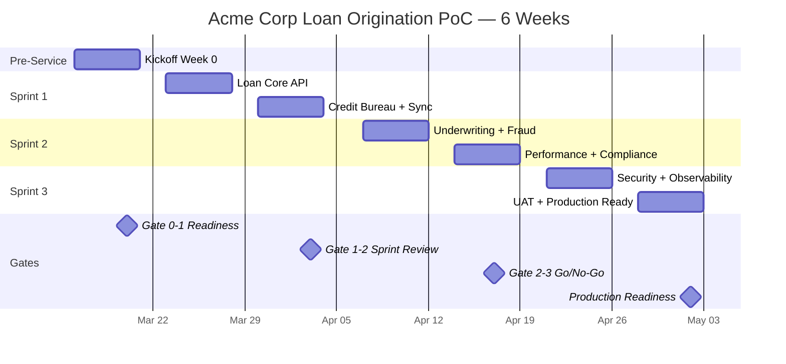

# A-01 Roadmap & PoC Execution Plan — Acme Corp Banking Modernization

> **Proyecto:** Acme Corp Banking Modernization | **Fecha:** 12 de marzo de 2026
> **Modo:** piloto-auto | **Variante:** tecnica (full)
> **Scope:** Loan Origination PoC | **Duration:** 6 weeks (3 sprints)

---

## Executive Summary

This roadmap details the 6-week PoC for modernizing Acme Corp's loan origination system from COBOL mainframe to Java/Spring Boot microservices on AWS. The PoC validates three critical hypotheses: (1) loan application processing under 5 seconds end-to-end, (2) credit bureau integration via async pattern reduces latency 60%, and (3) the new stack meets OCC regulatory requirements for audit trails. Team: 4 Provider + 3 Client engineers. Budget: $185K (+/-20%).

---

## Section 1: Pre-Service Kickoff (Week 0)

### Day-by-Day Agenda

| Day | Activity | Owner | Duration | Outcomes |
|-----|----------|-------|----------|----------|
| Mon | AS-IS Core Banking Session | Tech Lead + Mainframe SME | 3h | Current COBOL loan flow documented, data model mapped |
| Mon | Definition of Done Workshop | Provider Lead + VP Lending | 1.5h | DoD approved: 5s loan processing, audit trail, regulatory compliance |
| Tue | Architecture Review | Solutions Architect + DBA | 2h | Target microservices architecture validated |
| Tue | Infrastructure Setup (parallel) | Provider DevOps | 4h | AWS EKS cluster, RDS PostgreSQL, MSK Kafka provisioned |
| Wed | Client Provisioning (parallel) | Acme IT | 3h | VPN, mainframe read-only access, test environment credentials |
| Wed | Data Migration Workshop | Data Engineer + Mainframe DBA | 2h | Loan schema mapping, test data extraction plan |
| Thu | Security & Compliance Briefing | CISO + Compliance Officer | 1.5h | PCI-DSS scope, OCC audit trail requirements documented |
| Fri | Sprint Planning (Sprint 1) | Full Team | 2h | Sprint 1 backlog groomed, stories estimated |

### Parallel Setup Grid

| Provider Responsibilities | Client Responsibilities |
|--------------------------|------------------------|
| AWS EKS cluster provisioning | VPN access for Provider team |
| CI/CD pipeline (GitHub Actions) | Mainframe read-only credentials |
| Grafana observability stack | Test environment with sample loan data |
| Development tools (IntelliJ, k6) | Stakeholder availability (VP Lending, Compliance) |
| Slack channel + Jira project | Conference room for daily standups |
| Confluence documentation space | Access to credit bureau sandbox API |

---

## Section 2: Prerequisites Validation Table

| ID | Prerequisite | Status | Owner | Deadline | Blocker |
|----|-------------|--------|-------|----------|---------|
| P1 | VPN + dev environment access | Not Started | Acme IT | Week 0 Day 2 | Yes |
| P2 | Source code repo + branch strategy | Not Started | Dev Lead | Week 0 Day 1 | Yes |
| P3 | CI/CD pipeline (GitHub Actions) | Not Started | Provider DevOps | Week 0 Day 2 | Yes |
| P4 | AWS EKS + RDS provisioned | Not Started | Provider DevOps | Week 0 Day 2 | Yes |
| P5 | Mainframe read-only access | Not Started | Acme DBA | Week 0 Day 3 | Yes |
| P6 | Credit bureau sandbox API keys | Not Started | Acme Vendor Mgmt | Week 0 Day 3 | Yes |
| P7 | Test loan data (500 applications) | Not Started | Data Engineer | Week 0 Day 4 | Yes |
| P8 | Stakeholder availability confirmed | Not Started | PM | Week 0 Day 1 | Yes |
| P9 | Architecture design approved | Not Started | Solutions Architect | Week 0 Day 2 | No |
| P10 | Security review scheduled | Not Started | CISO | Week 0 Day 5 | No |
| P11 | Grafana/observability setup | Not Started | Provider DevOps | Sprint 1 Day 2 | No |
| P12 | OCC audit trail spec documented | Not Started | Compliance Officer | Sprint 1 Day 3 | No |

---

## Section 3: Sprint Breakdown

### Sprint 1 — Loan Application Core (Weeks 1-2)

**Goal:** Submit and persist a loan application through the new microservice with basic validation.

| Days | Task | Owner | Deliverable |
|------|------|-------|-------------|
| 1-2 | Loan domain model + REST API scaffold | Senior Dev 1 | POST /loans/apply endpoint, OpenAPI spec |
| 1-2 | PostgreSQL schema + Flyway migrations | DBA + Dev 2 | Loan tables, indices, audit columns |
| 3-4 | Business rules: eligibility, DTI calculation | Senior Dev 1 + Dev 2 | LoanValidator service, 15+ unit tests |
| 3-4 | Kafka event publishing (loan.submitted) | Dev 3 | Kafka producer, Avro schema, topic created |
| 5 | Demo prep + internal UAT | QA + PM | Demo script, test scenarios ready |
| 6-7 | Credit bureau integration (async pattern) | Senior Dev 1 | CreditBureauAdapter, circuit breaker, 24h cache |
| 6-7 | Mainframe data sync (read-only bridge) | Dev 2 + Mainframe SME | JDBC adapter reading existing loan portfolio |
| 8-9 | Integration tests + contract tests | QA + Dev 3 | Testcontainers suite, Pact contracts |
| 10 | Sprint review + retrospective | Full Team | Demo to VP Lending, retrospective actions |

**Sprint 1 Deliverables Checklist:**
- [ ] Loan application submitted via REST API with validation (DTI <43%, credit score >620)
- [ ] Application persisted in PostgreSQL with OCC-compliant audit columns (created_by, created_at, modified_by, modified_at)
- [ ] Credit bureau check via async Kafka pattern (target: <2s vs current 4.2s synchronous)
- [ ] Kafka event published on loan submission
- [ ] 80% unit test coverage on business rules
- [ ] Integration tests passing with Testcontainers

### Sprint 2 — Underwriting + Fraud Detection (Weeks 3-4)

**Goal:** Complete loan decision pipeline including automated underwriting and fraud scoring.

| Days | Task | Owner | Deliverable |
|------|------|-------|-------------|
| 1-2 | Underwriting engine (rules-based) | Senior Dev 1 | UnderwritingService, decision matrix, 20+ unit tests |
| 1-2 | Fraud detection integration | Dev 3 | FraudEvaluationClient, risk score mapping |
| 3-4 | KYC verification service | Dev 2 | KYCAdapter, document type validation |
| 3-4 | Loan decision aggregator | Senior Dev 1 | Decision combining credit + fraud + underwriting |
| 5 | End-to-end flow testing | QA + Full Team | Full loan submission -> decision flow validated |
| 6-7 | Performance baseline measurement | Perf Engineer | k6 load test, p50/p95/p99 baseline established |
| 6-7 | Audit trail implementation | Dev 2 | Immutable event log, OCC-compliant format |
| 8-9 | Regulatory test suite | QA + Compliance | TILA disclosure validation, BSA/AML checks |
| 10 | Sprint review + Go/No-Go Gate | Full Team + Steering | Demo to steering committee, gate evaluation |

**Sprint 2 Deliverables Checklist:**
- [ ] Full loan decision in <5s p99 (submit -> credit check -> fraud -> underwriting -> decision)
- [ ] Fraud risk score integrated with configurable threshold (>0.7 = manual review)
- [ ] KYC verification for 3 document types (passport, driver license, utility bill)
- [ ] Audit trail captures every state transition with timestamp and actor
- [ ] Performance baseline: p50, p95, p99 for all endpoints documented
- [ ] Regulatory test suite: TILA, BSA/AML, fair lending compliance

### Sprint 3 — Stabilization + Production Readiness (Weeks 5-6)

**Goal:** Harden the system for production cutover with security, monitoring, and deployment readiness.

| Days | Task | Owner | Deliverable |
|------|------|-------|-------------|
| 1-2 | Security hardening (SAST/DAST) | Security Eng + Dev | Vulnerability remediation, secret rotation |
| 1-2 | Observability: dashboards + alerts | DevOps + Dev 3 | Grafana dashboards, PagerDuty alerts, runbooks |
| 3-4 | Load testing (month-end scenario) | Perf Engineer | k6 stress test at 3x normal load |
| 3-4 | Deployment runbook + rollback plan | DevOps + Tech Lead | Blue/green deployment, feature flag cutover |
| 5-6 | UAT with loan officers | QA + Business Users | 10 loan officers process 50 test applications |
| 7-8 | Bug fixes + polish | Full Dev Team | Critical/high bugs from UAT resolved |
| 9 | Production readiness review | Steering Committee | Formal sign-off checklist |
| 10 | Retrospective + handover documentation | Full Team | Lessons learned, Phase 2 recommendations |

---

## Section 4: Team Composition & Budget

### Team Structure

| Role | Source | Allocation | Individual |
|------|--------|-----------|-----------|
| Tech Lead / Architect | Provider | 100% | 1 Senior |
| Senior Developer | Provider | 100% | 2 |
| Mid-Level Developer | Provider | 100% | 1 |
| QA / Automation | Provider | 50% (Sprints 1-2), 100% (Sprint 3) | 1 |
| Mainframe SME | Client | 25% (Week 0 + Sprint 1 only) | 1 |
| DBA | Client | 50% | 1 |
| Product Owner (VP Lending) | Client | 20% (reviews, decisions) | 1 |
| **Total Provider FTE** | | **4.5** | |
| **Total Client FTE** | | **1.7** | |

### Steering Committee

- Frequency: Bi-weekly (end of each sprint)
- Members: VP Lending, CTO, CISO, Provider Delivery Lead
- Duration: 1 hour

### Budget Range (+/-20%)

| Category | Estimate | Notes |
|----------|----------|-------|
| Provider services (4.5 FTE x 6 weeks) | $135,000 | Blended rate |
| AWS infrastructure | $18,000 | EKS, RDS, MSK, S3, CloudFront |
| Tooling (Grafana Cloud, PagerDuty) | $4,500 | 6-week licenses |
| Credit bureau sandbox fees | $2,500 | Equifax sandbox API |
| Contingency (15%) | $24,000 | |
| **Total** | **$184,000** | **Range: $147K - $221K** |
| Monthly burn rate | $123,000/month | |

---

## Section 5: Timeline Visualization

---

## Section 6: Gate Criteria

### Gate 0>1: Readiness to Sprint 1

- [ ] All Blocker prerequisites (P1-P8) complete or mitigated
- [ ] Kickoff executed with VP Lending sign-off
- [ ] DoD document approved (5s loan processing, audit trail, compliance)
- [ ] Team access verified: AWS, GitHub, Jira, Slack, VPN
- [ ] Architecture design reviewed (not required approved)

### Gate 1>2: Readiness to Sprint 2

- [ ] Sprint 1 deliverables verified (loan API, credit bureau async, Kafka events)
- [ ] Demo successful with VP Lending — no critical blockers
- [ ] Credit bureau async pattern achieving <2s (vs 4.2s synchronous baseline)
- [ ] Unit test coverage >80% on business rules
- [ ] UAT feedback from Sprint 1 incorporated

### Gate 2>3: Go/No-Go for Stabilization

- [ ] Full loan decision flow working end-to-end in <5s p99
- [ ] Audit trail passing compliance review
- [ ] Performance baseline established and documented
- [ ] Regulatory test suite passing (TILA, BSA/AML)
- [ ] No critical or high severity bugs open

### Gate 3>Production: Production Readiness

- [ ] E2E flow validated in staging with production-like data
- [ ] Load test at 3x normal passed (month-end simulation)
- [ ] Security assessment passed (SAST: 0 critical, DAST: 0 high)
- [ ] Deployment runbook approved with rollback plan tested
- [ ] Observability: dashboards, alerts, runbooks operational
- [ ] 10 loan officers completed UAT successfully
- [ ] OCC audit trail format validated by compliance

---

## Section 7: Risk Register

| Risk ID | Description | Probability | Impact | Delay (days) | Cost Impact | Mitigation | Owner |
|---------|-------------|-------------|--------|-------------|-------------|------------|-------|
| R1 | Mainframe access delayed by IT security review | High | High | 5-10 | $15K (team idle) | Pre-submit security questionnaire Week -1; escalate to CTO if blocked Day 2 | PM |
| R2 | Credit bureau sandbox rate-limited during testing | Medium | Medium | 3-5 | $5K | Cache responses in test; negotiate higher sandbox limits | Dev Lead |
| R3 | OCC audit trail requirements change mid-PoC | Low | High | 5-7 | $12K | Document requirements in Week 0; get compliance sign-off before Sprint 2 | Compliance |
| R4 | PostgreSQL connection pool saturation under load | High | Medium | 2-3 | $3K | Implement PgBouncer in Sprint 1; monitor connections from Day 1 | DBA |
| R5 | Key stakeholder (VP Lending) unavailable for reviews | Medium | High | 3-5 | $8K (rework) | Identify delegate; record all demos; async feedback channel | PM |
| R6 | COBOL business rule translation errors | Medium | High | 5-10 | $10K | Characterization tests on mainframe first; parallel run comparison | Senior Dev |

---

## Validation Checklist

- [x] 12 prerequisites with status, deadline, and blocker flag
- [x] Each sprint has daily task allocation with owner and deliverable
- [x] Each deliverable has specific, testable acceptance criteria
- [x] Timeline shows 4 milestones (Gate 0>1, 1>2, 2>3, Production)
- [x] Gates define measurable go/no-go conditions
- [x] Team composition shows FTE allocation with role clarity
- [x] Budget range is +/-20% ($147K-$221K) with breakdown and burn rate
- [x] Risk register has 6 risks with delay/cost estimates
- [x] Roadmap is immediately actionable — team can execute Day 1 without rework

---
**Autor:** Javier Montaño — MetodologIA Discovery Framework v6.0
