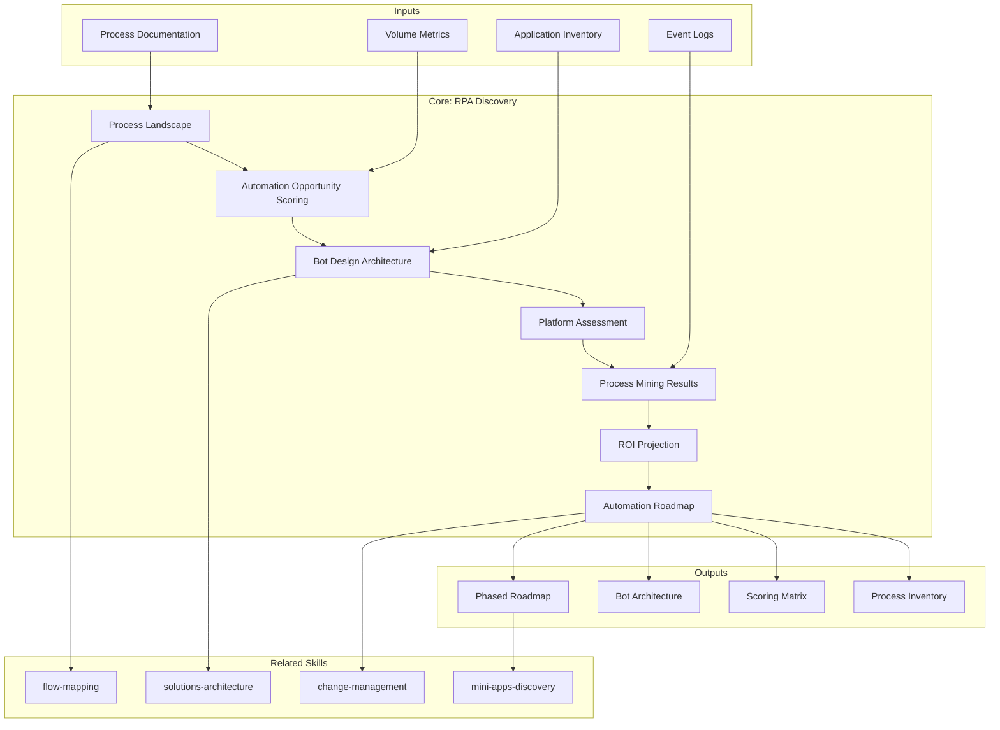

# RPA Discovery — Process Automation Assessment & Roadmap

Generates a 7-section assessment for RPA and process automation initiatives: process inventory (BPMN), automation opportunity scoring, bot architecture, platform evaluation, process mining results, ROI projection, and automation roadmap. Each finding backed by evidence from the client's process landscape.

## Grounding Guideline

> *Automation without process understanding is the fastest way to scale a problem. First understand, then optimize, and only then automate.*

1. **Automating a broken process is amplifying the error.** Before considering a bot, the process must be documented, stabilized, and measured. Automation is the last step, not the first.
2. **Objective scoring replaces intuition.** Each candidate process is evaluated with quantifiable criteria (structured data, stable rules, volume, repetitiveness, error-proneness). Prioritization emerges from data, not political pressure.
3. **RPA ROI is a mirage without governance.** Bots without monitoring, without exception handling, without updates when the underlying process changes generate automation debt that erodes the initial return.

## Inputs

- `$1` — Path to process documentation or project workspace (default: current working directory)
- `$2` — Analysis depth: `full` (default), `executive` (S1, S2, S6, S7 only)

Parse from `$ARGUMENTS`.

**Parameters:**
- `{MODO}`: `piloto-auto` (default) | `desatendido` | `supervisado` | `paso-a-paso`
  - **piloto-auto**: Auto para inventario de procesos y scoring, HITL para decisiones de plataforma y arquitectura de bots.
  - **desatendido**: Zero interruptions. Analisis completo automatizado. Assumptions documented.
  - **supervisado**: Autonomo con reportes al completar cada seccion.
  - **paso-a-paso**: Confirms before cada seccion del analisis.
- `{FORMATO}`: `markdown` (default) | `html` | `dual`
- `{VARIANTE}`: `ejecutiva` (~40% — S1, S2, S6, S7 only) | `tecnica` (full, default)
- `{TIPO_SERVICIO}`: `RPA` (fixed for this skill)

## Input Requirements

**Mandatory:**
- Documentacion de procesos (BPMN, diagramas de flujo, o descripciones textuales)
- Metricas de volumen por proceso (transacciones/dia, frecuencia)
- Inventario de aplicaciones involucradas en los procesos

**Recommended:**
- Datos de process mining (event logs)
- Inventario de bots existentes (si aplica)
- Metricas de error/rework por proceso
- Evaluaciones previas de automatizacion
- Stakeholder interviews o encuestas de process owners

## Assumptions & Limits

**Assumptions:**
- Los procesos candidatos tienen documentacion basica o process owners accesibles
- Las aplicaciones involucradas permiten interaccion via UI o API
- Existe voluntad organizacional para adoptar automatizacion
- No se asume una plataforma RPA predeterminada

**Cannot do:**
- Implementar bots o configurar plataformas RPA (requiere engagement de implementacion)
- Medir tiempos de proceso en produccion (requiere process mining en vivo)
- Evaluar licenciamiento especifico de plataformas (requiere cotizacion del vendor)
- Negociar con vendors de plataformas RPA

## Workarounds When Inputs Missing

| Missing Input | Impact | Workaround |
|---|---|---|
| No BPMN documentation | Cannot map process landscape | Entrevistas con process owners; documentacion narrativa; flag como supuesto |
| No volume metrics | Cannot score automation priority | Estimaciones de process owners con rangos (bajo/medio/alto); flag como [SUPUESTO] |
| No process mining data | Cannot validate bottlenecks | Analisis basado en documentacion + entrevistas; recomendar process mining como fase previa |
| No existing bot inventory | Cannot assess current state | Asumir greenfield; flag como supuesto si hay indicios de automatizacion previa |
| No error metrics | Cannot quantify error-proneness | Evaluacion cualitativa con process owners; flag confianza reducida en scoring |

## Edge Cases

- **Proceso con >20 variantes:** Agrupar variantes por decision points principales. Analizar las 3 variantes de mayor volumen. Recomendar simplificacion antes de automatizacion.
- **Aplicaciones legacy sin API:** Evaluar viabilidad de automatizacion via UI. Flag riesgo de fragilidad. Considerar modernizacion previa.
- **Regulacion estricta (SOX, GDPR):** Elevar requisitos de audit trail y credential management. Evaluar compliance por proceso.
- **Multi-plataforma existente:** Mapear bots por plataforma. Evaluar consolidacion vs coexistencia. Analizar interoperabilidad.
- **Procesos cross-funcionales:** Mapear handoffs entre departamentos. Evaluar impacto organizacional. Considerar process orchestration vs task automation.
- **>100 procesos candidatos:** Screening rapido con criterios binarios (digital/no-digital, reglas claras/ambiguas). Scoring detallado solo para top-30.

## Trade-off Matrix

| Decision | Enables | Constrains | When to Use |
|---|---|---|---|
| **Full 7-section analysis** | Maximum depth, complete automation roadmap | 5-7 dias, alto consumo de tokens | Programas de automatizacion enterprise, >50 procesos |
| **Executive variant** (S1+S2+S6+S7) | Quick wins identification, decision-ready | No incluye arquitectura de bots ni evaluacion de plataforma | Business case inicial, executive sponsor alignment |
| **Platform-first** (S4 deep) | Rapid platform selection | Menor profundidad en proceso | Cuando la decision de plataforma es urgente |
| **Process-first** (S1+S2 deep) | Solid process foundation | No llega a solucion tecnica | Organizaciones sin documentacion de procesos |

## 7-Section Framework

### S1: Process Landscape Assessment

Inventario completo de procesos candidatos a automatizacion.

**Entregables:**
- Inventario BPMN de procesos con clasificacion por area funcional
- Analisis de volumen/frecuencia por proceso (transacciones/dia, periodicidad)
- Clasificacion de complejidad: simple (1-5 pasos, 1 aplicacion), medio (5-15 pasos, 2-3 aplicaciones), complejo (>15 pasos, >3 aplicaciones, decisiones condicionales)
- Cuantificacion de esfuerzo manual por proceso (FTE-horas/mes)
- Mapeo de process owners y stakeholders por proceso

**Formato de inventario:**

| ID | Proceso | Area | Volumen/dia | Frecuencia | Complejidad | FTE-hrs/mes | Process Owner |
|---|---|---|---|---|---|---|---|
| P-001 | ... | ... | ... | ... | Simple/Medio/Complejo | ... | ... |

### S2: Automation Opportunity Scoring

Scoring cuantitativo por proceso para determinar prioridad de automatizacion.

**Criterios de scoring (0-3 cada uno, total maximo 15):**

| Criterio | 0 | 1 | 2 | 3 |
|---|---|---|---|---|
| Datos estructurados | Datos no digitales | Semi-estructurados | Estructurados con excepciones | 100% estructurados y digitales |
| Reglas estables | Cambian semanalmente | Cambian mensualmente | Cambian trimestralmente | Estables >6 meses |
| Alto volumen | <10 tx/dia | 10-50 tx/dia | 50-200 tx/dia | >200 tx/dia |
| Repetitivo | Alta variabilidad | Variabilidad moderada | Mayormente repetitivo | 100% repetitivo, sin juicio |
| Propenso a error | <1% error rate | 1-3% error rate | 3-5% error rate | >5% error rate |

**Clasificacion por score:**
- 12-15: **Automatizacion inmediata** (quick win)
- 8-11: **Automatizacion con optimizacion previa**
- 4-7: **Evaluar simplificacion antes de automatizar**
- 0-3: **No automatizar** (proceso no apto)

Ranking Pareto: top 20% de procesos que generan 80% del beneficio.

### S3: Bot Design Architecture

Arquitectura de automatizacion para los procesos priorizados.

**Entregables:**
- Clasificacion attended vs unattended por proceso automatizado
- Modelo de orquestacion (centralizado, distribuido, hibrido)
- Mapeo bot-to-process (1:1, 1:N, N:1)
- Estrategia de manejo de excepciones (retry, escalation, human-in-the-loop)
- Modelo de gestion de credenciales (vault integration, rotation policy)
- Diseno de audit trail (logging, compliance, trazabilidad)

**Diagrama de arquitectura (Mermaid):**
- Orquestador central, bots, aplicaciones target, exception handler, credential vault, monitoring

### S4: Platform Assessment

Evaluacion comparativa de plataformas RPA.

**Matriz de comparacion:**

| Criterio | UiPath | Automation Anywhere | Power Automate | Blue Prism |
|---|---|---|---|---|
| Escalabilidad | ... | ... | ... | ... |
| Gobernanza | ... | ... | ... | ... |
| Cost Drivers | ... | ... | ... | ... |
| Ecosistema | ... | ... | ... | ... |
| Curva de aprendizaje | ... | ... | ... | ... |
| Enterprise Features | ... | ... | ... | ... |

**Escala de evaluacion (de software-viability):**
- **SUBSTANCIA**: Capacidad demostrada con evidencia en produccion
- **PROMESA**: Capacidad anunciada con roadmap creible
- **RIESGO**: Capacidad parcial con limitaciones conocidas
- **HUMO**: Marketing sin evidencia tecnica sustancial

Recomendacion fundamentada con trade-offs explicitos.

### S5: Process Mining Results

Resultados de process mining cuando datos disponibles.

**Si hay datos de process mining disponibles:**
- Identificacion de bottlenecks (cuellos de botella con metricas de tiempo)
- Analisis de variantes (happy path vs variantes, frecuencia por variante)
- Conformance checking (adherencia al proceso documentado vs proceso real)
- Validacion de oportunidades de automatizacion (confirmar/ajustar scoring de S2)

**Si no hay datos de process mining:**
- Flag como recomendacion: "Se recomienda implementar process mining como fase previa para validar oportunidades de automatizacion con datos reales."
- Documentar el gap y su impacto en la confianza del scoring
- Proponer herramientas (Celonis, Disco, ProcessGold) y esfuerzo estimado

### S6: ROI Projection Model

Proyeccion de retorno basada en magnitudes, NO en precios.

**Modelo de calculo:**
```
Beneficio = Tiempo ahorrado x Volumen de proceso x Reduccion de errores
```

**Componentes del modelo:**
- **Tiempo ahorrado por transaccion:** minutos manuales vs minutos automatizados
- **Volumen mensual:** transacciones procesadas
- **Reduccion de errores:** tasa actual vs tasa proyectada con automatizacion
- **FTE equivalentes liberados:** horas recuperadas convertidas a FTE

**Drivers de costo (magnitudes, NUNCA precios):**
- Licenciamiento de plataforma (numero de bots, tipo de licencia)
- Infraestructura (VMs, cloud resources por bot)
- Desarrollo e implementacion (FTE-meses por complejidad de proceso)
- Mantenimiento continuo (% del costo de desarrollo anual)
- Capacitacion y change management

**Proyeccion de automation debt:**
- Costo de mantenimiento acumulado si no se invierte en gobernanza
- Impacto de cambios en aplicaciones target sobre bots existentes
- Degradacion de ROI sin monitoreo activo

> **Disclaimer obligatorio:** Las magnitudes presentadas son estimaciones basadas en drivers identificados. Los valores finales dependen de negociacion comercial, condiciones de mercado y contexto especifico del cliente. Consultar con el area comercial para pricing.

### S7: Automation Roadmap

Hoja de ruta de automatizacion en 3 horizontes.

**Horizonte 1 — Quick Wins (0-3 meses):**
- Procesos con score 12-15, complejidad simple
- Bots unattended de alto volumen
- Resultados visibles para generar momentum

**Horizonte 2 — Medium-term (3-9 meses):**
- Procesos con score 8-11, complejidad media
- Bots attended para procesos que requieren juicio parcial
- Integracion con sistemas core

**Horizonte 3 — Strategic (9-18 meses):**
- Automatizaciones transformacionales (cross-funcionales, AI-augmented)
- Orquestacion avanzada (process orchestration, intelligent automation)
- Hyperautomation: RPA + AI/ML + process mining + low-code

**Evolucion del CoE (Center of Excellence):**
- Fase 1: Equipo centralizado, gobernanza basica, primeros bots
- Fase 2: Modelo federado, citizen developers, governance framework
- Fase 3: CoE maduro, automation-first culture, continuous improvement

**Dependencias entre fases:**
- Diagrama de dependencias (Mermaid gantt o flowchart)
- Prerequisitos tecnicos y organizacionales por fase
- Criterios de avance (exit criteria por horizonte)

## Escalation to Human Architect

- Procesos con regulacion especifica no documentada (SOX, GDPR, sector salud)
- Aplicaciones legacy sin documentacion tecnica accesible
- Conflictos entre process owners sobre priorizacion
- Infraestructura de seguridad que limita interaccion de bots
- Integraciones con sistemas de terceros sin API documentada
- Decisiones de licenciamiento que requieren negociacion con vendors

## Edge Cases

| Case | Handling Strategy |
|---|---|
| Proceso con >20 variantes | Agrupar variantes por decision points principales; analizar las 3 variantes de mayor volumen; recomendar simplificacion antes de automatizacion |
| Aplicaciones legacy sin API | Evaluar viabilidad de automatizacion via UI; flag riesgo de fragilidad ante cambios de interfaz; considerar modernizacion previa como prerequisito |
| Regulacion estricta (SOX, GDPR) | Elevar requisitos de audit trail y credential management; evaluar compliance por proceso individual; documentar controles regulatorios por bot |
| >100 procesos candidatos | Screening rapido con criterios binarios (digital/no-digital, reglas claras/ambiguas); scoring detallado solo para top-30; el resto en backlog priorizado |
| Procesos cross-funcionales entre departamentos | Mapear handoffs entre departamentos; evaluar impacto organizacional; considerar process orchestration sobre task automation simple |

## Decisions & Trade-offs

| Decision | Discarded Alternative | Justification |
|---|---|---|
| Entender y optimizar el proceso ANTES de automatizar | Automatizar el proceso tal como esta | Automatizar un proceso roto amplifica el error a velocidad de maquina; la optimizacion previa reduce variantes y excepciones |
| Scoring cuantitativo con 5 criterios objetivos | Priorizacion por intuicion o presion politica | La priorizacion basada en datos (estructurados, reglas estables, volumen, repetitividad, error-proneness) elimina sesgos y produce ROI predecible |
| Gobernanza del CoE desde el primer bot | Escalar bots primero, gobernar despues | Bots sin monitoreo ni manejo de excepciones generan deuda de automatizacion que erosiona el ROI; la gobernanza es prerequisito, no afterthought |

## Knowledge Graph



## Output Templates

| Formato | Nombre | Contenido |
|---|---|---|
| **Markdown** | `RPA_Discovery_{project}.md` | Assessment completo de 7 secciones: inventario BPMN, scoring de automatizacion, arquitectura de bots, evaluacion de plataforma, process mining, ROI y roadmap. Diagramas Mermaid embebidos. |
| **PPTX** | `RPA_Discovery_{project}_Executive.pptx` | Presentacion ejecutiva con quadrant chart de scoring, arquitectura de bots simplificada, proyeccion de ROI por horizonte, y roadmap visual para alineacion con sponsors. |
| **HTML** | `{fase}_rpa_discovery_{cliente}_{WIP}.html` | Mismo contenido en HTML branded (Design System MetodologIA v5). Self-contained, WCAG AA, responsive. Incluye scoring matrix interactivo con semáforo por proceso, automation roadmap timeline visual y ROI projection chart. |
| **DOCX** | `{fase}_rpa_discovery_{cliente}_{WIP}.docx` | Generado via python-docx con MetodologIA Design System v5. Portada, TOC automático, encabezados en Poppins (navy), cuerpo en Trebuchet MS, acentos en gold. Tablas de scoring de automatización, inventario de procesos y roadmap por horizonte con zebra striping. Encabezados y pies de página con branding MetodologIA. |
| **XLSX** | `{fase}_rpa_discovery_{cliente}_{WIP}.xlsx` | Generado via openpyxl con MetodologIA Design System v5. Encabezados con fondo navy y texto Poppins blanco, cuerpo en Trebuchet MS, zebra striping en filas. Hojas: Process Inventory (ID, proceso, área, volumen/día, frecuencia, complejidad, FTE-hrs/mes, process owner), Automation Scoring (proceso, criterio 1-5, score total, clasificación, prioridad), Bot Architecture (proceso, tipo attended/unattended, orquestación, manejo excepciones), Platform Assessment (criterio, UiPath, AA, Power Automate, Blue Prism, recomendación), ROI Projection (proceso, tiempo ahorrado, volumen mensual, FTE liberados, driver de costo). Conditional formatting por score de automatización y veredicto de plataforma. Auto-filters en todas las hojas. Valores directos sin fórmulas. |

## Evaluacion

| Dimension | Peso | Criterio |
|---|---|---|
| Trigger Accuracy | 10% | Descripcion activa triggers correctos (RPA, automation, bot design, process mining, automation candidates) sin falsos positivos con mini-apps-discovery o workflow automation generica |
| Completeness | 25% | Las 7 secciones cubren inventario, scoring, arquitectura, plataforma, mining, ROI y roadmap sin huecos; todos los procesos candidatos evaluados |
| Clarity | 20% | Instrucciones ejecutables sin ambiguedad; scoring con criterios cuantificables (0-3 por dimension); ROI con formula explicita y disclaimer |
| Robustness | 20% | Maneja >100 procesos, legacy sin API, regulacion estricta, procesos cross-funcionales y ausencia de process mining con workarounds especificos |
| Efficiency | 10% | Proceso no tiene pasos redundantes; variante ejecutiva reduce a S1+S2+S6+S7 sin perder capacidad de decision sobre priorizacion y ROI |
| Value Density | 15% | Cada seccion aporta valor practico directo; scoring matrix y ROI projection son herramientas de decision inmediata para el business case |

**Umbral minimo: 7/10.**

---

## Validation Gate

- [ ] Inventario de procesos completo con metricas de volumen y complejidad
- [ ] Scoring de automatizacion aplicado a todos los procesos con criterios cuantificables
- [ ] Arquitectura de bots definida (attended/unattended, orquestacion, excepciones)
- [ ] Evaluacion de plataforma con escala SUBSTANCIA/PROMESA/RIESGO/HUMO
- [ ] Process mining resultados integrados o gap documentado con recomendacion
- [ ] ROI proyectado en magnitudes (NUNCA precios) con disclaimer obligatorio
- [ ] Roadmap en 3 horizontes con dependencias y criterios de avance
- [ ] Evolucion del CoE documentada con fases y governance
- [ ] Evidencia tagueada con [CODIGO], [CONFIG], [DOC], [INFERENCIA], [SUPUESTO]
- [ ] Cross-references entre secciones (scoring S2 alimenta roadmap S7)

## Output Artifact

**Primary:** `RPA_Discovery_{project}.md` — Assessment completo de 7 secciones con inventario de procesos, scoring de automatizacion, arquitectura de bots, evaluacion de plataforma, resultados de process mining, proyeccion de ROI, y roadmap de automatizacion.

**Diagramas incluidos:**
- Mapa de procesos candidatos (mindmap o flowchart)
- Arquitectura de bots y orquestacion
- Matriz de scoring (quadrant chart)
- Roadmap de automatizacion (gantt)

---
**Autor:** Javier Montaño · Comunidad MetodologIA | **Ultima actualizacion:** 14 de marzo de 2026
