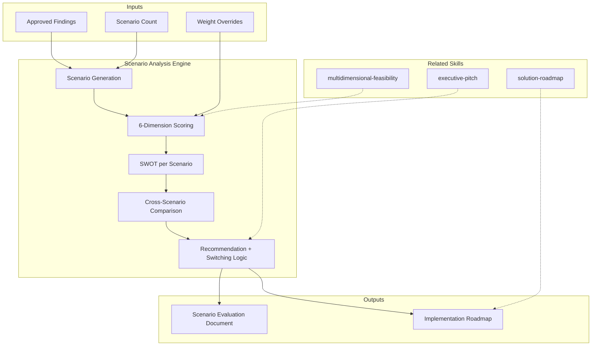

# Strategic Scenario Analysis — Tree of Thought

Develops 3+ parallel technology/approach scenarios, scores each across 6 weighted dimensions, performs SWOT per scenario, builds cross-scenario comparative analysis, and recommends the strongest path with documented trade-offs and conditional switching logic.

## Inputs

- `$1` — Number of scenarios to evaluate (default: 3, min: 3)
- `$2` — Weight override file path (optional; overrides default dimension weights)

Parse from `$ARGUMENTS`.

**Parameters:**
- `{MODO}`: `piloto-auto` (default) | `desatendido` | `supervisado` | `paso-a-paso`
  - **piloto-auto**: Auto para generación de escenarios y scoring, HITL para validación de pesos dimensionales y decisión final.
  - **desatendido**: Zero interruptions. Scoring y recomendación automáticos. Assumptions documented.
  - **supervisado**: Autónomo con checkpoint en selección de escenarios y antes de recomendación final.
  - **paso-a-paso**: Confirma cada escenario, cada score dimensional, y la recomendación.
- `{FORMATO}`: `markdown` (default) | `html` | `dual`
- `{VARIANTE}`: `ejecutiva` (~40% — scoring matrix + recommendation only) | `técnica` (full SWOT + risk register + implementation roadmap, default)

## Grounding Guideline

**Choosing without comparing is gambling. Comparing without structure is bias.** The Tree of Thought imposes divergence before convergence: first all viable scenarios are generated, then evaluated with quantitative rigor, and only then is a recommendation made. The goal is not to find the "correct" answer — it is to eliminate the wrong ones with evidence.

### Strategic Analysis Philosophy

1. **Mandatory divergence.** Minimum 3 scenarios. Confirmation bias favors the "obvious" scenario — alternatives challenge and strengthen it (or disqualify it).
2. **Scoring > opinion.** Each dimension is scored with a rubric. If it cannot be scored, evidence is missing — do not infer, investigate.
3. **Context changes, recommendation changes.** Conditional switching logic documents under what circumstances the recommendation would change. No recommendation is absolute.

## 6-Dimension Weighted Scoring

| Dimension | Weight | Definition | Scoring (1-10) |
|---|---|---|---|
| **Cost** | 20% | CAPEX + OPEX + 3-year TCO | 10: <1M Yr1, 8: 1-2M, 6: 2-3M, 4: 3-5M, 2: >5M, 1: Prohibitive |
| **Time-to-Value** | 20% | MVP deployment + stabilization | 10: <3mo, 8: 3-4mo, 6: 4-6mo, 4: 6-9mo, 2: 9-12mo, 1: >12mo |
| **Operational Risk** | 15% | Downtime, data loss, disruption | 10: Zero downtime, 8: <2hr, 6: 2-4hr, 4: 4-8hr, 2: >8hr, 1: Unacceptable |
| **Strategic Alignment** | 20% | Business goal + capability uplift | 10: New revenue, 8: 3+ objectives, 6: 1 key capability, 4: Marginal, 2: Weak |
| **Regulatory Fit** | 15% | Compliance, audit trail, governance | 10: Fully compliant, 8: Minor gaps, 6: Core met + 2-3 gaps, 4: 3-5 gaps |
| **PoC Speed** | 10% | Validate assumptions in 4-8 weeks | 10: <4 weeks 2-3 people, 8: 4-6 weeks, 6: 6-8 weeks, 4: >8 weeks |

**Calculation:** Final Score = Sum(Dimension Score x Weight) on 0-10 scale.

**Weight override:** If client priorities differ (e.g., regulated industry: Regulatory 25%, PoC Speed 5%), pass adjusted weights via `$2`. Document weight rationale explicitly.

## Scenario Archetypes

### A: Conservative (Low Risk, Incremental)
- Wrap/bridge legacy rather than replace. Proven technologies. Longer timeline, lower uplift.
- Best for: risk-averse orgs, constrained budgets, regulatory uncertainty.
- Typical pattern: Strangler facade, API gateway, incremental refactoring.

### B: Moderate (Balanced Path)
- Selective modernization of critical capabilities. Hybrid with anti-corruption layer. Staged migration.
- Best for: most organizations seeking balance between speed and safety.
- Typical pattern: Domain-driven decomposition, selective rebuild, cloud migration.

### C: Aggressive (High Reward, Higher Risk)
- Full-stack modernization (strangler fig). Cloud-native microservices. Event-driven/CQRS.
- Best for: digitally mature orgs, competitive urgency, ample resources.
- Typical pattern: Greenfield rebuild, cloud-native, event sourcing.

If `$1` > 3, generate additional scenarios as variations (e.g., "B with outsourced team", "C phased over 24 months", "A with selective cloud migration").

## Per-Scenario Documentation

For each scenario, deliver:

1. **Vision & Strategic Rationale** — one-sentence direction, business benefits, technical benefits, org impact
2. **Technology Stack Proposal** — ASCII architecture diagram (presentation to API to services to data to infrastructure)
3. **Scope Intervention Matrix** — effort vs complexity grid (3x3)
4. **SWOT Assessment** — Strengths (internal+), Weaknesses (internal-), Opportunities (external+), Threats (external-). Minimum 3 items per quadrant.
5. **Risk Register** — per-risk: ID, statement, impact (1-5), probability (1-5), score, mitigation, owner
6. **Scoring Grid** — 6 dimensions with weighted scores + rationale per score. No empty cells.
7. **Verdict Callout** — Final score, recommendation tier (STRONG / VIABLE / CONDITIONAL / NOT RECOMMENDED), key drivers, primary concern, next steps

## Cross-Scenario Comparative Analysis

### Scoring Matrix
All scenarios side-by-side with per-dimension winners and total weighted scores.

### Trade-off Decision Map
```
         High Strategic Value
                  |
         Scenario C (Value + Risk)
                  |
Low Risk ------------------------------ High Risk
                  |
         Scenario B (Balanced)
                  |
         Scenario A (Safe, proven)
                  |
         Low Strategic Value
```

### Decision Rules
1. **Clear Winner** (score diff > 1.0): Recommend with confidence
2. **Viable Alternatives** (diff 0.5-1.0): Recommend winner; flag alternatives with conditional triggers
3. **Trade-off Zone** (diff < 0.5): All viable; decision depends on risk appetite
4. **Dominated Scenario** (last by > 1.5): Discard unless exceptional circumstance

### Conditional Switching Logic

Document 5+ triggers that would change the recommendation:
- IF timeline pressure increases: higher-scoring time-to-value scenarios gain advantage
- IF budget expands by >30%: aggressive scenarios become viable
- IF regulatory tightens: reconsider compliance-weak scenarios; may force conservative
- IF team expertise hired (3+ senior engineers): moderate and aggressive improve 1-2 points
- IF competitive threat detected: urgency favors faster scenarios
- IF key technology matures (e.g., cloud service GA): reduces risk on dependent scenarios

## Implementation Roadmap (Recommended Scenario)

4 phases with go/no-go gates:
1. **Foundation (Months 1-2):** Team, PoC, validate assumptions. Gate: PoC achieves target KPI.
2. **Pilot (Months 3-5):** Expand scope, test integration. Gate: load test passes, SLO targets met.
3. **Scale (Months 6-10):** Full migration, parallel run. Gate: zero incidents during parallel run.
4. **Optimize (Months 10-12):** Stabilize, cost-optimize. Gate: ops/finance/security sign-off.

## Edge Cases

- **Only 2 viable scenarios:** Generate "Do Nothing" as third scenario to quantify cost of inaction.
- **All scenarios score within 0.3 points:** Declare trade-off zone. Present to steering committee with recommendation based on org risk appetite.
- **Regulatory requirements unknown:** Score conservatively (assume 3-5 gaps). Flag for compliance review before gate.
- **No cost data available:** Use industry benchmarks. Flag all cost scores as "estimated" with confidence range.
- **Stakeholders disagree on weights:** Run scoring with 2-3 weight sets. Show how recommendation changes. Document which weight set the committee adopts.
- **One scenario dominates all dimensions:** Still document alternatives — the "obvious" choice may have hidden risks surfaced by comparison.

## Assumptions & Limits

- Phase 2 (Flow Mapping) completed with validated domain taxonomy
- Scenario archetypes are starting points, not constraints — real scenarios may blend approaches
- Scoring is relative within the engagement context, not absolute benchmarks
- Cost estimates use magnitude ranges, not precise figures (see cost-estimation for detail)
- Risk register is scenario-level; detailed risk analysis is in risk-controlling-dynamics
- Cannot replace steering committee judgment — structures the decision, does not make it

## Trade-off Matrix

| Trade-off | Benefit | Cost | When to Choose |
|---|---|---|---|
| **3 scenarios vs 5+** | Decision clarity, focused comparison | May miss edge-case approaches | Default; use 5+ only when stakeholders demand broader options |
| **Depth vs speed** | Full SWOT + risk register per scenario | 3-5 days vs 1-2 days (scoring only) | Full depth for strategic decisions; abbreviated for time-boxed sprints |
| **Quantitative vs qualitative scoring** | Rubric-based (1-10) comparability | Forces precision, may oversimplify nuance | Always quantitative + qualitative narrative complement |
| **Weight override** | Tailored to client priorities | Requires explicit justification | Regulated industries, specific risk profiles |

## Output Artifact

**Primary:** `05_Escenarios_ToT_{project}.md` (o `.html` si `{FORMATO}=html|dual`) — 3+ scenario evaluations with 6-dimension scoring, SWOT analysis, cross-scenario comparison, conditional switching logic, and implementation roadmap.

**Diagramas incluidos:**
- Flowchart: Tree-of-Thought decision tree with criteria at each node
- Quadrant chart: scenario positioning (feasibility × strategic impact)

## Validation Gate

- [ ] 3+ distinct scenarios evaluated (different tech/approach, not minor variations)
- [ ] All 6 dimensions scored with evidence-based rationale (no empty scores)
- [ ] SWOT complete per scenario (min 3 items per quadrant)
- [ ] Cross-scenario matrix with per-dimension winners
- [ ] Decision rules applied; recommendation explicit with rationale
- [ ] Conditional switching logic documented (5+ trigger conditions)
- [ ] Implementation roadmap for recommended scenario with 4 phased gates
- [ ] Trade-off decision map visual included
- [ ] All assumptions documented (min 3 per scenario)
- [ ] Risk register per scenario with scored risks and mitigations
- [ ] Mermaid diagrams: flowchart (decision tree) + quadrant (scenario positioning)

## Output Format Protocol

| Format | Default | Description |
|--------|---------|-------------|
| `markdown` | ✅ | Rich Markdown + Mermaid diagrams. Token-efficient. |
| `html` | On demand | Branded HTML (Design System). Visual impact. |
| `dual` | On demand | Both formats. |

Default output is Markdown with embedded Mermaid diagrams. HTML generation requires explicit `{FORMATO}=html` parameter.

### Diagrams (Mermaid)
- Flowchart: decision tree (Tree-of-Thought) with criteria at each node
- Quadrant chart: scenario positioning (feasibility × impact)

## Edge Cases

| Case | Handling Strategy |
|------|---------------------|
| Stakeholders insist on only 1 scenario ("we already know what we want") | Generate the requested scenario plus "Do Nothing" and one genuine alternative; present the comparison to demonstrate either the conviction is justified or alternatives have merit |
| Scoring produces identical totals for 2+ scenarios (difference <0.2 points) | Declare a trade-off zone; run a sensitivity analysis with 3 different weight sets (risk-averse, balanced, aggressive); present which scenario wins under each weight profile |
| A scenario scores highest overall but has a critical dimension score below 3 | Flag the critical weakness as a BLOCKER; add a mandatory spike/PoC to validate whether the weakness is resolvable; recommend the second-highest scenario as contingency |
| Weight override requested but no justification provided | Reject the override until stakeholder documents the rationale; default weights are designed for balance and deviations require explicit reasoning |

## Decisions & Trade-offs

| Decision | Discarded Alternative | Justification |
|----------|----------------------|---------------|
| Minimum 3 scenarios mandatory, no exceptions | Allow 2-scenario comparisons for speed | Two scenarios create a false binary; the third scenario (even "Do Nothing") forces divergent thinking and prevents confirmation bias |
| Use rubric-based quantitative scoring (1-10) with qualitative narrative | Qualitative-only comparison (pros/cons lists) | Qualitative comparisons are susceptible to anchoring and recency bias; quantitative scoring creates comparable, auditable decisions |
| Document conditional switching logic (5+ triggers) | Static recommendation without conditions | Business conditions change; a recommendation that says "this changes if X happens" builds client confidence and reduces plan fragility |
| Score rationale required for every dimension (no empty cells) | Allow blank rationale for obvious scores | "Obvious" is subjective; forcing rationale surfaces hidden assumptions and creates an audit trail for the steering committee |

## Knowledge Graph



## Output Templates

### Markdown (default)
- Filename: `05_Escenarios_ToT_{cliente}_{WIP}.md`
- Structure: TL;DR > Scenario descriptions > Per-scenario SWOT + scoring grid > Cross-scenario matrix > Trade-off decision map > Conditional switching logic > Implementation roadmap > Mermaid flowchart + quadrant > ghost menu

### PPTX
- Filename: `05_Escenarios_ToT_{cliente}_{WIP}.pptx`
- Structure: Executive summary slide > 1 slide per scenario (vision + score) > Comparison matrix slide > Trade-off map visual > Recommendation slide with switching triggers; speaker notes with full evidence

### HTML (bajo demanda)
- Filename: `05_Escenarios_ToT_{cliente}_{WIP}.html`
- Estructura: HTML self-contained branded (Design System MetodologIA v5). Dark-First Executive. Scoring matrix comparativa por escenario, quadrant chart de posicionamiento (feasibility × impacto), y conditional switching logic resaltada. WCAG AA, responsive, print-ready.

### DOCX (bajo demanda)
- Filename: `{fase}_escenarios_tot_{cliente}_{WIP}.docx`
- Generado via python-docx con MetodologIA Design System v5. Portada, TOC automático, encabezados en Poppins (navy), cuerpo en Trebuchet MS, acentos en gold. Tablas de scoring 6 dimensiones por escenario y risk register con zebra striping. Encabezados y pies de página con branding MetodologIA.

### XLSX (bajo demanda)
- Filename: `{fase}_escenarios_tot_{cliente}_{WIP}.xlsx`
- Generado via openpyxl con MetodologIA Design System v5. Encabezados con fondo navy y texto Poppins blanco, cuerpo en Trebuchet MS, zebra striping en filas. Hojas: Scoring Matrix (escenario, costo, time-to-value, riesgo operacional, alineación estratégica, regulatory fit, PoC speed, score ponderado, recomendación tier), SWOT por Escenario (escenario, fortalezas, debilidades, oportunidades, amenazas), Risk Register (ID, escenario, riesgo, impacto, probabilidad, score, mitigación, owner), Conditional Switching Logic (trigger, escenario beneficiado, cambio de recomendación). Conditional formatting por score y recommendation tier. Auto-filters en todas las hojas. Valores directos sin fórmulas.

## Evaluacion

| Dimension | Peso | Criterio |
|-----------|------|----------|
| Trigger Accuracy | 10% | Descripcion activa triggers correctos sin falsos positivos |
| Completeness | 25% | Todos los entregables cubren el dominio sin huecos |
| Clarity | 20% | Instrucciones ejecutables sin ambiguedad |
| Robustness | 20% | Maneja edge cases y variantes de input |
| Efficiency | 10% | Proceso no tiene pasos redundantes |
| Value Density | 15% | Cada seccion aporta valor practico directo |

**Umbral minimo**: 7/10 en cada dimension para considerar el skill production-ready.

---
**Autor:** Javier Montaño | **Ultima actualizacion:** 15 de marzo de 2026
