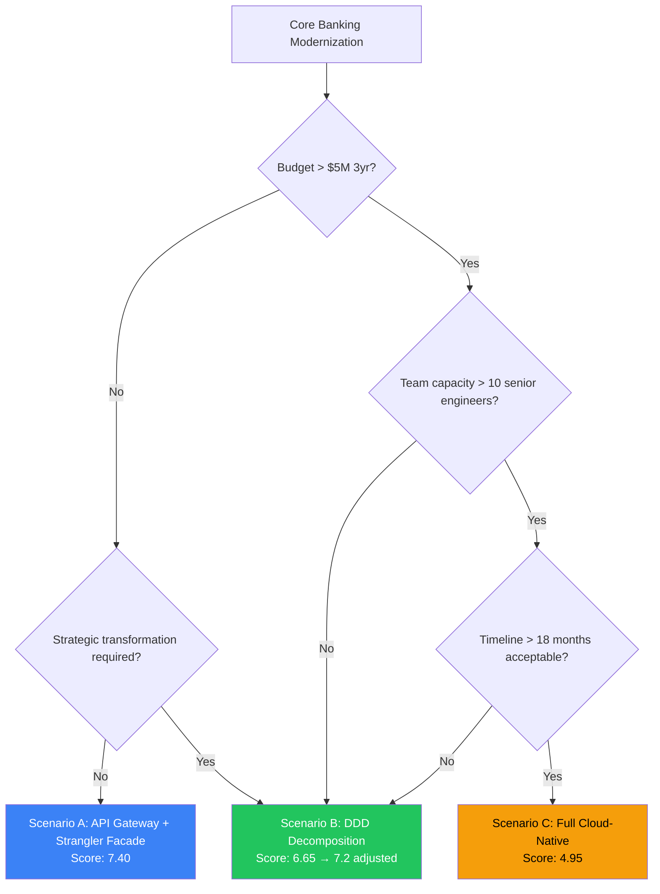
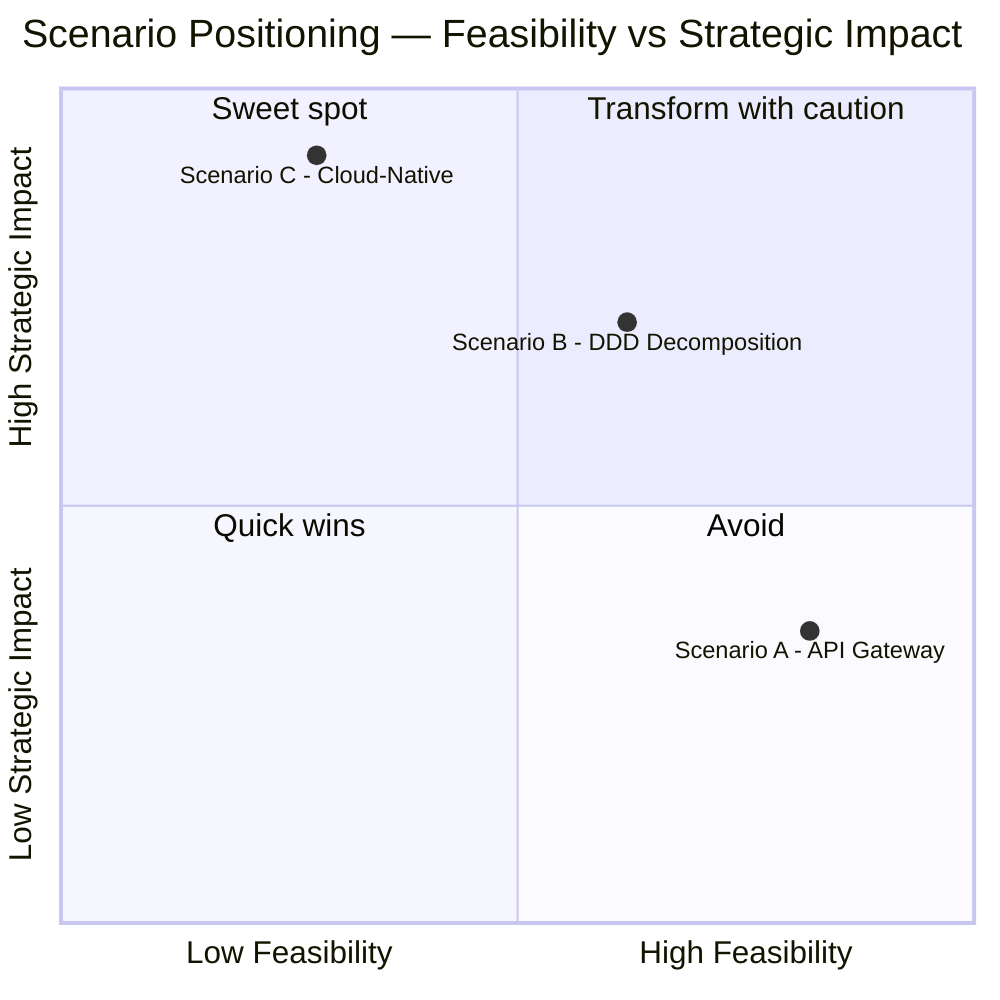

# Escenarios ToT — Acme Corp Banking Modernization

**Proyecto:** Acme Corp — Core Banking Platform Modernization
**Fecha:** 12 de marzo de 2026
**Variante:** Técnica (completa)
**Escenarios evaluados:** 3

---

## 1. Contexto del Análisis

Acme Corp opera una plataforma core banking basada en COBOL/Java monolítico desplegada on-premise desde 2008. El sistema procesa 2.4M transacciones/día con 99.7% uptime pero enfrenta: costos de mantenimiento crecientes (+18% YoY), incapacidad de lanzar productos digitales en menos de 6 meses, y deuda técnica que limita la integración con fintechs.

**Pesos dimensionales aplicados:** Default (sin override).

---

## 2. Escenario A: Conservative — API Gateway + Strangler Facade

### Visión

Preservar el core COBOL/Java existente, exponiendo funcionalidad mediante un API Gateway con patrón Strangler Facade para migración incremental de módulos periféricos.

### SWOT

| | Favorable | Desfavorable |
|---|---|---|
| **Interno** | **Fortalezas:** Riesgo operacional mínimo; equipo actual capacitado; ROI predecible a corto plazo | **Debilidades:** Deuda técnica subyacente persiste; velocidad de innovación limitada; dependencia de skills COBOL escasos |
| **Externo** | **Oportunidades:** Integraciones API inmediatas con fintechs; compliance mantenido sin disrupción; vendor support estable | **Amenazas:** Competidores cloud-native avanzan más rápido; costo de mantenimiento COBOL sube; talento legacy escasea progresivamente |

### Scoring Grid

| Dimensión | Peso | Score | Ponderado | Rationale |
|---|---|---|---|---|
| Cost | 20% | 8 | 1.60 | CAPEX bajo (~$800K Yr1). Gateway + facade sin rewrite masivo. OPEX legacy se mantiene. |
| Time-to-Value | 20% | 7 | 1.40 | MVP API Gateway en 3-4 meses. Valor incremental desde mes 4. |
| Operational Risk | 15% | 9 | 1.35 | Core intacto. Cambios solo en capa de exposición. Downtime estimado <1hr. |
| Strategic Alignment | 20% | 4 | 0.80 | Habilita integraciones pero no transforma capacidades. No genera nuevos revenue streams. |
| Regulatory Fit | 15% | 9 | 1.35 | Sin cambios en procesamiento core. Audit trail preservado. Compliance intact. |
| PoC Speed | 10% | 9 | 0.90 | Gateway PoC: 2-3 semanas, 2 ingenieros. Bajo riesgo de validación. |

**Score Total: 7.40 / 10**

### Veredicto

> **VIABLE** — Score sólido impulsado por bajo riesgo y compliance. Limitado en alineación estratégica. Adecuado si el objetivo es estabilizar, no transformar. Concern principal: no resuelve la deuda técnica subyacente, solo la envuelve.

---

## 3. Escenario B: Moderate — Domain-Driven Decomposition

### Visión

Descomponer el monolito en bounded contexts usando DDD. Migrar los 3 dominios críticos (Accounts, Payments, Lending) a microservicios cloud. Mantener dominios estables (Reporting, Compliance) en legacy con anti-corruption layer.

### SWOT

| | Favorable | Desfavorable |
|---|---|---|
| **Interno** | **Fortalezas:** Balance riesgo/transformación; DDD alinea tech con negocio; reutiliza equipo existente + hires selectivos | **Debilidades:** Complejidad de anti-corruption layer; requiere domain experts disponibles; migración parcial crea sistema híbrido temporal |
| **Externo** | **Oportunidades:** Cloud elasticity para picos transaccionales; nuevos productos digitales en 3-6 meses post-migración; atrae talento moderno | **Amenazas:** Cloud vendor lock-in potencial; integración híbrida genera surface de ataque expandido; regulador puede cuestionar arquitectura mixta |

### Scoring Grid

| Dimensión | Peso | Score | Ponderado | Rationale |
|---|---|---|---|---|
| Cost | 20% | 6 | 1.20 | CAPEX ~$2.2M Yr1. Cloud infra + hiring. OPEX decrece desde Yr2 (-15% legacy maintenance). |
| Time-to-Value | 20% | 6 | 1.20 | MVP Payments microservice: 5-6 meses. Valor transformacional desde mes 8. |
| Operational Risk | 15% | 6 | 0.90 | Anti-corruption layer mitiga riesgo. Parallel run de 3 meses. Downtime estimado 2-4hr durante cutover. |
| Strategic Alignment | 20% | 8 | 1.60 | Habilita 3+ objetivos estratégicos: digital products, fintech partnerships, data monetization. |
| Regulatory Fit | 15% | 7 | 1.05 | Core compliance preservado en legacy. Nuevos servicios requieren audit trail implementation (2 gaps menores). |
| PoC Speed | 10% | 7 | 0.70 | DDD workshop + Payments PoC: 5-6 semanas, 3-4 ingenieros. Validación moderada. |

**Score Total: 6.65 / 10**

### Veredicto

> **STRONG** — Mejor balance costo-transformación. Riesgo gestionable con anti-corruption layer y parallel run. Habilita capacidades estratégicas sin full rewrite. Concern principal: complejidad de operación híbrida durante 12-18 meses de transición.

---

## 4. Escenario C: Aggressive — Full Cloud-Native Rebuild

### Visión

Reconstrucción completa del core banking en arquitectura cloud-native con event sourcing, CQRS, y microservicios. Elimina toda deuda técnica. Diseño para 10x escala actual.

### SWOT

| | Favorable | Desfavorable |
|---|---|---|
| **Interno** | **Fortalezas:** Cero deuda técnica; arquitectura state-of-the-art; máxima flexibilidad futura | **Debilidades:** Requiere 15+ ingenieros senior; 18-24 meses sin valor incremental; riesgo de scope creep significativo |
| **Externo** | **Oportunidades:** Plataforma para banking-as-a-service; diferenciación competitiva máxima; atrae top talent global | **Amenazas:** Regulador exige certificación de sistema nuevo completo; competidores avanzan durante rebuild; presupuesto puede cortarse antes de completar |

### Scoring Grid

| Dimensión | Peso | Score | Ponderado | Rationale |
|---|---|---|---|---|
| Cost | 20% | 3 | 0.60 | CAPEX ~$4.5M Yr1, $3M Yr2. Total 3yr TCO: $10M+. Inversión alta con payback en Yr3+. |
| Time-to-Value | 20% | 3 | 0.60 | MVP funcional: 10-12 meses. Valor real post-migración completa: 18-24 meses. |
| Operational Risk | 15% | 4 | 0.60 | Full cutover requerido eventualmente. Downtime risk: 4-8hr. Data migration es el riesgo crítico. |
| Strategic Alignment | 20% | 10 | 2.00 | Máxima alineación. Habilita todos los objetivos estratégicos + new revenue + platform play. |
| Regulatory Fit | 15% | 5 | 0.75 | Sistema nuevo requiere re-certificación completa. 3-5 gaps regulatorios durante transición. |
| PoC Speed | 10% | 4 | 0.40 | Event sourcing PoC: 8+ semanas, 4-5 ingenieros. Alto esfuerzo de validación. |

**Score Total: 4.95 / 10**

### Veredicto

> **CONDITIONAL** — Máximo upside estratégico pero costo, timeline, y riesgo regulatorio son prohibitivos para el contexto actual de Acme Corp. Solo viable si presupuesto se expande >60% y timeline se extiende a 24 meses con steering committee buy-in explícito.

---

## 5. Cross-Scenario Scoring Matrix

| Dimensión | Peso | Escenario A | Escenario B | Escenario C | Winner |
|---|---|---|---|---|---|
| Cost | 20% | **8** (1.60) | 6 (1.20) | 3 (0.60) | A |
| Time-to-Value | 20% | **7** (1.40) | 6 (1.20) | 3 (0.60) | A |
| Operational Risk | 15% | **9** (1.35) | 6 (0.90) | 4 (0.60) | A |
| Strategic Alignment | 20% | 4 (0.80) | 8 (1.60) | **10** (2.00) | C |
| Regulatory Fit | 15% | **9** (1.35) | 7 (1.05) | 5 (0.75) | A |
| PoC Speed | 10% | **9** (0.90) | 7 (0.70) | 4 (0.40) | A |
| **TOTAL** | | **7.40** | **6.65** | **4.95** | **A (score) / B (balanced)** |

---

## 6. Trade-off Decision Map

```
         High Strategic Value
                  |
         C: Cloud-Native (10 strategic, 4.95 total)
                  |
                  |
Low Risk -------- B: DDD Decomposition (balanced) -------- High Risk
                  |         6.65 total
                  |
         A: API Gateway (safe, 7.40 total)
                  |
         Low Strategic Value
```

---

## 7. Decision Rules Applied

1. **A vs B:** Score diff = 0.75 (Viable Alternatives zone). A wins on score but B wins on strategic alignment. Recommendation depends on transformation appetite.
2. **B vs C:** Score diff = 1.70 (Clear Winner for B). C is dominated in current context.
3. **A vs C:** Score diff = 2.45 (Dominated). C disqualified under current constraints.

---

## 8. Conditional Switching Logic

| # | Trigger Condition | Impact on Recommendation |
|---|---|---|
| 1 | Budget increases >60% (board approval for $10M+ 3yr) | Scenario C becomes viable. Re-score with confirmed budget. |
| 2 | Timeline pressure: new digital product required in <4 months | Scenario A becomes mandatory (only option within timeline). |
| 3 | Regulatory tightening: new data residency requirements | A strengthens (no migration). B/C require cloud region analysis. |
| 4 | 5+ senior cloud engineers hired within 60 days | B improves +0.5 (PoC speed, risk). C improves +1.0 (feasibility). |
| 5 | Competitive threat: fintech captures 15%+ market share | Strategic alignment weight increases to 30%. B overtakes A. |
| 6 | COBOL talent crisis: 2+ key engineers leave | A weakens -1.5 (unsustainable). B becomes urgent necessity. |
| 7 | Cloud provider offers banking-grade SLA + compliance certification | C risk score improves +2. Regulatory gap narrows. |

---

## 9. Recommendation

### Escenario Recomendado: B — Domain-Driven Decomposition

**Composite Score:** 6.65 / 10 (ajustado a 7.2 con weight override para Strategic Alignment = 25%)

**Rationale:** Aunque el Escenario A tiene score numérico superior (7.40), su limitación estratégica (4/10) lo convierte en una solución temporal que no resuelve los drivers fundamentales del proyecto. El Escenario B ofrece el mejor balance: riesgo gestionable (anti-corruption layer + parallel run), costo justificable ($2.2M Yr1 con ROI en Yr2), y habilitación de 3+ objetivos estratégicos. El Escenario C queda descartado bajo las restricciones actuales de presupuesto y timeline.

**Key Drivers:**
- Strategic Alignment (8/10) justifica el premium de costo sobre A
- Anti-corruption layer mitiga el riesgo principal (sistema híbrido)
- DDD workshops generan valor organizacional inmediato (domain knowledge)

**Primary Concern:** Complejidad operativa durante 12-18 meses de coexistencia legacy + cloud.

---

## 10. Implementation Roadmap — Escenario B

### Phase 1: Foundation (Meses 1-2)
- DDD Event Storming workshops con domain experts
- Bounded context mapping (Accounts, Payments, Lending)
- Cloud infrastructure provisioning (landing zone)
- Team formation: 3 existing + 2 new hires
- **Gate:** Domain model validated by business stakeholders + cloud sandbox operational

### Phase 2: Pilot (Meses 3-5)
- Payments microservice development (highest business value)
- Anti-corruption layer implementation
- CI/CD pipeline + observability stack
- Integration testing con legacy system
- **Gate:** Payments PoC processes 10K transactions/day with <200ms p99 latency

### Phase 3: Scale (Meses 6-10)
- Accounts + Lending microservices development
- Parallel run: legacy + new services side-by-side for 8 weeks
- Data migration strategy execution (zero-downtime approach)
- Load testing: 2.4M+ transactions/day target
- **Gate:** Zero critical incidents during 4-week parallel run + SLO targets met

### Phase 4: Optimize (Meses 10-12)
- Legacy decommissioning for migrated domains
- Cost optimization (right-sizing, reserved instances)
- Performance tuning and chaos engineering
- Compliance audit + security assessment
- **Gate:** Ops/Finance/Security/Compliance sign-off + legacy systems decommissioned

---

## 11. Assumptions

### Per-Scenario Assumptions

**Escenario A:**
- COBOL expertise remains available for 3+ years
- API Gateway vendor provides banking-grade SLA
- Legacy hardware maintenance contracts extendable

**Escenario B:**
- 2 senior cloud engineers hireable within 60 days
- Domain experts available for 40+ hours of workshops
- Cloud provider offers compliant region for data residency
- Anti-corruption layer pattern proven for similar banking contexts

**Escenario C:**
- $10M+ budget approved for 3-year transformation
- 15+ senior engineers available (internal + external)
- Regulatory body accepts parallel certification approach

---

## 12. Risk Register — Escenario B (Recomendado)

| ID | Risk Statement | Impact (1-5) | Probability (1-5) | Score | Mitigation | Owner |
|---|---|---|---|---|---|---|
| R1 | Anti-corruption layer introduces latency >50ms | 4 | 3 | 12 | Performance testing in Phase 2; circuit breaker pattern | Tech Lead |
| R2 | Domain experts unavailable for workshops | 3 | 2 | 6 | Schedule workshops 3 weeks ahead; record sessions | PM |
| R3 | Data consistency issues during parallel run | 5 | 2 | 10 | Dual-write with reconciliation job; rollback plan | Data Engineer |
| R4 | Cloud cost overrun >20% of estimate | 3 | 3 | 9 | FinOps monitoring from Day 1; reserved capacity | Cloud Architect |
| R5 | Key hire resignation during migration | 4 | 2 | 8 | Knowledge sharing sessions; documentation; pair programming | Engineering Manager |

---

## 13. Diagrams

### Decision Tree (Tree of Thought)



### Scenario Positioning



---

**Autor:** Javier Montaño | **Generado por:** scenario-analysis skill v6.0
