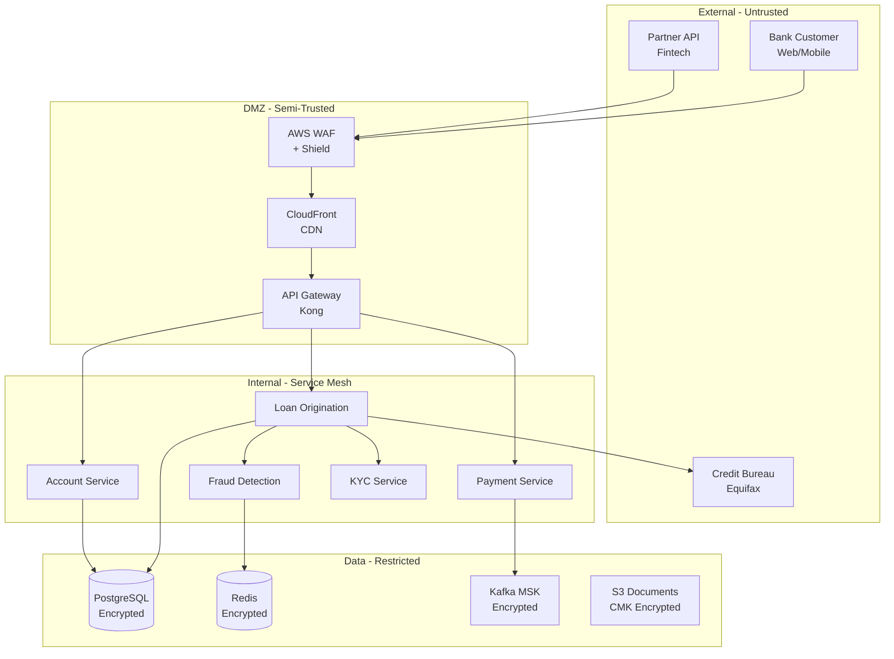
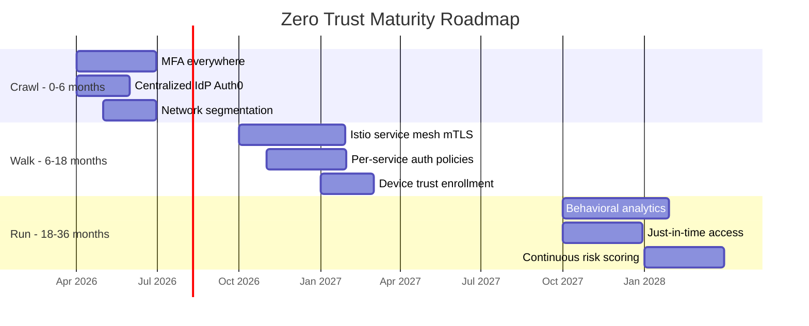

# A-01 Security Architecture — Acme Corp Banking Modernization

> **Proyecto:** Acme Corp Banking Modernization | **Fecha:** 12 de marzo de 2026
> **Modo:** piloto-auto | **Variante:** tecnica (full)

---

## Executive Summary

Acme Corp is migrating its core banking platform to a microservices architecture on AWS. This security architecture defines the threat model (STRIDE applied to 14 services and 4 trust boundaries), zero trust implementation roadmap, OAuth2/OIDC-based identity management, data protection strategy for PII/PCI data, application security pipeline, and compliance mapping across PCI-DSS 4.0, SOC 2, and OCC regulatory requirements. The platform handles 12M daily transactions including loan origination, payments, and account management — all classified as restricted data under Acme's data classification policy.

---

## S1: Threat Modeling

### Methodology: STRIDE per Element

Applied to Acme Corp's banking microservices architecture with 4 trust boundaries.

### Data Flow Diagram — Trust Boundaries



### STRIDE Threat Enumeration — Top 10

| ID | Element | STRIDE | Threat | Likelihood | Impact | Risk | Mitigation |
|----|---------|--------|--------|-----------|--------|------|-----------|
| T1 | API Gateway | Spoofing | Stolen JWT used to access accounts | High | Critical | Critical | Short-lived tokens (15 min), refresh rotation, device binding |
| T2 | Loan Service | Tampering | Modified loan amount in transit | Medium | Critical | High | Request signing, input validation, immutable audit log |
| T3 | Payment Service | Repudiation | Customer disputes payment they initiated | Medium | High | High | Non-repudiation via signed transaction receipts, audit trail |
| T4 | Database | Info Disclosure | SQL injection exposes PII | Medium | Critical | Critical | Parameterized queries, WAF SQL rules, field-level encryption |
| T5 | Kafka | Info Disclosure | Unauthorized message consumption | Low | High | Medium | Topic-level ACLs, TLS encryption, consumer group auth |
| T6 | Credit Bureau | DoS | Bureau API timeout cascades | High | Medium | High | Circuit breaker, 24h cache, async pattern, timeout 3s |
| T7 | KYC Service | Elevation | Document upload exploit gains admin | Low | Critical | Medium | File type validation, sandbox processing, least privilege |
| T8 | Redis Cache | Info Disclosure | Cache contains PII in plaintext | Medium | High | High | Encrypt PII before caching, TTL-based expiry |
| T9 | S3 Documents | Info Disclosure | Misconfigured bucket exposes loan docs | Low | Critical | Medium | Block public access, CMK encryption, access logging |
| T10 | Partner API | Spoofing | Compromised partner credentials | Medium | High | High | IP allowlist, mutual TLS, credential rotation 90 days |

### Attack Surface Summary

| Entry Point | Exposure | Controls |
|-------------|----------|----------|
| Public REST API (web/mobile) | Internet-facing, 6 endpoints | WAF, rate limiting, JWT auth, input validation |
| Partner API | B2B, 3 endpoints | mTLS, IP allowlist, OAuth2 client credentials |
| Admin Portal | Internal VPN only | MFA, RBAC, session timeout 15 min |
| Credit Bureau Integration | Outbound HTTPS | Certificate pinning, egress firewall rules |
| Kafka Topics | Internal only | TLS, SASL, topic-level ACLs |

---

## S2: Zero Trust Architecture

### Implementation Roadmap



### Zero Trust Controls — Current vs. Target

| Control | Current State | Crawl (6mo) | Walk (18mo) | Run (36mo) |
|---------|-------------|-------------|-------------|------------|
| Identity verification | Password + optional MFA | MFA enforced (all users) | Passwordless (WebAuthn) | Continuous auth |
| Network trust | VPN = trusted | Segmented VPCs | Micro-segmentation (Istio) | Software-defined perimeter |
| Service-to-service | Plain HTTP internal | TLS internal | mTLS (Istio sidecar) | mTLS + policy engine |
| Device trust | None | Managed device enrollment | Posture assessment | Real-time posture checks |
| Access model | Coarse RBAC | Fine RBAC per service | ABAC for data-level | Continuous adaptive |

---

## S3: Identity & Access Management

### Authentication Architecture

| Flow | Protocol | Provider | MFA | Token Lifetime |
|------|----------|----------|-----|---------------|
| Customer (web) | OAuth2 Authorization Code + PKCE | Auth0 | TOTP/WebAuthn | Access: 15 min, Refresh: 7 days |
| Customer (mobile) | OAuth2 Authorization Code + PKCE | Auth0 | Biometric/WebAuthn | Access: 15 min, Refresh: 30 days |
| Partner API | OAuth2 Client Credentials | Auth0 | N/A (mTLS) | Access: 1 hour |
| Internal admin | OIDC + SAML federation | Auth0 + Okta | WebAuthn required | Access: 15 min, Refresh: 8 hours |
| Service-to-service | mTLS (SPIFFE/SPIRE) | Istio | N/A | Certificate: 24 hours |

### Authorization Model: RBAC + ABAC Hybrid

| Role | RBAC Permissions | ABAC Constraints |
|------|-----------------|------------------|
| `customer` | Read/write own accounts, loans | tenant_id matches, account_status=active |
| `loan_officer` | Review loan applications, approve <$500K | branch_region matches, approval_limit |
| `senior_underwriter` | Approve loans any amount | Requires dual approval >$1M |
| `teller` | Process deposits, withdrawals <$10K | branch_id matches, shift=active |
| `admin` | System configuration, user management | IP allowlist, MFA verified in session |
| `auditor` | Read-only all transactions | No write, no delete, audit log access only |
| `partner` | API access per agreement | Scoped to contracted products, rate-limited |

### Secret Management

| Secret Type | Storage | Rotation | Access |
|-------------|---------|----------|--------|
| Database credentials | AWS Secrets Manager | 90 days (automated) | Service IAM role only |
| API keys (credit bureau) | AWS Secrets Manager | 90 days | Loan service only |
| JWT signing keys | AWS KMS | Annual | Auth0 + API Gateway |
| TLS certificates | ACM + Let's Encrypt | 90 days (automated) | ALB, service mesh |
| Encryption keys (CMK) | AWS KMS (HSM-backed) | Annual | Per-service IAM policy |

---

## S4: Data Protection

### Data Classification

| Class | Examples | Encryption at Rest | Encryption in Transit | Access Control | Retention |
|-------|---------|-------------------|----------------------|---------------|-----------|
| Restricted | SSN, account numbers, loan details | AES-256 (CMK) | TLS 1.3 | Named individuals | 7 years (regulatory) |
| Confidential | Credit scores, fraud assessments | AES-256 (AWS-managed) | TLS 1.3 | Role-based | 3 years |
| Internal | Employee data, system configs | AES-256 (AWS-managed) | TLS 1.3 | All employees | 1 year |
| Public | Rate tables, branch locations | Integrity only | TLS 1.3 | Anyone | Indefinite |

### Field-Level Encryption — Restricted PII

| Field | Storage Format | Decryption Context |
|-------|---------------|-------------------|
| SSN | Encrypted (KMS envelope) | Loan officer viewing application |
| Account Number | Tokenized (Vault) | Transaction processing only |
| Date of Birth | Encrypted (KMS envelope) | KYC verification only |
| Income | Encrypted (KMS envelope) | Underwriting process only |

### Key Management Hierarchy

```
Master Key (AWS KMS, HSM-backed, annual rotation)
  +-- Data Encryption Key: Loan Data (monthly rotation)
  +-- Data Encryption Key: Payment Data (monthly rotation)
  +-- Data Encryption Key: Customer PII (monthly rotation)
  +-- Data Encryption Key: Documents/S3 (monthly rotation)
```

---

## S5: Application Security

### Security Pipeline

| Stage | Tool | Trigger | SLA | Gate Action |
|-------|------|---------|-----|------------|
| SAST | SonarQube + Semgrep | Every PR | Critical: block, High: 7 days | Block merge on critical |
| SCA | Snyk | Every PR + daily scan | Critical: 24h, High: 7d, Medium: 30d | Block merge on critical |
| DAST | OWASP ZAP | Weekly + pre-release | Critical: block release | Block deployment |
| Container Scan | Trivy | Every build | Critical: block, High: 7d | Block image push |
| Secret Scan | TruffleHog | Pre-commit hook | Immediate | Block commit |
| SBOM Generation | Syft (CycloneDX) | Every release | N/A | Stored in Dependency-Track |

### SLSA Level Target: Level 2

| Requirement | Implementation | Status |
|-------------|---------------|--------|
| Hosted build service | GitHub Actions | Complete |
| Signed provenance | cosign/Sigstore | Sprint 3 |
| SBOM per release | Syft + CycloneDX | Sprint 2 |
| Dependency lock files | Gradle lock, npm lock | Complete |

### Security Champions Program

| Aspect | Plan |
|--------|------|
| Champions per team | 1 per microservice team (6 total) |
| Time allocation | 10% (4 hours/week) |
| Initial training | OWASP Top 10, secure coding, threat modeling (40 hours) |
| Ongoing training | 8 hours/quarter |
| Responsibilities | First-pass threat models, SAST triage, security PR reviews |

---

## S6: Compliance & Audit

### Compliance Framework Mapping

| Control Area | PCI-DSS 4.0 | SOC 2 (TSC) | OCC/FFIEC |
|-------------|-------------|-------------|-----------|
| Access control | Req 7-8 | CC6.1-CC6.3 | 12 CFR 30 Appendix A |
| Encryption | Req 3-4 | CC6.1, CC6.7 | FFIEC IT Handbook |
| Logging/monitoring | Req 10 | CC7.1-CC7.3 | FFIEC CAT |
| Incident response | Req 12.10 | CC7.4-CC7.5 | OCC Bulletin 2023-19 |
| Vendor management | Req 12.8 | CC9.2 | OCC Bulletin 2013-29 |
| Change management | Req 6 | CC8.1 | FFIEC SDLC |
| Vulnerability mgmt | Req 6.3, 11 | CC7.1 | FFIEC IT Handbook |

### Continuous Compliance Automation

| Control | Tool | Frequency | Evidence |
|---------|------|-----------|---------|
| IAM policy drift | AWS Config Rules | Continuous | Config compliance dashboard |
| Encryption at rest | AWS Config Rules | Continuous | KMS key usage audit |
| Network segmentation | Security Hub | Continuous | Security group analysis |
| Patch compliance | Systems Manager | Weekly | Patch compliance report |
| Access reviews | Auth0 + custom | Quarterly | User access certification |
| Pen testing | Third party (Coalfire) | Annual | Pen test report |

### Audit Readiness

| Artifact | Owner | Location | Update Frequency |
|----------|-------|----------|-----------------|
| Control matrix | CISO | Confluence | Quarterly |
| Evidence repository | Security team | S3 (versioned) | Continuous |
| Risk register | Risk committee | Jira | Monthly |
| Incident log | SOC team | PagerDuty + Jira | Per incident |
| Vendor assessments | Procurement | Confluence | Annual per vendor |

---

## Validation Checklist

- [x] Threat model covers 4 trust boundaries and all data flows with STRIDE (10 threats enumerated)
- [x] Zero trust roadmap phased realistically: Crawl/Walk/Run over 36 months
- [x] Identity covers customer, partner, admin, service, and auditor personas
- [x] Encryption covers data at rest (AES-256 CMK) and in transit (TLS 1.3)
- [x] Application security pipeline: SAST, SCA, DAST, container scan, secret scan with SLAs
- [x] SLSA Level 2 targeted with SBOM generation (CycloneDX)
- [x] PCI-DSS 4.0, SOC 2, and OCC requirements mapped to technical controls
- [x] Continuous compliance automation with AWS Config + Security Hub
- [x] Secret management eliminates long-lived credentials (90-day rotation)
- [x] Security champions program: 6 champions, 10% time, 40h initial training

---
**Autor:** Javier Montano | **Generado por:** metodologia-security-architecture | **Fecha:** 12 de marzo de 2026
