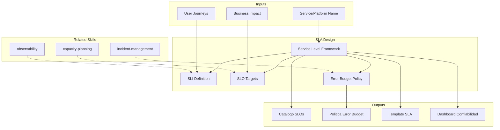

# SLA Design: Service Level Objectives, Indicators & Agreements

SLA design establishes measurable reliability targets that balance user expectations with engineering investment. The skill produces SLO catalogs, error budget policies, and SLA templates following Google SRE principles for sustainable reliability management.

## Grounding Guideline

> *An SLA without an SLO is an empty promise. An SLO without an SLI is a goal without a thermometer.*

1. **Bottom-up.** SLIs measure reality, SLOs define the target, SLAs formalize the commitment.
2. **Error budget as a decision tool.** The error budget is not a permission to fail — it is a mechanism to prioritize between speed and reliability.
3. **Client SLAs, not provider SLAs.** Agreements must reflect what the end user experiences, not what the system reports internally.

## TL;DR

- Defines SLIs (Service Level Indicators) based on real user experience, not internal metrics
- Establishes SLOs (Service Level Objectives) with reliability targets aligned to business impact
- Designs error budget policies that connect reliability with development velocity
- Produces SLA (Service Level Agreements) templates for contractual commitments with clients
- Creates governance framework for review, adjustment, and escalation of service levels

## Inputs

The user provides a service or platform name as `$ARGUMENTS`. Parse `$1` as the **service/platform name**.

**Parameters:**
- `{MODO}`: `piloto-auto` (default) | `desatendido` | `supervisado` | `paso-a-paso`
- `{FORMATO}`: `markdown` (default) | `html` | `dual`
- `{VARIANTE}`: `ejecutiva` (~40%) | `tecnica` (full, default)
- `{ALCANCE}`: `single-service` | `platform` | `customer-facing` | `auto` (default)

## Deliverables

1. **SLO Catalog** — Per-service SLI definitions, SLO targets, measurement windows, and rationale
2. **Error Budget Policy** — Error budget calculation, consumption tracking, escalation triggers, and development velocity consequences
3. **SLA Template** — Customer-facing SLA template with commitments, exclusions, measurement methodology, and remedies
4. **Reliability Dashboard** — Metrics specification for SLI measurement, SLO tracking, and error budget burn rate
5. **Governance Guide** — Review cadence, SLO adjustment criteria, stakeholder RACI, and escalation procedures

## Process

1. **Identify critical user journeys** — Map the most important user-facing workflows that define perceived reliability
2. **Define SLIs** — Select indicators that measure user experience: availability (successful requests / total), latency (p50, p95, p99), correctness, freshness, throughput
3. **Establish SLO targets** — Set reliability targets per SLI based on user expectations, business impact, and engineering cost of each additional nine
4. **Calculate error budgets** — Derive error budget from SLO: 99.9% SLO = 0.1% error budget = 43.2 min/month or 8.76 h/year
5. **Design error budget policy** — Define what happens when budget is consumed: freeze deployments, focus on reliability, postmortem triggers
6. **Create SLA template** — Draft customer-facing agreement with: commitments (always looser than SLOs), measurement window, exclusions, service credits
7. **Specify dashboard** — Define metrics collection, visualization, alerting on burn rate, and multi-window alerting strategy
8. **Establish governance** — Define quarterly SLO review, adjustment criteria, and escalation paths

## Quality Criteria

- [ ] SLIs measure user-facing experience (not internal metrics like CPU usage)
- [ ] SLO targets justified by business impact analysis (cost of each nine)
- [ ] Error budget policy has clear consequences for budget exhaustion
- [ ] SLA commitments are looser than internal SLOs (buffer for safety)
- [ ] Measurement methodology is unambiguous and reproducible
- [ ] Multi-window burn rate alerting configured (fast-burn + slow-burn)
- [ ] Governance includes periodic review and adjustment process
- [ ] Evidence tags applied: [DOC], [CONFIG], [INFERENCIA], [SUPUESTO]

## Assumptions & Limits

- SLO targets are starting points — expect iterative refinement over 2-3 quarters
- Error budget policy requires organizational buy-in from product and engineering leadership
- SLA service credits are business decisions outside the scope of technical design
- Effective SLO management requires observability infrastructure (metrics, tracing, logging)

## Edge Cases

1. **Servicio sin metricas historicas de confiabilidad** — El skill propone SLOs conservadores basados en benchmarks de industria marcados con [SUPUESTO], con plan de refinamiento al acumular 2-3 meses de datos reales.
2. **Dependencias externas con SLA inferior al SLO deseado** — Cuando un tercero ofrece 99.9% pero el servicio quiere 99.95%, el skill documenta el techo de confiabilidad impuesto por dependencias y disena patrones de resiliencia (cache, fallback, retry).
3. **Stakeholders que exigen 100% uptime** — El skill genera analisis de costo por nine adicional para demostrar la inviabilidad economica de 100%, y propone SLOs realistas con error budget como herramienta de comunicacion.
4. **Multiples user journeys con criticidad diferente** — Se definen SLOs diferenciados por journey (ej: checkout 99.99% vs. browse catalog 99.9%) en lugar de un SLO unico para todo el servicio.

## Decisions & Trade-offs

1. **SLI basado en experiencia de usuario vs. metricas internas** — User-facing siempre, porque CPU al 90% no significa que el usuario esta impactado; el costo es mayor complejidad de medicion pero la senal es real.
2. **SLO mas estricto que SLA vs. iguales** — SLO siempre mas estricto (buffer) porque si el SLO = SLA, las violaciones de SLA ocurren sin warning; el buffer tipico es 0.5-1x nine adicional.
3. **Error budget como hard freeze vs. soft warning** — Hard freeze en deploys cuando se agota el budget, porque sin consecuencias reales el error budget es solo un dashboard; requiere buy-in de product management.
4. **Ventana de medicion 30 dias rolling vs. calendario mensual** — Rolling porque calendario mensual permite agotar budget el dia 1 y luego tener 29 dias sin consecuencias; rolling distribuye la presion uniformemente.

## Knowledge Graph

## Output Templates

### Markdown (default)
- Filename: `ops_sla-design_{servicio}_{WIP}.md`
- Structure: TL;DR -> User journeys criticos -> Catalogo SLI/SLO (tabla) -> Politica de error budget -> Template SLA -> Especificacion de dashboard

### XLSX
- Filename: `ops_slo-catalog_{servicio}_{WIP}.xlsx`
- Hojas: User Journeys | SLI Definitions | SLO Targets | Error Budget Calculations | SLA Template | Governance Calendar

### DOCX (bajo demanda)
- Filename: `{fase}_sla-design_{servicio}_{WIP}.docx`
- Generado con python-docx y MetodologIA Design System v5. Portada con nombre del servicio y fecha, TOC automático, encabezados Poppins navy, cuerpo Trebuchet MS, acentos dorados, tablas zebra. Secciones: Catálogo SLI/SLO, Política de Error Budget, Template SLA, Especificación de Dashboard, Gobernanza.

### PPTX (bajo demanda)
- Filename: `{fase}_sla-design_{servicio}_{WIP}.pptx`
- Generado con python-pptx y MetodologIA Design System v5. Slide master con gradiente navy, títulos Poppins, cuerpo Trebuchet MS, acentos dorados. Máximo 20 slides (ejecutiva). Speaker notes con referencias de evidencia. Slides: Portada, TL;DR SLO/SLA, Catálogo SLI/SLO (tabla visual), Política de Error Budget, Template SLA, Especificación de Dashboard, Gobernanza y próximos pasos.

### HTML (bajo demanda)
- Filename: `ops_sla-design_{servicio}_{WIP}.html`
- Estructura: HTML self-contained branded (Design System MetodologIA v5). Light-First Technical. Catálogo SLO con targets visuales por servicio, error budget burn rate indicator y SLA template formateado para circulación. WCAG AA, responsive, print-ready.

## Evaluacion

| Dimension | Peso | Criterio |
|-----------|------|----------|
| Trigger Accuracy | 10% | Activa ante "SLA", "SLO", "SLI", "error budget", "nines" sin confundir con monitoring general o capacity planning |
| Completeness | 25% | Cubre SLI, SLO, error budget, SLA template y gobernanza sin huecos |
| Clarity | 20% | SLIs son medibles sin ambiguedad; SLOs tienen target numerico y ventana de medicion |
| Robustness | 20% | Maneja ausencia de historicos, dependencias con SLA inferior, y expectativa de 100% uptime |
| Efficiency | 10% | 8 pasos donde user journeys alimentan SLIs que alimentan SLOs que alimentan politica |
| Value Density | 15% | Catalogo SLO y politica de error budget son directamente operacionalizables |

**Umbral minimo**: 7/10 en cada dimension para considerar el skill production-ready.

## Cross-References

- **metodologia-observability:** Monitoring infrastructure that measures SLIs and tracks SLOs
- **metodologia-capacity-planning:** Capacity that underpins reliability targets
- **metodologia-incident-management:** Incident response triggered by SLO violations

---
**Autor:** Javier Montaño · Comunidad MetodologIA | **Version:** 1.0.0
