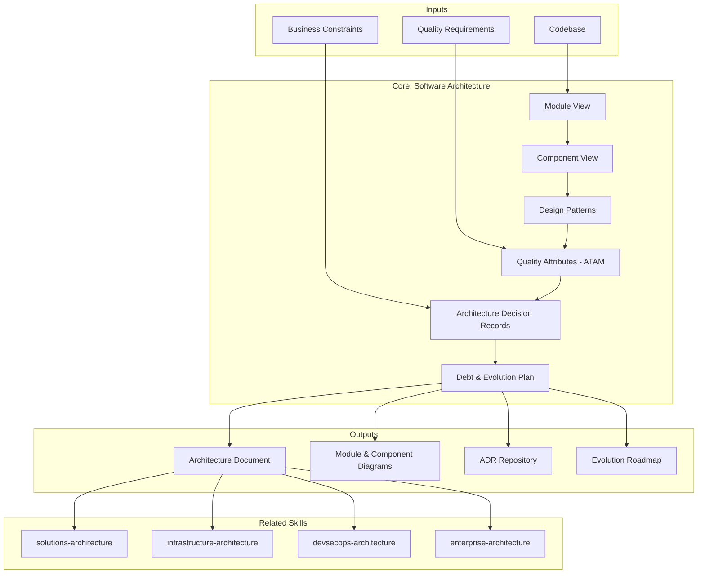

> **Alcance:** Este skill es específico para `{TIPO_SERVICIO}=SDA` (Software Development & Architecture). Para arquitectura en otros tipos de servicio, consulte `enterprise-architecture` (visión empresarial), `solutions-architecture` (integración E2E), `infrastructure-architecture` (infraestructura), o el skill de discovery específico del tipo de servicio.

# Software Architecture: Internal System Structure & Design Decisions

Software architecture defines how code is organized internally — module boundaries, layer separation, dependency direction, design patterns, and the reasoning behind technical decisions. This skill produces comprehensive architecture documentation that enables teams to understand structure, maintain it consistently, and evolve it strategically.

## Principio Rector

**La arquitectura es la decisión que más cuesta cambiar después.** Por eso se documenta ANTES de implementar, se valida contra quality attributes medibles, y cada decisión vive en un ADR con alternatives y trade-offs. Arquitectura implícita es deuda garantizada.

### Filosofía de Arquitectura de Software

1. **Decisiones explícitas > convenciones implícitas.** Si no hay un ADR, no hay una decisión — hay una casualidad que se confundirá con intención.
2. **Quality attributes mandan.** Los patterns sirven a los atributos de calidad (performance, modifiability, availability), no al revés. CQRS sin necesidad de performance es complejidad gratuita.
3. **Deuda técnica es una decisión, no un accidente.** Se documenta, se prioriza, se paga. Ignorarla no la elimina — la capitaliza.

## Inputs

The user provides a system or project name as `$ARGUMENTS`. Parse `$1` as the **system/project name** used throughout all output artifacts.

**Parameters:**
- `{MODO}`: `piloto-auto` (default) | `desatendido` | `supervisado` | `paso-a-paso`
  - **piloto-auto**: Auto para análisis de estructura y patterns, HITL para ADRs y decisiones de refactoring.
  - **desatendido**: Cero interrupciones. Arquitectura documentada automáticamente. Supuestos documentados.
  - **supervisado**: Autónomo con checkpoint en pattern selection y ADRs.
  - **paso-a-paso**: Confirma cada module view, pattern, ADR, y plan de evolución.
- `{FORMATO}`: `markdown` (default) | `html` | `dual`
- `{VARIANTE}`: `ejecutiva` (~40% — S1 module view + S3 patterns + S5 ADRs) | `técnica` (full 6 sections, default)

Before generating architecture, detect the codebase context:

```
!find . -name "*.ts" -o -name "*.java" -o -name "*.py" -o -name "*.go" -o -name "*.cs" | head -30
```

Use detected languages and frameworks to tailor pattern recommendations, module conventions, and component naming.

If reference materials exist, load them:

```
Read ${CLAUDE_SKILL_DIR}/references/patterns.md
Read ${CLAUDE_SKILL_DIR}/references/quality-attributes.md
```

---

## When to Use

- Designing modular structure for new systems or major refactors
- Evaluating existing architecture against quality attributes
- Selecting design patterns (CQRS, Event Sourcing, Hexagonal, Clean Architecture, Layered, Microkernel)
- Documenting architectural decisions with ADRs
- Identifying anti-patterns and debt before they compound
- Communicating architecture to development teams and stakeholders
- Planning evolution strategy aligned with business and technical constraints

## When NOT to Use

- End-to-end solution design across multiple systems → **metodologia-solutions-architecture**
- Enterprise portfolio alignment and capability mapping → **metodologia-enterprise-architecture**
- Infrastructure, compute, storage, and platform design → **metodologia-infrastructure-architecture**
- CI/CD pipelines and supply chain security → **metodologia-devsecops-architecture**

---

## Delivery Structure: 6 Sections

### S1: Module View

Maps internal module structure — what modules exist, responsibilities, dependencies, layer architecture.

**Includes:**
- Module decomposition logic (domain-driven, layer-based, feature-based, or hybrid)
- Dependency graph showing coupling and direction
- Layer map with clear separation (presentation, business, persistence, infrastructure)
- Module-to-team ownership mapping where applicable
- Identified dependency violations and cycles

**Key decisions:**
- Granularity: too fine = overhead; too coarse = tight coupling
- Direction: all dependencies flow inward (Clean/Hexagonal) vs. layered flow
- Shared libraries: minimize exposure; use facade if needed
- Cross-module contracts: define clear interfaces, avoid implicit coupling

### S2: Component View

Decomposes selected modules into components — what they do, interfaces exposed, dependencies.

**Includes:**
- Component identification and naming (controller, service, repository, gateway)
- Responsibility assignment (single responsibility principle)
- Interface contracts (accept/return)
- Dependency list (internal and external)
- Interaction patterns (direct call, event, message)

**Key decisions:**
- Cohesion: related functionality grouped together
- Interface design: minimal, focused, versioned for stability
- Injection vs. lookup: dependency injection preferred for testability
- Composition over inheritance for flexibility

### S3: Design Patterns

Documents selected patterns with justification, detected anti-patterns, and alternatives.

**Architectural patterns** (Hexagonal, Clean, CQRS, Event Sourcing, Microkernel):
- Why chosen: quality attributes it enables, constraints it respects
- How applied: concrete examples from the system
- Implications: data consistency model, deployment topology, team structure alignment

**Design patterns** (Repository, Factory, Observer, Strategy, Adapter):
- Context where applied, problem solved, trade-offs vs. alternatives

**Anti-patterns detected** (God object, Leaky abstraction, Tight coupling):
- Location in codebase, consequences if unaddressed, refactoring approach

**Principle:** Patterns serve quality attributes, not vice versa. Over-application adds unnecessary complexity.

### S4: Quality Attribute Scenarios (ATAM)

ATAM-style scenarios: **Stimulus -> Response -> Measure**

| Quality Attribute | Example Scenario |
|---|---|
| **Performance** | User request completes within 200ms (p95) under 1000 concurrent users |
| **Modifiability** | Adding a new payment method requires changes to <=3 modules |
| **Availability** | Service remains available during single DB node failure with <30s failover |
| **Security** | Unauthorized user cannot access restricted data even with valid token from different role |
| **Testability** | Core business logic tested without external service stubs; full integration test <2min |
| **Deployability** | New version deployed to production in <15min with instant rollback |

### S5: Architecture Decision Records (ADRs)

Captures significant decisions with context, decision, consequences, and alternatives.

**ADR structure:**
- **Title:** Concise decision statement
- **Status:** Proposed / Accepted / Deprecated / Superseded
- **Context:** Business and technical constraints, driving requirements
- **Decision:** What was chosen and why
- **Consequences:** Positive (enables), negative (constrains), neutral (side effects)
- **Alternatives considered:** What else was evaluated and why rejected
- **Related decisions:** Links to other ADRs

**Scope:** Decisions affecting multiple components, requiring significant refactoring if changed, or trading off quality attributes.

**Not ADRs:** Code style, tool selection (unless architectural impact), local implementation choices.

### S6: Debt & Evolution Plan

Identifies current architectural debt and a strategy for evolution without disruption.

**Debt inventory per item:**
- Symptom (what fails or creates friction)
- Root cause (why it exists)
- Impact (which quality attributes, team velocity)
- Repayment cost (effort to fix)
- Risk if unfixed (compounding, blocking future work)

**Evolution strategy:**
- Phased approach: debt reduction doesn't block feature delivery
- Parallel running: old and new pattern coexist briefly before cutover
- Testing coverage: increase before major refactors
- Team structure: align teams to module boundaries
- Monitoring: metrics before, during, after refactoring

---

## Trade-off Matrix

| Decision | Enables | Constrains | When to Use |
|---|---|---|---|
| **Layered Architecture** | Clear separation, team scaling, predictable testing | Tight coupling to layers, harder to change across layers | Traditional, simple domains; monoliths |
| **Hexagonal Architecture** | Test isolation, business logic independence | More classes/interfaces, complexity for small systems | Systems with multiple external integrations |
| **CQRS** | Optimized read/write paths, temporal queries | Eventual consistency complexity, more code | High-scale, complex reporting requirements |
| **Event Sourcing** | Complete audit trail, event replay, temporal queries | No in-place updates, distributed transaction complexity | Financial systems, compliance-heavy, audit-critical |
| **Microservices Patterns** | Independent deploy, tech diversity, scale per service | Distributed complexity, data consistency, ops overhead | High-scale, multi-team, heterogeneous requirements |
| **Shared Kernel** | Code reuse, consistency | Coupling between domains | Temporary; retire when domains clarify |
| **Facade Pattern** | Simplified client interface, internal refactoring freedom | Indirection adds latency and complexity | Legacy systems, integration points |

---

## Assumptions

- System exists (greenfield with architecture-first, or brownfield analysis of existing code)
- Team has access to codebase and can inspect actual structure
- Architectural decisions are made with input from technical leadership
- Quality attributes and constraints have been discussed (from prior discovery)
- Time is available for documentation (not reverse-engineered)

## Limits

- Focuses on *logical architecture*, not physical deployment (see **metodologia-infrastructure-architecture**)
- Does not design *external integration* points (see **metodologia-solutions-architecture**)
- Does not address *team structure* or *governance* (see **metodologia-enterprise-architecture**)
- Pattern selection requires understanding the problem domain; overly generic patterns add waste

---

## Casos Borde

| Caso | Estrategia de Manejo |
|---|---|
| Sistema greenfield sin estructura previa | Iniciar con arquitectura simple; diferir complejidad; usar ADRs para decisiones reversibles; evitar sobre-ingenieria para escala hipotetica |
| Sistema legacy con dependencias enredadas | Documentar estado actual (as-is) y estado objetivo (to-be); planificar migracion por fases; aceptar coexistencia temporal de multiples versiones de arquitectura |
| Sistema multi-lenguaje (polyglot) | Separar analisis por lenguaje si los patrones divergen; explicitar dependencias cross-lenguaje (APIs, colas); unificar convenciones donde sea posible |
| Transicion de monolito a microservicios | Usar strangler fig con criterios claros de cutover; vigilar anti-patrones (monolito distribuido, servicios chatty); documentar estrategia de datos |
| Sistema de alta escala o tiempo real | Abordar escala y latencia desde el diseno inicial; CQRS, event sourcing, sharding y caching como decisiones obligatorias; escenarios de quality attributes con evidencia de load testing |

## Decisiones y Trade-offs

| Decision | Alternativa Descartada | Justificacion |
|---|---|---|
| Documentar ADRs ANTES de implementar | Documentar post-implementacion | El costo de cambiar una decision arquitectonica crece exponencialmente despues del codigo; documentar antes fuerza la deliberacion explicita |
| Quality attributes como drivers de seleccion de patterns | Seleccionar patterns por popularidad o conveniencia | Un pattern sin quality attribute que lo justifique es complejidad gratuita; los atributos medibles evitan decisiones por moda |
| Deuda tecnica como decision explicita y registrada | Ignorar deuda o tratarla como accidente | Registrar la deuda con impacto y costo de repago permite priorizarla racionalmente; la deuda ignorada se capitaliza |
| Dependency direction inward (Clean/Hexagonal) | Dependency direction layered bidireccional | La direccion inward protege el dominio de negocio de cambios en infraestructura; la bidireccional acopla capas innecesariamente |

## Knowledge Graph



## Output Templates

| Formato | Nombre | Contenido |
|---|---|---|
| **Markdown** | `A-01_Software_Architecture_Deep.md` | Documento completo con Module View, Component View, Design Patterns, Quality Attribute Scenarios (ATAM), ADRs, Debt & Evolution Plan. Diagramas Mermaid embebidos. |
| **HTML** | `A-01_Software_Architecture_Deep.html` | Mismo contenido en HTML branded (Design System MetodologIA). Incluye navegacion interna, tooltips en diagramas, y tabla de contenidos interactiva. |
| **DOCX** | `{fase}_software_architecture_{cliente}_{WIP}.docx` | Generado con python-docx y MetodologIA Design System v5. Portada con nombre del sistema y fecha, TOC automático, encabezados Poppins navy, cuerpo Montserrat, acentos dorados, tablas zebra. Secciones: Module View, Component View, Design Patterns, Quality Attribute Scenarios, ADRs, Debt & Evolution Plan. |
| **XLSX** | `{fase}_software_architecture_{cliente}_{WIP}.xlsx` | Generado via openpyxl con MetodologIA Design System v5. Encabezados con fondo navy y texto Poppins blanco, cuerpo en Montserrat, zebra striping en filas. Hojas: Module View (módulo, responsabilidad, dependencias, layer, owner, violaciones detectadas), Design Patterns (pattern, justificación, quality attribute habilitado, anti-patterns detectados), ADR Log (ID, título, status, decisión, consecuencias positivas, consecuencias negativas, alternativas descartadas), Debt Inventory (ítem, síntoma, causa raíz, quality attribute impactado, esfuerzo de repago, riesgo si no se aborda), Quality Attributes (atributo, escenario estímulo, respuesta esperada, métrica, estado actual). Conditional formatting por estado de ADR y nivel de riesgo de deuda. Auto-filters en todas las hojas. Valores directos sin fórmulas. |
| **PPTX** | `{fase}_software_architecture_{cliente}_{WIP}.pptx` | Generado con python-pptx y MetodologIA Design System v5. Slide master con gradiente navy, títulos Poppins, cuerpo Montserrat, acentos dorados. Máximo 30 slides (técnica). Speaker notes con referencias de evidencia. Slides: Portada, Principio Rector, Module View (diagrama), Component View, Design Patterns seleccionados, Quality Attribute Scenarios (ATAM), ADR highlights, Debt & Evolution Plan, próximos pasos. |

## Evaluacion

| Dimension | Peso | Criterio |
|---|---|---|
| Trigger Accuracy | 10% | Descripcion activa triggers correctos (design structure, module boundaries, ADRs, patterns) sin falsos positivos con infrastructure o solutions architecture |
| Completeness | 25% | Las 6 secciones cubren modulos, componentes, patterns, quality attributes, ADRs y deuda sin huecos; todos los Core domains del sistema representados |
| Clarity | 20% | Instrucciones ejecutables sin ambiguedad; cada ADR explica por que, no solo que; cada pattern tiene justificacion contra quality attributes |
| Robustness | 20% | Maneja sistemas greenfield, legacy, polyglot, monolito-a-microservicios y alta escala con estrategias diferenciadas |
| Efficiency | 10% | Proceso no tiene pasos redundantes; variante ejecutiva reduce a 40% sin perder decisiones criticas |
| Value Density | 15% | Cada seccion aporta valor practico directo; trade-off matrix y quality attribute scenarios son herramientas de decision inmediata |

**Umbral minimo: 7/10.**

---

## Validation Gate

Before finalizing delivery, verify:

- [ ] Architecture decisions are explicit, not implicit
- [ ] Modules have clear responsibilities; no duplication
- [ ] Dependency direction enforces layer separation
- [ ] Quality attributes are measurable (latency, availability, modifiability)
- [ ] Anti-patterns identified with remediation plan
- [ ] ADRs explain *why*, not just *what*
- [ ] Evolution strategy is phased, not a rewrite
- [ ] Debt is quantified and prioritized
- [ ] Codebase structure matches architecture (or evolution plan is clear)
- [ ] Team can navigate architecture and explain it to newcomers

---

## Cross-References

- **metodologia-solutions-architecture:** Integrates this internal architecture into end-to-end solution design
- **metodologia-infrastructure-architecture:** Receives computational and storage needs; designs the platform
- **metodologia-devsecops-architecture:** Uses architecture decisions to design pipeline controls
- **metodologia-enterprise-architecture:** Maps architecture to enterprise capability model and technology radar

## Output Format Protocol

| Format | Default | Description |
|--------|---------|-------------|
| `markdown` | ✅ | Rich Markdown + Mermaid diagrams. Token-efficient. |
| `html` | On demand | Branded HTML (Design System). Visual impact. |
| `dual` | On demand | Both formats. |

Default output is Markdown with embedded Mermaid diagrams. HTML generation requires explicit `{FORMATO}=html` parameter.

## Output Artifact

**Primary:** `A-01_Software_Architecture_Deep.html` — Executive summary, module view, component cards, design patterns, quality attribute scenarios, ADRs, debt inventory and evolution roadmap.

**Secondary:** ADR repository (.md files, version-controlled), module structure diagram (PNG/SVG), quality attribute scenario checklist.

---
**Autor:** Javier Montaño | **Última actualización:** 12 de marzo de 2026
