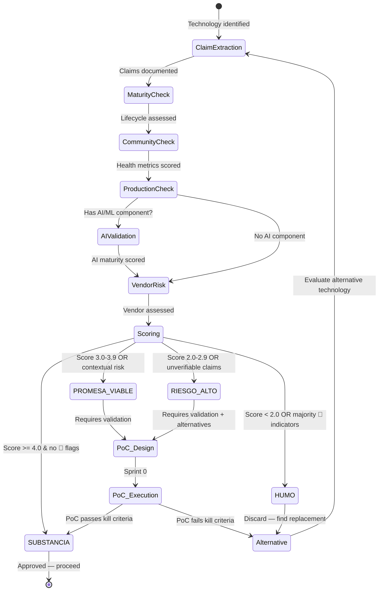

# A-04 Software Viability — Acme Corp Banking Modernization

**Proyecto:** Modernización de Core Bancario — Acme Corp
**Fecha:** 12 de marzo de 2026
**Variante:** Técnica (full)
**Modo:** piloto-auto

---

## S1: Technology Inventory & Claim Extraction

| Tecnología | Claim | Fuente del Claim | Evidencia Requerida |
|---|---|---|---|
| Spring Boot 3.x | "Industry standard for enterprise Java microservices" | Architecture decision record | Production adoption data, community metrics |
| Apache Kafka | "Handles millions of events/sec with exactly-once semantics" | Scenario B architecture | Benchmark data, production case studies in banking |
| Kubernetes (EKS) | "Auto-scaling, self-healing, cloud-native orchestration" | Infrastructure proposal | Team competency evidence, operational maturity |
| Vendor X AI Fraud Detection | "99.7% fraud detection accuracy, <50ms latency" | Vendor deck, Phase 3 | Independent benchmarks, production accuracy on comparable data |
| React 18 | "Concurrent rendering for responsive banking UIs" | Frontend architecture decision | Adoption data, ecosystem stability |

---

## S2: Software Maturity Assessment

### Spring Boot 3.x

**2a. Lifecycle Stage**

| Indicador | Hallazgo | Veredicto |
|---|---|---|
| Version | 3.3.x GA (stable, production-ready) | 🟢 |
| Release cadence | Monthly patch releases, 6-month minor releases | 🟢 |
| Breaking changes | Migration guide from 2.x well-documented, API stable since 3.0 | 🟢 |
| Deprecation policy | 12-month deprecation window, clear migration paths | 🟢 |
| LTS availability | Commercial LTS via VMware Tanzu; OSS support 12 months per minor | 🟢 |

**2b. Community Health:** 75K+ GitHub stars, 900+ contributors (12mo), 18% open issue ratio, daily commits, bus factor >20. Corporate backing: VMware/Broadcom (major sponsor).

**2c. Production Evidence:** Netflix, JP Morgan, Capital One documented users. 45K+ Stack Overflow questions/month. 180K+ Maven Central dependents.

**Veredicto: 🟢 SUBSTANCIA**

### Apache Kafka

**2a. Lifecycle Stage**

| Indicador | Hallazgo | Veredicto |
|---|---|---|
| Version | 3.7.x GA, KRaft mode production-ready | 🟢 |
| Release cadence | Quarterly releases, predictable | 🟢 |
| Breaking changes | ZooKeeper deprecation managed with multi-year migration path | 🟢 |
| Deprecation policy | Apache Foundation governance, formal deprecation process | 🟢 |
| LTS availability | Confluent LTS; community releases supported 12 months | 🟢 |

**2b. Community Health:** 28K+ GitHub stars, 1,200+ contributors, 22% open issue ratio, weekly commits. Corporate backing: Confluent (primary), LinkedIn (origin).

**2c. Production Evidence:** Goldman Sachs, ING, PayPal in production for financial event streaming. Proven at >1M events/sec in documented benchmarks (LinkedIn, Confluent).

**Veredicto: 🟢 SUBSTANCIA**

### Kubernetes (EKS)

**2a. Lifecycle Stage**

| Indicador | Hallazgo | Veredicto |
|---|---|---|
| Version | 1.29+ GA on EKS, CNCF graduated project | 🟢 |
| Release cadence | 3 releases/year, 14-month support window | 🟢 |
| Breaking changes | API deprecation policy: 12 months minimum | 🟢 |
| Deprecation policy | Formal KEP process, alpha/beta/GA lifecycle | 🟢 |
| LTS availability | EKS extended support (additional 12 months per version) | 🟢 |

**2b. Community Health:** 110K+ GitHub stars, 3,700+ contributors, top 5 CNCF project. Corporate backing: Google, AWS, Microsoft, Red Hat.

**2c. Production Evidence:** Ubiquitous in banking — BBVA, Goldman Sachs, Capital One documented. EKS specifically: mature, AWS-managed.

**Contexto crítico del equipo:** El equipo de Acme Corp tiene **cero experiencia operativa con Kubernetes**. Actualmente operan VMs con despliegues manuales. La curva de aprendizaje para networking, RBAC, observability, y troubleshooting en K8s es 6-12 meses para un equipo sin experiencia previa.

**Veredicto: 🟡 PROMESA VIABLE** — La tecnología es 🟢 SUBSTANCIA, pero la viabilidad se degrada a 🟡 por falta de competencia del equipo. Sin inversión en capacitación o contratación de SRE con experiencia K8s, el riesgo operativo es alto.

### Vendor X AI Fraud Detection

**2a. Lifecycle Stage**

| Indicador | Hallazgo | Veredicto |
|---|---|---|
| Version | "v2.3" — no public changelog, no migration guides | 🟠 |
| Release cadence | Unknown — no public release history | 🔴 |
| Breaking changes | Unknown — no public API versioning policy | 🔴 |
| Deprecation policy | Not documented | 🔴 |
| LTS availability | "Enterprise support included" — no SLA details public | 🟠 |

**2b. Community Health:** No open-source component. No public GitHub. No Stack Overflow presence. 3 customer testimonials on website (unverifiable).

**2c. Production Evidence:** Claims "trusted by 50+ financial institutions" — no named references. No public case studies. No postmortems. No independent benchmarks.

**Veredicto: 🟠 RIESGO ALTO** — Evidencia insuficiente para verificar claims. Ver S3 para análisis AI específico.

### React 18

**2a. Lifecycle Stage**

| Indicador | Hallazgo | Veredicto |
|---|---|---|
| Version | 18.3.x stable, React 19 in RC | 🟢 |
| Release cadence | Major every 2-3 years, patches monthly | 🟢 |
| Breaking changes | Concurrent features opt-in, backward compatible | 🟢 |
| Deprecation policy | Formal RFC process, codemods for migrations | 🟢 |
| LTS availability | Meta-backed, de facto LTS through ecosystem inertia | 🟢 |

**2b. Community Health:** 230K+ GitHub stars, 1,600+ contributors, 12% open issue ratio. Corporate backing: Meta (primary maintainer).

**2c. Production Evidence:** Facebook, Instagram, Netflix, Airbnb. Dominant frontend framework by market share. 22M+ weekly npm downloads.

**Veredicto: 🟢 SUBSTANCIA**

---

## S3: AI/ML Specific Validation — Vendor X AI Fraud Detection

**SECCIÓN CRÍTICA**

### 3a. Claims vs Reality Matrix

| Claim | Benchmark Citado | Benchmark Real | Gap | Veredicto |
|---|---|---|---|---|
| "99.7% fraud detection accuracy" | Vendor demo on curated dataset | Academic papers on comparable transaction fraud: 92-96% F1-score on production data | 3.7-7.7% gap | 🟠 RIESGO |
| "<50ms inference latency" | Marketing materials | No p95/p99 breakdown, no load profile documented | Unverifiable | 🟠 RIESGO |
| "Reduces false positives by 80%" | Customer testimonial (unnamed) | Industry baseline false positive rates: 5-15%; 80% reduction unsubstantiated | Unverifiable | 🔴 HUMO |
| "Real-time model updates" | Sales deck | No documentation on retraining pipeline, drift detection, or data requirements | Unverifiable | 🟠 RIESGO |

### 3b. AI Maturity Indicators

| Indicador | Hallazgo | Veredicto |
|---|---|---|
| Training data | "Proprietary dataset of 10B+ transactions" — no documentation on composition, representativeness, or bias analysis | 🔴 HUMO |
| Evaluation metrics | Single accuracy number (99.7%). No precision/recall breakdown, no F1, no confusion matrix | 🔴 HUMO |
| Failure modes | Not documented. No graceful degradation strategy. No fallback for model outage | 🔴 HUMO |
| Drift monitoring | "Continuous learning" mentioned — no technical documentation | 🟠 RIESGO |
| Human-in-the-loop | Not mentioned. Claims fully autonomous detection | 🔴 HUMO |
| Explainability | "AI-powered insights" — no mention of interpretability, SHAP, LIME, or feature importance | 🟠 RIESGO |
| Cost per inference | "Contact sales" | 🟠 RIESGO |
| Data privacy | "SOC 2 compliant" — no details on data residency, retention, or cross-border transfer | 🟠 RIESGO |

### 3c. Red Flags Detected

- No eval framework for domain-specific accuracy on Acme Corp's transaction patterns --> 🟠
- "99.7% accuracy" without error analysis or confusion matrix --> 🔴
- No fallback for model failure/outage --> 🔴
- Vendor lock-in: proprietary model, no portability, no export --> 🟠
- No documentation on regulatory compliance for AI-driven financial decisions --> 🔴

**Veredicto AI: 🟠 RIESGO ALTO** — Ratio humo/substancia desfavorable. 5 de 8 indicadores de madurez AI son 🔴 HUMO. Claims no verificables sin acceso a benchmarks independientes.

---

## S4: Vendor & Dependency Risk

### Vendor X (AI Fraud Detection)

| Factor | Hallazgo | Riesgo |
|---|---|---|
| Funding / Revenue | Series B ($45M raised, 2024). No public revenue data. Runway estimated 18-24 months | 🟠 Medio-Alto |
| Customer retention | No NRR data public. 3 testimonials, no named references | 🟠 Desconocido |
| Competitive position | Crowded market: Featurespace, Feedzai, NICE Actimize (established). Vendor X is challenger | 🟠 Débil |
| Acquisition risk | Likely acquisition target. Product continuity post-acquisition uncertain | 🟠 Alto |
| Pricing model stability | "Custom enterprise pricing" — no public pricing history. Lock-in via proprietary model | 🔴 Alto |

### Dependency Chain (All Technologies)

| Tecnología | Direct Deps | Lock-in Risk | Switch Cost |
|---|---|---|---|
| Spring Boot 3.x | Maven Central ecosystem, well-documented | Bajo — portable across cloud providers | Bajo |
| Apache Kafka | Confluent optional, self-hosted viable | Bajo-Medio — Kafka protocol is standard | Medio (migration to Pulsar/RabbitMQ feasible) |
| Kubernetes (EKS) | AWS-managed, CNCF standard | Medio — EKS-specific features (ALB, IAM) create coupling | Medio (portable to GKE/AKS with effort) |
| Vendor X AI | Fully proprietary, no data export, no model portability | 🔴 Crítico — complete vendor lock-in | Alto (rebuild from scratch) |
| React 18 | npm ecosystem, Meta-maintained | Bajo — standard web technologies | Bajo |

---

## S5: Proof-of-Concept Design

| Tecnología | PoC Objective | Success Criteria | Effort | Timeline | Kill Criteria |
|---|---|---|---|---|---|
| Kubernetes (EKS) | Deploy sample Spring Boot service with CI/CD, HPA, observability | Team deploys, scales, and troubleshoots independently in 2 weeks | 2 engineers, 3 weeks | Sprint 0 | Team cannot deploy without external help after 3 weeks |
| Vendor X AI Fraud Detection | Run accuracy test on 1,000 labeled Acme Corp transactions | F1-score >92% on Acme Corp data, p99 latency <200ms | 1 sprint + vendor support | Sprint 0-1 | F1 <88% OR vendor refuses data access OR no explainability API |

### PoC Design Details

**Kubernetes (EKS) PoC:**
- Deploy 1 Spring Boot microservice + PostgreSQL + Kafka consumer
- Configure HPA (CPU-based auto-scaling)
- Set up Prometheus + Grafana monitoring
- Simulate failure scenario: pod crash, node drain
- Measure: team's ability to diagnose and recover without external help
- Real data: use Acme Corp's staging transaction volume (50K tx/day)

**Vendor X AI PoC:**
- Provide 1,000 labeled transactions (500 fraud, 500 legitimate) from Acme Corp's historical data
- Measure: precision, recall, F1-score, false positive rate
- Measure: p50, p95, p99 inference latency under load (100 concurrent requests)
- Request: explainability output for each fraud decision
- Request: data residency documentation and SOC 2 Type II report
- Kill: if vendor refuses to run on Acme Corp data or cannot provide explainability

---

## S6: Technology Viability Scorecard

```
SOFTWARE VIABILITY SCORECARD
════════════════════════════
Proyecto: Acme Corp Banking Modernization — Scenario B Tech Stack

| Tecnología                  | Maturity | Community | Production | AI Score | Vendor | VEREDICTO          |
|-----------------------------|----------|-----------|------------|----------|--------|--------------------|
| Spring Boot 3.x             | 5/5      | 5/5       | 5/5        | n/a      | 5/5    | 🟢 SUBSTANCIA       |
| Apache Kafka                | 5/5      | 5/5       | 5/5        | n/a      | 4/5    | 🟢 SUBSTANCIA       |
| Kubernetes (EKS)            | 5/5      | 5/5       | 5/5        | n/a      | 4/5    | 🟡 PROMESA VIABLE   |
| Vendor X AI Fraud Detection | 2/5      | 1/5       | 1/5        | 1/5      | 2/5    | 🟠 RIESGO ALTO      |
| React 18                    | 5/5      | 5/5       | 5/5        | n/a      | 5/5    | 🟢 SUBSTANCIA       |

VEREDICTO GLOBAL: VIABLE CON PoCs

ALTERNATIVAS IDENTIFICADAS:
- Vendor X AI Fraud Detection → alternativa: Featurespace ARIC (🟢 community, 🟢 production evidence en banca)
- Vendor X AI Fraud Detection → alternativa: Open-source fraud pipeline (Scikit-learn + feature store + MLflow) — mayor esfuerzo, control total
- Kubernetes (EKS) → mitigación: contratar 1 SRE senior con experiencia K8s + programa de capacitación 3 meses

SPIKES OBLIGATORIOS: 2 (Kubernetes team competency, Vendor X accuracy validation)
TECNOLOGÍAS DESCARTADAS: 0 (pendiente resultados de PoCs)
```

### Viability Verdict Process



---

## S7: Recommendation & Guardrails

### Stack Recomendado

| Componente | Recomendación | Justificación |
|---|---|---|
| Backend | Spring Boot 3.x | 🟢 SUBSTANCIA. Estándar de facto para microservicios enterprise Java. Sin riesgos identificados. |
| Messaging | Apache Kafka | 🟢 SUBSTANCIA. Probado en banca a escala. KRaft mode elimina dependencia de ZooKeeper. |
| Orchestration | Kubernetes (EKS) **con mitigación** | 🟡 PROMESA VIABLE. Tecnología sólida, pero requiere inversión en competencia del equipo antes de producción. |
| Fraud Detection | **Pendiente PoC** — Vendor X o alternativa | 🟠 RIESGO ALTO. No aprobar sin validación independiente. Preparar alternativa open-source en paralelo. |
| Frontend | React 18 | 🟢 SUBSTANCIA. Ecosistema maduro, equipo tiene experiencia previa. |

### Guardrails de Producción

- **Kafka:** Monitorear consumer lag, replication factor, ISR shrink events. Alertar si lag >5 min.
- **Kubernetes:** Monitorear pod restart rate, node pressure events, HPA scaling frequency. Alertar si restart rate >3/hora.
- **AI Fraud (si se aprueba):** Monitorear accuracy drift semanalmente. Alertar si F1 cae >2 puntos. Revisión humana obligatoria para transacciones >$10K flaggeadas.

### Vendor Exit Strategy

- **Vendor X AI:** Si PoC falla o vendor se degrada: pipeline open-source con Scikit-learn + feature engineering custom + MLflow para model management. Estimado: 3-4 sprints de desarrollo. Mantener interfaz abstracta desde día 1 para facilitar switch.
- **EKS:** Si costos o complejidad exceden presupuesto: ECS Fargate como fallback (menor complejidad operativa, menor flexibilidad).

### AI Governance (si Vendor X se aprueba)

- Modelo de decisión de fraude requiere explicabilidad para cumplimiento regulatorio (Superintendencia Financiera)
- Auditoría trimestral de falsos positivos/negativos con equipo de compliance
- Data residency: transacciones deben permanecer en región (verificar con vendor)
- Reentrenamiento: documentar cada ciclo con dataset versioning

### Re-evaluation Triggers

- Vendor X recibe nueva ronda de funding o es adquirido → re-evaluar vendor risk
- Equipo K8s completa programa de capacitación → re-evaluar de 🟡 a 🟢
- Nueva regulación de AI en sector financiero → re-evaluar governance framework
- Cualquier tecnología cambia major version → re-evaluar maturity

---
**Autor:** Javier Montaño | **Última actualización:** 12 de marzo de 2026
