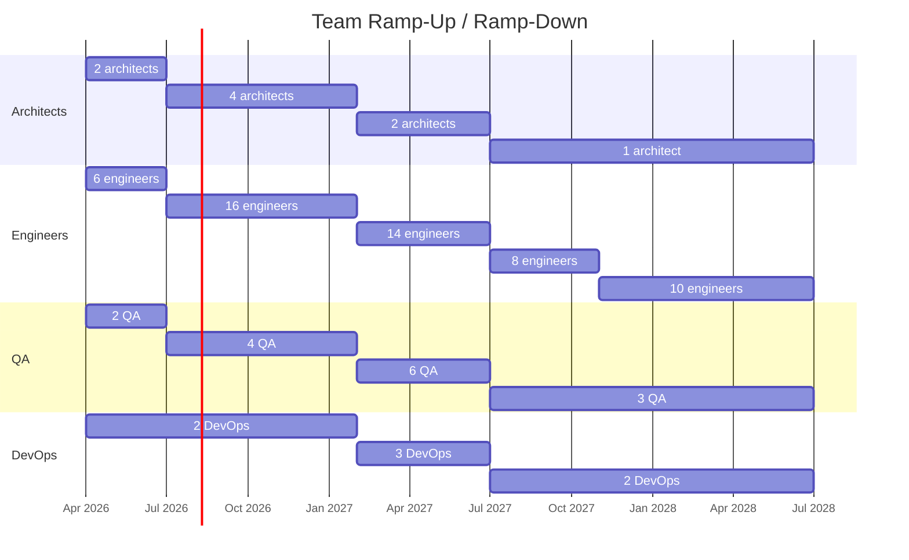
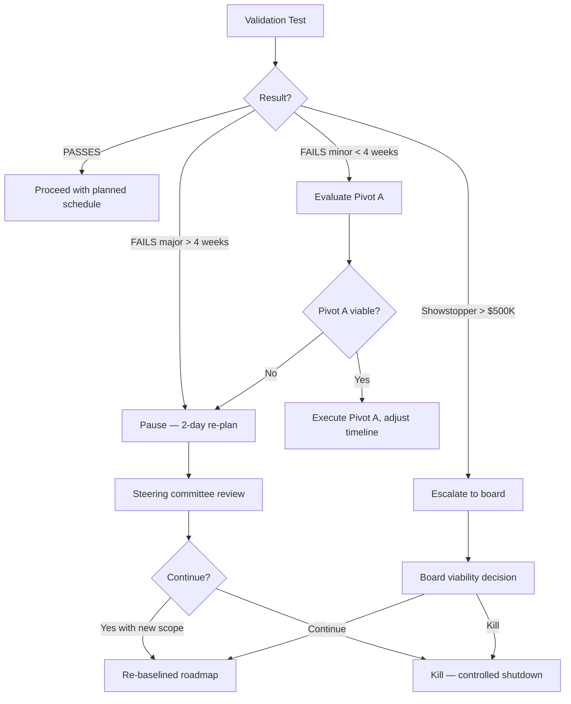
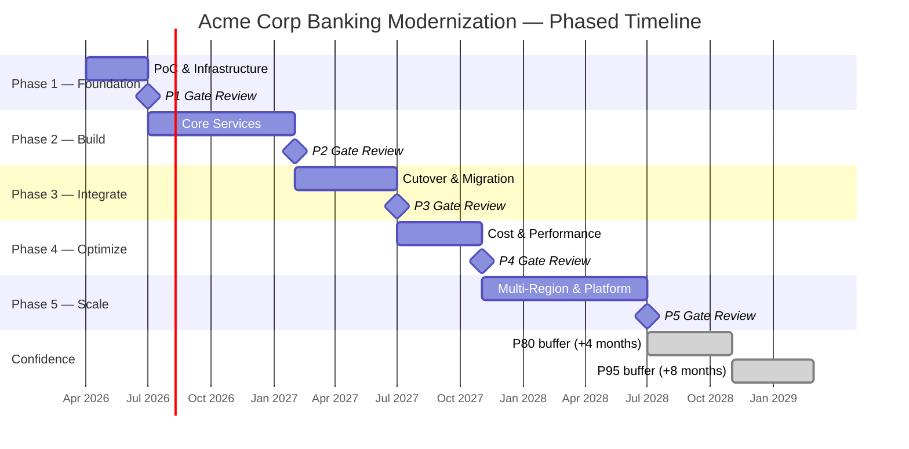

# Solution Roadmap — Acme Corp Banking Modernization

**Project:** Core Banking Platform Modernization
**Duration:** 24 months (P50) | 28 months (P80) | 32 months (P95)
**Budget Range:** $5M–$10M
**Date:** March 2026

---

## Section 1: Transformation Vision

### Business Objective Alignment

Modernize Acme Corp's monolithic core banking system to a microservices architecture, enabling real-time transaction processing, API-first partner integrations, and regulatory compliance automation.

### Success Metrics

| Metric | Baseline | 18-Month Target | 36-Month Target | Owner |
|--------|----------|----------------|----------------|-------|
| Transaction latency | 2.4s avg | <200ms P99 | <100ms P99 | CTO |
| Deployment frequency | Monthly | Weekly | Daily | VP Engineering |
| Partner onboarding | 6-8 weeks | 2 weeks | 3 days (self-service) | CPO |
| Regulatory report generation | 5 days manual | 4 hours automated | Real-time | CFO |
| System availability | 99.5% | 99.95% | 99.99% | VP Infrastructure |

**North Star Metric:** Time-to-partner-integration (from 6 weeks to 3 days).

### Strategic Capabilities Unlocked Per Phase

1. **Foundation:** Real-time event streaming, API gateway, DevOps pipeline
2. **Build:** Core transaction engine, account management microservices
3. **Integrate:** Legacy cutover, partner API marketplace
4. **Optimize:** Cost reduction through auto-scaling, ML-driven fraud detection
5. **Scale:** Multi-region deployment, white-label platform capability

---

## Section 2: Transformation Phases

| Phase | Name | Duration | Peak Team | Budget % | Key Gate |
|-------|------|----------|-----------|----------|---------|
| 1 | Foundation | 3 months | 12 | 22% | PoC validates <200ms latency on event mesh |
| 2 | Build | 7 months | 28 | 48% | Core transaction service in production (shadow mode) |
| 3 | Integrate | 5 months | 30 | 28% | Full cutover complete, legacy decommissioned |
| 4 | Optimize | 4 months | 16 | 12% | 30% infrastructure cost reduction achieved |
| 5 | Scale | 8 months | 22 | Varies | Multi-region live, 2 partner integrations via marketplace |

### Phase 1: Foundation (Months 1-3)

**Team:** 2 architects, 4 backend engineers, 2 DevOps, 2 QA, 1 PM, 1 tech lead
**Deliverables:**
- Event mesh PoC (Kafka/Pulsar evaluation)
- API gateway with auth, rate limiting, observability
- CI/CD pipeline with <15 min build-to-deploy
- Infrastructure-as-code (Terraform/Pulumi)
- Data migration strategy validated on 3 representative tables

**GO/NO-GO Gate:**
- Event mesh handles 10K TPS with <200ms P99 latency
- CI/CD pipeline operational with zero-downtime deployment proven
- Data migration PoC: <5% data quality variance on sample migration
- **NO-GO triggers:** Latency >500ms at load, data quality variance >10%

### Phase 2: Build (Months 4-10)

**Team:** 4 architects, 12 backend, 4 frontend, 4 QA, 2 DevOps, 1 PM, 1 tech lead
**Deliverables:**
- Account management service (CRUD, KYC, AML)
- Transaction engine (real-time processing, reconciliation)
- Notification service (multi-channel)
- Partner API SDK v1
- Shadow-mode production deployment

**GO/NO-GO Gate:**
- Transaction engine processes 50K TPS in shadow mode with zero data discrepancy vs legacy
- 3 core APIs documented and partner-testable
- **NO-GO triggers:** Data discrepancy >0.01%, latency regression >2x target

### Phase 3: Integrate (Months 11-15)

**Team:** 2 architects, 10 backend, 4 frontend, 6 QA, 3 DevOps, 2 PM, 1 tech lead, 2 change mgmt
**Deliverables:**
- Phased legacy cutover (by product line)
- Data migration execution (full production)
- Legacy decommission plan and execution
- Partner migration to new APIs
- Regulatory compliance validation

**GO/NO-GO Gate:**
- Zero critical incidents in 2-week production burn-in per product line
- All regulatory reports generated from new system matching legacy output
- **NO-GO triggers:** >2 P1 incidents in burn-in, regulatory report variance >0.1%

---

## Section 3: Investment Horizon

### 3-Year TCO Projection

| Category | Year 1 | Year 2 | Year 3 | Total |
|----------|--------|--------|--------|-------|
| Labor (internal) | $2.1M | $1.8M | $0.9M | $4.8M |
| Labor (external) | $0.9M | $0.6M | $0.2M | $1.7M |
| Infrastructure | $0.4M | $0.6M | $0.5M | $1.5M |
| Licensing | $0.2M | $0.3M | $0.3M | $0.8M |
| Training | $0.15M | $0.1M | $0.05M | $0.3M |
| Contingency (15%) | $0.56M | $0.51M | $0.29M | $1.36M |
| **Total** | **$4.31M** | **$3.91M** | **$2.24M** | **$10.46M** |

### Phased Funding Release

| Gate | Cumulative Commitment | Kill Point |
|------|----------------------|------------|
| Phase 1 start | 22% (~$2.3M) | PoC fails latency/data quality targets |
| Phase 2 start | 70% (~$7.3M) | Shadow mode discrepancy >0.01% |
| Phase 3 start | 98% (~$10.2M) | Regulatory compliance not achievable |

### ROI Modeling

| Scenario | Break-even | 3-Year ROI | NPV (8% discount) |
|----------|------------|------------|-------------------|
| Optimistic | Month 18 | 285% | $12.4M |
| Likely | Month 24 | 180% | $8.2M |
| Pessimistic | Month 30 | 95% | $3.1M |
| Severe | Month 36+ | 40% | $0.8M |

---

## Section 4: Team Roadmap

### Month-by-Month Headcount

### Skill Gap Analysis

| Skill | Current | Required (Peak) | Gap | Mitigation |
|-------|---------|----------------|-----|------------|
| Event-driven architecture | 2 | 6 | 4 | Hire 2, train 2 (Phase 1 bootcamp) |
| Kubernetes/cloud-native | 4 | 8 | 4 | Hire 2, upskill 2 |
| Domain-driven design | 1 | 4 | 3 | External coach + pair programming |
| Performance engineering | 0 | 2 | 2 | Hire specialist, knowledge transfer |

---

## Section 5: Estimation Pivot Points

### Pivot Point 1: Event Mesh Latency

- **Current estimate impact:** 40% of Phase 2 architecture depends on <200ms P99
- **Why it matters:** If event mesh cannot meet latency targets, transaction engine design must change fundamentally
- **PoC validation:** Load test at 10K TPS sustained for 72 hours
- **Pivot if invalidated:**
  - **Pivot A** (<$150K, <4 weeks): Switch from Kafka to Pulsar or NATS
  - **Pivot B** (>$150K): Hybrid approach — event mesh for non-critical, direct DB for transactions
- **Decision gate:** End of Phase 1, Week 10

### Pivot Point 2: Data Migration Quality

- **Current estimate impact:** Phase 3 timeline assumes <5% data quality variance
- **Why it matters:** If data quality is poor, Phase 3 extends 2-4 months for cleansing
- **PoC validation:** Migrate 3 representative tables (accounts, transactions, KYC), measure variance
- **Pivot if invalidated:**
  - **Pivot A** (<$100K, <3 weeks): Add data cleansing sprint in Phase 2
  - **Pivot B** (>$100K): Parallel-run approach (dual-write) instead of cutover
- **Decision gate:** End of Phase 1, Week 12

### Pivot Point 3: Legacy API Compatibility

- **Current estimate impact:** 25% of Phase 3 scope is partner migration
- **Why it matters:** If legacy APIs have undocumented behaviors, partner migration scope explodes
- **PoC validation:** Reverse-engineer top 5 partner integrations, document all edge cases
- **Pivot if invalidated:**
  - **Pivot A** (<$80K, <2 weeks): Anti-corruption layer with legacy API facade
  - **Pivot B** (>$200K): Maintain legacy API gateway indefinitely, migrate partners incrementally
- **Decision gate:** Phase 2, Month 6

### Pivot Decision Framework

---

## Section 6: Risk Management

### Risk Timeline

| Risk | Phase 1 | Phase 2 | Phase 3 | Phase 4 | Phase 5 |
|------|---------|---------|---------|---------|---------|
| Technology selection wrong | HIGH | Medium | Low | Low | Low |
| Data migration quality | Medium | Medium | HIGH | Low | Low |
| Team skill gaps | HIGH | Medium | Low | Low | Low |
| Legacy system instability | Low | Medium | HIGH | Medium | Low |
| Vendor lock-in | Low | Medium | Medium | HIGH | HIGH |
| Regulatory non-compliance | Low | Low | HIGH | Medium | Medium |

### Cascade Failure Chains

**Chain 1:** Event mesh latency fails -> transaction engine redesign -> Phase 2 extends 3 months -> Phase 3 delayed -> regulatory deadline missed -> $2M penalty risk.

**Chain 2:** Key architect leaves Phase 2 -> knowledge gap in DDD -> service boundaries wrong -> Phase 3 integration failures -> parallel-run required -> +$800K, +4 months.

**Chain 3:** Data migration quality <90% -> Phase 3 cutover impossible -> dual-write fallback -> operational complexity doubles -> Phase 4 optimization blocked -> ROI delayed 12 months.

### Kill Criteria

| Type | Condition | Action |
|------|-----------|--------|
| **Hard stop** | PoC fails all 3 pivot points | Terminate project. Sunk cost: ~$2.3M. |
| **Hard stop** | Regulatory compliance unachievable on new architecture | Terminate or pivot to compliance-only scope. |
| **Soft stop** | Budget overrun >30% at any gate | Steering committee re-scope or terminate. |
| **Soft stop** | Timeline overrun >40% at Phase 2 gate | Re-baseline or reduce Phase 3-5 scope. |

---

## Section 7: Governance Plan

### Steering Committee

- **Cadence:** Bi-weekly during Phase 1-2, monthly Phase 3-5
- **Members:** CTO (chair), CFO, VP Engineering, VP Product, External advisor
- **Authority:** GO/NO-GO at phase gates, budget reallocation up to 10%, scope changes

### Decision Authority (RACI)

| Decision | Responsible | Accountable | Consulted | Informed |
|----------|------------|-------------|-----------|----------|
| Phase gate GO/NO-GO | Tech Lead | CTO | Steering Committee | All teams |
| Budget reallocation <10% | PM | CTO | CFO | Steering Committee |
| Budget reallocation >10% | CTO | Board | CFO, CPO | All stakeholders |
| Technology pivot | Architect | CTO | Tech Lead, DevOps | PM, Steering Committee |
| Team changes | PM | VP Engineering | Tech Lead | HR |
| Kill decision | CTO | Board | Steering Committee | All stakeholders |

### Change Control

| Tier | Scope | Approver | Timeline |
|------|-------|----------|----------|
| Minor | <$50K, <2 weeks impact | Tech Lead + PM | 24 hours |
| Significant | $50K-$200K, 2-6 weeks impact | Steering Committee | 1 week |
| Major | >$200K or >6 weeks impact | Board | 2 weeks |

### Reporting Dashboard

- **Real-time:** Build status, deployment frequency, incident count, test coverage
- **Weekly:** Sprint velocity, burn-down, risk register updates, blocker log
- **Monthly:** Budget burn rate, milestone progress, team satisfaction, risk heat map

---

---
**Autor:** Javier Montano | **Proyecto:** Acme Corp Banking Modernization | **Fecha:** March 2026
