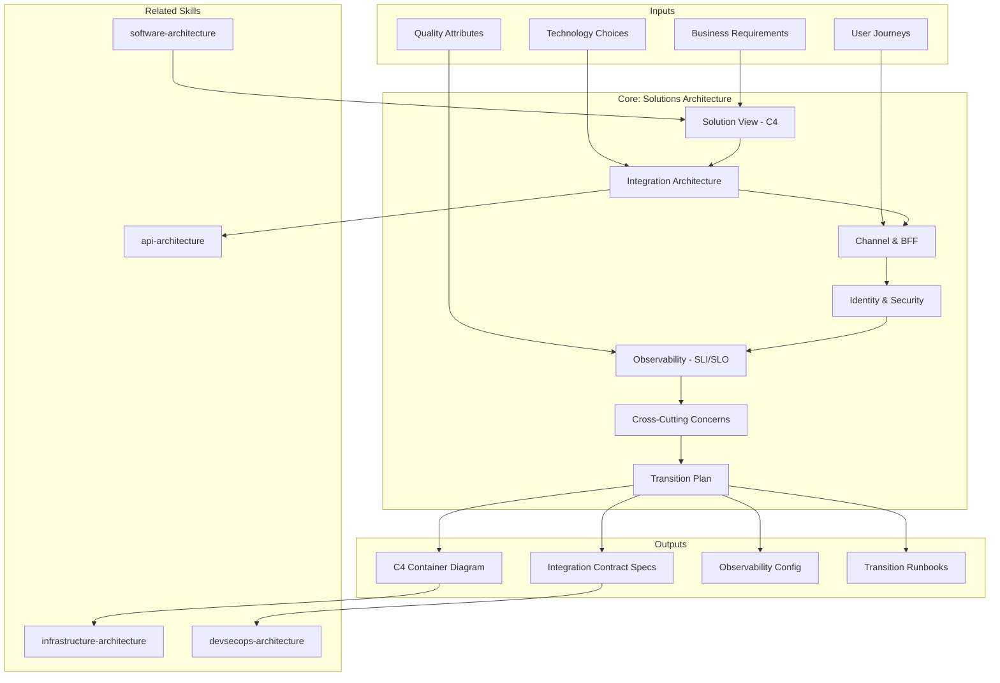

# Solutions Architecture: End-to-End Capability Delivery

Solutions architecture designs the complete system that solves a business problem — how multiple systems connect, how users interact, how data flows, how security is enforced, and how the solution is observed and operated. It bridges business requirements and technical implementation.

## Principio Rector

**Una solución es más que la suma de sus sistemas.** La arquitectura de solución diseña cómo múltiples componentes — APIs, canales, identidad, datos, observabilidad — se integran para resolver un problema de negocio completo. Cada integración es un contrato. Cada contrato es un punto de fallo. Cada punto de fallo necesita un plan B.

### Filosofía de Solución End-to-End

1. **Integration-first thinking.** Los sistemas individuales funcionan solos; la solución falla en las costuras. El foco está en los puntos de conexión.
2. **Zero Trust by default.** Cada servicio verifica, cada canal autentica, cada dato se cifra en tránsito y reposo. La seguridad no es un layer — es una propiedad.
3. **Observable antes que operacional.** Si no se puede observar, no se puede operar. Logging, tracing, y metrics se diseñan junto con la funcionalidad, no después.

## Inputs

The user provides a system or project name as `$ARGUMENTS`. Parse `$1` as the **solution/project name** used throughout all output artifacts.

**Parameters:**
- `{MODO}`: `piloto-auto` (default) | `desatendido` | `supervisado` | `paso-a-paso`
  - **piloto-auto**: Auto para solution view y integration patterns, HITL para security model y transition plan.
  - **desatendido**: Cero interrupciones. Arquitectura de solución documentada automáticamente. Supuestos documentados.
  - **supervisado**: Autónomo con checkpoint en integration architecture y identity model.
  - **paso-a-paso**: Confirma cada container, integration pattern, security decision, y observability config.
- `{FORMATO}`: `markdown` (default) | `html` | `dual`
- `{VARIANTE}`: `ejecutiva` (~40% — S1 solution view + S2 integration + S4 security) | `técnica` (full 7 sections, default)

Before generating architecture, detect the codebase context:

```
!find . -name "*.ts" -o -name "*.java" -o -name "*.py" -o -name "*.go" -o -name "*.yaml" | head -30
```

If reference materials exist, load them:

```
Read ${CLAUDE_SKILL_DIR}/references/integration-patterns.md
Read ${CLAUDE_SKILL_DIR}/references/security-models.md
```

---

## When to Use

- Designing complete solutions spanning multiple systems, services, or platforms
- Defining integration architecture between legacy and new systems
- Designing channel strategy (web, mobile, API, omnichannel)
- Planning identity and access management across the solution
- Establishing observability (logging, metrics, tracing)
- Addressing cross-cutting concerns (caching, rate limiting, retry, timeouts, feature flags)
- Planning migration from current state to target state
- Supporting RFP responses with architecture justification

## When NOT to Use

- Internal software structure only → **metodologia-software-architecture**
- Enterprise portfolio alignment and capability mapping → **metodologia-enterprise-architecture**
- Infrastructure, compute, and platform design → **metodologia-infrastructure-architecture**
- Build pipelines and security controls → **metodologia-devsecops-architecture**

---

## Delivery Structure: 7 Sections

### S1: Solution View (C4 Containers)

High-level diagram showing all systems, boundaries, external dependencies, and integration points.

**Includes:**
- C4 Container diagram: independent deployable components
- External systems: upstream sources, downstream consumers, third-party services
- User actors: internal staff, customers, integrations, admins
- Data stores: databases, caches, file storage
- Communication: APIs, message queues, event streams, sync/async patterns

**Key decisions:**
- System boundary: what's inside solution, what's external
- Container granularity: right size for independent deployment
- Communication protocol: REST, gRPC, message queues, webhooks
- Synchronous vs. asynchronous: latency and coupling trade-offs

### S2: Integration Architecture

How systems connect, exchange data, and coordinate.

**Includes:**
- API Gateway: entry point, routing, rate limiting, request transformation
- Message Broker / Event Bus: async communication, event publishing, subscriptions
- Synchronous Patterns: REST, gRPC, direct DB access, service-to-service
- Asynchronous Patterns: event sourcing, saga, eventual consistency, event streams
- Data Consistency: strong vs. eventual, CAP theorem, distributed transactions
- Protocols: HTTP/REST, gRPC, AMQP, Kafka, webhooks, polling, CDC

**Trade-offs:**
- REST (simple) vs. gRPC (high performance, streaming)
- Synchronous (immediate consistency) vs. async (decoupling)
- Message broker (reliability, ordering) vs. event stream (replay, temporal)
- Point-to-point (simple, tight coupling) vs. pub-sub (decoupling, broadcast)

### S3: Channel & BFF Architecture

How end-users and external systems interact with the solution.

**Includes:**
- Web Channel: SPA, PWA, browser-based
- Mobile Channel: native, cross-platform, offline capability
- API Channel: REST, GraphQL, gRPC for programmatic access
- Backend for Frontend (BFF): separate API layer per channel
- Omnichannel: session state, user identity, consistent experience
- Legacy Integration: existing channels remain supported

**Key decisions:**
- Single API for all channels vs. BFF per channel (simplicity vs. optimization)
- Thin client vs. fat client (consistency vs. responsiveness)
- Stateful vs. stateless (session management, scalability)
- Offline support (PWA, mobile sync)

### S4: Identity & Security (Zero Trust)

How users are authenticated, authorized, and how data is protected.

**Authentication (AuthN):**
- OAuth2/OIDC (industry standard, delegated), SAML (enterprise federation)
- MFA, passwordless (biometric, hardware keys)

**Authorization (AuthZ):**
- RBAC (coarse-grained), ABAC (fine-grained, context-aware), Policy-as-Code

**Zero Trust:**
- Every request authenticated and authorized
- Encryption in transit (TLS 1.2+) and at rest
- Minimal privilege, segmentation (network, data, application)

**API Security:**
- OAuth2 client credentials (recommended), mTLS (zero trust), JWT verification

**Data Protection:**
- Tokenization/masking of PII, data classification (public/internal/confidential/restricted)
- Compliance mapping: GDPR, PCI-DSS, HIPAA, SOX, local regulations
- Data residency, retention, deletion, audit trails

### S5: Observability (SLI/SLO)

How the solution is monitored, debugged, and operated in production.

**Logging:** Structured, centralized, correlation IDs, retention policy
**Metrics:** Application (RPS, error rate, latency p50/p95/p99), infrastructure (CPU, memory), business (transactions, revenue)
**Tracing:** OpenTelemetry, trace spans, sampling strategy
**Alerting:** Conditions, on-call escalation, alert fatigue management
**Dashboards:** Executive (business), operational (latency, errors), debugging (traces, slow queries)

**SLI/SLO/SLA:**
- SLI: measured metric (e.g., 99.9% uptime)
- SLO: target for SLI (commit to 99.95%)
- SLA: contractual consequence if SLO missed

### S6: Cross-Cutting Concerns

Technical patterns applied across multiple components.

- **Caching:** HTTP cache, application (Redis), database; invalidation (TTL, event-based); stampede/penetration risks
- **Rate Limiting:** Per-user/IP/API-key; token bucket, leaky bucket; graceful degradation vs. rejection
- **Circuit Breaker:** Closed/Open/Half-Open states; trip conditions; reset timeout
- **Retry & Timeout:** Exponential backoff + jitter; max retries; idempotency for safe retry
- **Bulkhead/Isolation:** Thread pools per component; separate DB connections; request timeout per subsystem
- **Feature Flags:** Environment-based, user/cohort-based, time-based; remote configuration
- **Configuration Management:** Secrets (encrypted, rotated, least privilege); non-secrets (version-controlled); tools (Vault, AWS Secrets Manager)

### S7: Transition Plan

How to move from current state to target state without disrupting operations.

**Migration Strategy:** Strangler fig, parallel running, cutover (flag day vs. phased), rollback plan
**Data Migration:** Schema evolution, dual-write, verification (checksums, counts), rollback
**Phased Rollout:** Dark launch -> canary 5% -> 25% -> 50% -> 100%; rollback criteria
**Team Readiness:** Documentation, training, on-call, capacity planning
**Risk Management:** Data loss (backup, RTO), service unavailability, performance degradation, security exposure, compliance approval

---

## Trade-off Matrix

| Decision | Enables | Constrains | When to Use |
|---|---|---|---|
| **Synchronous Integration** | Immediate consistency, simple errors | Tight coupling, latency, availability risk | Simple workflows, strong consistency |
| **Asynchronous (Event-Driven)** | Decoupling, resilience, independent scaling | Eventual consistency, complex debugging | High-scale, distributed, domain-driven |
| **API Gateway** | Central security, rate limiting, monitoring | Single point of failure, added latency | Multi-channel, external API exposure |
| **BFF** | Optimized API per channel, client flexibility | Duplication, consistency challenges | Multi-channel with divergent needs |
| **OAuth2/OIDC** | Industry standard, social login, delegation | More complex than basic auth | External users, enterprise SSO |
| **Centralized Logging** | Complete audit trail, easy debugging | Overhead, privacy, storage cost | Compliance-heavy, production troubleshooting |
| **Distributed Tracing** | End-to-end visibility, latency identification | Instrumentation overhead, sampling complexity | Multi-service, debugging latency |
| **Caching (Redis)** | Dramatic latency reduction | Invalidation complexity, memory cost, stale data | High-load, read-heavy workloads |
| **Circuit Breaker** | Fail-fast, prevent cascades | False positives, added latency | Systems calling unreliable dependencies |

---

## Assumptions

- Business requirements gathered and prioritized (from discovery)
- User journeys and personas understood
- Quality attributes (performance, availability, security) defined
- Technology choices roughly scoped (cloud provider, languages, databases)
- Team has infrastructure and tooling access (or migration path)
- Regulatory constraints known (GDPR, PCI, HIPAA, local laws)

## Limits

- Does not design internal software structure of individual systems (see **metodologia-software-architecture**)
- Does not design enterprise governance or capability mapping (see **metodologia-enterprise-architecture**)
- Does not detail infrastructure topology or cloud landing zones (see **metodologia-infrastructure-architecture**)
- Does not design CI/CD pipelines or supply chain security (see **metodologia-devsecops-architecture**)
- Assumes systems being integrated are brownfield or have architecture designed separately

---

## Casos Borde

| Caso | Estrategia de Manejo |
|---|---|
| Solucion greenfield multi-sistema | Iniciar con APIs sincronas simples; agregar async/caching cuando las metricas lo justifiquen; evitar sobre-diseno para escala hipotetica |
| Integracion con mainframe legacy | Capa de integracion (adapter, translator) para impedance mismatch (batch vs real-time, EBCDIC vs UTF-8); strangler fig con timeline de retiro |
| Redes de alta latencia o poco confiables | Arquitectura offline-first con cache local y sync al reconectar; conflict resolution para eventual consistency |
| Requisitos de tiempo real y baja latencia | Sincronico preferido; trade-offs de async documentados; infraestructura global con distribution y failover |
| Sistema altamente regulado (GDPR, HIPAA, PCI-DSS) | Compliance como constraint no-negociable; cada decision mapeada a requisito regulatorio; audit trails, encryption y consent management desde el inicio |

## Decisiones y Trade-offs

| Decision | Alternativa Descartada | Justificacion |
|---|---|---|
| Integration-first thinking (foco en costuras) | Foco en sistemas individuales | Los sistemas individuales funcionan solos; la solucion falla en los puntos de conexion; las costuras son donde se pierde valor |
| Zero Trust by default en cada servicio | Seguridad perimetral clasica | La seguridad perimetral asume que el interior es confiable; Zero Trust verifica cada request, cada canal, cada dato |
| Observabilidad disenada junto con la funcionalidad | Observabilidad agregada post-implementacion | Lo que no se puede observar no se puede operar; logging, tracing y metrics son parte del diseno, no afterthoughts |
| Circuit breaker y retry con idempotency por defecto | Llamadas directas sin proteccion | En sistemas distribuidos, las dependencias fallan; circuit breaker previene cascadas y retry con idempotency permite recovery seguro |

## Knowledge Graph



## Output Templates

| Formato | Nombre | Contenido |
|---|---|---|
| **Markdown** | `A-02_Solutions_Architecture_Deep.md` | Documento completo con Solution View (C4), Integration Architecture, Channel & BFF, Identity/Security, Observability, Cross-Cutting Concerns y Transition Plan. Diagramas Mermaid embebidos. |
| **HTML** | `A-02_Solutions_Architecture_Deep.html` | Mismo contenido en HTML branded (Design System MetodologIA). Diagramas C4 interactivos, navigation entre secciones, y integration contract specs detallados. |
| **DOCX** | `{fase}_solutions_architecture_{cliente}_{WIP}.docx` | Generado con python-docx y MetodologIA Design System v5. Portada con nombre de la solución y fecha, TOC automático, encabezados Poppins navy, cuerpo Montserrat, acentos dorados, tablas zebra. Secciones: Solution View (C4), Integration Architecture, Channel & BFF, Identity/Security, Observability, Cross-Cutting Concerns, Transition Plan. |
| **XLSX** | `{fase}_solutions_architecture_{cliente}_{WIP}.xlsx` | Generado via openpyxl con MetodologIA Design System v5. Encabezados con fondo navy y texto Poppins blanco, cuerpo en Montserrat, zebra striping en filas. Hojas: Integration Contracts (sistema origen, sistema destino, protocolo, patrón sync/async, SLA, fallback, responsable), Security Model (capa, mecanismo AuthN/AuthZ, cifrado, compliance mapping, gaps), SLI/SLO Targets (servicio, SLI, SLO objetivo, SLA contractual, estado actual), Cross-Cutting Concerns (concern, patrón aplicado, sistemas afectados, configuración, riesgo), Transition Plan (fase, actividad, owner, criterio de rollback, riesgo). Conditional formatting por estado de SLO y severidad de gaps de seguridad. Auto-filters en todas las hojas. Valores directos sin fórmulas. |
| **PPTX** | `{fase}_solutions_architecture_{cliente}_{WIP}.pptx` | Generado con python-pptx y MetodologIA Design System v5. Slide master con gradiente navy, títulos Poppins, cuerpo Montserrat, acentos dorados. Máximo 30 slides (técnica). Speaker notes con referencias de evidencia. Slides: Portada, Principio Rector, Solution View (C4 containers), Integration Architecture, Channel & BFF Strategy, Identity & Security (Zero Trust), Observability (SLI/SLO), Cross-Cutting Concerns, Transition Plan, próximos pasos. |

## Evaluacion

| Dimension | Peso | Criterio |
|---|---|---|
| Trigger Accuracy | 10% | Descripcion activa triggers correctos (full solution, integrate systems, API gateway, Zero Trust, observability) sin falsos positivos con software-architecture o infrastructure-architecture |
| Completeness | 25% | Las 7 secciones cubren solution view, integracion, canales, seguridad, observabilidad, cross-cutting y transicion sin huecos; todos los sistemas en scope mapeados |
| Clarity | 20% | Instrucciones ejecutables sin ambiguedad; cada integracion con protocolo, SLA y fallback; SLI/SLO con targets numericos |
| Robustness | 20% | Maneja greenfield, legacy mainframe, redes poco confiables, tiempo real y regulacion estricta con estrategias diferenciadas |
| Efficiency | 10% | Proceso no tiene pasos redundantes; variante ejecutiva reduce a S1+S2+S4 sin perder decisiones criticas de integracion y seguridad |
| Value Density | 15% | Cada seccion aporta valor practico directo; trade-off matrix y transition plan son herramientas de decision y ejecucion inmediata |

**Umbral minimo: 7/10.**

---

## Validation Gate

Before finalizing delivery, verify:

- [ ] All systems in scope identified and mapped
- [ ] Integration patterns explicit (sync, async, polling, CDC)
- [ ] Security model covers authentication, authorization, encryption, compliance
- [ ] Observability stack designed (logging, metrics, tracing, alerting)
- [ ] Cross-cutting concerns addressed (caching, rate limiting, circuit breakers)
- [ ] Multi-channel strategy clear (web, mobile, API, consistency)
- [ ] Data flow documented (what moves where, consistency model)
- [ ] Migration path phased, low-risk, with rollback options
- [ ] Assumptions explicit; risks identified and mitigated
- [ ] Technical teams can implement; operations can run and debug

---

## Cross-References

- **metodologia-software-architecture:** Each system has internal architecture; decisions here constrain that
- **metodologia-infrastructure-architecture:** Infrastructure must support integration patterns, security, observability
- **metodologia-devsecops-architecture:** Pipeline validates integration contracts, security gates, compliance
- **metodologia-enterprise-architecture:** Solution must fit enterprise capability map and technology radar

## Output Format Protocol

| Format | Default | Description |
|--------|---------|-------------|
| `markdown` | Yes | Rich Markdown + Mermaid diagrams. Token-efficient. |
| `html` | On demand | Branded HTML (Design System). Visual impact. |
| `dual` | On demand | Both formats. |

Default output is Markdown with embedded Mermaid diagrams. HTML generation requires explicit `{FORMATO}=html` parameter.

## Output Artifact

**Primary:** `A-02_Solutions_Architecture_Deep.html` — Executive summary, solution view, integration architecture, channel architecture, identity/security, observability, cross-cutting concerns, transition plan.

**Secondary:** C4 diagram (PNG/SVG), integration contract specs, observability config templates, security checklist, transition runbooks.

---
**Autor:** Javier Montaño | **Última actualización:** 12 de marzo de 2026
