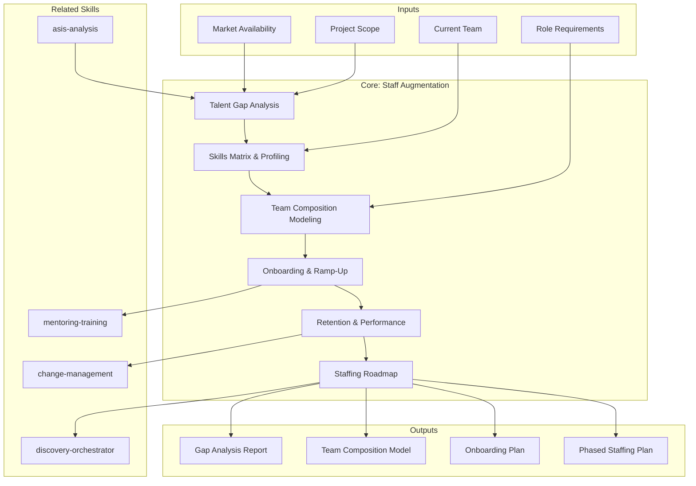

# Staff Augmentation Discovery — Talent Gap Analysis & Staffing Roadmap

Generates a comprehensive staff augmentation needs analysis covering talent gap analysis, skills matrix profiling, team composition modeling, onboarding & ramp-up design, retention framework, and staffing roadmap. Designed for engagements where the client needs to increase capacity with external professionals, whether nearshore, offshore, or on-site.

## Grounding Guideline

> *Staff augmentation is not filling seats — it is building capability. Every professional added must multiply, not just add to, the team's capacity.*

1. **Capability over headcount.** The number of people is a vanity metric. What matters is delivery capacity: speed, quality, and sustainability. A well-integrated senior contributes more than three juniors without onboarding.
2. **Integration before incorporation.** Adding talent without an integration plan creates friction, not productivity. Onboarding, mentoring, and tool access determine time-to-productivity more than prior experience.
3. **Retention is the best staffing strategy.** The cost of replacing a professional (recruiting + onboarding + ramp-up + knowledge loss) exceeds 3-6 months of salary. Preventing turnover is more profitable than covering it.

## Inputs

The user provides a project or client name as `$ARGUMENTS`. Parse `$1` as the **project/client name** used throughout all output artifacts.

**Parameters:**
- `{MODO}`: `piloto-auto` (default) | `desatendido` | `supervisado` | `paso-a-paso`
  - **piloto-auto**: Auto para análisis de gaps y skills matrix, HITL para decisiones de composición de equipo y roadmap.
  - **desatendido**: Zero interruptions. Análisis completo automatizado. Assumptions documented.
  - **supervisado**: Autónomo con checkpoint al completar cada sección.
  - **paso-a-paso**: Confirms before cada sección del análisis.
- `{FORMATO}`: `markdown` (default) | `html` | `dual`
- `{VARIANTE}`: `ejecutiva` (~40% — S1 + S3 + S6 only) | `técnica` (full 6 sections, default)

If reference materials exist, load them:

```
Read ${CLAUDE_SKILL_DIR}/references/
```

---

## When to Use

- El cliente necesita aumentar su equipo con talento externo (nearshore, offshore, on-site)
- Se requiere analizar brechas de talento contra las capacidades necesarias para un proyecto
- Es necesario diseñar la composición de un equipo augmentado
- Se necesita un plan de onboarding y ramp-up para personal externo
- Se busca establecer un framework de retención y performance para el equipo augmentado

## When NOT to Use

- Diseño organizacional completo (restructuración, re-org) --> requiere consultoría de management
- Assessment de estado actual del equipo sin intención de augmentation --> use asis-analysis con {TIPO_SERVICIO}=SAS
- Transformación digital que incluye staffing como un componente --> use digital-transformation-discovery
- Recruiting interno o employer branding --> fuera del scope de MetodologIA services

---

## Delivery Structure: 6 Sections

### S1: Talent Gap Analysis

Análisis de capacidades actuales del equipo versus capacidades requeridas para el proyecto/programa.

**Dimensiones del análisis:**
- **Capacidades actuales:** Inventario de roles, skills, y experiencia del equipo existente del cliente
- **Capacidades requeridas:** Skills técnicos, de dominio, y soft skills necesarios según el scope del proyecto
- **Identificación de gaps:** Delta por rol/skill entre lo actual y lo requerido
- **Scoring de criticidad:** Clasificación de cada gap como `blocker` (sin este skill el proyecto no avanza), `important` (impacta velocidad o calidad), `nice-to-have` (mejora pero no bloquea)
- **Disponibilidad en mercado:** Assessment de qué tan fácil o difícil es encontrar cada perfil en el mercado (alta demanda, nicho, abundante)

**Output:** Tabla de gaps con scoring de criticidad y disponibilidad en mercado.

### S2: Skills Matrix & Profiling

Matriz detallada de skills requeridos para el engagement.

**Categorías de skills:**
- **Technical skills:** Lenguajes de programación, frameworks, herramientas, plataformas cloud, bases de datos
- **Soft skills:** Comunicación (idioma, escrita/oral), liderazgo, colaboración, resolución de conflictos, autonomía
- **Domain knowledge:** Conocimiento de industria, regulaciones, procesos de negocio específicos del cliente

**Niveles de proficiencia:**
| Nivel | Descripción | Indicadores |
|---|---|---|
| Learning | En proceso de adquisición | Puede ejecutar con supervisión constante |
| Capable | Funcional e independiente | Ejecuta tareas estándar sin guía, necesita apoyo en edge cases |
| Expert | Dominio avanzado | Resuelve problemas complejos, mentora a otros, define estándares |

**Certificaciones:** Estado de certificaciones relevantes por perfil (AWS, Azure, GCP, Scrum, PMP, ISTQB, etc.).

**Output:** Skills matrix con proficiency levels por rol y certificaciones requeridas vs deseables.

### S3: Team Composition Modeling

Modelo de composición del equipo augmentado.

**Dimensiones del modelo:**
- **Roles:** Definición de cada rol con responsabilidades, skills requeridos, y nivel de seniority
- **Distribución de seniority:** Ratio junior/mid/senior. Regla general: mínimo 30% senior para equipos nuevos, 20% para equipos maduros
- **Allocation percentages:** Dedicación por recurso (100%, 75%, 50%). Evitar <50% — la fragmentación reduce productividad
- **Team topology:** Clasificación según Team Topologies (Skelton & Pais):
  - **Stream-aligned:** Entrega valor de negocio directamente
  - **Platform:** Provee capacidades internas que aceleran a los stream-aligned
  - **Enabling:** Asiste a otros equipos a adoptar nuevas capacidades
  - **Complicated-subsystem:** Gestiona subsistemas que requieren expertise especializado
- **Conway's Law alignment:** Análisis de si la estructura propuesta del equipo se alinea con la arquitectura del sistema que van a construir/mantener

**Output:** Organigrama propuesto con roles, seniority, allocation, y team topology classification.

### S4: Onboarding & Ramp-Up Design

Plan de integración para el personal augmentado.

**Componentes del plan:**
- **Knowledge transfer:** Sesiones de transferencia de conocimiento del dominio, arquitectura, procesos de negocio
- **Mentoring structure:** Asignación de buddies/mentores del equipo del cliente para cada recurso augmentado
- **Documentation needs:** Documentación mínima requerida antes del Day 1 (arquitectura, estándares de código, procesos de deployment, accesos)
- **Tooling access:** Checklist de accesos a herramientas (repositorios, CI/CD, cloud, comunicación, gestión de proyectos)
- **Cultural integration:** Ceremonias del equipo, normas de comunicación, horarios, zonas horarias, idioma de trabajo

**Ramp-up timeline por seniority:**

| Seniority | Ramp-Up | Semana 1 | Semana 2-4 | Semana 4-8 |
|---|---|---|---|---|
| Senior | 2 semanas | Contexto + codebase review | Contribuciones independientes | Productividad plena |
| Mid | 4 semanas | Contexto + pairing | Tareas guiadas | Contribuciones independientes |
| Junior | 8 semanas | Contexto + training | Tareas con supervisión | Tareas guiadas, inicio de autonomía |

**Output:** Plan de onboarding con timeline, checklist de accesos, y estructura de mentoring.

### S5: Retention & Performance Framework

Framework de retención y evaluación de performance para el equipo augmentado.

**KPI definition:**
- **Delivery KPIs:** Velocity, throughput, cycle time, defect rate
- **Integration KPIs:** Participación en ceremonias, code review contributions, knowledge sharing
- **Quality KPIs:** Code review feedback, adherencia a estándares, test coverage de contribuciones

**Feedback cadence:**
- **Semanal:** 1:1 de 15 minutos con team lead (blockers, satisfacción)
- **Mensual:** Review de performance contra KPIs con el delivery manager
- **Trimestral:** Evaluación 360 (peers del cliente + MetodologIA delivery manager)

**Growth opportunities:**
- Acceso a certificaciones y training
- Rotación entre proyectos para ampliar experiencia
- Path de crecimiento (junior → mid → senior → lead)

**Satisfaction monitoring:**
- eNPS mensual (promotores, pasivos, detractores)
- Exit interviews estructuradas
- Encuesta de clima trimestral

**Early warning indicators for attrition risk:**
- Caída en participación en ceremonias
- Reducción de throughput sin causa técnica
- Feedback negativo recurrente en 1:1s
- Solicitud de cambio de proyecto

**Output:** Framework de performance con KPIs, feedback cadence, y early warning system.

### S6: Staffing Roadmap

Plan de staffing faseado con curvas de ramp-up.

**Phased hiring plan:**
- **Fase 1 (Foundation):** Roles críticos (blockers del S1). Seniors primero para establecer estándares y mentorear
- **Fase 2 (Growth):** Roles importantes. Mids que se integran al equipo ya estabilizado
- **Fase 3 (Scale):** Roles nice-to-have. Juniors que se benefician del equipo maduro y mentoring establecido

**Ramp-up curves:** Visualización de la capacidad del equipo en el tiempo, mostrando la curva de productividad real (no es lineal — sigue una curva S).

**Contingency positions:** Perfiles pre-identificados para cubrir rotación o ausencias. Regla: 10-15% de contingencia sobre el equipo total.

**Succession planning:** Identificación de single points of failure y plan de cross-training para mitigar.

**Budget magnitude indicators:**
- Expresado en `posiciones x duración` (e.g., "3 seniors x 12 meses + 2 mids x 8 meses")
- NUNCA precios. Solo magnitudes de esfuerzo
- Incluir costo de onboarding como overhead (típicamente 15-20% del primer mes por recurso)

**Output:** Roadmap visual con fases, ramp-up curves, y contingency plan.

---

## Trade-off Matrix

| Decisión | Habilita | Restringe | Cuándo Usar |
|---|---|---|---|
| **100% senior** | Velocidad inmediata, autonomía | Costo alto, mercado escaso | Proyectos cortos (<6 meses), alta complejidad |
| **Mix senior/mid/junior** | Balance costo-capacidad, growth | Requiere inversión en mentoring | Proyectos >6 meses, equipo estable |
| **Nearshore** | Zona horaria compatible, costo moderado | Pool limitado vs offshore | Overlap de horarios requerido, comunicación frecuente |
| **Offshore** | Pool amplio, costo optimizado | Diferencia horaria, cultural gap | Tareas bien definidas, equipos autónomos |
| **Dedicated team** | Integración profunda, ownership | Costo fijo, flexibilidad reducida | Programas >12 meses, producto propio |
| **Time & Materials** | Flexibilidad, ajuste dinámico | Menos predictibilidad presupuestal | Scope variable, discovery/R&D |

---

## Assumptions

- El cliente tiene claridad sobre el scope del proyecto o programa que requiere augmentation
- Existe un equipo base del cliente con quien se integrará el personal augmentado
- Los roles y responsabilidades del equipo del cliente están documentados o son accesibles vía entrevistas
- El cliente puede proporcionar acceso a herramientas y documentación en tiempo razonable para el onboarding
- El mercado laboral permite cubrir los perfiles identificados en los tiempos del roadmap

## Limits

- No reemplaza la consultoría de diseño organizacional (restructuración, cambio de org chart)
- No incluye recruiting operativo (búsqueda, filtrado, entrevistas de candidatos)
- No define precios — solo magnitudes de esfuerzo (posiciones x duración)
- No cubre aspectos legales de contratación (clasificación contractor vs employee, regulaciones laborales locales)
- El análisis de disponibilidad en mercado es una estimación basada en tendencias — no es un market study formal

---

## Edge Cases

**Cliente sin equipo base (greenfield team):**
Se requiere un Tech Lead o Architect senior del lado de MetodologIA que establezca cultura, estándares, y procesos. El onboarding se convierte en team building. Incrementar ratio senior a 50%.

**Rotación alta en el equipo del cliente:**
La integración del personal augmentado se dificulta si el contexto cambia constantemente. Priorizar documentación exhaustiva sobre conocimiento tribal. Incluir knowledge management como responsabilidad explícita.

**Skills de nicho (mainframe, SAP, legacy):**
Lead times de recruiting más largos (8-12 semanas vs 2-4 semanas estándar). Considerar training de perfiles cercanos como alternativa. Documentar el riesgo de mercado escaso.

**Multi-timezone distributed team:**
Definir core hours de overlap mínimo (4 horas). Ceremonias asíncronas para lo que no requiere interacción en tiempo real. Documentación como ciudadano de primera clase.

**Ramp-down planning:**
Cuando el engagement tiene fecha de finalización, planear la transferencia de conocimiento inversa (del equipo augmentado al equipo del cliente) con al menos 4 semanas de anticipación.

## Edge Cases

| Case | Handling Strategy |
|---|---|
| Cliente sin equipo base (greenfield team) | Tech Lead o Architect senior de MetodologIA establece cultura y estandares; onboarding se convierte en team building; incrementar ratio senior a 50% |
| Rotacion alta en el equipo del cliente | Priorizar documentacion exhaustiva sobre conocimiento tribal; incluir knowledge management como responsabilidad explicita; buddy system reforzado |
| Skills de nicho (mainframe, SAP, legacy) | Lead times de recruiting mas largos (8-12 semanas); considerar training de perfiles cercanos como alternativa; documentar riesgo de mercado escaso |
| Multi-timezone distributed team | Definir core hours de overlap minimo (4 horas); ceremonias asincronas para lo que no requiere interaccion real-time; documentacion como ciudadano de primera clase |
| Ramp-down planning con fecha de finalizacion | Planear transferencia de conocimiento inversa con al menos 4 semanas de anticipacion; documentar runbooks y decision logs antes del offboarding |

## Decisions & Trade-offs

| Decision | Discarded Alternative | Justification |
|---|---|---|
| Capacidad de entrega sobre headcount | Medir exito por numero de personas incorporadas | El numero de personas es una metrica vanidosa; lo que importa es velocidad, calidad y sostenibilidad de entrega |
| Integracion antes que incorporacion | Incorporar primero, integrar despues | Anadir talento sin plan de integracion crea friccion; onboarding, mentoring y acceso a herramientas determinan el time-to-productivity |
| Retencion como estrategia primaria de staffing | Cubrir rotacion reactivamente | El costo de reemplazar (recruiting + onboarding + ramp-up + knowledge loss) supera 3-6 meses de salario; prevenir es mas rentable que cubrir |
| Seniors primero para establecer estandares | Juniors primero por menor costo | Los seniors establecen cultura, estandares y mentorias; sin ese foundation, los juniors no tienen framework de crecimiento |

## Knowledge Graph



## Output Templates

| Formato | Nombre | Contenido |
|---|---|---|
| **Markdown** | `Staff_Augmentation_Discovery_{project}.md` | Analisis completo de 6 secciones: talent gap, skills matrix, team composition, onboarding plan, retention framework y staffing roadmap con ramp-up curves. Diagramas Mermaid embebidos. |
| **XLSX** | `Staff_Augmentation_Skills_Matrix_{project}.xlsx` | Skills matrix interactiva con proficiency levels por rol, heatmap de gaps current vs required, certificaciones requeridas vs deseables, y scoring de criticidad por perfil. |
| **HTML** | `{fase}_staff_augmentation_{cliente}_{WIP}.html` | Mismo contenido en HTML branded (Design System MetodologIA v5). Self-contained, WCAG AA, responsive. Incluye talent gap heatmap con criticidad por rol, team composition org chart visual y staffing roadmap con curvas de ramp-up. |
| **DOCX** | `{fase}_staff_augmentation_{cliente}_{WIP}.docx` | Generado con python-docx y MetodologIA Design System v5. Portada con nombre del proyecto y fecha, TOC automático, encabezados Poppins navy, cuerpo Trebuchet MS, acentos dorados, tablas zebra. Secciones: Talent Gap Analysis, Skills Matrix, Team Composition Model, Onboarding Plan, Retention Framework, Staffing Roadmap. |
| **PPTX** | `{fase}_staff_augmentation_{cliente}_{WIP}.pptx` | Generado con python-pptx y MetodologIA Design System v5. Slide master con gradiente navy, títulos Poppins, cuerpo Trebuchet MS, acentos dorados. Máximo 20 slides (ejecutiva). Speaker notes con referencias de evidencia. Slides: Portada, Resumen ejecutivo, Talent Gap Analysis (tabla de gaps con criticidad), Skills Matrix (heatmap), Team Composition (org chart visual), Onboarding & Ramp-Up timeline, Retention Framework (KPIs), Staffing Roadmap faseado, próximos pasos. |

## Evaluacion

| Dimension | Peso | Criterio |
|---|---|---|
| Trigger Accuracy | 10% | Descripcion activa triggers correctos (staffing, talent gap, team composition, onboarding, augmentation) sin falsos positivos con organizational design o recruiting operativo |
| Completeness | 25% | Las 6 secciones cubren gap analysis, skills matrix, composition, onboarding, retention y roadmap sin huecos; todos los roles requeridos evaluados |
| Clarity | 20% | Instrucciones ejecutables sin ambiguedad; cada gap tiene scoring de criticidad; ramp-up timelines especificos por seniority; KPIs medibles |
| Robustness | 20% | Maneja greenfield team, rotacion alta, skills de nicho, multi-timezone y ramp-down con estrategias diferenciadas |
| Efficiency | 10% | Proceso no tiene pasos redundantes; variante ejecutiva reduce a S1+S3+S6 sin perder decisiones criticas de composicion y roadmap |
| Value Density | 15% | Cada seccion aporta valor practico directo; talent gap scoring y ramp-up curves son herramientas de decision inmediata para delivery managers |

**Umbral minimo: 7/10.**

---

## Validation Gate

Before finalizing delivery, verify:

- [ ] Talent gap analysis cubre todos los roles y skills requeridos por el proyecto
- [ ] Cada gap tiene scoring de criticidad (blocker/important/nice-to-have) documentado
- [ ] Skills matrix incluye technical, soft, y domain skills con proficiency levels
- [ ] Team composition alineada con team topologies y Conway's Law
- [ ] Distribución de seniority justificada con rationale (no arbitraria)
- [ ] Plan de onboarding tiene timeline específico por seniority level
- [ ] KPIs de performance son medibles y tienen cadencia de review definida
- [ ] Early warning indicators de attrition documentados
- [ ] Staffing roadmap faseado con contingency positions (10-15%)
- [ ] Budget expresado en magnitudes (posiciones x duración), NUNCA en precios
- [ ] Ramp-up curves reflejan productividad real (curva S, no lineal)

---

## Output Format Protocol

| Format | Default | Description |
|--------|---------|-------------|
| `markdown` | Yes | Rich Markdown + Mermaid diagrams. Token-efficient. |
| `html` | On demand | Branded HTML (Design System). Visual impact. |
| `dual` | On demand | Both formats. |

Default output is Markdown with embedded Mermaid diagrams. HTML generation requires explicit `{FORMATO}=html` parameter.

## Output Artifact

**Primary:** `Staff_Augmentation_Discovery_{project}.md` -- Talent gap analysis, skills matrix, team composition model, onboarding plan, retention framework, and phased staffing roadmap with ramp-up curves and contingency plan.

**Diagramas incluidos:**
- Team composition diagram: roles, seniority distribution, team topology
- Ramp-up curve: capacity over time per phase
- Staffing roadmap: Gantt-style phased hiring plan
- Skills gap heatmap: current vs required by role

---
**Autor:** Javier Montaño | **Última actualización:** 14 de marzo de 2026
