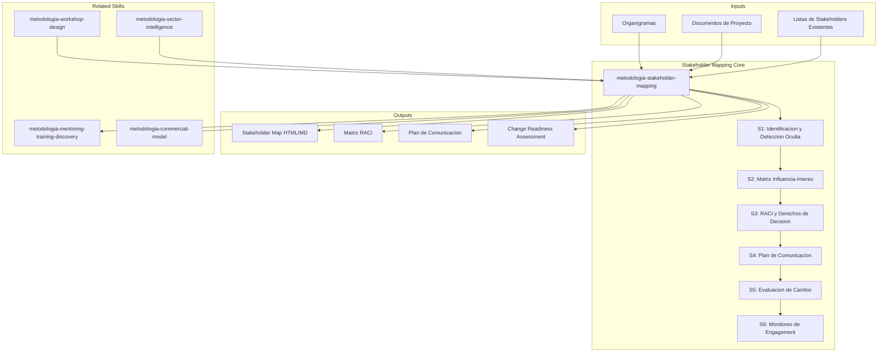

# Stakeholder Mapping: Analysis, Engagement & Change Readiness

Stakeholder mapping identifies who matters for a project or transformation, how much influence and interest they hold, what communication they need, and how ready they are for change. Produces actionable stakeholder maps that prevent surprises, accelerate adoption, and align decision-making.

## Principio Rector

**Un mapa de stakeholders no es un organigrama bonito — es un radar de supervivencia política.** El éxito de cualquier iniciativa depende menos de la calidad técnica y más de quién la apoya, quién la bloquea y quién simplemente no sabe que existe. Mapear stakeholders es hacer visible lo invisible antes de que lo invisible te haga fracasar.

### Filosofía de Mapeo de Stakeholders

1. **El poder informal supera al formal.** Los organigramas muestran quién debería decidir; el mapeo revela quién realmente decide. Siempre investiga ambos.
2. **El silencio es la señal más peligrosa.** Un stakeholder que no responde no es un stakeholder alineado — es un riesgo no cuantificado que requiere acción inmediata.
3. **El mapa es un organismo vivo.** Las dinámicas de poder cambian con cada sprint, cada reorganización, cada éxito y cada fracaso. Un mapa estático es un mapa mentiroso.

## Inputs

The user provides a project or initiative name as `$ARGUMENTS`. Parse `$1` as the **project/initiative name** used throughout all output artifacts.

Before generating stakeholder analysis, detect organizational context:

```
find . -name "*.md" -o -name "*.docx" -o -name "*.xlsx" -o -name "org*" -o -name "stakeholder*" | head -20
```

Use detected org charts, project documents, and existing stakeholder lists to tailor analysis scope and depth.

**Parameters:**
- `{MODO}`: `piloto-auto` (default) | `desatendido` | `supervisado` | `paso-a-paso`
  - **piloto-auto**: Auto para identificación y categorización de stakeholders, HITL para validación de influencia y decisiones de escalamiento.
  - **desatendido**: Cero interrupciones. Stakeholders inferidos de documentación disponible. Supuestos documentados.
  - **supervisado**: Autónomo con reportes en milestones. Preguntas solo en conflictos de poder o ambigüedad de RACI.
  - **paso-a-paso**: Confirma antes de cada categorización, asignación RACI y estrategia de engagement.
- `{FORMATO}`: `markdown` (default) | `html` | `dual`
- `{VARIANTE}`: `ejecutiva` (~40%) | `técnica` (full, default)

## When to Use

- Starting a new project and identifying key decision-makers
- Planning a transformation or organizational change initiative
- Building a communication plan for multi-stakeholder programs
- Assigning decision rights and responsibilities (RACI)
- Assessing organizational readiness for technology or process changes
- Recovering from stakeholder misalignment or surprise resistance
- Preparing executive sponsors with engagement strategies

## Delivery Structure: 6 Sections

### S1: Stakeholder Identification & Hidden Stakeholder Detection

Discovers all individuals and groups with a stake in the project outcome, including those invisible on org charts.

**Includes:**
- Discovery interview guide: questions to surface stakeholders not on org charts
- Org chart analysis: reporting lines, dotted-line relationships, matrix structures
- Stakeholder categories: sponsors, decision-makers, implementers, end users, affected parties, regulators
- External stakeholders: vendors, partners, customers, regulatory bodies
- Completeness check: "who would be upset if they weren't consulted?"
- **Hidden stakeholder detection techniques:**
  - Snowball method: ask each identified stakeholder "who else should we talk to?"
  - Meeting archaeology: review attendee lists of past related initiatives
  - Decision trail analysis: trace who actually approved/blocked past decisions (vs. who was supposed to)
  - Informal network mapping: identify who people go to for advice (not who they report to)
  - Budget trail: follow the money — who controls discretionary spend that affects the project
  - "Veto scan": for each deliverable, ask "who could kill this if they wanted to?"

**Key decisions:**
- Scope boundary: which organizational levels to include
- Granularity: individual mapping vs. group/role mapping
- External inclusion: whether vendors, customers, regulators are in scope
- Update cadence: how often to refresh the stakeholder list

### S2: Influence-Interest Matrix

Plots stakeholders on a power/interest grid and defines engagement strategy per quadrant.

**Includes:**
- Power assessment criteria: decision authority, budget control, political capital, expertise
- Interest assessment criteria: direct impact, career stakes, domain relevance, emotional investment
- Four-quadrant categorization:
  - **High Power / High Interest:** Manage closely — regular 1:1, co-creation, early reviews
  - **High Power / Low Interest:** Keep satisfied — periodic briefings, escalation path, no surprises
  - **Low Power / High Interest:** Keep informed — regular updates, feedback channels, champion candidates
  - **Low Power / Low Interest:** Monitor — minimal effort, inclusion in broad communications
- Movement tracking: stakeholders shifting quadrants over project lifecycle
- **Attitude overlay (+/-):** Mark each stakeholder with +, -, or ? to shape engagement tone
- **Coalition building:** Map natural alliances and fault lines. Build minimum winning coalition. Sequence engagement: activate allies first, then convert neutrals.
- **Power dynamics mapping:** Plot formal authority against informal influence. When they diverge, the informal map predicts outcomes more accurately.

### S3: RACI & Decision Rights

Assigns clear responsibilities and decision authority to prevent confusion and delays.

**Includes:**
- RACI matrix: Responsible, Accountable, Consulted, Informed per deliverable
- Single accountability rule: exactly one "A" per decision/deliverable
- Decision authority framework: what can be decided locally vs. needs escalation
- Escalation protocol: trigger criteria, escalation path, time limits, default decisions
- Conflict resolution: process for disagreements between stakeholders
- RACI validation: review with stakeholders to confirm assignments

### S4: Communication Plan

Designs targeted communication for each stakeholder group.

**Includes:**
- Communication matrix: stakeholder group x channel x frequency x format x owner
- Channel selection: email, meeting, dashboard, Slack, town hall, 1:1, newsletter
- Message framing: tailored messaging per audience (executive summary vs. technical detail)
- Feedback loops: how stakeholders can respond, ask questions, raise concerns
- Cadence calendar: weekly, bi-weekly, monthly, phase-gate aligned
- Crisis communication: escalation triggers, rapid notification, holding statements

### S5: Change Readiness Assessment

Evaluates how prepared the organization and individuals are for the change.

**Includes:**
- Adoption curve mapping: innovators, early adopters, early majority, late majority, laggards
- **Resistance archetypes** — identify and tailor response per type:
  - **The Skeptic:** Intellectually unconvinced. Needs data, evidence, pilot results. Can become strongest advocate once convinced.
  - **The Blocker:** Actively opposes, often protecting territory or budget. Needs to be heard, then given a role. Escalate if persists.
  - **The Passive Resister:** Appears agreeable but doesn't follow through. Needs explicit commitments with visible accountability.
  - **The Saboteur:** Undermines behind the scenes. Requires direct confrontation (privately), clear consequences, executive sponsor intervention.
  - **The Mourner:** Genuinely grieving what's being lost. Needs acknowledgment, transition time, connection to what's preserved.
- Champion identification: who will advocate and model new behaviors
- Training needs analysis: skill gaps, learning preferences, support requirements
- Organizational change capacity: how many concurrent changes can the org absorb
- Readiness scoring: quantified readiness per department or stakeholder group

### S6: Engagement Monitoring

Tracks stakeholder sentiment and participation throughout the project lifecycle.

**Includes:**
- Sentiment tracking: periodic pulse surveys, meeting observation, informal check-ins
- Participation metrics: attendance at meetings, feedback submitted, adoption rates
- Issue log: stakeholder concerns, status, resolution, owner
- Relationship health dashboard: green/yellow/red per key stakeholder
- Early warning indicators: declining attendance, silence from key stakeholders, escalation frequency
- Retrospective integration: lessons learned about stakeholder engagement per phase

## Trade-off Matrix

| Decision | Enables | Constrains | When to Use |
|---|---|---|---|
| **Individual Mapping** | Precision, personalized engagement | Time-intensive, doesn't scale | Small projects, executive-level, high-stakes |
| **Group/Role Mapping** | Scalable, manageable | Misses individual dynamics | Large programs, many stakeholders, lower stakes |
| **Formal RACI** | Clarity, accountability, audit trail | Overhead, rigidity | Regulated environments, large teams |
| **Informal Decision Rights** | Speed, flexibility | Ambiguity, disputes | Small teams, agile environments |
| **Proactive Communication** | No surprises, trust building | Effort, potential overload | Key stakeholders, change programs |
| **Self-Serve Dashboards** | Scalable, on-demand | Passive, may not be consumed | Large audiences, supplementary |

## Assumptions & Limits

- Project has multiple stakeholders with varying interests
- Organizational hierarchy is identifiable
- Access exists to conduct interviews or gather input
- Stakeholder dynamics may shift — analysis is a living document
- Political dynamics and informal power are estimated, not measured precisely
- Does not design technical solutions or replace organizational design / HR processes

## Edge Cases

**Highly Political Organization:** Formal org charts don't reflect real power. Supplement with informal network analysis. Conduct confidential 1:1 interviews. Treat influence matrix as confidential.

**Remote / Distributed Teams:** Communication plan must account for async channels and time zones. Cultural sensitivity in engagement approach (direct vs. indirect feedback norms).

**Merger or Reorganization:** Stakeholder landscape shifting rapidly. Increase reassessment frequency. Map stakeholders from both organizations. Watch for power vacuums.

**External Regulatory Stakeholders:** High power but engagement constraints. Communication is formal, documented, compliance-driven. Assign dedicated liaison.

**Stakeholder Fatigue:** Organization undergoing multiple simultaneous changes. Consolidate communications. Respect capacity limits. Show this initiative's unique value.

## Casos Borde

| Caso | Estrategia de Manejo |
|------|---------------------|
| Organizacion altamente politizada donde el organigrama no refleja el poder real | Complementar con analisis de red informal (snowball method, decision trail analysis); tratar la matriz de influencia como documento confidencial |
| Equipos remotos/distribuidos en multiples zonas horarias | Plan de comunicacion debe contemplar canales asincronos y sensibilidad cultural; adaptar enfoque de engagement (directo vs indirecto segun cultura) |
| Fusion o reorganizacion en curso con landscape de stakeholders cambiante | Aumentar frecuencia de re-evaluacion; mapear stakeholders de ambas organizaciones; vigilar vacios de poder |
| Fatiga de stakeholders por multiples cambios simultaneos | Consolidar comunicaciones; respetar limites de capacidad; demostrar valor unico de esta iniciativa vs las demas |

## Decisiones y Trade-offs

| Decision | Alternativa Descartada | Justificacion |
|----------|----------------------|---------------|
| Mapeo individual para stakeholders de alto poder/interes | Mapeo por grupo/rol para todos los niveles | Los stakeholders clave requieren engagement personalizado; el mapeo por grupo pierde dinamicas individuales criticas |
| RACI formal con un solo Accountable por decision | Decision rights informales basados en consenso | La ambiguedad en accountability es la causa principal de retrasos en decisiones; un solo A elimina la difusion de responsabilidad |
| Comunicacion proactiva con stakeholders clave | Dashboards self-serve para todos | Los dashboards son pasivos y pueden no ser consumidos; la comunicacion proactiva construye confianza y evita sorpresas |

## Knowledge Graph



## Output Templates

**Formato MD (default):**

```
# Stakeholder Map — {proyecto}
## Resumen Ejecutivo
> Stakeholders identificados: N. Coalicion minima ganadora: X personas. Riesgos de cambio: Y.
## S1: Registro de Stakeholders
| Nombre/Rol | Categoria | Poder | Interes | Actitud (+/-/?) |
## S2: Matriz Influencia-Interes
```mermaid
quadrantChart
    ...
```
## S3-S6: [secciones completas]
## Plan de Accion Inmediato
```

**Formato DOCX (para circulacion interna confidencial):**

```
Seccion 1: Resumen Ejecutivo (1 pagina)
Seccion 2: Registro de Stakeholders (tabla detallada, clasificacion por categoria)
Seccion 3: Matriz de Influencia-Interes (grafico + estrategia por cuadrante)
Seccion 4: Matriz RACI (por entregable/decision)
Seccion 5: Plan de Comunicacion (canal x frecuencia x formato x owner)
Seccion 6: Evaluacion de Change Readiness (adoption curve + arquetipos de resistencia)
Seccion 7: Dashboard de Monitoreo (plantilla para seguimiento quincenal)
Anexo: Guia de Entrevistas de Descubrimiento
```

### PPTX (bajo demanda)
- Filename: `{fase}_stakeholder_mapping_{cliente}_{WIP}.pptx`
- Generado con python-pptx y MetodologIA Design System v5. Slide master con gradiente navy, títulos Poppins, cuerpo Montserrat, acentos dorados. Máximo 20 slides (ejecutiva). Speaker notes con referencias de evidencia. Slides: Portada, Resumen ejecutivo, Stakeholder Register, Influence-Interest Matrix (cuadrante visual), RACI por entregable clave, Plan de Comunicación, Change Readiness (adoption curve + arquetipos de resistencia), Champions y plan de activación, próximos pasos.

### HTML (bajo demanda)
- Filename: `{fase}_stakeholder_mapping_{cliente}_{WIP}.html`
- Estructura: HTML self-contained branded (Design System MetodologIA v5). Dark-First Executive. Influence-interest quadrant chart interactivo con attitude overlay, RACI matrix por entregable y communication plan con canal y frecuencia visual. WCAG AA, responsive, print-ready.

## Evaluacion

| Dimension | Peso | Criterio | Umbral Minimo |
|-----------|------|----------|---------------|
| Trigger Accuracy | 10% | El skill se activa ante prompts de stakeholder mapping, RACI, comunicacion, change readiness | 7/10 |
| Completeness | 25% | Todas las categorias de stakeholders cubiertas; RACI con un solo A por decision; plan de comunicacion con canal, frecuencia, formato y owner | 7/10 |
| Clarity | 20% | Matriz de influencia-interes es visualmente clara; estrategia de engagement por cuadrante es accionable | 7/10 |
| Robustness | 20% | Edge cases cubiertos (politica, remoto, fusion, fatiga); stakeholders ocultos detectados; coaliciones mapeadas | 7/10 |
| Efficiency | 10% | Nivel de granularidad (individual vs grupo) adaptado al contexto; no se sobre-analiza cuando no es necesario | 7/10 |
| Value Density | 15% | Cada stakeholder tiene estrategia de engagement concreta; early warning indicators definidos; plan de activacion de champions | 7/10 |

**Umbral minimo global: 7/10.** Si alguna dimension cae por debajo, el entregable requiere revision antes de entrega.

## Validation Gate

Before finalizing delivery, verify:

- [ ] All stakeholder categories covered (sponsors, implementers, users, affected parties)
- [ ] Influence-interest matrix completed with engagement strategy per quadrant
- [ ] RACI has exactly one Accountable per deliverable/decision
- [ ] Communication plan specifies channel, frequency, format, and owner
- [ ] Change readiness assessed with resistance patterns identified
- [ ] Champions identified with activation plan
- [ ] Monitoring approach defined with early warning indicators
- [ ] Escalation paths are clear and time-bound
- [ ] Stakeholder map treated as living document with refresh cadence
- [ ] Hidden influencers and external stakeholders are not overlooked

## Output Format Protocol

| Format | Default | Description |
|--------|---------|-------------|
| `markdown` | ✅ | Rich Markdown + Mermaid diagrams. Token-efficient. |
| `html` | On demand | Branded HTML (Design System). Visual impact. |
| `dual` | On demand | Both formats. |

Default output is Markdown with embedded Mermaid diagrams. HTML generation requires explicit `{FORMATO}=html` parameter.

## Output Artifact

**Primary:** `A-01_Stakeholder_Map.html` — Stakeholder register, influence-interest matrix, RACI matrix, communication plan, change readiness assessment, engagement monitoring dashboard.

### Diagrams (Mermaid)
- Quadrant chart: influence × interest matrix
- Mindmap: organizational structure / stakeholder groups

---
**Autor:** Javier Montaño | **Última actualización:** 12 de marzo de 2026
