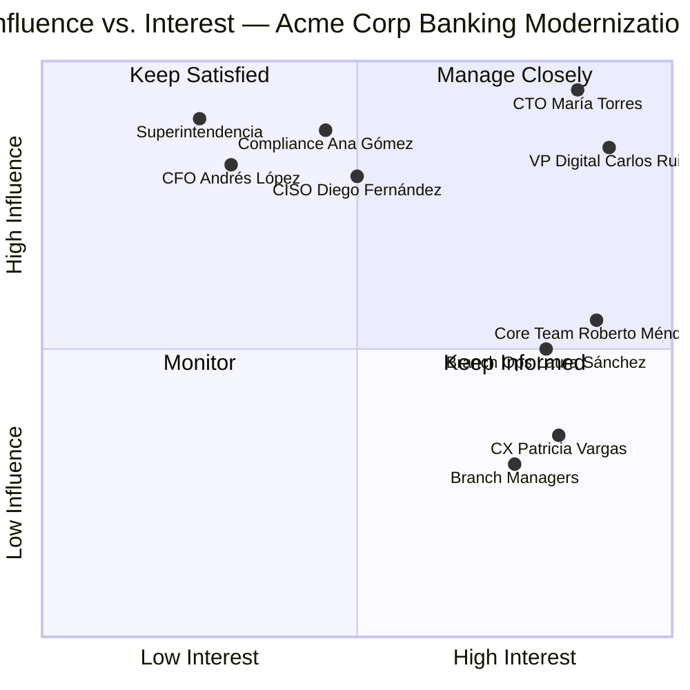

# A-01 Stakeholder Map — Acme Corp Banking Modernization

**Proyecto:** Modernización de Core Bancario — Acme Corp
**Fecha:** 12 de marzo de 2026
**Variante:** Técnica (full)
**Modo:** piloto-auto

---

## S1: Stakeholder Identification & Hidden Stakeholder Detection

### Stakeholder Register

| # | Nombre / Rol | Categoría | Departamento | Influencia | Interés | Actitud |
|---|---|---|---|---|---|---|
| 1 | María Torres — CTO | Sponsor ejecutivo | Tecnología | Alta | Alta | + |
| 2 | Carlos Ruiz — VP Digital Banking | Decision-maker | Banca Digital | Alta | Alta | + |
| 3 | Ana Gómez — Head of Compliance | Decision-maker | Cumplimiento | Alta | Media | ? |
| 4 | Roberto Méndez — Core Banking Team Lead | Implementer | Tecnología | Media | Alta | + |
| 5 | Laura Sánchez — Head of Branch Operations | Affected party | Operaciones | Media | Alta | - |
| 6 | Diego Fernández — CISO | Decision-maker | Seguridad | Alta | Media | ? |
| 7 | Patricia Vargas — Head of Customer Experience | End user champion | CX | Baja | Alta | + |
| 8 | Andrés López — CFO | Sponsor financiero | Finanzas | Alta | Baja | ? |
| 9 | Juana Castillo — Branch Managers (grupo, 42 personas) | End users | Sucursales | Baja | Alta | - |
| 10 | Superintendencia Financiera | Regulador externo | Externo | Alta | Baja | Neutral |

### Hidden Stakeholders Detected

- **Snowball method:** Roberto Méndez identified the legacy vendor (TechLedger Inc.) as a critical external stakeholder — they control migration tooling and hold institutional knowledge of the current core.
- **Meeting archaeology:** Review of 2024 failed migration attempt attendee lists revealed the Head of Internal Audit (Fernando Reyes) blocked go-live; he was not on initial lists.
- **Budget trail:** Discretionary spend for branch hardware upgrades sits with Laura Sánchez, not IT — giving her unexpected veto power over rollout timelines.
- **Veto scan:** Ana Gómez (Compliance) can halt deployment if regulatory reporting formats change without 90-day pre-notification to the Superintendencia.

---

## S2: Influence-Interest Matrix

### Quadrant Chart

### Engagement Strategies by Quadrant

| Quadrant | Stakeholders | Strategy |
|---|---|---|
| **Manage Closely** (High Power / High Interest) | María Torres (CTO), Carlos Ruiz (VP Digital) | Weekly 1:1, co-creation in design reviews, early access to prototypes, executive steering committee |
| **Keep Satisfied** (High Power / Low Interest) | Ana Gómez (Compliance), Andrés López (CFO), Diego Fernández (CISO), Superintendencia | Monthly executive briefings, no surprises, escalation path for blockers, compliance sign-off gates |
| **Keep Informed** (Low Power / High Interest) | Roberto Méndez, Laura Sánchez, Patricia Vargas, Branch Managers | Bi-weekly newsletter, demo sessions, feedback channels, champion program invitations |
| **Monitor** (Low Power / Low Interest) | General staff, external vendors (non-critical) | Quarterly town halls, intranet updates |

### Coalition Map

- **Core Alliance:** María Torres + Carlos Ruiz + Roberto Méndez — technically aligned, budget-empowered, execution-ready.
- **Persuasion Targets:** Ana Gómez (needs regulatory compliance guarantees), Diego Fernández (needs security architecture review).
- **Resistance Pocket:** Laura Sánchez + Branch Managers — fear disruption to daily operations and job redefinition.
- **Minimum Winning Coalition:** CTO + VP Digital + Compliance sign-off + CFO budget approval.

---

## S3: RACI Matrix

| Deliverable | CTO (María) | VP Digital (Carlos) | Compliance (Ana) | Core Team Lead (Roberto) | Branch Ops (Laura) | CISO (Diego) | CFO (Andrés) |
|---|---|---|---|---|---|---|---|
| Architecture Design | C | A | C | R | I | C | I |
| Data Migration Plan | I | C | C | A | I | R | I |
| Security Assessment | C | I | C | R | I | A | I |
| Regulatory Filing | I | I | A | C | I | C | I |
| Branch Rollout Plan | I | C | I | R | A | I | I |
| Budget Approval | I | C | I | I | I | I | A |
| User Training Program | I | A | I | C | R | I | I |
| Go-Live Decision | A | R | C | C | C | C | I |

> **Validation:** Each row has exactly one "A". No stakeholder is overloaded with more than 2 Accountable assignments.

### Escalation Protocol

| Trigger | Escalation Path | Time Limit | Default Decision |
|---|---|---|---|
| RACI conflict between departments | VP Digital → CTO | 48 hours | CTO decides |
| Compliance blocker | Head of Compliance → CTO + Legal | 5 business days | Pause deployment until resolved |
| Budget overrun > 10% | CFO → Executive Committee | 72 hours | Defer non-critical features |
| Security vulnerability (Critical) | CISO → CTO → Board | 24 hours | Halt deployment |

---

## S4: Communication Plan

| Stakeholder Group | Channel | Frequency | Format | Owner | Key Messages |
|---|---|---|---|---|---|
| Executive Sponsors (CTO, CFO) | 1:1 meetings | Weekly | Verbal + 1-page brief | VP Digital | Progress vs. milestones, budget status, risk escalations |
| Steering Committee | Video call + deck | Bi-weekly | Executive dashboard (5 slides) | PMO | Phase progress, decisions needed, blockers |
| Compliance & Security | Formal memo + review session | Monthly + ad-hoc | Written report | Core Team Lead | Regulatory impact, security posture, audit readiness |
| Core Implementation Team | Stand-up + Slack channel | Daily | Verbal + async | Core Team Lead | Sprint goals, blockers, integration status |
| Branch Managers (42) | Town hall + newsletter | Monthly + bi-weekly | Video + email digest | Branch Ops Lead | Timeline, training schedule, what changes for them |
| Branch Staff (500+) | Intranet + email | Monthly | FAQ + video tutorials | CX Team | What's changing, when, how to get help |
| Superintendencia | Formal written submission | Per regulatory calendar | Official filing | Compliance Lead | System change notifications, reporting continuity |
| Vendor (TechLedger) | Project sync | Weekly | Meeting minutes | Core Team Lead | Migration milestones, data handoff, SLA adherence |

### Crisis Communication Protocol

- **Trigger:** Unplanned downtime > 2 hours, data integrity issue, regulatory breach risk.
- **Rapid notification:** CTO + Compliance + CISO within 30 minutes via phone.
- **Holding statement template:** Pre-approved by Legal for branch and customer-facing channels.
- **Post-incident:** Root cause communicated within 48 hours to all stakeholder groups.

---

## S5: Change Readiness Assessment

### Adoption Curve Mapping

| Segment | Stakeholders | Readiness Score | Stage |
|---|---|---|---|
| Innovators (2.5%) | Carlos Ruiz, Roberto Méndez | 9/10 | Already advocating |
| Early Adopters (13.5%) | María Torres, Patricia Vargas | 8/10 | Supportive, need visibility |
| Early Majority (34%) | Core banking team (12 devs), select branch managers | 5/10 | Need proof points and training |
| Late Majority (34%) | Most branch managers, back-office staff | 3/10 | Will follow once peers adopt |
| Laggards (16%) | Laura Sánchez faction, long-tenure branch staff | 2/10 | Active or passive resistance |

### Resistance Archetypes Identified

| Archetype | Who | Response Strategy |
|---|---|---|
| **The Skeptic** | Ana Gómez (Compliance) | Provide regulatory impact analysis, invite to architecture review. Data-driven conversion. |
| **The Blocker** | Laura Sánchez (Branch Ops) | Acknowledge branch disruption fears. Give her ownership of rollout sequencing. Escalate to CTO if persists past Phase 2. |
| **The Passive Resister** | 8-10 branch managers (unnamed) | Assign explicit adoption commitments with weekly check-ins. Make participation visible. |
| **The Mourner** | Long-tenure staff (15+ years) | Acknowledge what's being lost (legacy expertise). Create "Legacy Champions" role to honor institutional knowledge during migration. |
| **The Saboteur** | Not yet identified | Monitoring via sentiment tracking (S6). If detected: private confrontation, clear consequences, CTO intervention. |

### Champion Network

| Champion | Department | Role in Change | Activation |
|---|---|---|---|
| Carlos Ruiz | Digital Banking | Executive champion — visible advocacy | Steering committee presentations, internal blog posts |
| Roberto Méndez | Core Team | Technical champion — demonstrates feasibility | Demo sessions, pair programming with skeptics |
| Patricia Vargas | CX | User champion — connects to customer value | Branch visit program, customer story collection |

---

## S6: Engagement Monitoring

### Sentiment Tracking Plan

| Method | Frequency | Target Group | Owner |
|---|---|---|---|
| Pulse survey (5 questions, anonymous) | Bi-weekly | All stakeholders | PMO |
| 1:1 informal check-ins | Weekly | Key stakeholders (top 6) | VP Digital |
| Meeting observation (body language, participation) | Every steering committee | Steering committee members | PMO |
| Slack channel sentiment analysis | Continuous | Core team | Core Team Lead |

### Relationship Health Dashboard

| Stakeholder | Current Status | Trend | Action Needed |
|---|---|---|---|
| María Torres (CTO) | :green_circle: Green | Stable | Maintain weekly cadence |
| Carlos Ruiz (VP Digital) | :green_circle: Green | Stable | Leverage as champion |
| Ana Gómez (Compliance) | :yellow_circle: Yellow | Flat | Schedule deep-dive on regulatory concerns |
| Roberto Méndez (Core Lead) | :green_circle: Green | Improving | Empower with decision authority |
| Laura Sánchez (Branch Ops) | :red_circle: Red | Declining | CTO intervention needed. Ownership offer for rollout. |
| Diego Fernández (CISO) | :yellow_circle: Yellow | Flat | Present security architecture for review |
| Andrés López (CFO) | :yellow_circle: Yellow | Stable | Monthly budget actuals report |
| Branch Managers | :red_circle: Red | Declining | Town hall + pilot branch success stories |

### Early Warning Indicators

| Signal | Threshold | Response |
|---|---|---|
| Steering committee attendance drops | < 80% for 2 consecutive sessions | PMO escalates to CTO |
| Pulse survey response rate drops | < 50% | Simplify survey, personal outreach |
| Key stakeholder goes silent (no response in 2 weeks) | 14 days no engagement | 1:1 outreach by sponsor |
| Escalation frequency spikes | > 3 escalations per week | Root cause analysis, process review |
| Branch pilot adoption rate | < 60% in first 30 days | Adjust training, add on-site support |

### Refresh Cadence

- **Full stakeholder map refresh:** Every phase gate (approximately quarterly).
- **Influence-interest matrix update:** Monthly or after any organizational change.
- **RACI validation:** At each phase transition.
- **Communication plan review:** Monthly.

---

*Generado por stakeholder-mapping skill v6.0 — MetodologIA Discovery Framework*
