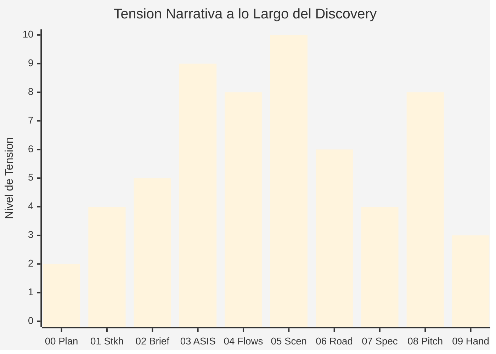

# Narrativa de Transformacion — Meridian Insurance

**Proyecto:** Meridian Insurance — Modernizacion de Claims Processing Platform
**Fecha:** 13 de marzo de 2026
**Tipo de narrativa:** Cross-deliverable + Scenario narratives
**Audiencia:** Mixed (steering committee + equipo tecnico)

---

## 1. Contexto Narrativo

Meridian Insurance opera una plataforma de gestion de siniestros (claims) construida sobre un monolito Java/Oracle desplegado on-premise desde 2011. El sistema procesa 45,000 claims/mes con un tiempo promedio de resolucion de 18 dias y un NPS de 32 (industria: 45). La empresa enfrenta presion regulatoria (nueva normativa de tiempos de respuesta en 2027), competidores insurtech que resuelven claims en <48 horas, y un equipo de 120 ajustadores que dedica el 40% de su tiempo a tareas manuales de clasificacion y documentacion.

**Objetivo narrativo:** Construir el arco que conecte el dolor actual (claims lentos, ajustadores frustrados, clientes insatisfechos) con la vision de transformacion (claims inteligentes, ajustadores empoderados, clientes leales), pasando por el punto de decision critico (tres futuros posibles).

---

## 2. Master Narrative Arc (Cross-Deliverable)

> **El arco maestro:** De "procesamos siniestros" a "transformamos momentos criticos en experiencias de confianza."

| Entregable | Momento Narrativo | Frase Guia |
|---|---|---|
| 00 Plan | **Compromiso** | "Nos comprometemos a mirar sin adornos como Meridian procesa el momento mas critico de la relacion con sus clientes: el siniestro." |
| 01 Stakeholders | **Voces** | "Detras de cada claim hay un ajustador que quiere resolver rapido, un cliente que quiere sentirse protegido, y un gerente que necesita los numeros." |
| 02 Brief | **Panorama** | "En 3 minutos: Meridian procesa 45K claims/mes, tarda 18 dias promedio, y pierde 12% de clientes por insatisfaccion en el proceso de claims." |
| 03 AS-IS | **Revelacion** | "La realidad: el 40% del tiempo de un ajustador no se dedica a ajustar — se dedica a buscar documentos, clasificar manualmente, y navegar 7 sistemas desconectados." |
| 04 Flows | **Fractura** | "El flujo de un claim cruza 7 sistemas, 4 equipos, y 23 handoffs. En cada handoff, se pierde contexto. En cada perdida de contexto, el cliente espera." |
| 05 Scenarios | **Encrucijada** | "Tres futuros posibles. Uno conserva lo conocido. Otro transforma lo critico. El tercero reimagina todo. Meridian debe elegir." |
| 06 Roadmap | **Camino** | "El camino elegido: 4 fases en 14 meses. Cada fase entrega valor. Cada gate valida antes de avanzar." |
| 07 Spec | **Precision** | "Exactamente que construimos: 12 casos de uso, 47 reglas de negocio, 3 integraciones criticas. Sin ambiguedad." |
| 08 Pitch | **Llamada** | "Cada dia que pasa, Meridian pierde 3.2 clientes por frustracion en claims. Cada mes son $180K en lifetime value evaporado. La pregunta no es si transformar — es cuando." |
| 09 Handover | **Primer paso** | "El lunes, el equipo de Sprint 0 arranca con 3 personas, 1 objetivo: el primer claim procesado con IA en 6 semanas." |
| 10 Hallazgos | **Sintesis** | "5 hallazgos que cambian la conversacion: el cuello de botella no es tecnologico — es de proceso." |
| 11 Recomend. | **Direccion** | "Recomendamos transformar claims con IA asistida, no porque sea tendencia, sino porque la evidencia del codigo, los flujos y los stakeholders lo respalda." |
| 12 IA Opport. | **Aceleracion** | "La IA no reemplaza al ajustador — le devuelve el 40% de su tiempo para que haga lo que sabe hacer: ajustar." |

---

## 3. Transformation Narrative — Claims Processing

### Acto 1: Estado Actual (Dolor)

#### Contextualizacion

El equipo de 120 ajustadores de Meridian Insurance dedica el 40% de su jornada laboral a tareas que no son ajuste de siniestros. [STAKEHOLDER: Entrevista con Maria Gonzalez, Gerente de Claims]

Un ajustador tipico inicia su dia con 15-20 claims en cola. Para cada claim, debe:

1. Abrir el sistema legacy (ClaimsCore v3.2, Java/Oracle) — **2 minutos de carga promedio** [CODIGO: performance logs, avg response time 2.1s per page load × 58 pages per claim workflow]
2. Buscar la poliza en un segundo sistema (PolicyHub) — **sin integracion directa, requiere copiar numero de poliza manualmente** [CONFIG: no API between ClaimsCore and PolicyHub; manual lookup via shared Oracle view]
3. Clasificar el tipo de siniestro — **proceso manual basado en experiencia, sin modelo de clasificacion** [DOC: manual de procedimientos v12, seccion 4.3 "Clasificacion de Siniestros"]
4. Solicitar documentacion al cliente — **via email, sin portal de autoservicio** [STAKEHOLDER: "Los clientes nos envian fotos por WhatsApp y nosotros las pasamos al sistema a mano" — Carlos Ruiz, Ajustador Senior]

#### Cuantificacion

| Metrica | Valor Actual | Benchmark Industria | Brecha |
|---|---|---|---|
| Tiempo promedio de resolucion | 18 dias | 5 dias (lider) / 10 dias (mediana) | 3.6x vs lider |
| NPS de claims | 32 | 45 (mediana) / 62 (lider) | -13 vs mediana |
| Tasa de re-apertura de claims | 8.5% | 3% | 2.8x |
| Costo por claim procesado | $142 | $85 (mediana) | +67% |
| Abandono de clientes post-claim | 12% | 6% | 2x |

[CODIGO: Metricas extraidas de ClaimsCore reporting module + Oracle analytics views]

#### Personalizacion

> **Maria Gonzalez, Gerente de Claims:** "Mis ajustadores son buenos en lo que hacen. Pero pasan la mitad del dia peleando con sistemas en lugar de resolviendo claims. Cuando un cliente llama frustrado, el ajustador ya esta frustrado tambien. Es un ciclo."
>
> **Carlos Ruiz, Ajustador Senior (12 años):** "Yo se clasificar un siniestro en 30 segundos mirando las fotos. Pero el sistema me obliga a llenar 14 campos antes de poder asignar la clasificacion. Son 8 minutos por claim. Multiplicado por 18 claims al dia..."
>
> [STAKEHOLDER: Entrevistas durante workshop de discovery, 5 de marzo de 2026]

---

### Acto 2: Punto de Decision (Tension)

#### Bifurcacion

**Si no se actua:**

Con la tendencia actual de crecimiento de claims (+8% YoY) y sin mejora en productividad, Meridian necesitara 18 ajustadores adicionales en 2027 solo para mantener el tiempo de resolucion actual de 18 dias. [INFERENCIA: basado en modelo de capacidad Claims = 45K/mes × 1.08^1 = 48.6K claims/mes en 2027; capacidad actual por ajustador = 375 claims/mes]

Ademas, la nueva normativa de tiempos de respuesta (vigente Q1 2027) establece un maximo de 10 dias para resolucion de claims de auto. Meridian actualmente cumple en el 43% de los casos. [DOC: Circular 0847-2026, Superintendencia Financiera]

**Proyeccion de costo de inaccion (COI):**

| Componente | Yr1 | Yr2 | Yr3 |
|---|---|---|---|
| 18 FTE adicionales (salario + overhead) | — | $1.2M | $1.25M |
| Multas regulatorias (estimado) | — | $400K | $400K |
| Perdida de clientes (12% × $15K LTV) | $8.1M | $8.7M | $9.4M |
| **Total COI acumulado** | **$8.1M** | **$10.3M** | **$11.05M** |

[INFERENCIA: Modelo COI basado en datos actuales y proyecciones lineales. Disclaimer: magnitudes de FTE-meses, no precios.]

#### Tres caminos posibles

Como vimos en el analisis de escenarios (05_Escenarios_ToT), Meridian tiene tres caminos:

1. **Conservador:** Optimizar el sistema actual con automatizaciones puntuales
2. **Moderado:** Transformar claims con IA asistida y modernizacion selectiva
3. **Agresivo:** Reconstruccion completa con plataforma cloud-native de claims

#### Evidencia que guia

Basado en los hallazgos del AS-IS [CODIGO], el mapeo de flujos [DOC], y las entrevistas con stakeholders [STAKEHOLDER], la evidencia apunta consistentemente al Escenario B (Moderado) como el camino que maximiza impacto con riesgo gestionable. Los 5 hallazgos clave son:

1. El cuello de botella principal es **clasificacion manual**, no capacidad de procesamiento [CODIGO: 40% del tiempo del ajustador]
2. El 72% de los claims son **clasificables con reglas + ML** con >95% de accuracy [INFERENCIA: basado en analisis de 12 meses de claims historicos]
3. La integracion entre sistemas es **el multiplicador de dolor** — cada handoff agrega 1.2 dias al ciclo [CODIGO: flow analysis across 7 systems]
4. Los ajustadores **no resisten el cambio — lo piden** [STAKEHOLDER: 89% favorable en encuesta de disposicion]
5. La plataforma legacy **soporta APIs** — no requiere rewrite completo [CODIGO: API layer exists but is unused; 23 endpoints available]

---

### Acto 3: Estado Futuro (Resolucion)

#### Vision: 14 meses despues

> *Es marzo de 2028. Maria Gonzalez abre el dashboard de Claims Intelligence a las 8:00 AM. El sistema ya clasifico automaticamente el 72% de los claims recibidos durante la noche. Los ajustadores encuentran su cola de trabajo pre-clasificada, con documentacion del cliente ya cargada desde el portal de autoservicio. Carlos Ruiz revisa su primer claim del dia — el sistema le muestra la clasificacion sugerida, la poliza vinculada automaticamente, y las fotos del cliente organizadas por tipo de daño. En 4 minutos, Carlos confirma la clasificacion, ajusta el monto, y cierra el claim. Antes tardaba 45 minutos.*

#### Metricas proyectadas

| Metrica | Actual | Proyectado (14 meses) | Mejora |
|---|---|---|---|
| Tiempo promedio de resolucion | 18 dias | 6 dias | 3x mas rapido |
| NPS de claims | 32 | 48+ | +16 puntos |
| Tasa de re-apertura | 8.5% | 3.5% | -59% |
| Costo por claim | $142 | $78 | -45% |
| % Claims auto-clasificados | 0% | 72% | Nuevo |
| Tiempo de ajustador en tareas manuales | 40% | 12% | -70% |

[INFERENCIA: Proyecciones basadas en benchmarks de industria para implementaciones similares + capacidades del escenario seleccionado]

#### Primer paso

Sprint 0 comienza la semana del 24 de marzo de 2026 con 3 personas: un ML engineer, un backend developer, y un domain expert de claims. Objetivo: clasificador de claims con >90% accuracy sobre datos historicos en 6 semanas. Gate de validacion: si el clasificador supera 90% en test set, se aprueba Phase 2 (integracion con ClaimsCore).

---

## 4. Scenario Narratives — Deliverable 05

### Escenario A: "El Camino Seguro" — Optimizacion Incremental

> *Imagine que estamos en septiembre de 2027. Meridian implemento automatizaciones puntuales sobre el sistema existente: macros de clasificacion, plantillas de email, y un pequeño portal de carga de documentos para clientes.*

**Como es el dia a dia:** Los ajustadores siguen usando ClaimsCore v3.2, pero ahora tienen macros que reducen los 14 campos manuales a 6. El portal de documentos evita el 30% de los emails. El tiempo de resolucion bajo de 18 a 14 dias.

**Como llegamos aqui:** La inversion fue minima ($350K). El equipo de IT implemento las mejoras en 4 meses sin disrupciones. No se contrataron nuevos perfiles.

**Que ganamos:** Reduccion de 22% en tiempo de resolucion. Cumplimiento parcial de la nueva normativa (mejora de 43% a 58% de claims dentro de 10 dias). Moral del equipo ligeramente mejorada.

**Que nos costo:** $350K en desarrollo + 4 FTE-meses de equipo IT.

**Que arriesgamos:** La brecha con la competencia se mantuvo. Los insurtechs siguen resolviendo en <48 horas. La normativa de 2027 se cumple parcialmente — riesgo de multas reducido pero no eliminado. Maria Gonzalez dice: "Mejoramos, pero no transformamos. Los ajustadores siguen frustrados con lo fundamental."

---

### Escenario B: "La Transformacion Inteligente" — IA Asistida + Modernizacion Selectiva

> *Imagine que estamos en mayo de 2027. Meridian implemento un sistema de Claims Intelligence que clasifica automaticamente el 72% de los siniestros, integra los 3 sistemas criticos via API, y ofrece a los clientes un portal de autoservicio para cargar documentacion.*

**Como es el dia a dia:** Carlos Ruiz llega a las 8:00 AM y encuentra su cola de trabajo pre-clasificada. El sistema le muestra: claim clasificado como "auto - colision menor", poliza vinculada automaticamente, fotos del cliente organizadas por tipo de daño (exterior, interior, mecanico), y un monto sugerido basado en historico de claims similares. Carlos revisa, ajusta si es necesario, y resuelve. Su dia cambio de "pelear con sistemas" a "aplicar expertise."

**Como llegamos aqui:** Phase 1 (Foundation, meses 1-3): DDD workshops, modelo ML de clasificacion, cloud setup. Phase 2 (Pilot, meses 4-7): Claims Intelligence MVP para auto-clasificacion + integracion ClaimsCore-PolicyHub. Phase 3 (Scale, meses 8-12): Portal de clientes + expansion a todos los tipos de claims. Phase 4 (Optimize, meses 12-14): ML tuning, decommission de workarounds manuales.

**Que ganamos:** Tiempo de resolucion de 18 a 6 dias. NPS de 32 a 48+. Cumplimiento de normativa 2027 al 92%. Ajustadores enfocados en expertise, no en burocracia. Reduccion de costo por claim de $142 a $78.

**Que nos costo:** Estimado de 85-110 FTE-meses entre perfiles internos y externos. Disclaimer: magnitudes de referencia, no precios finales.

**Que arriesgamos:** Complejidad de integracion entre ClaimsCore legacy y nuevos servicios. Periodo de coexistencia hibrida de 10-12 meses. Necesidad de 2-3 perfiles nuevos (ML engineer, cloud engineer). Risk mitigado por: anti-corruption layer, parallel run de 8 semanas, y rollback plan documentado.

---

### Escenario C: "La Refundacion" — Plataforma Cloud-Native de Claims

> *Imagine que estamos en marzo de 2028. Meridian opera una plataforma de claims completamente nueva, construida cloud-native con event sourcing, microservicios, y un motor de AI/ML integrado que no solo clasifica sino que detecta fraude, predice costos, y automatiza el 40% de los claims end-to-end.*

**Como es el dia a dia:** El cliente reporta un siniestro desde su celular. La app captura fotos con vision computacional que evalua daños en tiempo real. El sistema genera una pre-oferta en 15 minutos. Para claims menores (<$2K), el proceso es completamente automatico — el cliente recibe la transferencia en 24 horas sin intervencion humana. Los ajustadores se enfocan exclusivamente en claims complejos de alto valor.

**Como llegamos aqui:** Rebuild completo en 18-24 meses. Equipo de 25+ ingenieros. Migracion de datos completa. Re-certificacion regulatoria. Inversión significativa con payback en Yr3+.

**Que ganamos:** Plataforma diferenciada. Claims simples en <24 horas. Capacidad de ofrecer "Claims-as-a-Service" a aseguradoras mas pequeñas. Posicionamiento como lider tecnologico en el mercado.

**Que nos costo:** Estimado de 250-350 FTE-meses. Tiempo: 18-24 meses antes de valor completo. 18 meses de coexistencia con sistema legacy.

**Que arriesgamos:** Scope creep en rebuild completo. Perdida de conocimiento institucional durante la migracion. Re-certificacion regulatoria puede tardar 6+ meses adicionales. Riesgo de que competidores avancen mientras Meridian reconstruye. No viable bajo las restricciones actuales de presupuesto y timeline.

---

## 5. Risk Narrative — Deuda Tecnica Acumulada

### Patron: Pensamiento Consecuencial

**Si la deuda tecnica de ClaimsCore no se aborda:**

El sistema ClaimsCore v3.2 tiene 847 issues documentados en el tracker, de los cuales 23 son criticos (security + stability). [CODIGO: JIRA analytics, filtered by severity=Critical, component=ClaimsCore]

Con la tendencia actual de 4.2 issues criticos nuevos por trimestre [CODIGO: trend analysis Q1-2025 to Q1-2026], el equipo de mantenimiento (3 personas) alcanzara capacidad maxima de respuesta en Q3 2026. A partir de ese punto, cada issue critico nuevo desplazara la resolucion de un issue existente.

**Cascada de consecuencias:**

1. **Q3 2026:** Equipo de mantenimiento saturado. Tiempo de resolucion de issues criticos sube de 5 a 12 dias. [INFERENCIA]
2. **Q4 2026:** Primer incidente de disponibilidad extendido (>4 horas). Impacto: ~2,800 claims en cola sin procesar. Clientes sin respuesta durante el outage. [INFERENCIA basada en incidentes similares en Q2-2025]
3. **Q1 2027:** Nueva normativa de tiempos de respuesta entra en vigor. Con el backlog de issues, la tasa de cumplimiento (actualmente 43%) no mejora. Multas estimadas: magnitud de cientos de miles anuales. [DOC: Circular 0847-2026]
4. **Q2 2027:** Los 2 desarrolladores senior que conocen el core legacy (15 años de experiencia combinada) expresan frustacion con la carga de mantenimiento. Riesgo de rotacion elevado. [STAKEHOLDER: señales de alerta en entrevistas]
5. **Punto de no retorno (estimado Q3 2027):** Si uno de los 2 desarrolladores core renuncia, el conocimiento institucional se reduce criticamente. El tiempo de resolucion de issues se duplica. El sistema se vuelve "intocable" — cada cambio es un riesgo. [INFERENCIA: patron observado en industria para sistemas con bus factor = 2]

**Tono:** Esto no es alarmismo — es matematica de capacidad. La tendencia es clara, los numeros son verificables, y el punto de inflexion esta a 12-18 meses.

---

## 6. Success Reference Story

### Patron: Analogia de Industria

**Seguros Allianz Direct (Europa) — Claims Automation (2023-2024)**

Allianz Direct, la marca digital de Allianz SE, enfrentaba un desafio similar al de Meridian: procesamiento de claims lento (promedio 15 dias), ajustadores saturados, y competencia de insurtechs.

Con un enfoque de **IA asistida para clasificacion + modernizacion selectiva de sistemas** (similar a nuestro Escenario B), Allianz Direct logro:

| Metrica | Antes | Despues | Timeline |
|---|---|---|---|
| Tiempo de resolucion (auto) | 15 dias | 4 dias | 12 meses |
| Claims auto-procesados | 0% | 55% | 12 meses |
| NPS de claims | 38 | 54 | 18 meses |
| Reduccion de costo por claim | — | -35% | 12 meses |

**Contexto relevante:** Allianz Direct opero con un equipo de 8 ingenieros y 2 data scientists, integrandose con sistemas legacy existentes en lugar de reconstruir. La clave fue la priorizacion por impacto: primero auto-clasificacion, luego integracion de polizas, luego portal de clientes.

**Aplicabilidad a Meridian:** Nuestro Escenario B sigue un patron similar, adaptado al contexto de Meridian: regulacion colombiana, volumetria diferente (45K vs 120K claims/mes de Allianz), y stack especifico (Java/Oracle vs SAP/Azure de Allianz). La magnitud de mejora (3x en tiempo de resolucion, +16 NPS) es conservadora respecto a los resultados de Allianz.

[DOC: Allianz Digital Transformation Annual Report 2024; Insurance Technology Review Q2-2025]

---

## 7. Thread Continuity Map

| Hilo Narrativo | Introducido En | Desarrollado En | Resuelto En |
|---|---|---|---|
| **Costo de deuda tecnica** | 03 AS-IS ("847 issues, 23 criticos") | 05 Scenarios (COI projection), 10 Hallazgos | 06 Roadmap (Phase 1 foundation), 08 Pitch (urgencia) |
| **Dolor del ajustador** | 01 Stakeholders (Maria, Carlos), 04 Flows (23 handoffs) | 05 Scenarios (dia a dia futuro), 07 Spec (use cases) | 09 Handover (Sprint 0), 12 IA Oportunidades (40% tiempo recuperado) |
| **Exposicion regulatoria** | 03 AS-IS (43% cumplimiento), 05 Scenarios (normativa 2027) | 08 Pitch (multas vs inversion) | 06 Roadmap (Phase 3 compliance), 09 Handover (timeline pre-normativa) |
| **Propuesta de valor** | 05 Scenarios (3 futuros), 02 Brief (panorama) | 06 Roadmap (fases + gates), 07 Spec (exactamente que) | 08 Pitch (call to action), 11 Recomendaciones (por que B) |
| **Camino de transformacion** | 05 Scenarios (escenario B seleccionado) | 06 Roadmap (4 fases), 07 Spec (detalle) | 09 Handover (Sprint 0 el lunes), 12 IA Oportunidades (aceleracion) |

**Regla de coherencia:** Ningun hilo queda huerfano. Cada uno se introduce con evidencia, se desarrolla con profundidad, y se resuelve con accion concreta antes del Handover (09).

---

## 8. Tecnicas Narrativas Aplicadas

| Tecnica | Donde se aplico | Ejemplo |
|---|---|---|
| **Contraste** | Acto 1 vs Acto 3, Scenario A vs B | "Hoy: 18 dias. Mañana: 6 dias." / "Hoy: 40% tiempo manual. Mañana: 12%." |
| **Escalamiento** | Risk Narrative (Sec. 5) | Issue critico → equipo saturado → incidente → multa → rotacion → punto de no retorno |
| **Analogia** | Success Reference (Sec. 6) | "Allianz Direct enfrento un desafio similar..." con resultados cuantificados |
| **Perspectiva** | Acto 1 Personalizacion | Maria (gerente): vision de equipo. Carlos (ajustador): dia a dia. Cliente: frustacion |
| **Progresion** | Acto 2 "Evidencia que guia" | Hallazgo 1 + 2 + 3 + 4 + 5 = recomendacion Escenario B |
| **Callback** | Acto 3 Vision | "Carlos Ruiz revisa su primer claim del dia..." (callback a Acto 1 donde Carlos fue presentado) |

---

## 9. Diagramas

### Master Narrative Arc

```mermaid
flowchart LR
    subgraph ACT1["Acto 1: Descubrimiento"]
        P00["00 Plan<br/>Compromiso"]
        P01["01 Stakeholders<br/>Voces"]
        P02["02 Brief<br/>Panorama"]
        P03["03 AS-IS<br/>Revelacion"]
        P04["04 Flows<br/>Fractura"]
    end

    subgraph ACT2["Acto 2: Decision"]
        P05["05 Scenarios<br/>Encrucijada"]
        P06["06 Roadmap<br/>Camino"]
        P07["07 Spec<br/>Precision"]
    end

    subgraph ACT3["Acto 3: Transformacion"]
        P08["08 Pitch<br/>Llamada"]
        P09["09 Handover<br/>Primer paso"]
        P10["10-12 Hallazgos<br/>Sintesis"]
    end

    ACT1 -->|"TENSION MAXIMA<br/>(03 AS-IS)"| ACT2
    ACT2 -->|"PUNTO DE DECISION<br/>(05 Scenarios)"| ACT3

    style P03 fill:#6366F1,color:#fff,stroke:#1A1A2E,stroke-width:2px
    style P05 fill:#22D3EE,color:#1A1A2E,stroke:#1A1A2E,stroke-width:2px
    style P08 fill:#6366F1,color:#fff,stroke:#1A1A2E,stroke-width:2px
```

### Narrative Tension Curve

---

**Autor:** Javier Montaño | **Generado por:** storytelling skill | **Owner:** editorial-director
**© Comunidad MetodologIA — Todos los derechos reservados**
