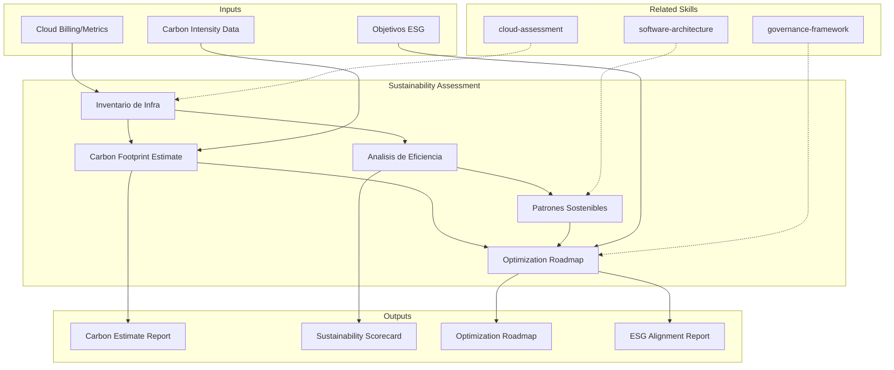

# Evaluacion de Sostenibilidad

Evaluacion de Green IT, estimacion de huella de carbono, analisis de eficiencia energetica
y recomendaciones de patrones de arquitectura sostenible.

## TL;DR

- Evalua impacto ambiental de infraestructura y arquitectura de software actual
- Estima huella de carbono de compute, storage, networking y desarrollo
- Identifica oportunidades de optimizacion energetica con impacto cuantificado
- Recomienda patrones de arquitectura sostenible (right-sizing, serverless, edge computing)
- Genera scorecard de sostenibilidad alineado con reportes ESG

## Inputs

Parse `$1` como **nombre del proyecto/organizacion**, `$2` como **scope de infraestructura**.

**Parameters:**
- `{MODO}`: `piloto-auto` (default) | `desatendido` | `supervisado` | `paso-a-paso`
- `{FORMATO}`: `markdown` (default) | `html` | `dual`
- `{VARIANTE}`: `ejecutiva` (~40%) | `tecnica` (full, default)

## Entregables

1. **Sustainability Scorecard** — Evaluacion por dimension (compute, storage, networking, development)
2. **Carbon Estimate** — Estimacion de huella de carbono con metodologia transparente
3. **Green Architecture Recommendations** — Patrones sostenibles aplicables al contexto
4. **Optimization Roadmap** — Plan de reduccion de impacto ambiental priorizado
5. **ESG Alignment Report** — Mapeo de iniciativas contra requisitos ESG

## Proceso

1. **Inventario de Infraestructura** — Mapear recursos de compute, storage, networking con utilizacion actual
2. **Estimacion de Carbon Footprint** — Calcular emisiones por categoria:
   | Categoria | Factores | Fuente de Datos |
   |---|---|---|
   | Compute | CPU/GPU hours x PUE x carbon intensity | Cloud provider reports, billing |
   | Storage | TB x replication factor x energy per TB | Storage inventory |
   | Networking | Data transfer x energy per GB | Traffic analysis |
   | Development | CI/CD pipeline runs, build compute | Pipeline metrics |
   | End user | Client-side compute, data transfer | Analytics data |
3. **Analisis de Eficiencia** — Identificar desperdicio:
   - Over-provisioned resources (utilization <20%)
   - Idle resources (dev/staging environments 24/7)
   - Redundant data copies y backups sin politica de retencion
   - Pipelines ineficientes (builds largos, tests redundantes)
4. **Patrones Sostenibles** — Recomendar segun contexto:
   - Right-sizing y auto-scaling
   - Serverless para workloads intermitentes
   - Edge computing para reducir data transfer
   - Region selection por carbon intensity del grid
   - Efficient algorithms y data structures
5. **Plan de Optimizacion** — Priorizar por reduccion de carbon x esfuerzo
6. **Alineacion ESG** — Mapear iniciativas contra frameworks de reporte (GRI, SASB)

## Criterios de Calidad

- [ ] Inventario de infraestructura completo con metricas de utilizacion
- [ ] Estimacion de carbon footprint con metodologia documentada y fuentes citadas
- [ ] Oportunidades de optimizacion cuantificadas (% reduccion estimado)
- [ ] Recomendaciones de arquitectura sostenible con trade-offs documentados
- [ ] Roadmap de optimizacion con quick wins y mejoras estructurales
- [ ] Alineacion con requisitos ESG si aplica
- [ ] Disclaimer sobre precision de estimaciones (orden de magnitud)

## Supuestos y Limites

- Estimaciones de carbon footprint son orden de magnitud, no mediciones precisas
- Factores de emision dependen de la region y el proveedor de cloud; se usan promedios publicados
- No reemplaza auditorias ambientales certificadas (ISO 14001)
- Datos de utilizacion de infraestructura son estimados si no existe monitoring activo

## Casos Borde

| Escenario | Estrategia de Manejo |
|---|---|
| Infraestructura on-premise sin datos de consumo energetico | Estimar usando specs de hardware y factores de PUE promedio de industria; marcar como [SUPUESTO] |
| Multi-cloud con proveedores en diferentes regiones | Calcular carbon intensity por region usando datos publicos de grid; reportar por proveedor y consolidado |
| Organizacion sin objetivos ESG definidos | Generar baseline de carbon footprint como punto de partida; proponer objetivos de reduccion basados en benchmarks de industria |
| Workloads de AI/ML con alto consumo de GPU | Evaluar por separado con factores de emision especificos para GPU; recomendar training scheduling en horas de baja carbon intensity |

## Decisiones y Trade-offs

| Decision | Habilita | Restringe | Justificacion |
|---|---|---|---|
| Estimacion por orden de magnitud en lugar de precision | Velocidad de assessment, accionabilidad | No sirve para reporte ESG formal | El objetivo es identificar oportunidades de optimizacion, no certificar emisiones |
| Right-sizing como primera recomendacion | Reduccion inmediata de costos y emisiones | Requiere monitoring de utilizacion | Over-provisioning es la fuente mas comun de desperdicio; impacto dual (costo + carbon) |
| Region selection por carbon intensity | Reduccion significativa de emisiones sin cambiar arquitectura | Puede impactar latencia para usuarios regionales | La diferencia de carbon intensity entre regiones puede ser 10x; se balancea con CDN |

## Knowledge Graph

## Output Templates

**Formato 1 — Markdown (default)**
- Filename: `Sustainability_Assessment_{project}_{WIP|Aprobado}.md`
- Estructura: Inventario > Carbon Estimate > Eficiencia > Patrones Sostenibles > Optimization Roadmap > ESG Alignment
- Incluye diagramas Mermaid de distribucion de carbon y decision tree

**Formato 2 — HTML (reporte ESG ejecutivo)**
- Filename: `Sustainability_Report_{project}_{WIP|Aprobado}.html`
- Estructura: Executive summary con metricas clave > Carbon footprint breakdown visual > Top 5 optimizaciones > Roadmap timeline
- Optimizado para presentacion a C-level y comite ESG

**Formato 3 — DOCX (bajo demanda)**
- Filename: `{fase}_sustainability_assessment_{cliente}_{WIP}.docx`
- Generado con python-docx y MetodologIA Design System v5. Portada con nombre del proyecto y fecha, TOC automático, encabezados Poppins navy, cuerpo Montserrat, acentos dorados, tablas zebra. Secciones: Inventario de Infraestructura, Carbon Footprint Estimate, Análisis de Eficiencia, Patrones Sostenibles, Optimization Roadmap, ESG Alignment Report.

**Formato 4 — PPTX (bajo demanda)**
- Filename: `{fase}_sustainability_assessment_{cliente}_{WIP}.pptx`
- Generado con python-pptx y MetodologIA Design System v5. Slide master con gradiente navy, títulos Poppins, cuerpo Montserrat, acentos dorados. Máximo 20 slides (ejecutiva). Speaker notes con referencias de evidencia. Slides: Portada, Resumen ejecutivo (sustainability scorecard), Carbon Footprint por categoría (gráfico), Top oportunidades de eficiencia, Green Architecture Recommendations, Optimization Roadmap (quick wins + estratégicos), ESG Alignment, próximos pasos.

**Formato 5 — XLSX (bajo demanda)**
- Filename: `{fase}_sustainability_assessment_{cliente}_{WIP}.xlsx`
- Generado via openpyxl con MetodologIA Design System v5. Encabezados con fondo navy y texto Poppins blanco, cuerpo en Montserrat, zebra striping en filas. Hojas: Infrastructure Inventory (recurso, tipo, región, utilizacion actual %, over-provisioned flag), Carbon Estimate (categoría, factor de emisión, unidad consumida, emisiones kgCO2e, fuente de dato), Efficiency Opportunities (recurso, tipo de desperdicio, reducción estimada %, impacto en carbon, prioridad), Green Architecture Patterns (patrón, aplicabilidad al contexto, reducción estimada, esfuerzo, trade-offs), Optimization Roadmap (iniciativa, horizonte, reducción kgCO2e, quick-win flag, owner). Conditional formatting por utilización (bajo/medio/alto) y nivel de prioridad de optimización. Auto-filters en todas las hojas. Valores directos sin fórmulas.

## Evaluacion

| Dimension | Peso | Criterio |
|-----------|------|----------|
| Trigger Accuracy | 10% | Activa triggers correctos ante keywords de sostenibilidad, carbon, green IT, ESG |
| Completeness | 25% | Cubre inventario, carbon estimate, eficiencia, patrones sostenibles y alineacion ESG |
| Clarity | 20% | Metodologia de estimacion es transparente; recomendaciones tienen impacto cuantificado |
| Robustness | 20% | Maneja on-premise sin datos, multi-cloud, workloads AI/ML, organizaciones sin ESG |
| Efficiency | 10% | Proceso no duplica inventario con otros assessments; escala con variante ejecutiva |
| Value Density | 15% | Optimizaciones tienen impacto dual (costo + carbon) cuantificado |

**Umbral minimo**: 7/10 en cada dimension para considerar el skill production-ready.

## Cross-References

- **metodologia-software-architecture:** Patrones arquitectonicos sostenibles como criterio de diseno
- **metodologia-cloud-assessment:** Inventario de infraestructura cloud como input para estimacion
- **metodologia-governance-framework:** Politicas ESG como parte del framework de gobernanza

---
**Autor:** Javier Montaño · Comunidad MetodologIA | **Version:** 1.0.0
