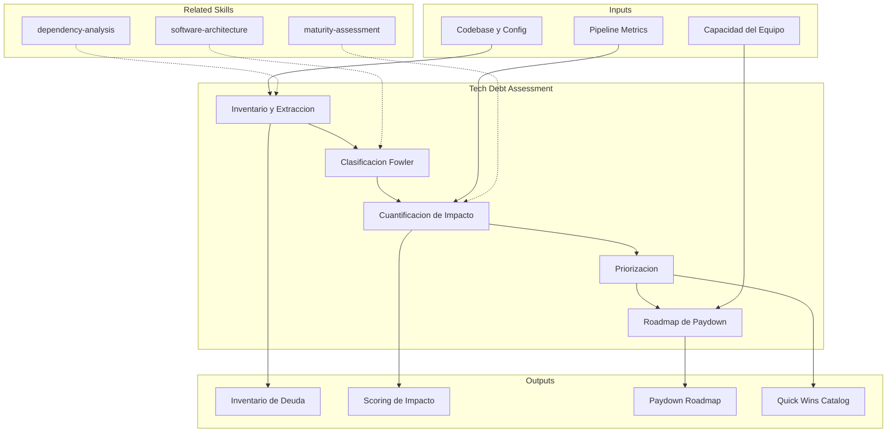

# Technical Debt Assessment

Quantification, classification, and prioritization of technical debt in software systems,
with business-impact-based remediation roadmap generation.

## Grounding Guideline

> *Technical debt is not a past mistake — it is a past decision that accrues interest paid today.*

1. **All debt accrues interest.** Every sprint that passes without paying technical debt increases its resolution cost.
2. **Classify before prioritizing.** Not all debt is equal — prudent debt with a payoff plan is different from reckless debt without awareness.
3. **Visibility as the first step.** If debt is not inventoried and quantified, it does not exist in planning and grows unchecked.

## TL;DR

- Inventories and classifies technical debt using the Martin Fowler quadrant (reckless/prudent x deliberate/inadvertent)
- Quantifies impact on development velocity, operational risk, and opportunity cost
- Prioritizes remediation using impact vs. effort scoring
- Generates paydown roadmap aligned with delivery cycles
- Produces complete inventory with traceable evidence per debt item

## Inputs

Parse `$1` as **project name**, `$2` as **repository or system to evaluate**.

**Parameters:**
- `{MODO}`: `piloto-auto` (default) | `desatendido` | `supervisado` | `paso-a-paso`
- `{FORMATO}`: `markdown` (default) | `html` | `dual`
- `{VARIANTE}`: `ejecutiva` (~40%) | `tecnica` (full, default)
- `{PROFUNDIDAD}`: `ejecutivo` | `tecnico` (default) | `exhaustivo`

## Deliverables

1. **Technical Debt Inventory** — Complete catalog with quadrant classification
2. **Impact Scoring** — Impact matrix on velocity, risk, and cost
3. **Paydown Roadmap** — Remediation plan prioritized by sprints/quarters
4. **Debt Dependency Map** — Mermaid diagram of relationships between debt items
5. **Executive Report** — Summary for non-technical stakeholders

## Process

1. **Inventory and Extraction** — Scan codebase, configurations, pipelines, and infrastructure to identify existing technical debt
2. **Quadrant Classification** — Categorize each item in the Fowler quadrant:
   - Deliberate/Prudent: "We know this is a shortcut, we will pay it off later"
   - Deliberate/Reckless: "We don't have time to design it well"
   - Inadvertent/Prudent: "Now we know how we should have done it"
   - Inadvertent/Reckless: "What is layered architecture?"
3. **Impact Quantification** — Evaluate each item against:
   - Impact on development velocity (drag coefficient)
   - Operational risk (probability x incident severity)
   - Opportunity cost (features not built due to friction)
4. **Prioritization** — Apply impact vs. effort scoring, identify quick wins and critical debt
5. **Paydown Roadmap** — Design remediation plan with:
   - Quick wins (high impact, low effort) for early sprints
   - Strategic remediation for subsequent quarters
   - Guardrails to prevent new debt accumulation
6. **Validation** — Verify inventory completeness and roadmap viability

## Quality Criteria

- [ ] Todo item de deuda tiene evidencia trazable [CODIGO], [CONFIG], [DOC], [INFERENCIA]
- [ ] Clasificacion por cuadrante justificada para cada item
- [ ] Scoring de impacto con criterios explicitos y reproducibles
- [ ] Roadmap alineado con capacidad real del equipo
- [ ] Quick wins identificados con ROI estimado
- [ ] Metricas de exito definidas para medir progreso de paydown
- [ ] Guardrails de prevencion documentados

## Assumptions & Limits

- Inventario depende de acceso al codebase, configuraciones y documentacion del sistema
- Cuantificacion de impacto en velocidad es estimada salvo que existan metricas de developer productivity
- Clasificacion por cuadrante Fowler es interpretativa — requiere contexto historico del equipo
- No reemplaza code review o static analysis — los complementa con perspectiva estrategica

## Edge Cases

| Escenario | Estrategia de Manejo |
|---|---|
| Sistema legacy sin documentacion ni conocimiento tribal disponible | Usar analisis estatico como fuente primaria; marcar inferencias como [INFERENCIA]; priorizar deuda que bloquea evolucion |
| Deuda tecnica deliberada reciente (decision consciente hace <3 meses) | Documentar pero no priorizar remediacion inmediata; verificar que existe ticket de paydown asociado |
| Equipo que normalizo la deuda ("siempre ha sido asi") | Cuantificar impacto en metricas concretas (deploy frequency, lead time, incident rate) para hacer visible el costo |
| Codebase con +100 items de deuda identificados | Aplicar Pareto agresivo: scoring de impacto para identificar el 20% que genera 80% del drag |

## Decisions & Trade-offs

| Decision | Habilita | Restringe | Cuando Usar |
|---|---|---|---|
| Inventario exhaustivo | Visibilidad completa | 3-5 dias de esfuerzo | Sistemas legacy criticos |
| Scan automatizado | Velocidad de assessment | Pierde deuda arquitectonica y de proceso | Evaluacion rapida o triaje inicial |
| Focus en quick wins | Impacto inmediato, genera momentum | Ignora deuda estructural profunda | Equipos con poca capacidad o buy-in inicial |
| Paydown incremental | No detiene delivery existente | Remediacion mas lenta | Equipos en produccion activa con SLAs estrictos |

## Knowledge Graph

## Output Templates

**Formato 1 — Markdown (default)**
- Filename: `Tech_Debt_Assessment_{project}_{WIP|Aprobado}.md`
- Estructura: Inventario > Clasificacion por Cuadrante > Scoring de Impacto > Quick Wins > Roadmap de Paydown > Guardrails de Prevencion
- Incluye diagramas Mermaid de cuadrante Fowler y roadmap

**Formato 2 — XLSX (inventario y tracking)**
- Filename: `Tech_Debt_Inventory_{project}_{WIP|Aprobado}.xlsx`
- Estructura: Sheet 1 (Inventario con cuadrante, impacto, esfuerzo, evidencia) > Sheet 2 (Roadmap de paydown por sprint) > Sheet 3 (Metricas de progreso)
- Optimizado para tracking operativo de remediacion y reporting a stakeholders

**Formato 3 — HTML (bajo demanda)**
- Filename: `Tech_Debt_Assessment_{project}_{WIP|Aprobado}.html`
- Estructura: HTML self-contained branded (Design System MetodologIA v5). Light-First Technical. Incluye cuadrante Fowler interactivo, heatmap de impacto vs esfuerzo, y roadmap de paydown por sprint con indicadores de quick wins. WCAG AA, responsive.

**Formato 4 — DOCX (bajo demanda)**
- Filename: `{fase}_{entregable}_{cliente}_{WIP}.docx`
- Generado con python-docx, Design System MetodologIA v5. Portada con logo y metadata del proyecto, TOC automático, encabezados/pies de página con marca. Tablas con zebra striping. Tipografía: Poppins para encabezados (navy), Trebuchet MS para cuerpo, acentos gold.

**Formato 5 — PPTX (bajo demanda)**
- Filename: `{fase}_tech_debt_assessment_{cliente}_{WIP}.pptx`
- Generado con python-pptx y MetodologIA Design System v5. Slide master con gradiente navy, títulos Poppins, cuerpo Trebuchet MS, acentos dorados. Máximo 20 slides (ejecutiva). Speaker notes con referencias de evidencia. Slides: Portada, Resumen ejecutivo, Cuadrante Fowler (clasificación visual), Scoring de Impacto (heatmap impacto vs esfuerzo), Quick Wins catalog, Roadmap de Paydown por trimestre, Guardrails de prevención, próximos pasos.

## Evaluacion

| Dimension | Peso | Criterio |
|-----------|------|----------|
| Trigger Accuracy | 10% | Activa triggers correctos ante keywords de deuda tecnica, remediacion, code quality |
| Completeness | 25% | Cubre inventario, clasificacion, scoring, roadmap y guardrails de prevencion |
| Clarity | 20% | Cada item de deuda tiene evidencia trazable y clasificacion justificada |
| Robustness | 20% | Maneja legacy sin docs, deuda normalizada, inventarios masivos |
| Efficiency | 10% | Proceso combina scan automatizado con revision manual sin redundancia |
| Value Density | 15% | Quick wins tienen ROI estimado; roadmap alineado con capacidad real del equipo |

**Umbral minimo**: 7/10 en cada dimension para considerar el skill production-ready.

## Cross-References

- **metodologia-dependency-analysis:** Dependencias desactualizadas como categoria de deuda tecnica
- **metodologia-maturity-assessment:** Deuda tecnica como indicador de madurez en desarrollo
- **metodologia-software-architecture:** Deuda arquitectonica como subcategoria critica del inventario

---
**Autor:** Javier Montaño · Comunidad MetodologIA | **Version:** 1.0.0
