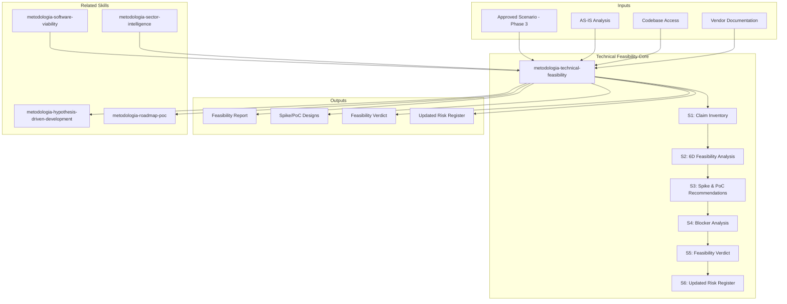

# Technical Feasibility: Fact-Checking & Multidimensional Feasibility Analysis

Validates the approved modernization scenario against hard evidence before committing resources.
Operates as a rigorous verification layer — the "red team" that stress-tests every technical claim,
assumption, and decision from the scenario analysis. Catches optimism bias, unfounded assumptions,
and hidden blockers BEFORE they become costly surprises in execution.

## Grounding Guideline

**You do not proceed by intuition. You proceed by evidence.** Every validation carries an explicit origin:
`[CODIGO]`, `[CONFIG]`, `[DOC]`, `[BENCHMARK]`, `[VENDOR-DOC]`, or `[INFERENCIA]`.
If there is no evidence, it is declared as an unvalidated assumption and escalated. Feasibility is not a formality — it is the last line of defense before committing budget and reputation to a transformation.

### Technical Validation Philosophy

1. **Evidence over optimism.** Every technical claim is validated against code, configuration, or real benchmarks. Inference is the last resort — never the first. Confirmation bias is the main enemy of feasibility analysis.
2. **The 6 dimensions are indivisible.** A technically brilliant project that ignores organizational capacity or regulatory compliance fails just the same. Partial feasibility is false feasibility.
3. **Escalating is strength, not weakness.** When evidence is insufficient to validate a claim, it is declared UNVALIDATED and a spike/PoC is recommended. Fabricating certainty where none exists is the most expensive way to fail.

## Inputs

Parse `$1` as **project name**, `$2` as **scenario name** (from Phase 3).
Requires: approved scenario from Phase 3, AS-IS analysis, flow mapping.
Recommended: codebase access, vendor documentation, benchmark data.

**Parameters:**
- `{MODO}`: `piloto-auto` (default) | `desatendido` | `supervisado` | `paso-a-paso`
  - **piloto-auto**: Auto para inventario de claims y análisis dimensional, HITL para veredicto de feasibility y recomendaciones de PoC.
  - **desatendido**: Zero interruptions. Veredicto automático. Assumptions documented.
  - **supervisado**: Autónomo con checkpoint en veredicto antes de entrega.
  - **paso-a-paso**: Confirma cada claim, cada dimensión, y el veredicto final.
- `{FORMATO}`: `markdown` (default) | `html` | `dual`
- `{VARIANTE}`: `ejecutiva` (~40% — S1 claims + S5 verdict only) | `técnica` (full 6D analysis, default)

## When to Use

- After Gate 1 (scenario approval), before Phase 4 (roadmap/cost)
- When a scenario relies on unproven technology choices
- When migration complexity is high (>5 integrations to change)
- When stakeholders question technical viability
- As due diligence before large investment decisions

## When NOT to Use

- Quick Reference variant (Phases 1,3,5b only)
- Scenarios with <3 months timeline (overhead exceeds value)
- Pure infrastructure migrations with no architecture change

## Delivery Structure: 6 Sections

### S1: Claim Inventory & Evidence Mapping

Extract every technical claim from the approved scenario and map to evidence:

| Claim | Source | Evidence | Status |
|---|---|---|---|
| "Microservices will reduce deployment time" | Phase 3 Scenario B | [INFERENCIA] — no deployment metrics in AS-IS | ⚠️ UNVALIDATED |
| "Event-driven decouples order flow" | Phase 3 Scenario B | [CÓDIGO] — OrderService has 7 sync calls | ⚠️ PARTIAL |
| "K8s handles auto-scaling" | Phase 3 Scenario B | [CONFIG] — no K8s experience in team | 🔴 AT RISK |

Classify each claim:
- ✅ **VALIDATED** — hard evidence supports the claim
- ⚠️ **UNVALIDATED** — plausible but no evidence; needs spike/PoC
- 🔴 **AT RISK** — evidence contradicts or no feasible path identified
- ❌ **REFUTED** — evidence directly contradicts the claim

### S2: Multidimensional Feasibility Analysis

Evaluate the scenario across 6 feasibility dimensions:

**D1: Technical Feasibility**
- Can the proposed architecture actually be built with the chosen stack?
- Are there proven patterns for this type of migration?
- What is the maturity of proposed technologies? (Gartner hype cycle position)
- Integration feasibility: can existing systems connect to proposed architecture?
- Data migration feasibility: can data be transformed and validated?

**D2: Organizational Feasibility**
- Does the team have (or can acquire) the skills needed?
- Is the org structure compatible with the target architecture? (Conway's Law)
- Change management capacity: how much change can the org absorb?
- Vendor/partner readiness: are external dependencies aligned?

**D3: Timeline Feasibility**
- Is the proposed timeline realistic given scope and team?
- Are there hard deadlines (regulatory, contractual) that constrain?
- What is the critical path and its vulnerability?
- Parallel work assumptions: are they realistic?

**D4: Financial Feasibility**
- Are the effort magnitude assumptions reasonable?
- Are there hidden cost drivers not accounted for?
- Is the phased funding structure viable?
- Opportunity cost of delay vs cost of transformation

**D5: Regulatory Feasibility**
- Does the target architecture comply with industry regulations?
- Are there data residency, privacy, or audit requirements?
- Certification timelines that constrain the schedule?

**D6: Operational Feasibility**
- Can the organization operate the target architecture?
- Monitoring, alerting, incident response for new stack
- Knowledge transfer from discovery team to operations
- Parallel running requirements and duration

Per dimension: score 1-5, evidence summary, risks, mitigations.

### S3: Spike & PoC Recommendations

For each UNVALIDATED or AT RISK claim, recommend a validation approach:

| Claim | Validation Method | Effort | Timeline | Success Criteria |
|---|---|---|---|---|
| K8s auto-scaling | PoC: deploy 1 service to K8s, load test | 2 sprints | Sprint 0 | <5min scale-up, <2% error rate |
| Event-driven decoupling | Spike: prototype order flow with events | 1 sprint | Sprint 0 | Async flow works for 3 use cases |

Classify each recommendation:
- **MUST-DO** — blocks Phase 4 if not validated
- **SHOULD-DO** — reduces risk significantly
- **COULD-DO** — nice to validate but acceptable risk

### S4: Blocker & Showstopper Analysis

Identify conditions that would STOP the project:

| Blocker | Type | Probability | Impact | Mitigation | Decision |
|---|---|---|---|---|---|
| Legacy DB cannot be migrated online | Technical | Medium | Critical | Dual-write pattern | MUST validate in Sprint 0 |
| No team member knows Kafka | Organizational | High | High | Training + hire 1 specialist | Budget impact |
| Regulatory approval takes 6+ months | Regulatory | Medium | Critical | Start process in parallel | Timeline impact |

For each blocker: if mitigation fails → what is the fallback scenario?

### S5: Feasibility Verdict

Synthesize all dimensions into a clear verdict:

```
FEASIBILITY VERDICT
═══════════════════
Scenario: {nombre}
Overall: FEASIBLE / FEASIBLE WITH CONDITIONS / NOT FEASIBLE

Dimensions:
  Technical:      [X]/5 — [rationale]
  Organizational: [X]/5 — [rationale]
  Timeline:       [X]/5 — [rationale]
  Financial:      [X]/5 — [rationale]
  Regulatory:     [X]/5 — [rationale]
  Operational:    [X]/5 — [rationale]

  Composite Score: [X.X]/5.0

Conditions (if FEASIBLE WITH CONDITIONS):
  1. PoC for [X] must succeed (Sprint 0)
  2. Hire [role] before Phase 2
  3. Regulatory process started by [date]

Recommendation:
  [PROCEED TO PHASE 4 / HOLD FOR SPIKES / PIVOT TO SCENARIO {alt}]
```

### S6: Updated Risk Register

Merge new risks discovered during feasibility analysis into the cumulative risk register:
- New risks from feasibility dimensions
- Upgraded risks (probability or impact increased)
- Mitigated risks (validated claims reduce risk)
- Kill criteria refined based on feasibility evidence

## Trade-off Matrix

| Decision | Enables | Constrains | When to Use |
|---|---|---|---|
| Full 6-dimension analysis | Maximum confidence | 2-3 days effort | High-investment scenarios |
| Tech-only feasibility | Fast, focused | Misses org/regulatory | Low-complexity, tech-driven |
| Spike-first approach | Evidence-based | Delays Phase 4 | Critical unvalidated claims |
| Paper analysis only | Fastest | Lower confidence | Time-constrained decisions |

## Assumptions & Limits

- Requires approved scenario from Phase 3 (or candidate scenario for pre-approval validation)
- Cannot replace actual PoC execution — recommends what to validate, not validates it
- Regulatory feasibility limited to what's detectable from code/docs; may need legal review
- Team skill assessment based on codebase evidence; may need HR/interview data

## Edge Cases

| Scenario | Response |
|---|---|
| All claims validated | Rare but possible — document evidence, proceed with confidence, reduce contingency |
| Multiple claims refuted | Recommend pivoting to alternative scenario from Phase 3 |
| No codebase access | Paper analysis only — mark all technical claims as [INFERENCIA], increase uncertainty |
| Scenario involves vendor product | Request vendor SLA/benchmarks — mark as [VENDOR-DOC] or [UNVALIDATED] |
| Time pressure to skip | Deliver abbreviated S1+S5 (claims + verdict). Flag risk of skipping full analysis |

## Edge Cases

| Case | Handling Strategy |
|------|---------------------|
| Todos los claims son validados (ningun riesgo identificado) | Caso raro; documentar evidencia exhaustivamente; proceder con alta confianza; reducir contingencia en presupuesto |
| Multiples claims refutados (>50% AT RISK o REFUTED) | Recomendar pivote a escenario alternativo de Phase 3; no proceder a Phase 4 sin escenario viable |
| Sin acceso al codebase (solo documentacion) | Paper analysis unicamente; marcar todos los claims tecnicos como [INFERENCIA]; incrementar incertidumbre; recomendar spike con acceso a codigo como prerequisito |
| Presion de tiempo para saltar feasibility | Entregar version abreviada S1+S5 (claims + veredicto); documentar explicitamente el riesgo de saltar analisis completo |

## Decisions & Trade-offs

| Decision | Discarded Alternative | Justification |
|----------|----------------------|---------------|
| Evaluar 6 dimensiones de feasibility (tecnica, organizacional, timeline, financiera, regulatoria, operacional) | Solo feasibility tecnica | Un proyecto tecnicamente brillante que ignora capacidad organizacional o compliance regulatorio fracasa igual; la feasibility parcial es feasibility falsa |
| Clasificar claims con 4 estados (VALIDATED, UNVALIDATED, AT RISK, REFUTED) | Binario (factible / no factible) | Los 4 estados permiten accion graduada: validados proceden, unvalidados necesitan spike, at risk necesitan mitigacion, refutados requieren alternativa |
| Disenar PoC para cada claim UNVALIDATED y AT RISK | Asumir que los claims son correctos y proceder | Los claims no validados son la fuente principal de sorpresas costosas en ejecucion; el PoC es inversion preventiva |

## Knowledge Graph



## Output Templates

**Formato MD (default):**

```
# Technical Feasibility — {proyecto} — {escenario}
## Resumen Ejecutivo
> Veredicto: [FEASIBLE / FEASIBLE WITH CONDITIONS / NOT FEASIBLE]. Claims: N validados, M en riesgo, K refutados.
## S1: Claim Inventory
| Claim | Source | Evidence | Status |
## S2: 6D Feasibility Analysis
| Dimension | Score (1-5) | Evidencia | Riesgos | Mitigaciones |
## S3: Spike & PoC Recommendations
| Claim | Validation Method | Effort | Timeline | Success Criteria | Priority |
## S4-S6: [secciones completas]
## Feasibility Verdict
```
FEASIBILITY VERDICT
...
```
```

**Formato DOCX (para comite de inversion):**

```
Seccion 1: Resumen Ejecutivo (1 pagina, veredicto + condiciones)
Seccion 2: Inventario de Claims (tabla con semaforo de status)
Seccion 3: Analisis 6D (una pagina por dimension con score, evidencia, riesgos)
Seccion 4: Blockers y Showstoppers (tabla con probabilidad, impacto, mitigacion)
Seccion 5: Spikes Recomendados (esfuerzo, timeline, success criteria)
Seccion 6: Veredicto y Recomendacion (proceed / hold / pivot)
Seccion 7: Risk Register Actualizado
Anexo: Cadena de Evidencia por Claim
```

**Formato XLSX (bajo demanda):**
- Filename: `{fase}_technical-feasibility_{cliente}_{WIP}.xlsx`
- Generado con openpyxl y MetodologIA Design System v5. Encabezados con fondo navy y texto Poppins blanco, formato condicional por status de claim (VALIDATED/UNVALIDATED/AT RISK/REFUTED) y score dimensional (1-5), auto-filtros en todas las columnas, valores calculados sin fórmulas. Hojas: Inventario de Claims, Análisis 6D, Spikes y PoC, Blockers, Risk Register.

**Formato PPTX (bajo demanda):**
- Filename: `{fase}_{entregable}_{cliente}_{WIP}.pptx`
- Generado con python-pptx y MetodologIA Design System v5. Slide master con gradiente navy, títulos en Poppins, cuerpo en Trebuchet MS, acentos gold. Máx 20 slides versión ejecutiva / 30 versión técnica. Notas del orador con referencias de evidencia por slide. Slides sugeridos: portada, resumen ejecutivo (veredicto), inventario de claims (semáforo), análisis 6D (radar chart), spikes y PoC prioritizados, bloqueadores y showstoppers, veredicto y recomendación, risk register actualizado.

## Evaluacion

| Dimension | Peso | Criterio | Umbral Minimo |
|-----------|------|----------|---------------|
| Trigger Accuracy | 10% | El skill se activa ante prompts de feasibility, validacion tecnica, due diligence, Phase 3b | 7/10 |
| Completeness | 25% | Todos los claims del escenario inventariados; 6 dimensiones scored con evidencia; PoC disenado para cada UNVALIDATED/AT RISK | 7/10 |
| Clarity | 20% | Veredicto es binario y justificado; condiciones son accionables; evidencia trazable a fuente | 7/10 |
| Robustness | 20% | Edge cases cubiertos (all validated, multiple refuted, no codebase, time pressure); blocker analysis con fallback scenarios | 7/10 |
| Efficiency | 10% | Variante ejecutiva vs tecnica correctamente aplicada; no se ejecuta analisis 6D completo cuando solo se necesita quick check | 7/10 |
| Value Density | 15% | Cada claim tiene evidence tag; spikes son MUST/SHOULD/COULD priorizados; risk register actualizado con nuevos riesgos de feasibility | 7/10 |

**Umbral minimo global: 7/10.** Si alguna dimension cae por debajo, el entregable requiere revision antes de entrega.

## Validation Gate

- [ ] Every technical claim from scenario inventoried with evidence status
- [ ] 6 feasibility dimensions scored with evidence
- [ ] Spike/PoC recommendations for all UNVALIDATED and AT RISK claims
- [ ] Blocker analysis complete with fallback scenarios
- [ ] Feasibility verdict with clear recommendation
- [ ] Risk register updated with feasibility findings
- [ ] Evidence tags present on all assertions

## Output Format Protocol

| Format | Default | Description |
|--------|---------|-------------|
| `markdown` | ✅ | Rich Markdown + Mermaid diagrams. Token-efficient. |
| `html` | On demand | Branded HTML (Design System). Visual impact. |
| `dual` | On demand | Both formats. |

Default output is Markdown with embedded Mermaid diagrams. HTML generation requires explicit `{FORMATO}=html` parameter.

## Output Artifact

**Primary:** `A-02_Technical_Feasibility_{project}.html` — Claim inventory, 6D feasibility, spikes, blockers, verdict, updated risk register.

### Diagrams (Mermaid)
- Flowchart: claim evidence chain (claim → evidence → verdict)
- Quadrant chart: feasibility dimensions positioning

---
**Autor:** Javier Montaño | **Última actualización:** 12 de marzo de 2026
