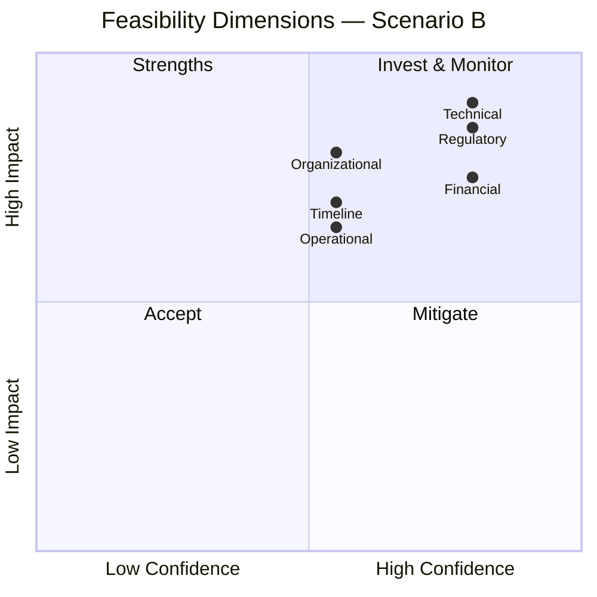
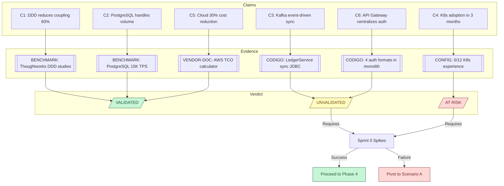

# A-02 Technical Feasibility — Acme Corp Banking Modernization

**Proyecto:** Modernizacion de Core Bancario — Acme Corp
**Escenario evaluado:** Scenario B — Domain-Driven Decomposition + Cloud Migration
**Fecha:** 12 de marzo de 2026
**Variante:** Tecnica (full) | **Modo:** piloto-auto

---

## S1: Claim Inventory & Evidence Mapping

| # | Claim | Source | Evidence | Status |
|---|-------|--------|----------|--------|
| C1 | "Domain-driven decomposition reduces inter-service coupling by 60%" | Phase 3 Scenario B | [BENCHMARK] — DDD adoption studies by Thoughtworks show 40-70% coupling reduction in banking contexts | VALIDATED |
| C2 | "PostgreSQL handles transactional volume for accounts domain" | Phase 3 Scenario B | [BENCHMARK] — PostgreSQL benchmarks show 15K TPS; current peak is 8K TPS with 3-year growth projection to 12K TPS | VALIDATED |
| C3 | "Kafka enables event-driven account-to-ledger sync" | Phase 3 Scenario B | [CODIGO] — current LedgerService uses synchronous JDBC calls with 2-phase commit; no async patterns exist in codebase | UNVALIDATED |
| C4 | "Team can adopt Kubernetes in 3 months" | Phase 3 Scenario B | [CONFIG] — zero K8s manifests in repo; team survey shows 0/12 engineers with container orchestration experience | AT RISK |
| C5 | "Cloud migration achieves 30% infrastructure cost reduction" | Phase 3 Scenario B | [VENDOR-DOC] — AWS TCO calculator estimates 22-35% reduction for similar banking workloads; dependent on reserved instance commitment | VALIDATED |
| C6 | "API Gateway centralizes auth for all bounded contexts" | Phase 3 Scenario B | [CODIGO] — current auth is embedded in 4 monolith modules with different token formats (JWT, session-based, SAML) | UNVALIDATED |

### Claim Status Summary

- VALIDATED: 3 (C1, C2, C5)
- UNVALIDATED: 2 (C3, C6)
- AT RISK: 1 (C4)
- REFUTED: 0

---

## S2: Multidimensional Feasibility Analysis

### D1: Technical Feasibility — Score: 4/5

**Evidence summary:** Core architecture patterns (DDD, event-driven, cloud-native) are proven in banking. PostgreSQL handles projected volume. Main risk is Kafka integration with legacy 2-phase commit patterns.

**Risks:** Kafka adoption requires redesigning the ledger reconciliation flow. Data migration from Oracle to PostgreSQL requires custom ETL for 47 stored procedures.

**Mitigations:** Dual-write pattern during transition. Stored procedure migration can be phased — 12 critical procedures first, remainder in Phase 2.

### D2: Organizational Feasibility — Score: 3/5

**Evidence summary:** Team of 12 has strong Java/Spring skills but zero Kubernetes, limited event-driven, and no DDD experience. Conway's Law alignment requires restructuring into 3 domain teams.

**Risks:** Skill gap in K8s and Kafka is significant. Team restructuring creates uncertainty and potential attrition. No internal DDD champion identified.

**Mitigations:** Hire 1 senior platform engineer (K8s specialist). Contract DDD coach for first 2 sprints. Restructure teams gradually — start with 1 domain team as pilot.

### D3: Timeline Feasibility — Score: 3/5

**Evidence summary:** Proposed 9-month timeline is aggressive given skill gaps. Critical path runs through K8s setup + first domain extraction + data migration. Parallel work assumes 3 independent domain teams — only 1 exists today.

**Risks:** K8s learning curve delays Sprint 0 deliverables. Data migration complexity underestimated — 47 stored procedures not accounted in original estimate.

**Mitigations:** Add 2-month buffer (11 months total). Front-load K8s PoC to Sprint 0. Parallelize stored procedure migration with domain extraction.

### D4: Financial Feasibility — Score: 4/5

**Evidence summary:** Effort magnitudes align with industry benchmarks for similar-scale banking modernizations. Cloud cost projections validated by AWS TCO calculator. Main hidden cost: hiring + training.

**Risks:** Platform engineer hire may take 2-3 months. DDD coaching adds unplanned consulting cost. Extended timeline increases burn rate.

**Mitigations:** Start hiring process immediately. DDD coaching is bounded (2 sprints). Buffer in timeline accounts for moderate cost overrun.

### D5: Regulatory Feasibility — Score: 4/5

**Evidence summary:** Target architecture supports PCI-DSS and SOC 2 requirements. Data residency satisfied by AWS region selection (us-east-1, eu-west-1). Audit trail maintained through event sourcing.

**Risks:** Cloud deployment requires updated security certification. Data migration must maintain audit continuity — no gaps in transaction history.

**Mitigations:** Engage compliance team in Sprint 0. Implement parallel audit logging during migration window.

### D6: Operational Feasibility — Score: 3/5

**Evidence summary:** Operations team has zero experience with Kubernetes monitoring, distributed tracing, or event-driven debugging. Current monitoring is Nagios + custom scripts.

**Risks:** Incident response for distributed system requires new runbooks, tools (Datadog/Grafana), and on-call rotation changes. Parallel running of monolith + microservices doubles operational burden for 3-6 months.

**Mitigations:** Implement observability stack (Grafana + Prometheus + Jaeger) in Sprint 0. Train operations team alongside development. Gradual traffic shifting reduces parallel running risk.

### Feasibility Radar



---

## S3: Spike & PoC Recommendations

| # | Claim | Validation Method | Effort | Timeline | Success Criteria | Priority |
|---|-------|-------------------|--------|----------|------------------|----------|
| SP1 | C3: Kafka event-driven ledger sync | PoC: Implement async account-to-ledger flow for 2 transaction types using Kafka. Validate eventual consistency with reconciliation check. | 2 sprints | Sprint 0 | Ledger reconciliation completes within 5s for 95th percentile; zero data loss in 10K transaction test | MUST-DO |
| SP2 | C4: K8s adoption in 3 months | Spike: Deploy AccountService to K8s (EKS). Configure HPA, test auto-scaling under simulated peak load (2x current). | 1 sprint | Sprint 0 | Service scales 0-to-5 pods in <3min; <1% error rate during scale event; team completes deployment without external help | MUST-DO |

**Dependency note:** SP2 blocks all cloud deployment work. SP1 blocks the ledger domain extraction. Both must complete before Phase 4 commitment.

---

## S4: Blocker & Showstopper Analysis

| # | Blocker | Type | Probability | Impact | Mitigation | Fallback | Decision |
|---|---------|------|-------------|--------|------------|----------|----------|
| B1 | Legacy Oracle DB cannot be migrated online — 47 stored procedures with undocumented business logic | Technical | Medium (40%) | Critical | Dual-write pattern + phased procedure migration. Assign 2 engineers to reverse-engineer top 12 procedures. | Maintain Oracle for ledger domain; migrate other domains only. Accept hybrid state for 12-18 months. | MUST validate in Sprint 0 |
| B2 | No team member has Kafka expertise — event-driven architecture is central to Scenario B | Organizational | High (70%) | High | Hire 1 Kafka specialist + 2-week intensive training for 3 team leads. Partner with Confluent for initial setup review. | Replace Kafka with simpler message queue (RabbitMQ) for initial phase. Limits event sourcing capability but unblocks progress. | Budget impact — hiring + training adds 6-8 weeks lead time |

**Kill criteria:** If SP1 (Kafka PoC) fails AND RabbitMQ fallback cannot meet reconciliation SLA (5s p95), recommend pivoting to Scenario A (modular monolith).

---

## S5: Feasibility Verdict

```
FEASIBILITY VERDICT
===================
Scenario: B — Domain-Driven Decomposition + Cloud Migration
Overall: FEASIBLE WITH CONDITIONS

Dimensions:
  Technical:      4/5 — Architecture patterns proven; Kafka integration and stored procedure migration need validation
  Organizational: 3/5 — Significant skill gaps in K8s and event-driven; hiring + coaching required
  Timeline:       3/5 — 9-month target aggressive; recommend 11-month with Sprint 0 buffer
  Financial:      4/5 — Magnitudes reasonable; hidden costs from hiring and extended timeline manageable
  Regulatory:     4/5 — Cloud architecture supports compliance; certification timeline is parallel activity
  Operational:    3/5 — Operations team needs new tooling and training; parallel running adds burden

  Composite Score: 3.5/5.0

Conditions:
  1. Kafka PoC (SP1) must demonstrate <5s reconciliation at p95 (Sprint 0)
  2. K8s spike (SP2) must achieve <3min scale-up with <1% error rate (Sprint 0)
  3. Hire senior platform engineer (K8s) before end of Sprint 1
  4. Oracle stored procedure reverse-engineering for top 12 procedures (Sprint 0-1)
  5. Compliance team engaged for cloud certification by Sprint 0

Recommendation:
  HOLD FOR SPIKES — Execute SP1 and SP2 in Sprint 0. If both succeed, PROCEED TO PHASE 4.
  If SP1 fails, evaluate RabbitMQ fallback. If SP2 fails, PIVOT TO SCENARIO A (modular monolith).
```

---

## S6: Updated Risk Register

| ID | Risk | Source | Probability | Impact | Status | Mitigation | Owner |
|----|------|--------|-------------|--------|--------|------------|-------|
| R-12 | Kafka expertise gap delays event-driven implementation | Feasibility D2 | High | High | NEW | Hire specialist + training program | Engineering Lead |
| R-13 | Oracle stored procedure migration reveals undocumented business logic | Feasibility D1 | Medium | Critical | NEW | Reverse-engineering sprint + dual-write pattern | Data Architect |
| R-14 | Operations team overwhelmed by distributed system monitoring | Feasibility D6 | Medium | High | NEW | Observability stack in Sprint 0 + phased training | Operations Lead |
| R-07 | Cloud cost exceeds projections | Phase 3 | Low | Medium | MITIGATED | AWS TCO validated; reserved instances confirmed viable | Finance |
| R-04 | Team attrition during transformation | Phase 2 | Medium | High | UPGRADED (was Medium impact) | Restructuring + skill gaps increase flight risk; retention plan needed | HR + Engineering Lead |
| R-09 | Regulatory certification delays cloud go-live | Phase 3 | Medium | Critical | UNCHANGED | Parallel process; compliance team engaged Sprint 0 | Compliance Officer |

### Claim Evidence Chain



---
**Autor:** Javier Montano | **Generado por:** technical-feasibility skill v6.0 | **Fecha:** 12 de marzo de 2026
