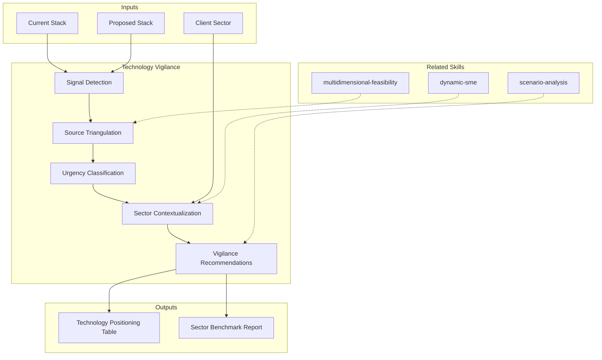

# Technology Vigilance: Proactive Technology Intelligence

Structured monitoring of the technology landscape to inform discovery decisions with up-to-date data on trends, maturity, adoption, and risks of proposed technologies.

## Grounding Guideline

**We do not propose technology based on what we know — we propose based on what the market shows.**

Technology vigilance is not "staying up to date." It is a systematic process of signal detection, classification by impact, and connection to ongoing architecture decisions.

### Vigilance Philosophy

1. **Signals before opinions.** A Gartner/Forrester data point or a Stanford HAI paper carries more weight than "I believe that...".
2. **Multiple sources, one synthesis.** A signal confirmed by 3+ independent sources is a trend. A signal from 1 source is a data point.
3. **Vigilance ≠ speculation.** We report what sources say, with citation. We do not predict the future.
4. **Sector context is mandatory.** A trend in FinTech does not apply equally in HealthTech. Always connect to the client's sector.

## Source Taxonomy

### Tier 1: Analyst Firms (Quantitative, Paid)
| Source | Key Product | Type | Access |
|--------|-------------|------|--------|
| **Gartner** | Magic Quadrant, Hype Cycle, Market Guide | Market quadrants, maturity cycles | Paywall (use public summaries + model knowledge) |
| **Forrester** | Wave, Total Economic Impact (TEI), Predictions | Vendor evaluations, ROI studies | Paywall (use public summaries) |
| **IDC** | MarketScape, FutureScape | Market share, quantitative trends | Paywall (use public summaries) |

### Tier 2: Open Sources (Qualitative, Free)
| Source | Key Product | Type | Access |
|--------|-------------|------|--------|
| **ThoughtWorks** | Technology Radar (biannual) | Adopt/Trial/Assess/Hold per quadrant | Open |
| **O'Reilly** | Radar Reports, Trends | Trends by domain | Partially open |
| **CNCF** | Landscape, Radar | Cloud-native ecosystem map | Open |
| **GitHub** | Octoverse, Trending | Language adoption, trending repos | Open |

### Tier 3: Academic and Standards
| Source | Key Product | Type | Access |
|--------|-------------|------|--------|
| **Stanford HAI** | AI Index Report (annual) | State of the art in AI, adoption metrics | Open |
| **IEEE** | Standards, Publications, Spectrum | Technical standards, research | Partial |
| **ACM** | Digital Library, CACM | Papers, surveys, state-of-the-art reviews | Partial |
| **arXiv** | Preprints | Frontier research | Open |

### Tier 4: Individual Thought Leaders
| Leader | Domain | Key Contribution | Source |
|--------|--------|------------------|--------|
| **Martin Fowler** | Architecture, Patterns | Refactoring, Microservices, CI/CD | martinfowler.com |
| **Paulo Caroli** | Lean Inception, Discovery | FunRetro, Lean Inception methodology | caroli.org |
| **Gregor Hohpe** | Enterprise Integration | Enterprise Integration Patterns, Cloud Strategy | architectelevator.com |
| **Jez Humble** | Continuous Delivery, DevOps | Accelerate, DORA metrics | continuousdelivery.com |
| **Sam Newman** | Microservices | Building Microservices, Monolith to Microservices | samnewman.io |
| **Kelsey Hightower** | Kubernetes, Cloud Native | K8s evangelism, simplification advocacy | Twitter/conf talks |
| **Charity Majors** | Observability | Observability Engineering, Honeycomb | charity.wtf |
| **Camille Fournier** | Engineering Management | The Manager's Path, org design | elidedbranches.com |
| **Liz Rice** | Container Security | Container Security book, eBPF | lizrice.com |
| **Eric Ries** | Lean Startup | Build-Measure-Learn, Innovation Accounting | theleanstartup.com |

## Delivery Structure

### S1: Vigilance Context

| Parameter | Value |
|-----------|-------|
| Client sector | {sector} |
| Current stack | {technologies} |
| Proposed stack | {technologies} |
| Vigilance horizon | Last 12 months |

### S2: Detected Signals

| # | Signal | Source(s) | Type | Urgency | Impact | Relevance |
|---|--------|----------|------|---------|--------|-----------|
| S1 | {signal} | Gartner 2025 + TW Radar | Confirmed trend | 🔴 High | Strategic | Direct |
| S2 | {signal} | Stanford HAI 2025 | Emerging data point | 🟡 Medium | Tactical | Indirect |
| S3 | {signal} | Fowler blog 2025 | Expert opinion | 🟢 Low | Informational | Contextual |

Urgency classification:
- 🔴 **High**: Signal that could change the discovery recommendation
- 🟡 **Medium**: Signal that should be considered in the roadmap
- 🟢 **Low**: Informational signal for context

### S3: Proposed Technology Positioning

For each technology in the proposed scenario:

| Technology | Gartner Position | TW Radar | GitHub Trend | CNCF Status | Verdict |
|-----------|-----------------|----------|-------------|-------------|---------|
| {tech1} | Slope of Enlightenment | Adopt | ↑ Trending | Graduated | ✅ Safe bet |
| {tech2} | Peak of Inflated Expectations | Trial | → Stable | Incubating | ⚠️ Validate with PoC |
| {tech3} | Trough of Disillusionment | Assess | ↓ Declining | — | 🔴 High risk |

### S4: Sector Benchmark

Sector-specific signals for the client:

| Area | Sector Trend | Source | Implication for Discovery |
|------|-------------|--------|--------------------------|
| {area} | {trend} | {source + year} | {direct implication} |

### S5: Relevant Thought Leaders

Opinions and frameworks from thought leaders relevant to the project:

| Leader | Relevant Position | Citation/Reference | Application |
|--------|------------------|-------------------|-------------|
| Martin Fowler | "Microservices prerequisites" | martinfowler.com/bliki/... | Validate prerequisites before migrating |
| Paulo Caroli | "Lean Inception for discovery" | Lean Inception, Ch. 3 | Apply lean inception to sprint 0 |

### S6: Vigilance Recommendations

| Priority | Recommendation | Based On | Action |
|----------|---------------|----------|--------|
| 🔴 MUST | {recommendation} | Signal S1 | Incorporate into scenario |
| 🟡 SHOULD | {recommendation} | Signal S2 | Consider in roadmap |
| 🟢 COULD | {recommendation} | Signal S3 | Document for reference |

## Source Mapping by Industry

| Sector | Specialized Sources | Sector Thought Leaders |
|--------|---------------------|----------------------|
| **Banking/FinTech** | Gartner Banking, Finastra, SWIFT, BIS | Chris Skinner, Brett King |
| **Health/HealthTech** | HIMSS, HL7/FHIR, WHO Digital | Eric Topol |
| **Retail/eCommerce** | Gartner Retail, NRF, Shopify Engineering | — |
| **SaaS/Cloud** | CNCF, Gartner Cloud, Flexera | Kelsey Hightower, Adrian Cockcroft |
| **Manufacturing** | Gartner Manufacturing, Industry 4.0, IIoT | — |
| **Government** | Gartner Gov, GovTech, NIST | — |
| **Energy** | IEEE Power, IEA, IRENA | — |
| **Telecom** | TM Forum, GSMA, 3GPP | — |

## When to Use

- Phase 0 (Plan): include relevant vigilance signals in discovery plan
- Phase 3 (Scenarios): validate proposed technologies against current landscape
- Phase 3b (Think Tank): feed updated radar data to the 7 Sages
- Standalone: technology landscape assessment for any engagement

## When NOT to Use

- Highly constrained environments where technology is fixed (regulatory, legacy lock-in)
- Express discovery (time constraint overrides depth)

## Trade-off Matrix

| Decision | Enables | Constrains | When to Use |
|---|---|---|---|
| Full multi-source vigilance | Comprehensive landscape view | 1-2 days effort | Strategic engagements, technology selection |
| Analyst-only (Gartner+Forrester) | Quantitative positioning | Misses open-source signals | Enterprise/vendor-driven decisions |
| Open-source only (TW+CNCF+GitHub) | Free, current | Misses enterprise analyst perspective | Cloud-native/startup contexts |
| Single thought leader deep-dive | Expert depth on specific topic | Narrow perspective | Targeted technology question |

## Output Configuration

- **Language**: Spanish (Latin American, business register — simple, clear, concise, direct)
- **Attribution**: Expert committee of the MetodologIA Discovery Framework
- **Tagline**: *"Construido por profesionales, potenciado por la red agéntica de MetodologIA."*

## Validation Gate

- [ ] Technology stack positioned against >=2 sources
- [ ] Signals classified by urgency and impact
- [ ] Sector context connected to general signals
- [ ] Thought leader opinions cited with source
- [ ] Recommendations linked to specific signals
- [ ] Evidence tags: [ANALYST], [ACADEMIC], [OPENSOURCE], [REFERENT]

## Output Artifact

**Primary:** `A-05_Technology_Vigilance_{project}.md`

### Diagrams (Mermaid)
- quadrantChart: technology positioning (maturity x adoption)
- timeline: signal detection timeline

## Edge Cases

| Case | Handling Strategy |
|------|---------------------|
| All analyst sources are behind paywalls and no public summaries exist for the requested technology | Use Tier 2 (ThoughtWorks Radar, CNCF, GitHub Octoverse) and Tier 4 (thought leaders) as primary sources; flag all findings as [OPENSOURCE] or [REFERENT]; recommend client purchase analyst access for validation |
| Technology is so new that no analyst firm has positioned it (pre-hype cycle) | Use academic sources (arXiv, IEEE, ACM) and GitHub trending; classify as "Emerging Signal — insufficient data for positioning"; recommend PoC-based validation |
| Client's sector has no specialized analyst coverage (niche industry) | Map to the closest covered sector; document the mapping rationale; flag all sector-specific conclusions as [INFERENCIA] with the parent sector cited |
| Conflicting signals across sources (e.g., Gartner says "Adopt", ThoughtWorks says "Hold") | Report both positions with full citation; analyze the disagreement (different evaluation criteria, different time horizons); recommend the client define their own evaluation weight set |

## Decisions & Trade-offs

| Decision | Discarded Alternative | Justification |
|----------|----------------------|---------------|
| Require minimum 2 independent sources to classify a signal as "trend" | Accept single-source signals as trends | Single-source signals carry high bias risk; the 2-source minimum forces corroboration and filters noise from genuine shifts |
| Include thought leader opinions as Tier 4 (lowest evidence weight) | Exclude individual opinions entirely | Thought leaders often signal shifts 12-18 months before analyst firms; their value is early detection, not confirmation |
| Always connect vigilance signals to the client's specific sector | Produce sector-agnostic technology reports | Sector-agnostic reports produce "interesting but irrelevant" outputs; sector connection is what transforms information into actionable intelligence |

## Knowledge Graph

## Output Templates

### Markdown (default)
- Filename: `A-05_Technology_Vigilance_{cliente}_{WIP}.md`
- Structure: TL;DR > Vigilance Context > Detected Signals table > Technology Positioning > Sector Benchmark > Thought Leader References > Recommendations > Mermaid quadrantChart

### HTML
- Filename: `A-05_Technology_Vigilance_{cliente}_{WIP}.html`
- Structure: MetodologIA Design System v4; interactive signal table with urgency color coding; embedded Mermaid quadrant and timeline; collapsible source citations

### DOCX (bajo demanda)
- Filename: `{fase}_{entregable}_{cliente}_{WIP}.docx`
- Generado con python-docx, Design System MetodologIA v5. Portada con logo y metadata del proyecto, TOC automático, encabezados/pies de página con marca. Tablas con zebra striping. Tipografía: Poppins para encabezados (navy), Trebuchet MS para cuerpo, acentos gold.

### XLSX (bajo demanda)
- Filename: `{fase}_technology-vigilance_{cliente}_{WIP}.xlsx`
- Generado con openpyxl y MetodologIA Design System v5. Encabezados con fondo navy y texto Poppins blanco, formato condicional por urgencia de señal (🔴/🟡/🟢) y veredicto de tecnología, auto-filtros en todas las columnas, valores calculados sin fórmulas. Hojas: Señales Detectadas, Posicionamiento de Tecnologías, Benchmark Sectorial, Thought Leaders, Recomendaciones.

### PPTX (bajo demanda)
- Filename: `{fase}_{entregable}_{cliente}_{WIP}.pptx`
- Generado con python-pptx y MetodologIA Design System v5. Slide master con gradiente navy, títulos en Poppins, cuerpo en Trebuchet MS, acentos gold. Máx 20 slides versión ejecutiva / 30 versión técnica. Notas del orador con referencias de evidencia por slide. Slides sugeridos: portada, contexto de vigilancia, señales detectadas (tabla con semáforo de urgencia), posicionamiento de tecnologías propuestas (quadrant chart), benchmark sectorial, thought leaders relevantes, recomendaciones priorizadas (MUST/SHOULD/COULD).

## Evaluacion

| Dimension | Peso | Criterio |
|-----------|------|----------|
| Trigger Accuracy | 10% | Descripcion activa triggers correctos sin falsos positivos |
| Completeness | 25% | Todos los entregables cubren el dominio sin huecos |
| Clarity | 20% | Instrucciones ejecutables sin ambiguedad |
| Robustness | 20% | Maneja edge cases y variantes de input |
| Efficiency | 10% | Proceso no tiene pasos redundantes |
| Value Density | 15% | Cada seccion aporta valor practico directo |

**Umbral minimo**: 7/10 en cada dimension para considerar el skill production-ready.

---
