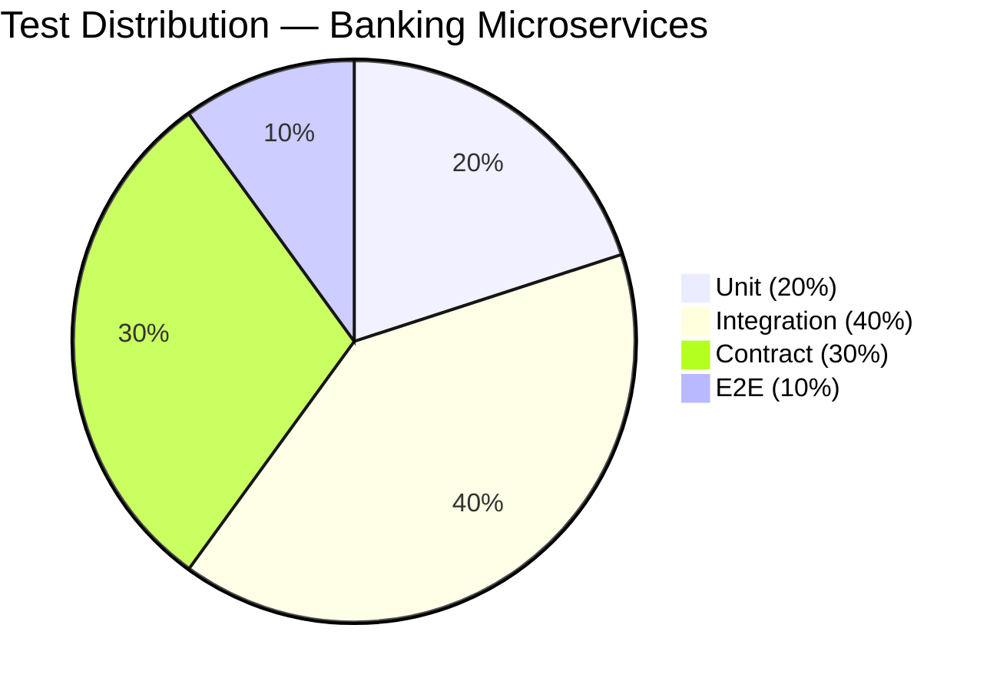
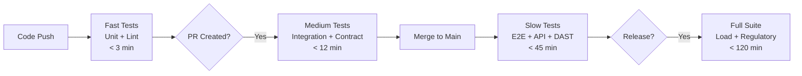
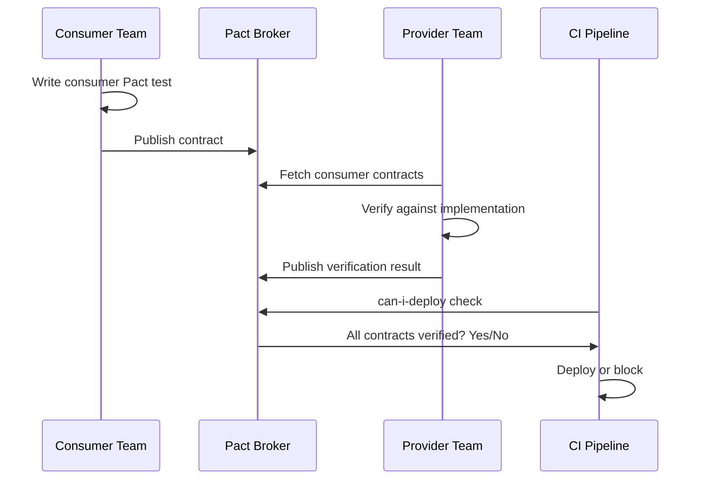

# A-01 Testing Strategy — Acme Corp Banking Modernization

> **Proyecto:** Acme Corp Banking Modernization | **Fecha:** 12 de marzo de 2026
> **Modo:** piloto-auto | **Variante:** tecnica (full)

---

## Executive Summary

Acme Corp's banking platform migration from COBOL mainframe to Java/Spring Boot microservices requires a comprehensive testing strategy. With 14 services, 6 Kafka topics, and 3 external integrations (credit bureau, fraud, KYC), the test diamond shape maximizes confidence at service boundaries. This document defines the test architecture, automation framework (JUnit 5 + Testcontainers + Pact), contract testing for all cross-service APIs, chaos engineering readiness plan, test data management for PII-regulated environments, and quality metrics with CI/CD gate integration.

---

## S1: Test Shape Selection & Pyramid Design

### Architecture Analysis

| Characteristic | Value | Implication |
|---------------|-------|-------------|
| Architecture style | Microservices (14 services) | Integration boundaries are the highest risk area |
| Communication | REST + Kafka async | Contract testing essential for both sync and async |
| External dependencies | 3 (Equifax, fraud provider, KYC) | Service virtualization needed |
| Data stores | PostgreSQL, Redis, Kafka, S3 | Testcontainers for integration fidelity |
| Regulatory | PCI-DSS, OCC, BSA/AML | Mandatory compliance test suite |

### Selected Shape: Test Diamond

| Test Level | Ratio | Estimated Count | Rationale |
|-----------|-------|----------------|-----------|
| Unit | 20% | ~600 | Interest calculations, validation rules, DTI formulas — pure business logic |
| Integration | 40% | ~1,200 | Service-to-database, service-to-Kafka, service-to-Redis interactions |
| Contract | 30% | ~900 | 14 services with 23 consumer-provider relationships |
| E2E | 10% | ~300 | 5 critical banking journeys (loan, payment, account open, transfer, statement) |

### Coverage Targets

| Scope | Target | Rationale |
|-------|--------|-----------|
| Business logic (calculations, rules) | >90% line coverage | Regulatory accuracy requirements |
| Service layer | >75% line coverage | Core behavior verification |
| Controller/API layer | >60% line coverage | Input validation, error handling |
| Overall | >70% line coverage | Floor, not ceiling |
| Mutation score (critical modules) | >80% | Validates test quality, not just quantity |

---

## S2: Test Automation Framework

### Framework Selection

| Level | Framework | Pattern | Rationale |
|-------|-----------|---------|-----------|
| Unit | JUnit 5 + Mockito | AAA (Arrange-Act-Assert) | Spring Boot native, team expertise |
| Integration | Spring Boot Test + Testcontainers | @SpringBootTest + real containers | PostgreSQL, Kafka, Redis in Docker |
| Contract | Pact (JVM) | Consumer-driven contracts | Decoupled deployment verification |
| API | REST Assured | BDD-style fluent API | Schema validation, response assertion |
| E2E | Playwright (Java) | Page Object Model | Cross-browser, banking portal flows |
| Performance | Grafana k6 | Threshold-based scenarios | CI-native, existing Grafana stack |
| Security | OWASP ZAP + Semgrep | DAST + SAST | PCI-DSS compliance requirement |

### Test Categorization & CI Triggers

| Category | Tests | Max Duration | Trigger | Failure Action |
|----------|-------|-------------|---------|---------------|
| Fast | Unit + lint + SAST | 3 min | Every push | Block push |
| Medium | Integration + contract + coverage | 12 min | PR create/update | Block merge |
| Slow | E2E + API regression + DAST | 45 min | Merge to main (nightly) | Alert team |
| Full | Load + regulatory + pen test report | 120 min | Pre-release | Block release |

### Test Data Factories — Banking Domain

| Factory | Generates | Key Attributes |
|---------|-----------|---------------|
| `LoanApplicationFactory` | Loan applications | amount, term, DTI ratio, credit score, product type |
| `CustomerFactory` | Customer profiles | SSN (synthetic), income, employment, address |
| `PaymentFactory` | Payment transactions | amount, currency, source/destination account, type |
| `AccountFactory` | Bank accounts | type (checking/savings/loan), balance, status, tier |
| `FraudScenarioFactory` | Fraud test cases | risk score, rule triggers, geographic anomalies |

---

## S3: Contract & API Testing

### Consumer-Provider Map

| Provider Service | Consumers | Contract Count | Protocol |
|-----------------|-----------|---------------|----------|
| Account Service | Web BFF, Mobile BFF, Payment Service, Loan Service | 8 | REST |
| Loan Origination | Web BFF, Mobile BFF, Partner API | 6 | REST |
| Payment Service | Web BFF, Mobile BFF, Account Service | 5 | REST |
| Fraud Detection | Loan Service, Payment Service | 2 | REST |
| KYC Service | Loan Service | 1 | REST |
| Event Bus (Kafka) | All consumers of loan.events, payment.events | 4 | Async (Avro) |

### Pact Workflow

### Event Contract Testing

| Topic | Schema Format | Registry | Compatibility Mode |
|-------|--------------|----------|-------------------|
| loan.events | Avro | AWS Glue Schema Registry | BACKWARD_COMPATIBLE |
| payment.events | Avro | AWS Glue Schema Registry | BACKWARD_COMPATIBLE |
| account.events | Avro | AWS Glue Schema Registry | BACKWARD_COMPATIBLE |
| fraud.alerts | Avro | AWS Glue Schema Registry | FULL_COMPATIBLE |

**Breaking change prevention:** Schema registry rejects incompatible changes. CI pipeline runs schema compatibility check before merging Avro schema modifications.

---

## S4: Performance & Chaos Testing

### Performance Testing in CI

| Scenario | Endpoint | Target | Regression Threshold |
|----------|----------|--------|---------------------|
| Loan application | POST /loans/apply | p95 <4s | >10% regression = block |
| Payment processing | POST /payments/process | p95 <300ms | >10% regression = block |
| Account lookup | GET /accounts/{id} | p95 <200ms | >10% regression = block |
| Fraud evaluation | POST /fraud/evaluate | p95 <400ms | >10% regression = block |

### Chaos Engineering Readiness

| Level | Practice | Environment | Timeline |
|-------|----------|-------------|----------|
| 1 - Learning | Kill individual pods, verify recovery | Staging | Month 1-3 |
| 2 - Automated | Inject network latency to credit bureau | Staging | Month 3-6 |
| 3 - Production canary | Terminate 1 of N pods during low-traffic | Production | Month 6-12 |
| 4 - Advanced | Game day: simulate AZ failure | Production | Month 12+ |

### Banking-Specific Failure Scenarios

| Scenario | Injection | Expected Behavior | Verification |
|----------|-----------|-------------------|-------------|
| Credit bureau timeout | 30s network delay | Circuit breaker opens, cached score used | Loan processed with cached data |
| Payment gateway down | Drop all traffic | Retry 3x, queue for later, notify customer | Payment queued, no double-charge |
| Database failover | Kill primary | Automatic failover to replica <30s | No transaction loss |
| Kafka broker failure | Kill 1 of 3 brokers | Rebalance, no message loss | All events delivered |
| Redis cache failure | Evict all keys | Graceful degradation to database | Higher latency but functional |

---

## S5: Test Data Management

### Strategy by Test Level

| Level | Database | Data Source | Isolation | Cleanup |
|-------|----------|-----------|-----------|---------|
| Unit | None (mocked) | In-memory builders | Complete | GC |
| Integration | Testcontainers PostgreSQL | Factories + Flyway migrations | Per-test container | Container destroyed |
| Contract | Mock server (Pact) | Contract-defined fixtures | Per-test | Pact cleanup |
| E2E | Shared staging DB | Seed scripts + factories | Transaction rollback | Post-suite cleanup |
| Performance | Production-scale staging | Anonymized production clone | Isolated environment | Snapshot restore |

### PII Handling — Regulatory Compliance

| Environment | PII Policy | Implementation |
|-------------|-----------|---------------|
| Development | Fully synthetic | Faker-generated SSN, names, addresses |
| Integration (CI) | Fully synthetic | Test data factories, no real data |
| Staging | Anonymized | Production data masked via ETL pipeline |
| Performance | Anonymized at scale | 1M anonymized records from production |
| Production | Real (protected) | Field-level encryption, access logging |

### Anonymization Pipeline

| Field | Original | Anonymized | Method |
|-------|----------|-----------|--------|
| SSN | 123-45-6789 | 999-88-0001 | Sequential replacement |
| Name | John Smith | Alejandro Rivera | Faker replacement (locale-aware) |
| Address | 123 Main St, NYC | 456 Oak Ave, Springfield | Faker replacement |
| Phone | 212-555-0100 | 555-000-0001 | Sequential replacement |
| Email | john@acme.com | user0001@test.acme.com | Pattern replacement |
| Account# | 9876543210 | Tokenized (Vault) | Tokenization |

---

## S6: Advanced Techniques & Quality Metrics

### Property-Based Testing — Financial Calculations

| Property | Module | Example |
|----------|--------|---------|
| Amortization total = principal + total interest | LoanCalculator | For any loan (amount, rate, term), sum of payments equals principal + interest |
| DTI ratio always 0-100% | DTICalculator | For any income and debt combination, DTI is between 0% and 100% |
| Payment reversal = original - reversed | PaymentProcessor | Process then reverse yields zero net effect |
| Interest rounding follows Reg Z | InterestEngine | Calculated APR matches disclosed APR per TILA |

**Tool:** jqwik (JUnit 5 native). Run nightly on critical financial modules.

### Mutation Testing

| Module | Target Score | Tool | CI Cadence |
|--------|-------------|------|-----------|
| LoanCalculator | >90% | PIT/pitest | Nightly |
| PaymentProcessor | >85% | PIT/pitest | Nightly |
| FraudRuleEngine | >85% | PIT/pitest | Nightly |
| DTICalculator | >90% | PIT/pitest | Nightly |

### Quality Metrics Dashboard

| Metric | Current | Target | Category |
|--------|---------|--------|----------|
| Line coverage | 55% | >75% | Leading |
| Mutation score (critical) | N/A | >85% | Leading |
| Flaky test rate | 8% | <2% | Leading |
| Contract coverage | 0% | >90% of boundaries | Leading |
| Escaped defect rate | 12% | <5% | Lagging |
| Production incidents | 3/week | <1/week | Lagging |
| MTTR | 4 hours | <1 hour | Lagging |
| Change failure rate | 18% | <5% | Lagging |

---

## Validation Checklist

- [x] Test diamond shape selected with banking microservices justification
- [x] Automation framework: JUnit 5, Testcontainers, Pact, Playwright, k6
- [x] Test categorization: fast/medium/slow with CI trigger mapping
- [x] Contract testing covers 23 consumer-provider relationships + 4 Kafka topics
- [x] Performance testing integrated into release process with regression thresholds
- [x] Test data strategy addresses PII compliance (synthetic in dev/CI, anonymized in staging)
- [x] Flaky test management: quarantine after 2 flakes, fix within sprint
- [x] Quality gates are specific and measurable (coverage, mutation, contract verification)
- [x] Mutation testing planned for 4 critical financial modules (>85% target)
- [x] Test maintenance budget: 15% of development time allocated

---
**Autor:** Javier Montaño — MetodologIA Discovery Framework v6.0
