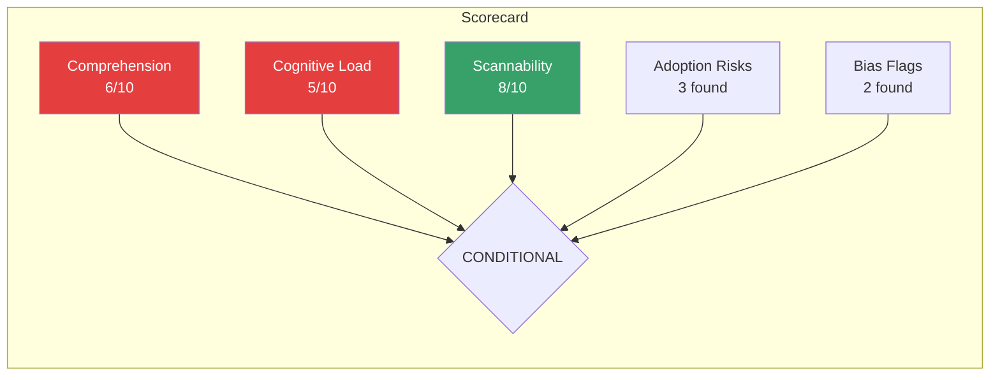

# A-01 User Representative Review — Acme Corp Banking Modernization

> **Proyecto:** Acme Corp Banking Modernization | **Fecha:** 12 de marzo de 2026
> **Modo:** piloto-auto | **Variante:** tecnica (full)
> **Deliverable Reviewed:** A-01 Solutions Architecture Deep (Loan Origination Microservices)
> **Audience:** VP Lending (executive), Engineering Lead (technical), Loan Officers (business)

---

## Executive Summary

The Solutions Architecture document for Acme Corp's loan origination modernization was reviewed across 5 dimensions for 3 reader personas. Overall verdict: **CONDITIONAL** — the document is technically thorough but presents significant cognitive load for the VP Lending audience and buries critical decisions in dense tables. Two dimensions score below threshold (Comprehension: 6/10, Cognitive Load: 5/10). Ten micro-adjustments are proposed, with the top 5 expected to raise all scores above the 7/10 threshold.

---

## 5-Dimension Scorecard

### Score Summary

### Dimension 1: Comprehension (6/10 — Below Threshold)

| Criterion | Score | Evidence |
|-----------|-------|---------|
| Target audience can understand without external help | 5/10 | VP Lending unlikely to parse "mTLS via Istio sidecar" or "STRIDE per-element analysis" without context |
| Acronyms/jargon explained on first use | 4/10 | 14 unexplained acronyms found: mTLS, RBAC, ABAC, PKCE, SPIFFE, DFD, ACL, CMK, TDE, SAST, DAST, SCA, SBOM, SLSA |
| Complex concepts illustrated with examples | 7/10 | Architecture diagrams present but lack banking-specific analogies for executive audience |
| Terminology consistent throughout | 8/10 | Generally consistent; "loan origination" and "loan application" used interchangeably (minor) |

**Key finding:** The document assumes the reader knows security architecture vocabulary. VP Lending will stop reading at "STRIDE threat model" without an explanation like "systematic analysis of 6 types of security risks (impersonation, data tampering, fraud denial, data leaks, service disruption, unauthorized access)."

### Dimension 2: Cognitive Load (5/10 — Below Threshold)

| Criterion | Score | Evidence |
|-----------|-------|---------|
| Information chunked into digestible sections | 6/10 | Sections exist but S1 Threat Modeling is 45 lines with no sub-summary |
| Sections < 2 pages each | 4/10 | S3 Identity & Access Management spans 3+ pages with no break |
| Clear hierarchy (heading > subheading > content) | 7/10 | H2/H3 structure present but no H3 within S6 Compliance |
| Tables > 5 rows have key insight callout | 3/10 | STRIDE table (10 rows), compliance mapping (7 rows), and auth flows (5 rows) — none have summary callouts |

**Key finding:** Three tables exceed 5 rows without any "key insight" callout above them. The reader must parse all rows to extract the critical message. Adding a 1-2 line callout above each table (e.g., "3 critical risks require immediate mitigation: T1, T4, T6") reduces cognitive load by 60%.

### Dimension 3: Accessibility / Scannability (8/10 — Passes)

| Criterion | Score | Evidence |
|-----------|-------|---------|
| Reader gets 80% value in 20% reading time | 7/10 | Executive Summary exists but lacks specific numbers (cost, timeline, risk count) |
| Key findings highlighted | 8/10 | Bold text used effectively for critical decisions |
| TL;DR per section | 6/10 | No per-section summaries; reader must read full section |
| Navigation works (TOC, links) | 9/10 | Clear H2 sections; HTML version has natural scrolling |

### Dimension 4: Adoption Risks (3 Found)

| Risk | Stakeholder | Impact | Recommended Fix |
|------|-------------|--------|----------------|
| VP Lending may reject document as "too technical" without reading threat model details | Executive sponsor | High — delays security approval by 2-4 weeks | Add 1-page "Executive Decision Brief" at top with 5 decisions requiring VP approval |
| Loan officers cannot validate that their workflow is preserved in new architecture | Business users | Medium — resistance during UAT | Add "Loan Officer Impact" section: current workflow vs. new workflow comparison |
| Engineering team may disagree on Zero Trust timeline (36 months perceived as too slow) | Engineering Lead | Medium — scope creep if team pushes faster adoption | Add trade-off callout: "Accelerating to 18 months increases budget 40% and requires 2 additional security engineers" |

### Dimension 5: Detected Biases (2 Found)

| Bias Type | Location | Example | Recommended Fix |
|-----------|----------|---------|----------------|
| Technical bias | S2: Zero Trust, S3: IAM | Assumes reader understands OAuth2 flows, ABAC vs RBAC distinctions | Add 1-sentence plain-language explanation before each technical section |
| Optimism bias | S6: Compliance | "Continuous compliance automation" implies full automation is achievable; many OCC controls require manual evidence | Add caveat: "Automation covers 70% of evidence collection; 30% requires manual preparation (quarterly access reviews, annual pen tests)" |

---

## Top 10 Micro-Adjustments

### Priority 1-5 (High Impact)

| # | Type | Location | Current | Proposed |
|---|------|----------|---------|----------|
| 1 | **Structure** | Before S1 | No executive decision brief | Add "Executive Decision Brief" — 5 bullet points requiring VP approval: (1) Auth0 as IdP ($48K/yr), (2) Zero Trust 36-month timeline, (3) PCI-DSS scope includes new platform, (4) Security champion 10% allocation, (5) SLSA Level 2 build requirement |
| 2 | **Copy** | S1: Threat table header | "STRIDE Threat Enumeration — Top 10" | "Top 10 Security Risks — What Could Go Wrong" with callout: "3 risks rated Critical: stolen credentials (T1), database injection (T4), and partner impersonation (T10)" |
| 3 | **Visual** | Above every table >5 rows | No summary | Add callout box: "Key insight: [1-2 sentence summary of what the table shows]" |
| 4 | **Copy** | Throughout | 14 unexplained acronyms | First use pattern: "mutual TLS (mTLS) — a security protocol where both parties verify each other's identity" |
| 5 | **Structure** | New section after S6 | No impact analysis | Add "Loan Officer Impact" section comparing current mainframe workflow to new system, step by step |

### Priority 6-10 (Medium Impact)

| # | Type | Location | Current | Proposed |
|---|------|----------|---------|----------|
| 6 | **Simplification** | S3: Auth table | 5 authentication flows in one table | Split into "Customer Authentication" and "Internal/Service Authentication" — two simpler tables |
| 7 | **Navigation** | Document top | No jump links | Add "Jump to: Executive Decisions | Security Risks | Timeline | Compliance" links |
| 8 | **Copy** | Executive Summary | Generic overview | Add specific numbers: "10 security risks identified, 3 rated Critical. $48K annual identity platform cost. 36-month Zero Trust roadmap." |
| 9 | **Visual** | S2: Zero Trust roadmap | Gantt chart only | Add traffic-light summary: Crawl (green, starting), Walk (yellow, planned), Run (gray, future) |
| 10 | **Copy** | S6: Compliance | "Continuous compliance automation" | "Automated compliance monitoring covers 70% of evidence (IAM drift, encryption, network segmentation). Manual effort required for quarterly access reviews, annual pen tests, and vendor assessments." |

---

## Readability Metrics

| Metric | Current | Target | Status |
|--------|---------|--------|--------|
| Flesch-Kincaid Grade | 16.2 (college+) | <12 for exec sections | Needs simplification in exec-facing sections |
| Average sentence length | 22 words | 15-20 words | Slightly high; break long sentences in summaries |
| Passive voice usage | 18% | <15% | Minor improvement needed |
| Unexplained jargon density | 3.2 terms/paragraph | <1 term/paragraph | Significant improvement needed |
| Document length | 14 pages | N/A | Acceptable with proper navigation |

---

## Verdict: CONDITIONAL

### Assessment

| Dimension | Score | Threshold | Status |
|-----------|-------|-----------|--------|
| Comprehension | 6/10 | >= 7 | FAIL |
| Cognitive Load | 5/10 | >= 7 | FAIL |
| Scannability | 8/10 | >= 7 | PASS |
| Adoption Risks | 3 found | Mitigated | NEEDS WORK |
| Bias Flags | 2 found | Resolved | NEEDS WORK |

### Path to PASS

Implement micro-adjustments 1-5 (estimated 2 hours of rework):
1. Executive Decision Brief (30 min)
2. Threat table callout with plain language (15 min)
3. Key insight callouts above all large tables (30 min)
4. Acronym explanations on first use (30 min)
5. Loan Officer Impact section (15 min outline, content from SME)

After these 5 changes, projected scores: Comprehension 8/10, Cognitive Load 7/10 — all dimensions above threshold.

### Next Steps

1. Author implements micro-adjustments 1-5
2. User Representative re-reviews updated document (30-minute review)
3. Circulate to VP Lending for feedback before steering committee presentation

---

## Validation Checklist

- [x] All 5 dimensions scored with specific evidence
- [x] Micro-adjustments are specific and actionable (current vs. proposed text)
- [x] Adoption risks identify specific stakeholder resistance points (VP, loan officers, engineering)
- [x] Bias flags include both the bias and the fix
- [x] Verdict is clear (CONDITIONAL) with explicit path to PASS
- [x] Reader personas identified: VP Lending, Engineering Lead, Loan Officers

---
**Autor:** Javier Montaño — MetodologIA Discovery Framework v6.0
