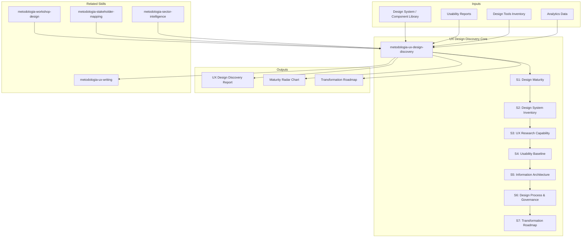

# UX Design Discovery — Design Maturity & Transformation Assessment

Generates a 7-section UX/UI design discovery covering design maturity assessment, design system inventory, UX research capability, usability baseline, information architecture, design process governance, and a phased design transformation roadmap. Produces actionable findings with evidence-based scoring and prioritized recommendations.

## Grounding Guideline

> *Design without research is decoration. Research without implementation is academia. Only when design, research, and development converge does user experience become a competitive advantage.*

1. **Design maturity is measured, not declared.** Each maturity level must be backed by observable evidence: artifacts, documented processes, impact metrics. The team's self-perception is a data point, not a verdict.
2. **The design system is infrastructure, not decoration.** A design system without governance, versioning, and measurable adoption is a component gallery. Visual consistency is a consequence of operational discipline.
3. **Accessibility is not optional, it is a non-functional requirement.** WCAG is not an aspirational ideal — it is the baseline. Every accessibility violation is design debt with legal and business impact.

## Inputs

- `$1` — Path to design assets, documentation, or project root (default: current working directory)
- `$2` — Analysis depth: `full` (default), `executive` (sections S1, S4, S7 only)

Parse from `$ARGUMENTS`.

**Parameters:**
- `{MODO}`: `piloto-auto` (default) | `desatendido` | `supervisado` | `paso-a-paso`
  - **piloto-auto**: Auto para inventario y metricas, HITL para evaluacion de madurez y hallazgos de accesibilidad.
  - **desatendido**: Zero interruptions. Analisis completo automatizado. Assumptions documented.
  - **supervisado**: Autonomo con reportes al completar cada seccion.
  - **paso-a-paso**: Confirms before cada seccion del analisis.
- `{FORMATO}`: `markdown` (default) | `html` | `dual`
- `{VARIANTE}`: `ejecutiva` (~40% — sections S1, S4, S7 only) | `tecnica` (full, default)

## Input Requirements

**Mandatory:**
- Design system documentation or component library access
- Existing usability reports or user research artifacts
- Current design tools inventory (Figma, Sketch, Adobe XD, etc.)
- Design team structure and roles

**Recommended:**
- SUS (System Usability Scale) scores from previous evaluations
- Analytics data (user flows, drop-off rates, task completion)
- Accessibility audit results (automated or manual)
- Stakeholder interviews on design culture and process
- Card sorting or tree testing results

## Assumptions & Limits

**Assumptions:**
- Design artifacts are accessible (Figma links, exported assets, documentation)
- Organization has at least one dedicated design role
- Documentation in English or Spanish
- Existing products/interfaces available for evaluation

**Cannot do:**
- Live usability testing with real users (requires recruitment and sessions)
- Eye-tracking or biometric analysis (requires specialized equipment)
- Competitive visual design benchmarking (requires access to competitor products)
- Legal accessibility compliance certification (requires legal expertise)

## Workarounds When Inputs Missing

| Missing Input | Impact | Workaround |
|---|---|---|
| No design system | Cannot assess components | Audit UI patterns in production; catalog implicit patterns; flag as ad-hoc |
| No usability data | Cannot baseline usability | Heuristic evaluation only; recommend usability testing program |
| No analytics | Cannot measure findability | Information architecture review based on structure only; flag as assumption |
| No research repository | Cannot assess research maturity | Interview design team on research practices; document tribal knowledge |
| No accessibility audit | Cannot assess WCAG compliance | Automated scan (axe, Lighthouse) on key screens; flag as partial |

## 7-Section Framework

### S1: Design Maturity Assessment

Assessment across five dimensions using a 5-level maturity model:

| Level | Name | Description |
|---|---|---|
| L1 | Ad-hoc | No consistent process. Design is reactive and inconsistent |
| L2 | Repeatable | Basic processes exist. Some templates and guidelines |
| L3 | Managed | Defined processes, metrics tracked, design system in place |
| L4 | Optimized | Data-driven design decisions, continuous improvement |
| L5 | Innovative | Design as strategic differentiator, experimentation culture |

**Dimensions evaluated:**
- **Process**: Design workflow definition, review cadence, iteration cycles
- **People**: Team structure, skills distribution, career paths, hiring criteria
- **Tools**: Tool standardization, integration with development workflow, asset management
- **Culture**: Design thinking adoption, cross-functional collaboration, executive sponsorship
- **Impact Measurement**: Design metrics tracked, business outcome correlation, ROI evidence

Per dimension: current level (L1-L5), evidence, target level, gap description, improvement actions.

**Conditional logic:**
- IF overall maturity < L2: flag CRITICAL, recommend foundational design process before system investment
- IF people dimension < L2 AND tools dimension >= L3: flag RISK — herramientas sin capacidad humana
- IF impact measurement < L2: recommend design metrics framework as quick win

### S2: Design System Inventory

- **Components catalog**: Total count, categorization (atoms, molecules, organisms), documentation status per component
- **Design tokens**: Color, typography, spacing, elevation, motion. Token coverage vs hardcoded values (%)
- **Documentation coverage**: Percentage of components with usage guidelines, do/don't examples, accessibility notes
- **Adoption rate**: Per product/team — percentage of UI built with design system components vs custom
- **Governance model**: Contribution process, approval workflow, breaking change policy, deprecation process
- **Versioning strategy**: Semantic versioning adherence, changelog quality, migration guides availability

**Conditional logic:**
- IF no design system exists: document implicit patterns, recommend design system strategy
- IF adoption rate < 50%: flag as SIGNIFICANT gap, investigate adoption barriers
- IF documentation coverage < 30%: flag as HIGH priority — undocumented components are unusable components

### S3: UX Research Capability

- **Research methods in use**: Interviews, surveys, usability testing, A/B testing, analytics review, diary studies, contextual inquiry, card sorting
- **Research frequency**: Per product/quarter. Continuous vs project-based
- **Integration with product decisions**: How research findings flow into roadmap, acceptance criteria, design iterations
- **Research repository maturity**: Centralized findings, searchable insights, cross-project patterns, historical access
- **Participant recruitment**: Internal panel, external recruitment, intercept methods, compensation model
- **Research ops**: Tools (UserTesting, Maze, Hotjar, etc.), template library, consent management, data governance

**Conditional logic:**
- IF zero research methods in active use: flag CRITICAL — diseno sin investigacion es decoracion
- IF research exists but no integration with product: flag HIGH — research theater risk
- IF no research repository: recommend lightweight repository (Dovetail, Notion, Airtable)

### S4: Usability Baseline

- **Heuristic evaluation (Nielsen's 10)**: Score each heuristic (1-10) with evidence from key user flows
  1. Visibility of system status
  2. Match between system and real world
  3. User control and freedom
  4. Consistency and standards
  5. Error prevention
  6. Recognition rather than recall
  7. Flexibility and efficiency of use
  8. Aesthetic and minimalist design
  9. Help users recognize, diagnose, and recover from errors
  10. Help and documentation
- **SUS scores**: If available, current score with benchmark comparison (68 = average, 80+ = excellent)
- **Task success rates**: Per critical user journey, completion rate and abandonment points
- **Error rates**: Per flow, error frequency and severity classification
- **Time-on-task benchmarks**: Against industry standards or previous baselines
- **Accessibility audit (WCAG 2.1/2.2)**: Level assessment (A/AA/AAA), violations by severity, remediation priority

**Conditional logic:**
- IF SUS < 68: flag as BELOW AVERAGE, prioritize usability improvements
- IF WCAG Level A violations exist: flag CRITICAL — legal and ethical exposure
- IF task success rate < 70% on critical flows: flag HIGH — conversion/productivity impact

### S5: Information Architecture Assessment

- **Navigation structure**: Primary, secondary, tertiary navigation evaluation. Depth vs breadth analysis
- **Content hierarchy**: Logical grouping assessment, page/section organization, progressive disclosure effectiveness
- **Labeling consistency**: Terminology alignment with user mental models, jargon audit, naming convention adherence
- **Search effectiveness**: Search usage rate, zero-result queries, search refinement patterns, search vs browse ratio
- **Findability metrics**: Time to find key content/features, navigation path efficiency, dead ends identification
- **Card sorting and tree testing results**: If available, agreement rates, first-click accuracy, task completion rates

**Conditional logic:**
- IF navigation depth > 4 levels: flag as RISK — information buried too deep
- IF search zero-result rate > 20%: flag HIGH — content discoverability gap
- IF no IA evaluation ever performed: recommend card sorting study as foundational step

### S6: Design Process & Governance

- **Design review cadence**: Frequency, participants, criteria, decision documentation
- **Handoff quality (design-to-dev)**: Specification completeness, annotation quality, developer satisfaction, implementation fidelity measurement
- **Tools ecosystem**: Primary design tool (Figma, Sketch, etc.), prototyping tools, handoff tools, version control, asset management
- **Design-dev collaboration maturity**: Shared language, component mapping (design token to code), joint ceremonies, feedback loops
- **Design critique culture**: Structured critique sessions, psychological safety, actionable feedback patterns, cross-team reviews

**Conditional logic:**
- IF no design review process: flag HIGH — quality is accidental
- IF handoff relies on static screenshots: flag SIGNIFICANT — recommend interactive specs (Figma Dev Mode, Zeplin)
- IF design-dev collaboration < L2: recommend shared component library as bridge

### S7: Design Transformation Roadmap

Phased plan with maturity targets per phase:

**Phase 1: Quick Wins (0-3 months)**
- Design system adoption acceleration (component documentation, onboarding)
- Accessibility fixes for WCAG Level A violations
- Design review process establishment
- Research template library creation

**Phase 2: Medium-term (3-9 months)**
- UX research program launch (regular cadence, participant panel)
- Design ops establishment (tools standardization, asset management)
- Usability testing integration into sprint cycles
- Information architecture restructuring (if needed)

**Phase 3: Strategic (9-18 months)**
- Design culture transformation (design thinking workshops, executive education)
- Innovation processes (design sprints, experimentation framework)
- Design metrics program (business impact measurement)
- Advanced research capabilities (analytics integration, continuous discovery)

Per phase: target maturity level, key activities, success metrics, dependencies, effort magnitude (designer-weeks, NOT prices).

## Edge Cases

| Case | Handling Strategy |
|------|---------------------|
| No existe design system ni patrones implicitos documentables | Auditar UI patterns en produccion; catalogar patrones implicitos ad-hoc; recomendar design system strategy como primer entregable |
| Madurez de diseno L1 (ad-hoc) en todas las dimensiones | Flag CRITICAL; recomendar proceso de diseno foundacional antes de invertir en sistema o herramientas; tools sin capacidad humana no generan valor |
| Organizacion sin representacion de diseno en decisiones de producto | Escalar como issue organizacional; documentar impacto de decisiones sin input de diseno; esto no es un gap de skill sino de estructura |
| Multi-brand con design systems conflictivos | Evaluar cada brand por separado; identificar tokens compartidos vs divergentes; recomendar capa de abstraccion si governance unificada es posible |

## Decisions & Trade-offs

| Decision | Discarded Alternative | Justification |
|----------|----------------------|---------------|
| Usar modelo de 5 niveles de madurez (Ad-hoc a Innovative) por dimension | Evaluacion binaria (maduro / inmaduro) | Los 5 niveles permiten roadmap de transformacion progresivo; el modelo binario no captura donde invertir primero |
| Incluir accessibility audit (WCAG) como seccion obligatoria | Tratar accesibilidad como nice-to-have | WCAG no es aspiracional, es linea base legal y etica; cada violacion Level A es deuda con impacto legal y de negocio |
| Evaluar 5 dimensiones de madurez (Process, People, Tools, Culture, Impact) | Solo evaluar herramientas y componentes | Un design system excelente sin proceso de review, personas capacitadas, o cultura de diseno no produce resultados; las 5 dimensiones son indivisibles |

## Knowledge Graph



## Output Templates

**Formato MD (default):**

```
# UX Design Discovery — {proyecto}
## Resumen Ejecutivo
> Madurez promedio: L2.4/5. Gaps criticos: accessibility (L1), research (L1). Quick wins identificados: N.
## S1: Design Maturity Assessment
| Dimension | Nivel Actual | Nivel Objetivo | Gap | Evidencia |
## S2: Design System Inventory
| Componente | Documentado | Adoptado | Accesible | Status |
## S3-S7: [secciones completas]
## Transformation Roadmap
```mermaid
gantt
    title UX Transformation
    ...
```
```

**Formato DOCX (bajo demanda):**
- Filename: `{fase}_{entregable}_{cliente}_{WIP}.docx`
- Generado con python-docx, Design System MetodologIA v5. Portada con logo y metadata del proyecto, TOC automático, encabezados/pies de página con marca. Tablas con zebra striping. Tipografía: Poppins para encabezados (navy), Trebuchet MS para cuerpo, acentos gold.

**Formato HTML (para presentacion a liderazgo de producto):**

```
Header: Logo + proyecto + maturity score visual
Section 1: Design Maturity Radar (chart interactivo 5 dimensiones)
Section 2: Design System Health (cards con % adopcion, % documentado, % accesible)
Section 3: Research Capability (timeline de actividades de research)
Section 4: Usability Baseline (Nielsen heuristics scores + SUS)
Section 5: Information Architecture Assessment (findability metrics)
Section 6: Transformation Roadmap (timeline visual con fases)
Footer: Attribution MetodologIA + fecha
```

**Formato XLSX (bajo demanda):**
- Filename: `{fase}_ux-design-discovery_{cliente}_{WIP}.xlsx`
- Generado con openpyxl y MetodologIA Design System v5. Encabezados con fondo navy y texto Poppins blanco, formato condicional por nivel de madurez (L1-L5) y severidad de hallazgos, auto-filtros en todas las columnas, valores calculados sin fórmulas. Hojas: Design Maturity Assessment, Design System Inventory, UX Research Capability, Usability Baseline, IA Assessment, Transformation Roadmap.

**Formato PPTX (bajo demanda):**
- Filename: `{fase}_{entregable}_{cliente}_{WIP}.pptx`
- Generado con python-pptx y MetodologIA Design System v5. Slide master con gradiente navy, títulos en Poppins, cuerpo en Trebuchet MS, acentos gold. Máx 20 slides versión ejecutiva / 30 versión técnica. Notas del orador con referencias de evidencia por slide. Slides sugeridos: portada, madurez de diseño promedio (radar chart 5 dimensiones), design system health (adopción y cobertura), UX research capability, usability baseline (heurísticas Nielsen), hallazgos de accessibility (WCAG), transformation roadmap (3 fases con maturity targets y métricas de éxito).

## Evaluacion

| Dimension | Peso | Criterio | Umbral Minimo |
|-----------|------|----------|---------------|
| Trigger Accuracy | 10% | El skill se activa ante prompts de UX discovery, design maturity, design system audit, usability assessment | 7/10 |
| Completeness | 25% | Las 7 secciones pobladas; madurez evaluada en 5 dimensiones con evidencia; accessibility audit incluido | 7/10 |
| Clarity | 20% | Radar chart de madurez es visualmente claro; roadmap tiene fases con maturity targets y metricas de exito | 7/10 |
| Robustness | 20% | Edge cases cubiertos (sin design system, L1 everywhere, sin representacion UX, multi-brand); workarounds documentados | 7/10 |
| Efficiency | 10% | Profundidad adaptada (full vs executive); heuristic evaluation como minimo cuando no hay usability data | 7/10 |
| Value Density | 15% | Quick wins priorizados por impacto; recomendaciones sized en designer-weeks; WCAG violations clasificadas por severidad | 7/10 |

**Umbral minimo global: 7/10.** Si alguna dimension cae por debajo, el entregable requiere revision antes de entrega.

## Escalation to Human Architect

- Design maturity self-assessment contradicts observable evidence
- No design representation in product decisions (organizational issue)
- Legal accessibility compliance requirements unclear
- Multi-brand design system with conflicting governance
- Organizational resistance to design process change

## Validation Gate

- [ ] Design maturity assessed across all 5 dimensions with evidence
- [ ] Design system inventory complete with adoption metrics
- [ ] UX research capability evaluated with method inventory
- [ ] Usability baseline established (heuristic evaluation minimum)
- [ ] Information architecture assessed with findability indicators
- [ ] Design process and governance documented with gap analysis
- [ ] Transformation roadmap phased with maturity targets per phase
- [ ] All findings tagged with evidence source [DOC], [INFERENCIA], [SUPUESTO]
- [ ] Accessibility assessment included (WCAG 2.1/2.2 level)
- [ ] Recommendations sized in effort magnitude and sequenced by impact

## Output Artifact

**Primary:** `UX_Design_Discovery_{project}.md` (o `.html` si `{FORMATO}=html|dual`) — 7-section design maturity and transformation assessment with evidence-based scoring, gap analysis, and phased roadmap.

**Diagramas incluidos:**
- Radar chart: Design maturity across 5 dimensions
- Quadrant chart: Design system component coverage vs adoption
- Flowchart: Design process current state vs target state

---
**Autor:** Javier Montaño · Comunidad MetodologIA | **Ultima actualizacion:** 14 de marzo de 2026
