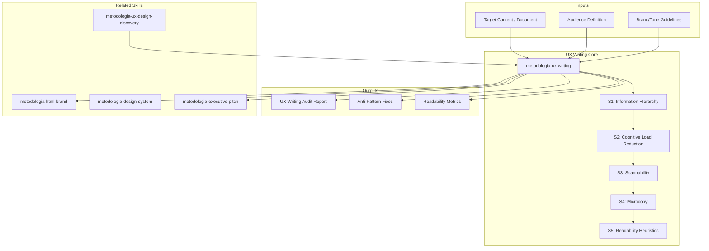

# UX Writing: Information Design & Cognitive Accessibility Standards

Ensures deliverables are business-readable, scannable, and cognitively accessible. Provides 5 standards: information hierarchy, cognitive load reduction, scannability, microcopy, and readability heuristics. Spanish-first bilingual support.

## Grounding Guideline

**Words are interface. Every title, every label, every callout is an information design decision.** UX writing is not "polishing the text at the end" — it is the first usability layer of every deliverable. If the reader cannot scan, understand, and act within their time budget, the content does not exist.

### UX Writing Philosophy

1. **Progressive disclosure reduces cognitive load.** The reader chooses depth: summary > detail > appendix. Forcing full reading is an anti-pattern.
2. **Consistent terminology across deliverables.** The same concept with three different names is three concepts for the reader. Implicit glossary, never explicit.
3. **Microcopy matters.** Every button, every error message, every tooltip is a micro design decision. "Click here" is not microcopy — it is noise.

## Inputs

The user provides a standard or target content as `$ARGUMENTS`. Parse `$1` as **standard name/number** and `$2` as **target content or file path**.

**Parameters:**
- `{MODO}`: `piloto-auto` (default) | `desatendido` | `supervisado` | `paso-a-paso`
  - **piloto-auto**: Auto para readability metrics y hierarchy analysis, HITL para microcopy recommendations y audience adaptation.
  - **desatendido**: Zero interruptions. Auditoria completa con supuestos documentados.
  - **supervisado**: Autonomo con checkpoint en readability scores y anti-pattern findings.
  - **paso-a-paso**: Confirma cada standard assessment, anti-pattern fix, y readability target.
- `{FORMATO}`: `markdown` (default) | `html` | `dual`
- `{VARIANTE}`: `ejecutiva` (~40% — S1 hierarchy + S5 readability + top anti-patterns) | `tecnica` (full 5 standards, default)

If reference materials exist, load them:

```
Read ${CLAUDE_SKILL_DIR}/references/ux-writing-patterns.md
```

---

## When to Use

- Auditing deliverable readability before stakeholder presentation
- Improving information hierarchy in executive or technical documents
- Reducing cognitive load in complex multi-section reports
- Writing or reviewing microcopy (CTAs, error messages, tooltips)
- Checking readability scores and bilingual consistency

## When NOT to Use

- Technical accuracy validation → domain expert responsibility
- Full document rewriting → content creation, not UX audit
- Visual design and branding → **metodologia-html-brand**
- End-user advocacy and adoption risk → **metodologia-user-representative**

---

## Delivery Structure: 5 Standards

```
$ARGUMENTS format: [standard-number-or-name] [target-content]
Examples:
  "hierarchy executive-report.html"      → Standard 1, target=file
  "microcopy error messages"             → Standard 4, focus=errors
  "readability check this document"      → Standard 5, target=conversation context
  "full audit proposal.html"             → All 5 standards
```

- If no standard specified → apply all 5
- If no target → ask: "Paste the content or provide the file path to audit"

### Standard 1: Information Hierarchy

**Pattern:** Executive Summary > What Changes > Impact > Next Steps

**Per-Section Structure:**
1. Key Takeaway Box (3 lines max)
2. Detail Section (body, tables, lists)
3. Evidence (data, quotes, references)
4. Implication (what happens next?)

**Page Composition:** 30% scanning content (headings, callouts, bold, lists) + 70% detail content (paragraphs, tables, appendices)

**Anti-Patterns:** Burying conclusion in paragraph 3. Walls of text without breaks. Sections without summary.

**Conditional Logic:**
- IF document > 10 pages → add TOC with summaries
- IF section > 500 words → add section summary callout
- IF table > 6 columns OR > 10 rows → add summary above, move detail to appendix

**Audience Adaptation:** Executive (60% scanning / 40% detail), Technical (40/60), Regulatory (20/80).

### Standard 2: Cognitive Load Reduction

**Chunking Rule:** Max 3-5 items per group, max 7 plus/minus 2 concepts per section.

**Progressive Disclosure:** Summary > Detail > Appendix (reader chooses depth)

**Terminology:** Explain on FIRST use, then use consistently. Example: "Annual Percentage Rate (APR) is the yearly cost of borrowing. Example: 5% APR on $100K = $5,000/year."

**Numbers:** Always contextualized. "$2.5M (15 FTE annual salary, 25% of infrastructure budget)" not just "$2.5M".

**Comparisons:** Relative + absolute. "3x faster (150ms vs 500ms), reducing approval from 2 hours to 40 minutes" not just "150ms response time".

**Conditional Logic:**
- IF audience is non-technical → minimize jargon, explain all acronyms
- IF document is reference (not narrative) → use progressive disclosure
- IF concepts > 9 → group into categories with section headings

**Trade-offs:** Chunking size (3 items = memorable, 5 = comprehensive) — target 4. Disclosure depth (2 levels = simple, 4 = complete) — target 3 levels.

### Standard 3: Scannability

**80/20 Rule:** Reader extracts 80% value from 20% content (headings, callouts, bold, lists, summaries).

**Visual Hierarchy:**
- H1: 1 per page max (document title)
- H2: 3-5 per document (major sections)
- H3: 2-3 per H2 max (subsections)
- No H4/H5: over-nesting signals need to restructure

**Callout Types:**

| Type | Use Case |
|------|----------|
| Key Insight | Critical finding, decision, action |
| Warning | Risk, blocker, unresolved issue |
| Decision Required | Awaiting stakeholder approval |
| Success | Positive outcome, milestone reached |

Callout styling: left 4px border + tinted background. Colors configurable via brand-config.json or design system tokens.

**Table Rules:** Max 6 visible columns (rest in appendix). Sticky header row. Min 32px row height. Highlight critical rows.

**Paragraph Rules:** First sentence = topic sentence. Max 4 sentences. Last sentence = implication.

**Conditional Logic:**
- IF document > 5 pages → add TOC
- IF section > 800 words → add section summary callout
- IF table > 10 rows → add summary statistics above

### Standard 4: Microcopy

**Buttons/CTAs:** Verb + Object pattern. "View Architecture" not "Click Here". "Download Phase 3 Report" not "More Info".

**Empty States:** What is missing + how to fix. "No scenarios evaluated yet. Run Phase 3 to generate options."

**Error Messages:** What happened + why + how to fix. "Gate 1 failed: 2 scenarios missing cost scores. Re-run Phase 3 with cost analysis enabled."

**Confirmation:** What was done + what happens next. "Scenario B approved. Phase 4 design can now begin."

**Inline Validation:** Issue + context + fix. "Loan amount exceeds limit ($800K > $750K max). Enter amount <= $750,000."

**Help Text:** Definition + example. "Annual income: total earnings before taxes (W-2 or tax return). Example: $75,000"

**Conditional Logic:**
- IF irreversible action (delete, publish) → confirmation dialog with summary
- IF error → always include "how to fix"
- IF help text > 2 lines → move to tooltip or help panel

### Standard 5: Readability Heuristics

**Targets:**

| Metric | Target | Test |
|--------|--------|------|
| Sentence length | 15-20 words avg, max 35 | Read aloud; pause for breath = too long |
| Paragraph length | 3-4 sentences avg, max 6 | Fits on phone screen |
| Passive voice | <15% of sentences | Count "is/are/was/were" + past participle |
| Jargon density | Max 2 unexplained terms per paragraph | Count domain terms without inline explanation |

**Flesch-Kincaid Grade Targets:**
- Executive documents: Grade <= 12 (high school level)
- Technical documents: Grade <= 16 (college level)
- Legal/regulatory: Grade > 16 acceptable

**Bilingual Support (Spanish-first):**
- Write in Spanish first (primary audience)
- Keep English terms in parentheses: "tasa de interes anual (APR)"
- Avoid literal translation; adapt to Spanish idioms
- Test readability in both languages

**Conditional Logic:**
- IF readability > target grade → simplify: break long sentences, replace jargon, shorter words
- IF document > 3,000 words → check readability per section; high-stakes sections should be lowest grade
- IF bilingual → test both languages separately

## Assumptions & Limits

- Assumes business-literate audience (understands domain, may not understand technical details)
- Assumes digital-first format; print/PDF requires adaptation for scannability
- Assumes single primary audience; mixed audiences need progressive disclosure
- Assumes time-constrained readers (2-5 min for key documents)
- Readability scores assume English text; different languages have different complexity metrics
- Tool-generated scores are estimates; human review still needed

## Edge Cases

| Scenario | Response |
|---|---|
| **No existing content to audit** | Start with competitor/industry benchmark analysis. Create content style guide from scratch with stakeholder workshops. Deliver baseline standards + 10 sample rewrites. |
| **Highly technical audience (developers, engineers)** | Adjust readability targets upward (Grade 10-12 acceptable). Prioritize precision over simplicity. Preserve domain jargon but define on first use. |
| **Multi-language product (not just bilingual)** | Define primary language for content creation. Create translation brief per language with tone adaptations. Budget 40% more for 3+ languages. Use ICU message format for dynamic content. |
| **Regulated content (financial disclaimers, medical)** | Legal review mandatory — UX writing optimizes within legal constraints, not overrides them. Maintain approved-copy registry. Version-control all regulated microcopy. |
| **Design system without content guidelines** | Integrate content standards into component documentation. Each component gets: label pattern, character limits, tone guidance, error message template. |
| **Legacy product with inconsistent voice** | Audit and categorize existing patterns. Create "current vs target" voice comparison. Prioritize high-traffic flows for rewriting first. Accept gradual migration over big-bang rewrite. |

## Trade-offs

| Dimension | Option A | Option B | Decision Rule |
|-----------|----------|----------|---------------|
| Completeness vs readability | All details in one doc | Summary + appendix | Summary + appendix if > 3 pages |
| Accessibility vs authoring speed | Well-structured (20% longer to write) | Quick draft | Invest if document read by 5+ people |
| Bilingual vs single language | Spanish + English (30% more effort) | Single language | Bilingual if audience spans languages |
| Visual design vs plain text | Styled HTML (higher readability) | Plain text (portable) | Styled for stakeholder-facing; plain for internal |

## Validation Gate

Before delivering UX writing audit:
- [ ] All applicable standards assessed with specific examples
- [ ] Anti-patterns identified with concrete fixes (not "improve readability")
- [ ] Readability metrics calculated or estimated with targets
- [ ] Audience identified and standards adapted accordingly
- [ ] Bilingual considerations addressed if applicable

## Edge Cases

| Case | Handling Strategy |
|------|---------------------|
| No existe contenido previo para auditar | Comenzar con benchmark de competidores/industria; crear content style guide desde cero con workshop de stakeholders; entregar standards baseline + 10 rewrites de ejemplo |
| Audiencia altamente tecnica (developers, ingenieros) | Ajustar targets de readability hacia arriba (Grade 10-12 aceptable); priorizar precision sobre simplicidad; preservar jargon de dominio pero definir en primer uso |
| Producto multi-idioma (3+ idiomas, no solo bilingue) | Definir idioma primario para creacion de contenido; crear translation brief por idioma con adaptaciones de tono; presupuestar 40% mas para 3+ idiomas |
| Contenido regulado (disclaimers financieros, medicos) | Legal review obligatorio; UX writing optimiza dentro de restricciones legales, no las reemplaza; mantener registro de copy aprobado con versionamiento |

## Decisions & Trade-offs

| Decision | Discarded Alternative | Justification |
|----------|----------------------|---------------|
| Progressive disclosure (summary > detail > appendix) como patron default | Todo el contenido al mismo nivel de detalle | Forzar lectura completa es un antipatron; el lector elige profundidad segun su presupuesto de tiempo |
| Regla 80/20 de scannability (80% del valor en 20% del contenido) | Disenar para lectura lineal completa | Los lectores de negocio escanean, no leen linealmente; el contenido debe funcionar para scanners y deep-readers por igual |
| Targets de Flesch-Kincaid diferenciados por audiencia | Un unico target de readability para todos los documentos | Un executive summary necesita Grade 12; un documento tecnico puede tolerar Grade 16; un unico target sub-optimiza para ambos |

## Knowledge Graph



## Output Templates

**Formato MD (default):**

```
# UX Writing Audit — {proyecto/documento}
## Resumen Ejecutivo
> Standards evaluados: N/5. Anti-patterns encontrados: X. Readability score: Grade Y.
## Standard 1: Information Hierarchy
| Hallazgo | Severidad | Ubicacion | Fix Recomendado |
## Standard 2-5: [evaluacion por standard]
## Anti-Pattern Summary
| Anti-Pattern | Frecuencia | Ejemplo | Fix |
## Readability Metrics
| Metrica | Actual | Target | Status |
## Recomendaciones Priorizadas
1. [Quick win] ...
2. [Medium effort] ...
```

**Formato DOCX (bajo demanda):**
- Filename: `{fase}_{entregable}_{cliente}_{WIP}.docx`
- Generado con python-docx, Design System MetodologIA v5. Portada con logo y metadata del proyecto, TOC automático, encabezados/pies de página con marca. Tablas con zebra striping. Tipografía: Poppins para encabezados (navy), Trebuchet MS para cuerpo, acentos gold.

**Formato XLSX (bajo demanda):**
- Filename: `{fase}_ux-writing_{cliente}_{WIP}.xlsx`
- Generado con openpyxl y MetodologIA Design System v5. Encabezados con fondo navy y texto Poppins blanco, formato condicional por severidad de anti-pattern y score de readability vs target, auto-filtros en todas las columnas, valores calculados sin fórmulas. Hojas: Standards Assessment (5 standards), Anti-Patterns con Fixes, Readability Metrics, Microcopy Inventory.

**Formato PPTX (bajo demanda):**
- Filename: `{fase}_{entregable}_{cliente}_{WIP}.pptx`
- Generado con python-pptx y MetodologIA Design System v5. Slide master con gradiente navy, títulos en Poppins, cuerpo en Trebuchet MS, acentos gold. Máx 20 slides versión ejecutiva / 30 versión técnica. Notas del orador con referencias de evidencia por slide. Slides sugeridos: portada, resumen ejecutivo (standards evaluados, anti-patterns encontrados, readability score), assessment por standard (5 slides), anti-patterns top con before/after, métricas de readability vs target (Flesch-Kincaid), recomendaciones priorizadas por impacto.

**Formato HTML (para revision de deliverables):**

```
Header: Logo + documento auditado + readability score badge
Section 1: Dashboard de Scores (visual con semaforo por standard)
Section 2: Annotated Document (original con highlights de anti-patterns)
Section 3: Before/After Examples (side-by-side comparisons)
Section 4: Readability Radar (chart 5 dimensiones)
Section 5: Action Items (priorizados por impacto)
Footer: Attribution MetodologIA + fecha de auditoria
```

## Evaluacion

| Dimension | Peso | Criterio | Umbral Minimo |
|-----------|------|----------|---------------|
| Trigger Accuracy | 10% | El skill se activa ante prompts de readability, UX writing, cognitive load, scannability, microcopy | 7/10 |
| Completeness | 25% | Los 5 standards evaluados con ejemplos especificos; anti-patterns con fixes concretos (no "mejorar readability"); metricas calculadas | 7/10 |
| Clarity | 20% | Fixes son accionables (before/after); audiencia identificada y standards adaptados; scores contextualizados | 7/10 |
| Robustness | 20% | Edge cases cubiertos (sin contenido, audiencia tecnica, multi-idioma, regulado); bilingual considerations addressed | 7/10 |
| Efficiency | 10% | Variante ejecutiva vs tecnica correctamente aplicada; no se auditan los 5 standards cuando solo 1 fue solicitado | 7/10 |
| Value Density | 15% | Anti-patterns tienen fix concreto, no solo diagnostico; readability targets diferenciados por audiencia; microcopy patterns documentados | 7/10 |

**Umbral minimo global: 7/10.** Si alguna dimension cae por debajo, el entregable requiere revision antes de entrega.

## Cross-References

- **metodologia-user-representative:** End-user advocacy that uses UX writing standards for deliverable review
- **metodologia-html-brand:** Branded HTML deliverables where UX writing standards ensure readability
- **metodologia-design-system:** Design system components that support UX writing patterns (callouts, typography)
- **metodologia-executive-pitch:** Executive deliverables where readability is mission-critical

## Output Format Protocol

| Format | Default | Description |
|--------|---------|-------------|
| `markdown` | Yes | Rich Markdown + Mermaid diagrams. Token-efficient. |
| `html` | On demand | Branded HTML (Design System). Visual impact. |
| `dual` | On demand | Both formats. |

Default output is Markdown with embedded Mermaid diagrams. HTML generation requires explicit `{FORMATO}=html` parameter.

## Output Artifact

**Primary:** `UW-01_UX_Writing_{project}.md` (or `.html` if `{FORMATO}=html|dual`) — 5-standard audit (hierarchy, cognitive load, scannability, microcopy, readability), anti-patterns with fixes, readability metrics, audience adaptation recommendations.

**Secondary:** Readability radar chart, information hierarchy map, terminology consistency report.

---
**Autor:** Javier Montaño | **Ultima actualizacion:** 12 de marzo de 2026
