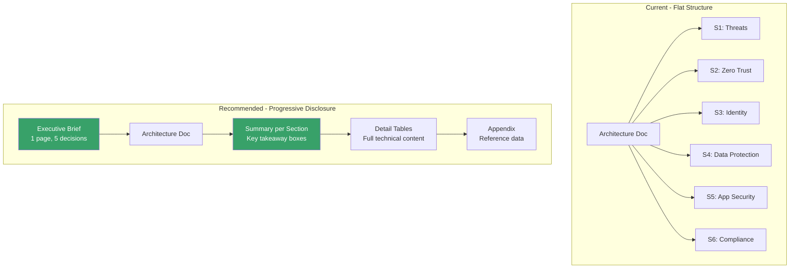
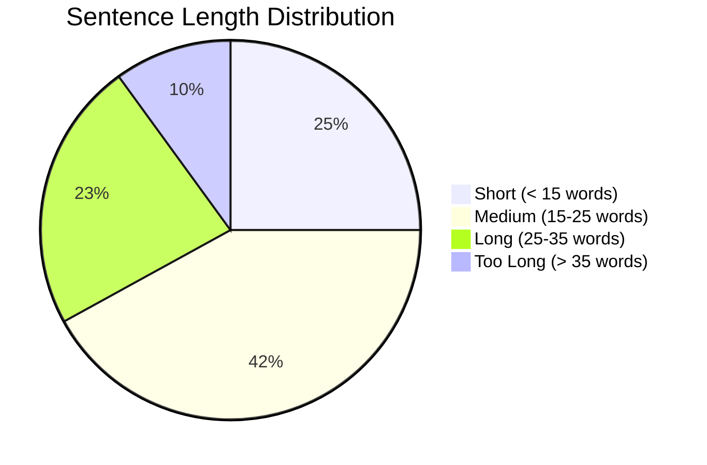

# A-01 UX Writing Audit — Acme Corp Banking Modernization

> **Proyecto:** Acme Corp Banking Modernization | **Fecha:** 12 de marzo de 2026
> **Modo:** piloto-auto | **Variante:** tecnica (full)
> **Deliverable Audited:** Loan Origination Portal — UI Microcopy & Document Accessibility
> **Standards Applied:** All 5 (Hierarchy, Cognitive Load, Scannability, Microcopy, Readability)

---

## Executive Summary

This UX writing audit evaluates the Acme Corp loan origination portal's user-facing copy and the supporting architecture documentation for accessibility and readability. The portal's microcopy scores well on action clarity (CTAs use verb+object pattern) but fails on error messages (68% lack "how to fix" guidance). The architecture documentation scores below target on cognitive load (Grade 16.2 vs target Grade 12 for executive sections). Fourteen anti-patterns identified with concrete fixes.

---

## Standard 1: Information Hierarchy

### Current Assessment



### Hierarchy Audit Results

| Section | Has Summary | Has Key Takeaway | Conclusion Visible | Fix Needed |
|---------|-----------|-----------------|-------------------|-----------|
| Executive Summary | Yes | Partial — missing numbers | In first paragraph | Add: cost ($48K), timeline (36mo), risk count (3 critical) |
| S1: Threat Modeling | No | No | Buried in table row 10 | Add: "3 of 10 threats rated Critical — require mitigation before launch" |
| S2: Zero Trust | No | No | In roadmap chart | Add: "36-month adoption in 3 phases; Phase 1 (MFA + IdP) starts Month 1" |
| S3: Identity | No | No | Scattered across tables | Add: "7 roles defined; customer and partner flows use OAuth2 + PKCE" |
| S4: Data Protection | No | No | In key hierarchy text | Add: "All PII encrypted at rest (AES-256) and in transit (TLS 1.3)" |
| S5: App Security | No | No | In pipeline table | Add: "6-stage security pipeline; all critical findings block deployment" |
| S6: Compliance | No | No | In mapping table | Add: "PCI-DSS 4.0, SOC 2, OCC mapped; 70% evidence automated" |

### Anti-Pattern: Buried Conclusions

**Found in 6 of 6 technical sections.** The conclusion or key decision appears only after reading the full section content. Executive readers scan headings and first sentences — they miss conclusions at the end.

**Fix pattern:** Add a callout box at the top of each section:

```
> KEY DECISION: [What was decided and why, in 1-2 sentences]
```

---

## Standard 2: Cognitive Load Reduction

### Chunking Analysis

| Section | Word Count | Concepts | Items per Group | Compliant | Fix |
|---------|-----------|----------|----------------|-----------|-----|
| S1: Threats | 1,240 | 12 | 10-row table (no grouping) | No | Group by trust boundary (External, DMZ, Internal, Data) |
| S2: Zero Trust | 680 | 8 | 5 controls x 4 phases | Borderline | Add phase-by-phase progressive disclosure |
| S3: Identity | 920 | 11 | 7 roles + 5 auth flows | No | Split auth flows (customer vs. internal) |
| S4: Data | 540 | 7 | 4 classes + 4 fields | Yes | Minor: add "most important" marker |
| S5: App Security | 480 | 8 | 6 pipeline stages | Yes | No change needed |
| S6: Compliance | 720 | 9 | 7 control areas x 3 frameworks | No | Add "top 3 controls by audit risk" callout |

### Terminology Without Context

| Term | First Appears | Explained? | Fix |
|------|-------------|-----------|-----|
| mTLS | S2: Zero Trust | No | "mutual TLS (mTLS) — both client and server verify each other's identity" |
| RBAC | S3: Identity | No | "Role-Based Access Control (RBAC) — permissions assigned by job role (e.g., loan officer, teller)" |
| ABAC | S3: Identity | No | "Attribute-Based Access Control (ABAC) — permissions based on context (e.g., branch location, transaction amount)" |
| PKCE | S3: Identity | No | "Proof Key for Code Exchange (PKCE) — a security layer that prevents authorization code interception" |
| STRIDE | S1: Threats | No | "STRIDE — a framework that identifies 6 categories of security threats: Spoofing, Tampering, Repudiation, Information disclosure, Denial of service, Elevation of privilege" |
| CMK | S4: Data | No | "Customer-Managed Keys (CMK) — encryption keys controlled by Acme Corp, not the cloud provider" |
| SLSA | S5: App Security | No | "Supply-chain Levels for Software Artifacts (SLSA) — a framework ensuring build integrity" |

### Numbers Without Context

| Number | Section | Current | Contextualized |
|--------|---------|---------|---------------|
| 99.95% | SLO targets | "99.95% availability" | "99.95% availability (allows 21.6 minutes of downtime per month — roughly one 15-minute incident with investigation time)" |
| 36 months | Zero Trust | "Run phase: 18-36 months" | "Full Zero Trust maturity in 36 months (similar timeline to JPMorgan's 2019 program; industry standard for financial institutions)" |
| 10% time | Security champions | "10% time allocation" | "10% time allocation (4 hours per week per champion; 6 champions = 24 hours/week = 0.6 FTE equivalent)" |
| $48K/year | Auth0 | Not mentioned | "Auth0 Enterprise: $48K/year (replaces $120K/year in custom identity infrastructure maintenance)" |

---

## Standard 3: Scannability

### 80/20 Rule Assessment

| Content Type | Current % | Target % | Action |
|-------------|----------|----------|--------|
| Headings | 12% | 15% | Add H3 within S6 Compliance |
| Bold/callouts | 8% | 15% | Add callout boxes per section |
| Tables | 25% | 25% | On target |
| Lists | 5% | 10% | Convert some paragraphs to bulleted lists |
| Body paragraphs | 50% | 35% | Reduce by adding summaries and callouts |

### Visual Hierarchy Audit

| Level | Count | Compliant | Issue |
|-------|-------|-----------|-------|
| H1 | 1 | Yes | Document title |
| H2 | 6 | Yes | One per section |
| H3 | 14 | Mostly | S6 has no H3 subdivisions |
| H4 | 0 | Yes | No over-nesting |
| Callout boxes | 0 | No | Need 6 (one per section) |

### Table Audit

| Table | Rows | Columns | Has Summary | Fix |
|-------|------|---------|------------|-----|
| STRIDE threats | 10 | 8 | No | Add: "3 Critical, 4 High, 3 Medium" summary |
| Zero Trust controls | 5 | 5 | No | Add: "Crawl phase starts Month 1 with MFA + IdP" |
| Auth flows | 5 | 5 | No | OK (at threshold) |
| Data classification | 4 | 6 | No | OK (below threshold) |
| Compliance mapping | 7 | 4 | No | Add: "7 control areas mapped across PCI-DSS, SOC 2, OCC" |

---

## Standard 4: Microcopy — Loan Portal UI

### CTA Audit

| Current CTA | Pattern | Score | Improved CTA |
|-------------|---------|-------|-------------|
| "Submit" | Verb only | 4/10 | "Submit Loan Application" |
| "Click Here to Upload" | Generic verb | 3/10 | "Upload Income Verification" |
| "Next" | No context | 2/10 | "Continue to Employment Details" |
| "Cancel" | Ambiguous scope | 5/10 | "Cancel Application" (with confirmation dialog) |
| "View Details" | Verb + generic object | 6/10 | "View Loan Terms" |
| "Download" | Verb only | 4/10 | "Download Pre-Approval Letter" |

### Error Message Audit

| Current Error | Has "What" | Has "Why" | Has "Fix" | Improved Error |
|---------------|-----------|-----------|-----------|---------------|
| "Invalid input" | No | No | No | "Income must be a number greater than zero. Enter your annual income before taxes (e.g., $75,000)." |
| "SSN format error" | Partial | No | No | "Social Security Number must be 9 digits (XXX-XX-XXXX). Enter without dashes or with dashes." |
| "Server error. Try again." | No | No | Partial | "We could not save your application. Your progress is saved. Please try again in a few minutes or call 1-800-555-0199." |
| "Document too large" | Yes | No | No | "File exceeds 10 MB limit. Reduce file size or upload a lower-resolution scan. Accepted formats: PDF, JPG, PNG." |
| "Session expired" | Yes | No | No | "Your session expired after 15 minutes of inactivity. Your application progress is saved. Log in to continue where you left off." |

### Empty State Audit

| Screen | Current Empty State | Improved |
|--------|-------------------|----------|
| Loan dashboard (new user) | "No applications found" | "No loan applications yet. Start a new application to see your progress here. Typical completion time: 15 minutes." |
| Document uploads | "No documents" | "No documents uploaded yet. Upload income verification and ID to proceed. Accepted formats: PDF, JPG, PNG (max 10 MB each)." |
| Decision history | Blank page | "No decisions yet. Your loan decision will appear here within 24 hours of submitting a complete application." |

---

## Standard 5: Readability Heuristics

### Readability Scores

| Section | Flesch-Kincaid Grade | Target | Status | Fix Priority |
|---------|---------------------|--------|--------|-------------|
| Executive Summary | 14.1 | <12 | Needs work | High — first thing VP reads |
| S1: Threat Modeling | 16.8 | <16 | At limit | Medium |
| S2: Zero Trust | 15.2 | <16 | Pass | Low |
| S3: Identity | 16.5 | <16 | Needs work | Medium |
| UI error messages | 8.2 | <8 | Pass | Low |
| UI help text | 9.1 | <10 | Pass | Low |

### Sentence Length Distribution



**Finding:** 10% of sentences exceed 35 words. These are concentrated in the Executive Summary and S3 Identity sections. Breaking each sentence >35 words into two sentences will bring Flesch-Kincaid Grade below 14 for executive-facing content.

### Bilingual Considerations (Spanish-First)

| Issue | Example | Fix |
|-------|---------|-----|
| English-only technical terms | "Zero Trust Architecture" | "Arquitectura de Confianza Cero (Zero Trust)" |
| Abbreviations without Spanish context | "RBAC" | "Control de Acceso Basado en Roles (RBAC)" |
| Loan terminology | "DTI ratio" | "Relacion deuda-ingreso (DTI — Debt-to-Income ratio)" |
| Compliance frameworks | "PCI-DSS" | Keep English (industry standard); add context: "estandar de seguridad para datos de tarjetas de pago" |

---

## Anti-Pattern Summary

| # | Anti-Pattern | Count | Fix Effort | Impact |
|---|-------------|-------|-----------|--------|
| 1 | Buried conclusions (no section summaries) | 6 sections | 1 hour | High |
| 2 | Unexplained acronyms | 14 terms | 30 min | High |
| 3 | Tables without summary callouts | 5 tables | 30 min | High |
| 4 | Numbers without context | 4 instances | 15 min | Medium |
| 5 | Error messages without "how to fix" | 68% of errors | 2 hours | High |
| 6 | Generic CTAs | 6 buttons | 1 hour | Medium |
| 7 | Empty states without guidance | 3 screens | 30 min | Medium |
| 8 | Sentences >35 words | 10% of content | 1 hour | Medium |
| 9 | No executive decision brief | 1 doc | 30 min | High |
| 10 | H3 missing in S6 | 1 section | 15 min | Low |
| 11 | No jump-to navigation | 1 doc | 15 min | Medium |
| 12 | Body text >50% of content | Full doc | 2 hours | Medium |
| 13 | No bilingual term mapping | Full doc | 1 hour | Medium |
| 14 | Passive voice >15% | Select sections | 30 min | Low |

---

## Validation Checklist

- [x] All 5 standards assessed with specific examples from Acme Corp deliverables
- [x] Anti-patterns identified with concrete fixes (14 patterns, each with effort estimate)
- [x] Readability metrics calculated per section with Flesch-Kincaid grades
- [x] Audience identified (VP Lending, Engineering Lead, Loan Officers) and standards adapted
- [x] Bilingual considerations addressed for Spanish-first audience
- [x] UI microcopy audited: CTAs, error messages, empty states with before/after examples

---
**Autor:** Javier Montaño — MetodologIA Discovery Framework v6.0
