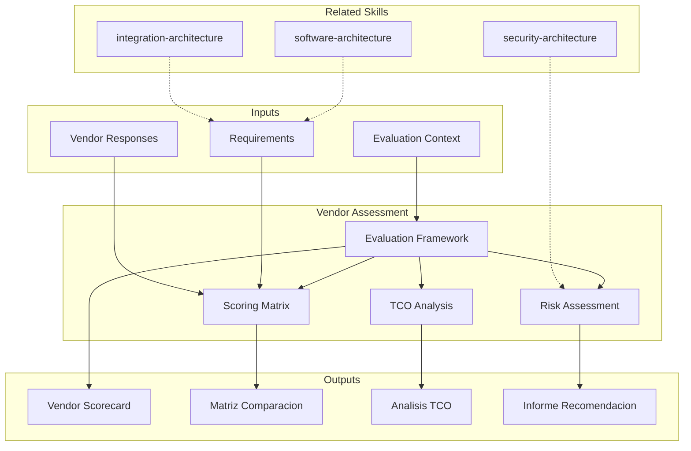

# Vendor Assessment: Evaluation, Selection & Risk Analysis

Vendor assessment provides structured evaluation of technology vendors and platforms. The skill produces vendor scorecards, comparison matrices, and recommendation reports that support objective, defensible procurement decisions.

## Grounding Guideline

> *Choosing a vendor without structured evaluation is delegating your technological destiny to chance.*

1. **Total Cost of Ownership, not license price.** Integration, maintenance, exit migration, and lock-in are real costs that rarely appear in the quote.
2. **Evaluate capabilities, not promises.** Demos, PoCs, and verifiable references carry more weight than product roadmaps.
3. **The best vendor is the one you can replace.** Excessive dependency is a risk, not a strategic relationship.

## TL;DR

- Designs vendor evaluation framework with weighted criteria and transparent scoring
- Generates multi-dimensional comparison matrices (functional, technical, financial, risk)
- Calculates TCO (Total Cost of Ownership) at 3-5 years including hidden costs
- Evaluates contractual risk, technology lock-in, and vendor viability
- Produces evidence-based recommendation with build-vs-buy analysis when applicable

## Inputs

The user provides a vendor evaluation context as `$ARGUMENTS`. Parse `$1` as the **evaluation name/context**.

**Parameters:**
- `{MODO}`: `piloto-auto` (default) | `desatendido` | `supervisado` | `paso-a-paso`
- `{FORMATO}`: `markdown` (default) | `html` | `dual`
- `{VARIANTE}`: `ejecutiva` (~40%) | `tecnica` (full, default)
- `{TIPO_EVALUACION}`: `rfp` | `build-vs-buy` | `platform-selection` | `auto` (default)

## Deliverables

1. **Vendor scorecard** — Weighted multi-criteria evaluation per vendor with normalized scores
2. **Comparison matrix** — Side-by-side comparison across functional, technical, and commercial dimensions
3. **TCO analysis** — Total cost of ownership projection including licensing, implementation, operations, exit costs
4. **Risk evaluation** — Vendor viability, lock-in risk, contractual risk, and mitigation strategies
5. **Recommendation report** — Final recommendation with rationale, trade-offs, and conditions

## Process

1. **Define evaluation criteria** — Establish evaluation dimensions: functional fit, technical capability, financial, vendor viability, support, ecosystem
2. **Weight criteria** — Assign weights based on business priorities; validate with stakeholders
3. **Design RFP/RFI** — Structure information request covering must-have requirements, nice-to-haves, and deal-breakers
4. **Collect responses** — Gather vendor responses, demos, references, and proof-of-concept results
5. **Evaluate and score** — Score each vendor against criteria using consistent 1-5 scale with evidence
6. **Calculate TCO** — Project 3-5 year total cost including: licenses, implementation, training, customization, integration, operations, and exit/migration
7. **Analyze risks** — Assess vendor financial health, market position, lock-in factors, contract terms, and data portability
8. **Formulate recommendation** — Synthesize scores, TCO, and risk into defensible recommendation with conditions and negotiation leverage points

## Quality Criteria

- [ ] Evaluation criteria are weighted and weights are justified
- [ ] All vendors scored using identical criteria and methodology
- [ ] TCO includes hidden costs: training, integration, customization, migration, exit
- [ ] Vendor viability assessed (financial health, market position, roadmap alignment)
- [ ] Lock-in risk quantified with data portability and exit cost analysis
- [ ] Build-vs-buy analysis included when custom development is a viable alternative
- [ ] Recommendation includes conditions and negotiation points
- [ ] Evidence tags applied: [DOC], [INFERENCIA], [SUPUESTO]

## Assumptions & Limits

- Vendor evaluations based on publicly available information and provided documentation
- TCO projections are estimates based on stated assumptions
- Does not negotiate contracts — provides analysis to support negotiation
- Market conditions and vendor positions may change post-assessment

## Edge Cases

1. **Vendor unico en el mercado (monopolio de nicho)** — Cuando solo existe un proveedor viable, el skill pivota de evaluacion comparativa a analisis de riesgo de dependencia, negociacion de exit clauses y diseno de abstraction layers.
2. **Build-vs-buy donde el equipo no tiene experiencia** — El skill incluye costo de adquisicion de conocimiento en el analisis build, ajustando TCO por curva de aprendizaje y riesgo de entrega, frecuentemente inclinando la balanza hacia buy.
3. **Evaluacion con informacion asimetrica entre vendors** — Si un vendor provee documentacion detallada y otro no, el skill normaliza la evaluacion asignando score neutral (3/5) a criterios sin evidencia, marcados con [SUPUESTO].
4. **Cambio de vendor en produccion (re-evaluacion)** — El skill agrega dimension de costo de migracion y riesgo de transicion al scorecard, calculando TCO diferencial vs. permanecer con el vendor actual.

## Decisions & Trade-offs

1. **Scoring ponderado vs. ranking simple** — Scoring ponderado porque criterios no son igualmente importantes; el costo de definir pesos se justifica por la defensibilidad de la decision ante stakeholders.
2. **TCO a 3 anos vs. 5 anos** — 3 anos como default porque proyecciones mas largas tienen alta incertidumbre en tecnologia; 5 anos disponible para infraestructura de larga vida.
3. **Escala 1-5 vs. 1-10** — Escala 1-5 porque reduce falsa precision y facilita consensus entre evaluadores; 1-10 genera debates sobre la diferencia entre 6 y 7 que no aportan valor.
4. **RFP formal vs. evaluacion directa** — RFP cuando hay >3 vendors y el monto justifica el proceso formal; evaluacion directa para decisiones rapidas con 2-3 opciones claras.

## Knowledge Graph

## Output Templates

### Markdown (default)
- Filename: `strategy_vendor-assessment_{contexto}_{WIP}.md`
- Structure: TL;DR -> Criterios y pesos -> Scorecard por vendor (tabla) -> Analisis TCO -> Evaluacion de riesgo -> Recomendacion final

### XLSX
- Filename: `strategy_vendor-scorecard_{contexto}_{WIP}.xlsx`
- Hojas: Evaluation Criteria | Vendor Scores | TCO Comparison | Risk Matrix | Recommendation Summary

### HTML (bajo demanda)
- Filename: `strategy_vendor-assessment_{contexto}_{WIP}.html`
- Estructura: HTML self-contained branded (Design System MetodologIA v5). Light-First Technical. Incluye scorecard comparativo con barras de score ponderado por vendor, proyección TCO a 3-5 años con gráfico de costo acumulado, y tabla de riesgos con semáforo de lock-in. WCAG AA, responsive.

### DOCX (bajo demanda)
- Filename: `{fase}_{entregable}_{cliente}_{WIP}.docx`
- Generado con python-docx, Design System MetodologIA v5. Portada con logo y metadata del proyecto, TOC automático, encabezados/pies de página con marca. Tablas con zebra striping. Tipografía: Poppins para encabezados (navy), Trebuchet MS para cuerpo, acentos gold.

### PPTX (bajo demanda)
- Filename: `{fase}_{entregable}_{cliente}_{WIP}.pptx`
- Generado con python-pptx y MetodologIA Design System v5. Slide master con gradiente navy, títulos en Poppins, cuerpo en Trebuchet MS, acentos gold. Máx 20 slides versión ejecutiva / 30 versión técnica. Notas del orador con referencias de evidencia por slide. Slides sugeridos: portada, criterios de evaluación y pesos, scorecard comparativo por vendor (barras ponderadas), análisis TCO a 3-5 años (gráfico de costo acumulado), evaluación de riesgo y lock-in (semáforo), análisis build-vs-buy (cuando aplica), recomendación final con condiciones y puntos de negociación.

## Evaluacion

| Dimension | Peso | Criterio |
|-----------|------|----------|
| Trigger Accuracy | 10% | Activa ante "vendor evaluation", "RFP", "build-vs-buy", "TCO" sin confundir con procurement operacional o contract management |
| Completeness | 25% | Cubre criterios, scoring, TCO, riesgo y recomendacion sin huecos |
| Clarity | 20% | Cada vendor tiene score numerico con evidencia; recomendacion es defendible |
| Robustness | 20% | Maneja vendor unico, informacion asimetrica, build-vs-buy y re-evaluacion |
| Efficiency | 10% | 8 pasos donde criterios alimentan scoring que alimenta recomendacion |
| Value Density | 15% | Scorecard y TCO son directamente presentables en comite de decision |

**Umbral minimo**: 7/10 en cada dimension para considerar el skill production-ready.

## Cross-References

- **metodologia-software-architecture:** Technical architecture requirements that constrain vendor selection
- **metodologia-integration-architecture:** Integration capabilities required from vendors
- **metodologia-security-architecture:** Security and compliance requirements for vendor evaluation

---
**Autor:** Javier Montaño · Comunidad MetodologIA | **Version:** 1.0.0
