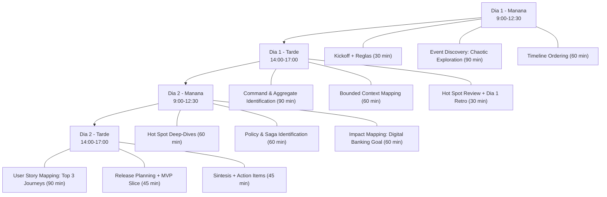
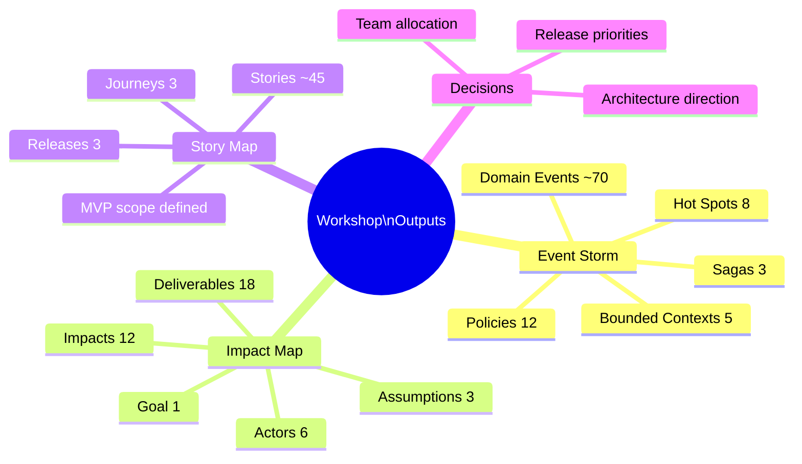

# A-01 Workshop Design — Acme Corp Banking Modernization

**Proyecto:** Acme Corp Banking Modernization
**Objetivo:** Descubrir el dominio de core banking, mapear impactos de la transformacion digital y planificar los primeros releases del producto.
**Fecha de diseno:** 12 de marzo de 2026
**Facilitador:** Equipo de Discovery

---

## S1: Workshop Selection & Design

### Tecnica seleccionada: Event Storming (Big Picture)

**Justificacion:** El equipo necesita construir un modelo mental compartido del dominio de core banking antes de tomar decisiones de arquitectura. El sistema legado tiene 15+ anos de logica acumulada y el conocimiento esta distribuido entre 4 equipos diferentes. Event Storming es la tecnica idonea para extraer conocimiento tacito de multiples expertos simultaneamente.

**Tecnicas complementarias:**
- **Impact Mapping** (Dia 2, sesion PM) — para conectar la vision de transformacion digital con entregables concretos.
- **User Story Mapping** (Dia 2, sesion PM) — para planificar los primeros releases a partir de los journeys prioritarios.

### Participantes

| Rol | Nombre | Razon de inclusion |
|-----|--------|--------------------|
| Domain Expert — Cuentas | Maria Lopez | 12 anos en operaciones de cuentas corrientes y ahorro |
| Domain Expert — Pagos | Carlos Ruiz | Lider del equipo de pagos interbancarios |
| Domain Expert — Creditos | Ana Torres | Arquitecta de negocio del modulo de creditos |
| Product Owner | Diego Fernandez | Decision-maker para priorizacion de scope |
| Tech Lead | Laura Martinez | Restricciones tecnicas y viabilidad |
| UX Lead | Pablo Sanchez | Perspectiva del usuario final |
| Sponsor | Roberto Acosta | Validacion de alineamiento estrategico (solo kickoff y cierre) |

**Tamano:** 7 participantes (rango ideal 5-8).

### Formato y logistica

- **Duracion:** 2 dias completos (9:00 - 17:00)
- **Modalidad:** Presencial (sala de innovacion, piso 3)
- **Herramientas:** Sticky notes fisicos, pared de 6 metros, marcadores, dot stickers
- **Respaldo digital:** Fotografias cada 30 min + transcripcion a Miro al cierre de cada dia

### Agenda de alto nivel

### Pre-work distribuido

1. **Para todos:** Leer el one-pager del proyecto (2 paginas). Traer 5 sticky notes con "cosas que pasan en el sistema actual que me frustran".
2. **Para domain experts:** Preparar un diagrama informal de su area (flujo principal en 5-10 pasos).
3. **Para Tech Lead:** Listar las 5 integraciones externas mas criticas del sistema legado.

---

## S2: Event Storming — Core Banking Domain

### Dia 1, Manana: Chaotic Exploration (9:30 - 12:30)

**Objetivo:** Generar el mayor volumen posible de domain events sin filtrar.

**Protocolo de facilitacion:**

1. **Energizer (10 min):** "Banking Horror Stories" — cada participante comparte en 1 minuto la peor experiencia bancaria que ha vivido como usuario.
2. **Silent brainstorming (15 min):** Cada participante escribe eventos en sticky notes naranjas. Formato: verbo en pasado ("CuentaAbierta", "PagoRechazado", "CreditoAprobado").
3. **Sticky parade (20 min):** Participantes pegan sticky notes en la pared, explicando brevemente cada uno.
4. **Clustering emergente (30 min):** El grupo reorganiza los eventos en clusters tematicos naturales.
5. **Second wave (15 min):** Nuevos eventos que surgieron durante la discusion.
6. **Timeline ordering (60 min):** Reorganizar todos los eventos en orden cronologico, izquierda a derecha.

**Eventos esperados por dominio:**

| Cluster | Eventos ejemplo | Volumen estimado |
|---------|----------------|-----------------|
| Cuentas | CuentaAbierta, SaldoActualizado, CuentaCerrada, TitularModificado | 15-20 |
| Pagos | TransferenciaIniciada, PagoConfirmado, PagoRechazado, LoteProcessado | 20-25 |
| Creditos | SolicitudRecibida, CreditoAprobado, CuotaVencida, MoraRegistrada | 15-20 |
| Compliance | KYCCompletado, AlertaGenerada, ReporteRegulatorioEnviado | 8-12 |
| Canales | SesionIniciada, OperacionFirmada, NotificacionEnviada | 10-15 |

### Dia 1, Tarde: Commands, Aggregates & Contexts (14:00 - 17:00)

**Protocolo:**

1. **Command identification (60 min):** Para cada evento, identificar que comando lo dispara y quien/que lo ejecuta. Sticky notes azules.
2. **Aggregate clustering (30 min):** Agrupar eventos + commands alrededor de entidades de dominio. Sticky notes amarillos.
3. **Bounded context boundaries (45 min):** Dibujar fronteras con cinta de color alrededor de aggregates relacionados.
4. **Hot spot marking (15 min):** Sticky notes rosados en areas de conflicto, ambiguedad o riesgo.

**Bounded contexts identificados (estimacion):**

- **Account Management** — apertura, cierre, modificacion de cuentas
- **Payment Processing** — transferencias, pagos, conciliacion
- **Credit Lifecycle** — solicitud, evaluacion, desembolso, cobranza
- **Regulatory Compliance** — KYC, AML, reportes regulatorios
- **Channel Gateway** — autenticacion, autorizacion, notificaciones

### Dia 2, Manana: Deep-Dives & Policies (9:00 - 12:30)

1. **Hot spot resolution (60 min):** Abordar los 3-5 hot spots mas criticos con discusion estructurada.
2. **Policy identification (60 min):** Identificar reacciones automaticas: "Cuando X ocurre, entonces Y". Sticky notes lilas.
3. **Saga mapping (30 min):** Procesos que cruzan bounded contexts (ej: transferencia interbancaria involucra Payments + Compliance + Channels).

**Policies ejemplo:**

- Cuando `TransferenciaIniciada` y monto > $10,000 → `AlertaAMLGenerada`
- Cuando `CuotaVencida` y dias_mora > 30 → `ProcesoCobranzaIniciado`
- Cuando `KYCCompletado` y riesgo = alto → `MonitoreoReforzadoActivado`

---

## S3: Impact Mapping — Digital Banking Transformation

**Goal:** Incrementar adopcion de canales digitales del 35% al 70% en 18 meses.

### Mapa de impacto

| Actor | Impacto deseado | Entregables candidatos |
|-------|----------------|----------------------|
| **Cliente retail** | Realiza el 90% de operaciones sin ir a sucursal | App movil con transferencias, pagos de servicios, apertura de cuentas digital |
| **Cliente retail** | Confiar en la seguridad del canal digital | Autenticacion biometrica, notificaciones en tiempo real, dashboard de actividad |
| **Cliente empresa** | Gestiona nomina y pagos a proveedores digitalmente | Portal empresarial, pagos masivos, integracion contable |
| **Ejecutivo de cuenta** | Dedica mas tiempo a asesoria vs. operaciones manuales | CRM integrado, automatizacion de procesos rutinarios |
| **Equipo de compliance** | Reduce tiempo de generacion de reportes regulatorios | Reportes automatizados, monitoreo en tiempo real |
| **Equipo de TI** | Despliega cambios sin ventanas de mantenimiento de 8 horas | Arquitectura de microservicios, CI/CD, feature flags |

### Supuestos a validar

1. Los clientes retail abandonan el canal digital por UX deficiente (no por desconfianza).
2. Los ejecutivos de cuenta estan dispuestos a cambiar su flujo de trabajo.
3. La regulacion local permite apertura de cuentas 100% digital.

---

## S4: User Story Mapping — Top 3 User Journeys

### Journey 1: Apertura de cuenta digital

**Backbone:** Registro → Verificacion de identidad → Seleccion de producto → Configuracion → Activacion

| Actividad | Walking Skeleton (R1) | Mejora (R2) | Optimizacion (R3) |
|-----------|----------------------|-------------|-------------------|
| Registro | Formulario basico con email + telefono | SSO con Google/Apple | Pre-llenado desde datos gubernamentales |
| Verificacion | Foto de documento + selfie | OCR automatico + liveness detection | Verificacion en tiempo real vs. base gubernamental |
| Seleccion | Cuenta de ahorro unica | 3 tipos de cuenta con comparador | Recomendacion personalizada por perfil |
| Configuracion | Pin + email de notificaciones | Biometria + preferencias de notificacion | Configuracion inteligente por perfil de uso |
| Activacion | Deposito minimo por transferencia | Deposito por PSE/tarjeta | Activacion inmediata sin deposito |

### Journey 2: Transferencia interbancaria

**Backbone:** Seleccion de beneficiario → Monto y concepto → Autorizacion → Confirmacion → Comprobante

| Actividad | Walking Skeleton (R1) | Mejora (R2) | Optimizacion (R3) |
|-----------|----------------------|-------------|-------------------|
| Beneficiario | Ingreso manual de cuenta | Directorio de contactos frecuentes | Busqueda por nombre/alias, QR |
| Monto | Ingreso manual | Templates de pagos recurrentes | Programacion y pagos automaticos |
| Autorizacion | OTP por SMS | Push notification + biometria | Transferencias de bajo monto sin OTP |
| Confirmacion | Pantalla de exito | Notificacion push + email | Estado en tiempo real con tracking |
| Comprobante | PDF descargable | Compartir por WhatsApp/email | Integracion automatica con contabilidad |

### Journey 3: Consulta de movimientos y saldo

**Backbone:** Autenticacion → Dashboard → Filtrado → Detalle → Exportacion

| Actividad | Walking Skeleton (R1) | Mejora (R2) | Optimizacion (R3) |
|-----------|----------------------|-------------|-------------------|
| Autenticacion | Login con usuario + contrasena | Biometria (huella/face) | Auto-login en dispositivo confiable |
| Dashboard | Saldo actual + ultimos 5 movimientos | Grafico de gastos por categoria | Insights inteligentes + alertas |
| Filtrado | Por fecha (ultimo mes) | Por categoria, monto, tipo | Busqueda en lenguaje natural |
| Detalle | Fecha, monto, descripcion | Categoria, comercio, ubicacion | Adjuntar recibos, notas |
| Exportacion | PDF del periodo | CSV, Excel | Integracion directa con apps contables |

### MVP (Release 1) — Walking Skeleton

Los walking skeletons de los 3 journeys conforman el MVP. Estimacion: 8-10 semanas de desarrollo con un equipo de 6.

---

## S6: Synthesis & Action Items

### Artefactos generados

### Decisiones clave tomadas

| # | Decision | Rationale | Owner |
|---|----------|-----------|-------|
| D1 | Arquitectura de microservicios por bounded context | Cada contexto tiene ciclo de vida y equipo diferente | Laura Martinez |
| D2 | MVP = 3 journeys en walking skeleton | Validar end-to-end antes de profundizar | Diego Fernandez |
| D3 | Compliance como servicio transversal | Todas las operaciones requieren validacion regulatoria | Ana Torres |
| D4 | Canal movil primero, web responsive segundo | 78% del trafico actual es movil | Pablo Sanchez |

### Action items

| # | Accion | Responsable | Fecha limite |
|---|--------|-------------|-------------|
| A1 | Transcribir event storm completo a Miro | Laura Martinez | 14 mar 2026 |
| A2 | Validar supuestos de Impact Map con datos de uso actual | Diego Fernandez | 18 mar 2026 |
| A3 | Crear backlog inicial en Jira desde story map | Diego Fernandez | 19 mar 2026 |
| A4 | Documentar bounded contexts como ADR | Laura Martinez | 21 mar 2026 |
| A5 | Presentar sintesis al sponsor (Roberto Acosta) | Diego Fernandez | 15 mar 2026 |
| A6 | Sesion de refinamiento tecnico por bounded context | Laura Martinez | 25 mar 2026 |
| A7 | Prototipo Figma del Journey 1 (apertura digital) | Pablo Sanchez | 21 mar 2026 |
| A8 | Validar requisitos regulatorios para apertura digital | Ana Torres | 18 mar 2026 |

### Follow-up

- **Sesion de refinamiento tecnico:** 25 mar 2026 (medio dia, por bounded context)
- **Review de prototipo UX:** 24 mar 2026 (2 horas, Journey 1)
- **Check-in de avance:** semanal, lunes 10:00 AM, 30 min standing

---

**Generado por:** workshop-facilitator | **Proyecto:** Acme Corp Banking Modernization | **Fecha:** 12 de marzo de 2026
