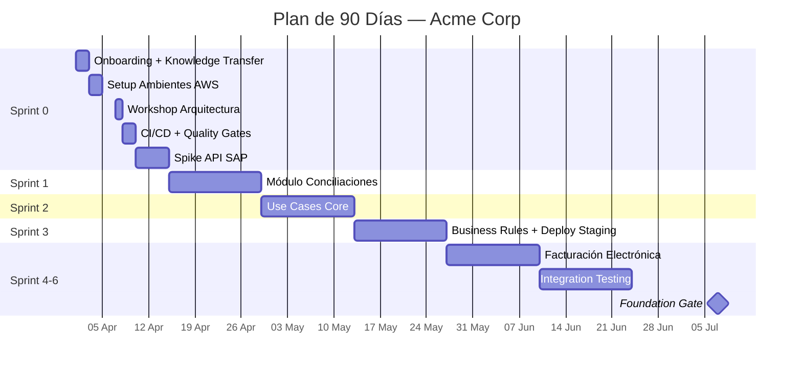
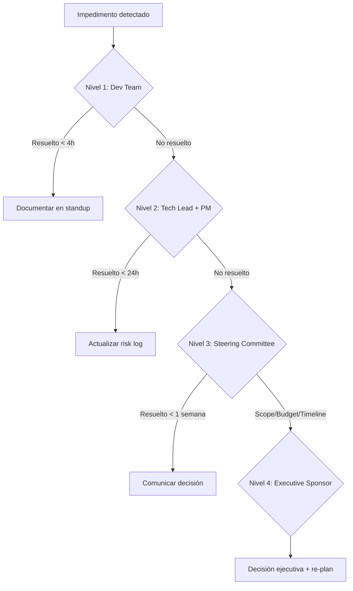
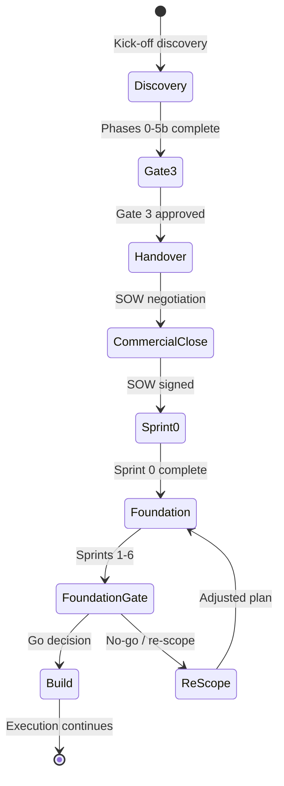

# Handover de Operaciones — Acme Corp

**Proyecto:** Modernización ERP Legacy → Plataforma Digital Integrada
**Fecha de cierre discovery:** 2026-03-10
**Gates aprobados:** Gate 1 (AS-IS), Gate 2 (Escenarios), Gate 3 (Roadmap + Pitch)
**Receptor:** Ambos (Operaciones + Comercial)

---

## S1: Resumen Ejecutivo de Transición

| Dimensión | Detalle |
|-----------|---------|
| **Estado del descubrimiento** | 6 fases completas (Phase 0-5b). Gate 3 aprobado 2026-03-08 por Steering Committee. |
| **Escenario aprobado** | "Modernización Progresiva con Microservicios" — score 8.7/10 (Phase 3, Escenario B). |
| **Inversión aprobada** | $3,800,000 USD en 18 meses. NPV $2.1M, IRR 34%, payback 14 meses. |
| **Timeline** | Foundation (M1-M4) → Build (M5-M9) → Integrate (M10-M13) → Optimize (M14-M16) → Scale (M17-M18). |

### Próximos Pasos Inmediatos

| # | Acción | Owner | Deadline |
|---|--------|-------|----------|
| 1 | Firmar SOW con Acme Corp | Dir. Comercial — Laura Méndez | 2026-03-24 |
| 2 | Onboarding Tech Lead + 2 Sr. Devs | HR — Carlos Duarte | 2026-03-28 |
| 3 | Provisionar ambientes dev/staging en AWS | DevOps — Andrés Reyes | 2026-03-31 |
| 4 | Sesión de knowledge transfer (discovery → ejecución) | Discovery Conductor — María Torres | 2026-03-26 |
| 5 | Configurar JIRA project + canales Slack | PMO — Felipe Ríos | 2026-03-25 |

### Riesgos Críticos Activos

| # | Riesgo | Probabilidad | Impacto | Status |
|---|--------|-------------|---------|--------|
| 1 | API legacy SAP sin documentación oficial | Alta | Alto | Mitigación: reverse-engineering spike en Sprint 0 |
| 2 | Dependencia de vendor externo para módulo fiscal | Media | Alto | Mitigación: contrato marco en negociación |
| 3 | Resistencia del equipo contable al cambio de flujo | Media | Medio | Mitigación: programa de change management desde Sprint 1 |

---

## S2: Paquete de Activación Comercial

### 2.1 Narrativa de Propuesta

**Contexto:** Acme Corp opera con un ERP monolítico de 12 años que genera $420K/año en costos de mantenimiento, 23 horas/semana de trabajo manual en conciliaciones, y 3 incidentes críticos/trimestre por deuda técnica.

**Propuesta de valor:**
- **Cost Reduction:** -$380K/año en mantenimiento + eliminación de 18h/semana de trabajo manual
- **Revenue:** +$1.2M/año por time-to-market 4x más rápido en nuevos productos
- **Risk:** Reducción de 3 a 0 incidentes críticos/trimestre; DR automatizado
- **Modernization:** Arquitectura cloud-native lista para escalar 10x sin refactoring

**Diferenciadores:** Equipo con 3 migraciones SAP exitosas, framework de discovery probado, modelo de inversión por fases con gates de go/no-go.

**Modelo financiero:** NPV $2,100,000 | IRR 34% | Payback 14 meses | ROI 187% a 3 años.

### 2.2 Estructura de Pricing

| Fase | Duración | Equipo | Inversión |
|------|----------|--------|-----------|
| Foundation | 4 meses | 6 FTE | $760,000 |
| Build | 5 meses | 8 FTE | $1,140,000 |
| Integrate | 4 meses | 7 FTE | $950,000 |
| Optimize | 3 meses | 5 FTE | $570,000 |
| Scale | 2 meses | 4 FTE | $380,000 |
| **TOTAL** | **18 meses** | | **$3,800,000** |
| Contingencia | | | 12% incluido |

### 2.3 Condiciones Comerciales

- **Facturación:** Mensual contra hitos de sprint completados
- **Gates de inversión:** Go/no-go al cierre de cada fase. Cliente puede cancelar con 30 días de aviso.
- **Kill criteria:** Budget overrun >130%, timeline overrun >150% de Foundation, >3 defectos críticos en producción
- **SLAs:** Respuesta a incidentes P1 < 2h, deployments a staging < 24h, cobertura de tests > 80%

### 2.4 Cronograma de Cierre Comercial

| Semana | Actividad | Responsable | Entregable |
|--------|-----------|-------------|------------|
| 11-14 Mar | Revisión propuesta con CFO Acme | Laura Méndez (Comercial) | Propuesta v1 aprobada |
| 17-21 Mar | Negociación términos contractuales | Laura Méndez + Legal | Term sheet firmado |
| 24-28 Mar | Aprobación board Acme Corp | Steering Committee | SOW ejecutado |
| 31 Mar - 4 Abr | Kick-off operativo | Felipe Ríos (PMO) | Plan Phase 1 comunicado |

---

## S3: Checklist de Readiness Operacional

### 3.1 Equipo

| Rol | Cantidad | Status | Owner Contratación | Fecha Límite |
|-----|----------|--------|--------------------|-------------|
| Tech Lead (Java/Spring) | 1 | Listo — Juan Herrera confirmado | N/A | 2026-03-20 |
| Sr. Backend Developer | 2 | 1 listo, 1 pendiente | HR — Carlos Duarte | 2026-03-28 |
| Sr. Frontend Developer | 1 | Pendiente | HR — Carlos Duarte | 2026-03-28 |
| DevOps Engineer | 1 | Listo — Andrés Reyes | N/A | N/A |
| QA Engineer | 1 | Pendiente | HR — Carlos Duarte | 2026-04-04 |
| Scrum Master | 1 | Listo — Felipe Ríos | N/A | N/A |
| Solution Architect | 1 | Listo — Patricia Vega (transición desde discovery) | N/A | N/A |
| Data Engineer | 1 | Pendiente — perfil en pipeline | HR — Carlos Duarte | 2026-04-11 |

### 3.2 Infraestructura

| Componente | Especificación | Status | Owner | Fecha Límite |
|-----------|----------------|--------|-------|-------------|
| AWS Account (dev) | EKS cluster, RDS PostgreSQL, S3 | Pendiente | Andrés Reyes | 2026-03-31 |
| AWS Account (staging) | Mirror de dev + monitoring | Pendiente | Andrés Reyes | 2026-04-07 |
| CI/CD Pipeline | GitHub Actions + ArgoCD | Pendiente | Andrés Reyes | 2026-04-04 |
| Monitoring | Datadog APM + logs | Pendiente | Andrés Reyes | 2026-04-11 |

### 3.3 Accesos y Permisos

- [x] Repositorio GitHub (org Sofka) — creado, permisos pendientes
- [ ] AWS Console — IAM roles por definir
- [ ] SAP API Gateway — credenciales solicitadas a Acme IT
- [ ] VPN acceso a red Acme — solicitud en proceso
- [ ] JIRA project — pendiente creación
- [ ] Slack channels (#acme-dev, #acme-ops, #acme-steering) — pendiente

### 3.4 Documentación Base

- [x] Roadmap aprobado compartido con equipo de ejecución
- [x] Especificación funcional accesible al equipo técnico
- [x] Riesgos y mitigaciones asignados a owners operativos
- [ ] RACI de ejecución definido (diferente al RACI de discovery)
- [ ] Canales de comunicación establecidos

---

## S4: Plan de Kickoff — Primeros 90 Días

### 4.1 Sprint 0 (2026-04-01 a 2026-04-14): Setup

| Día | Actividad | Responsable | Output |
|-----|-----------|-------------|--------|
| 1-2 Abr | Onboarding equipo técnico + knowledge transfer | Felipe Ríos + María Torres | Equipo alineado con contexto discovery |
| 3-4 Abr | Setup ambientes dev/staging AWS | Andrés Reyes | Ambientes listos, IaC en repo |
| 7 Abr | Workshop de arquitectura: microservicios target | Patricia Vega | ADRs documentados, tech stack final |
| 8-9 Abr | Configuración CI/CD + quality gates | Andrés Reyes + QA | Pipeline funcional con tests |
| 10-14 Abr | Spike: reverse-engineering API SAP legacy | Juan Herrera + 1 Sr. Dev | Documentación API + contrato OpenAPI |

### 4.2 Sprint 1-3 (2026-04-15 a 2026-05-26): Foundation Execution

- **Sprint 1:** Módulo de Conciliaciones (mayor valor, menor riesgo — cuadrante Q1 de matriz 3x3)
- **Sprint 2:** Use cases: conciliación automática, alertas de discrepancia, reporte diario
- **Sprint 3:** Validar business rules críticas (tolerancia fiscal, reglas de matching)
- First deployment a staging: 2026-05-12
- Retrospectiva + ajuste velocidad: 2026-05-26

### 4.3 Sprint 4-6 (2026-05-27 a 2026-07-07): Foundation Completion

- Módulo de Facturación Electrónica (segundo en prioridad)
- Integration testing contra SAP y sistema bancario (identificados en Phase 2)
- Performance baseline: latencia < 200ms p95, throughput > 500 TPS
- **Gate de Foundation:** 2026-07-07 — evaluación go/no-go para Phase Build

### 4.4 Métricas de Seguimiento

| Métrica | Target | Fuente | Frecuencia |
|---------|--------|--------|-----------|
| Velocidad del equipo | Estabilizar en Sprint 3 (~34 pts) | JIRA | Semanal |
| Defectos críticos | 0 en staging/producción | JIRA Bug Tracker | Diario |
| Cobertura de tests | >80% unit, >70% integration | GitHub Actions | Por PR |
| Budget burn rate | $190K/mes ± 10% | Finance dashboard | Quincenal |
| Riesgo materializado | 0 de top-5 | Risk register (Confluence) | Semanal |

---

## S5: Protocolo de Transición de Gobernanza

### 5.1 De Discovery Governance a Execution Governance

| Rol Discovery | Transiciona a | Nuevo Responsable |
|---------------|--------------|-------------------|
| Discovery Conductor — María Torres | Scrum Master | Felipe Ríos |
| Technical Architect — Patricia Vega | Solution Architect (ejecución) | Patricia Vega (continuidad) |
| Domain Analyst — Ricardo Sánchez | Product Owner | Ricardo Sánchez (continuidad) |
| Quality Guardian — Ana Beltrán | QA Lead | Ana Beltrán (continuidad) |
| Delivery Manager — Felipe Ríos | Project Manager | Felipe Ríos (continuidad) |
| Data Strategist — Diego Morales | Data Engineer Lead | Diego Morales (continuidad) |
| Change Catalyst — Sofía Ramírez | Change Manager | Sofía Ramírez (continuidad) |

### 5.2 Estructura de Reuniones

| Ceremonia | Frecuencia | Participantes | Propósito |
|-----------|-----------|---------------|-----------|
| Standup | Diario 9:00 AM | Dev team (8 personas) | Impedimentos + progreso |
| Sprint Planning | Quincenal (lunes) | PO + Dev team | Scope del sprint |
| Sprint Review | Quincenal (viernes) | Stakeholders Acme + Dev | Demo + feedback |
| Retrospectiva | Quincenal (viernes PM) | Dev team | Mejora continua |
| Steering Committee | Mensual (primer martes) | Sponsors Acme + PMO Sofka | Go/no-go, budget, riesgos |
| Architecture Review | Quincenal (miércoles) | Patricia Vega + Tech Lead | Decisiones técnicas, ADRs |

---

## S6: Tracker de Validación de Supuestos y Riesgos

### 6.1 Supuestos Críticos

| # | Supuesto | Validación Propuesta | Deadline | Owner | Status |
|---|----------|---------------------|----------|-------|--------|
| 1 | API SAP soporta volumen de 500 TPS | Spike técnico Sprint 0 | 2026-04-14 | Juan Herrera | Pendiente |
| 2 | Equipo contable Acme disponible para UAT | Confirmación con HR Acme | 2026-04-07 | Ricardo Sánchez | Pendiente |
| 3 | Licencia Datadog aprobada por Acme IT | Solicitud de compra | 2026-03-28 | Andrés Reyes | En proceso |
| 4 | Migración de datos históricos viable en 2 sprints | Análisis de volumen + sampling | 2026-04-21 | Diego Morales | Pendiente |

**Regla:** Si un supuesto se invalida, activar escenario alternativo de Phase 3 (Escenario C: "Modernización con Adapter Layer" — score 7.2/10).

### 6.2 Riesgos Heredados

| # | Riesgo | Prob. | Impacto | Mitigación | Early Warning | Owner |
|---|--------|-------|---------|-----------|---------------|-------|
| 1 | API SAP sin documentación | Alta | Alto | Reverse-engineering spike + contrato OpenAPI | Spike no produce contrato en 5 días | Juan Herrera |
| 2 | Vendor fiscal no cumple timeline | Media | Alto | Contrato marco con penalidades + vendor alternativo identificado | Vendor no firma en 2 semanas | Laura Méndez |
| 3 | Resistencia equipo contable | Media | Medio | Change management program + early adopters | < 30% asistencia a workshops | Sofía Ramírez |
| 4 | Performance degradada en integración SAP | Media | Alto | Performance testing desde Sprint 2 + cache layer | Latencia > 500ms en spike | Patricia Vega |
| 5 | Rotación de equipo técnico | Baja | Alto | Knowledge sharing sessions + documentación continua | 1+ salida no planificada en 60 días | Felipe Ríos |

**Regla:** Revisar en cada Steering Committee. Si early warning se activa, ejecutar mitigación inmediata.

### 6.3 Kill Criteria

| Condición | Threshold | Acción | Decision Maker |
|-----------|-----------|--------|---------------|
| Budget overrun | >130% ($4,940,000) | Pause + re-scope | CFO Acme — Roberto Lara |
| Timeline overrun | >150% de Foundation (> 6 meses) | Re-evaluate approach | Steering Committee |
| Quality failure | >3 defectos P1 en staging | Stop + quality sprint | Ana Beltrán + Felipe Ríos |
| Team attrition | >40% turnover (> 3 de 8) | Pause + re-staff | HR Sofka + Felipe Ríos |

---

## S7: Matriz de Transición de Stakeholders

| Stakeholder | Rol Discovery | Rol Ejecución | Engagement Shift | Comunicación |
|-------------|--------------|---------------|-----------------|-------------|
| Roberto Lara (CFO) | Executive Sponsor | Executive Sponsor | Mensual steering | Dashboard + monthly report |
| Ana María Ruiz (COO) | Decision Maker | Escalation point | Trimestral | Executive summary |
| Pedro Castillo (CTO) | Technical Validator | Architecture Sponsor | Quincenal arch review | ADR reviews + tech updates |
| Marcela Díaz (Dir. Contabilidad) | Domain Expert | Product Owner — Contabilidad | Semanal sprint review | Sprint demos + UAT sessions |
| Jorge Mendoza (Dir. IT) | Infrastructure Sponsor | Infrastructure Sponsor | Mensual | Infra reports + capacity planning |
| Lucía Vargas (Gerente Operaciones) | Process Owner | Early Adopter Champion | Post-MVP | Training + pilot feedback |
| Tomás Herrera (Auditor Interno) | Compliance Reviewer | Compliance Gate | Por release | Compliance checklists |
| Sandra López (Equipo Contable) | End User Representative | UAT Lead | Sprint review + UAT | Test scripts + feedback forms |

---

## S8: Entregable Final

**Archivo:** `09_Handover_Operaciones_AcmeCorp.md`
**Generado:** 2026-03-10
**Secciones:** 8 (técnica completa)
**Diagramas:** 3 (Gantt 90 días, Flowchart governance, State transition)
**Receptor:** Ambos (Operaciones + Comercial)

---
**Autor:** Javier Montaño | **Generado por:** sofka-discovery-handover v6.0
