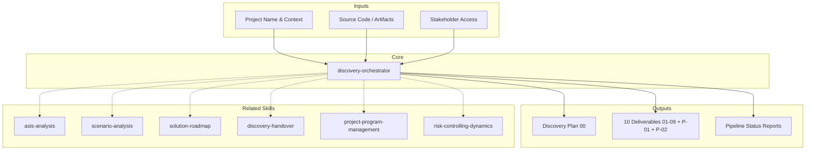

# MetodologIA Discovery Orchestrator

The single entry point for every MetodologIA discovery engagement. Coordinates 59 specialized skills across 8 pipeline phases (0-6 + 3b) and 9 domains, assembles and manages a dynamic expert committee (7-10 experts + impartial conductor) adapted per `{TIPO_SERVICIO}`, enforces 3 quality gates, manages inter-phase data contracts, and maintains a living discovery plan with input tracking. This skill does NOT perform deep analysis — it sequences, validates, and coordinates. [EXPLICIT]

## Service Type Parameter

`{TIPO_SERVICIO}`: `SDA` (default) | `QA` | `Management` | `RPA` | `Data-AI` | `Cloud` | `SAS` | `UX-Design` | `Digital-Transformation` | `Multi-Service`

Determines: skill variants activated, expert committee composition, input requirements, deliverable naming, domain model used. See `references/service-type-matrix.md` for detection rules and routing logic. [EXPLICIT]

### Auto-Detection Rules (Priority Order)
1. Explicit parameter in command invocation
2. User states service type in prompt
3. Codebase detected -> SDA
4. Process/BPMN artifacts detected -> RPA
5. Test artifacts dominant -> QA
6. Data pipelines/models detected -> Data-AI
7. Cloud infrastructure configs dominant -> Cloud
8. Design assets dominant -> UX-Design
9. Multiple service indicators -> Multi-Service
10. Default -> SDA (backward compatible)

Always confirm detected service type with user before proceeding. [EXPLICIT]

## Grounding Guideline

**Discovery without orchestration is a collection of disconnected analyses disguised as consulting.** This skill imposes sequence, validation, and traceability over the complete pipeline.

### Orchestration Philosophy

1. **Sequence with purpose.** Each phase exists because the previous one feeds it. Skipping phases is not efficiency — it is unmanaged risk. [EXPLICIT]
2. **Contracts, not trust.** Data contracts between phases are explicitly verified. [EXPLICIT]
3. **The conductor does not analyze.** Pure coordination. Technical opinions belong to the experts. [EXPLICIT]

## Skill Catalog (111 skills across 11 domains)

Covers 11 domains: Discovery Pipeline (16), Architecture Design (8), Data Strategy (7), Cloud & Mobile (4), Engineering Excellence (5), Consulting & Quality (3), Governance & Risk (2), Delivery & Brand (3), Service Discovery (11). See `references/skills-catalog.md` for the complete catalog with per-skill descriptions. [EXPLICIT]

## Output Format Protocol

Every deliverable supports two output formats controlled by `{FORMATO}`:

| Format | Default | Use Case |
|--------|---------|----------|
| `markdown` | Yes | Day-to-day deliverables, iterative work, Mermaid-native diagrams |
| `html` | On demand | Executive presentations, client-facing documents, brand-compliant output |
| `dual` | On demand | When both formats are needed simultaneously |

Markdown: Rich formatting with Mermaid diagrams, evidence tags inline. HTML: Full Design System branding, print-ready, self-contained. See `references/body-of-knowledge.md` for diagram budget per deliverable. [EXPLICIT]

## Engagement Modes ({MODO})

| Mode | Default | Behavior |
|------|---------|----------|
| `piloto-auto` | Yes | Smart autopilot. Routine auto-executed. Critical decisions pause for human approval. |
| `desatendido` | — | Full autonomy. Zero interruptions. All gates auto-approved. |
| `supervisado` | — | Human-on-the-loop. Pauses only on genuine blockers. |
| `paso-a-paso` | — | Full interactive. Confirms before each phase. |

### What Triggers a Pause in `piloto-auto`
- Quality gate evaluation (G1, G2, G3)
- Ambiguity that could change scope by >20%
- Missing input classified as CRITICAL
- Feasibility verdict of RIESGO ALTO or HUMO
- Cost magnitude exceeding initial estimate by >50%
- Proposal QA score <3.5/5.0
- Risk controller finds >3 unvalidated critical assumptions

## Core Process

### Phase -1: Discovery Initialization

Execute the initialization protocol before any analysis. See `references/expert-committee.md` for full details. [EXPLICIT]

1. **Declare Expert Committee** — 7 experts (Technical Architect, Domain Analyst, Full-Stack Generalist, Delivery Manager, Quality Guardian, Data Strategist, Change Catalyst) + Conductor + cross-cutting governance (PMO + Risk Controller)
2. **Build Discovery Plan** — Living document with engagement context, phase schedule, input registry, assumptions log, risk register
3. **Validate Minimum Viable Inputs** — Service-type-specific input requirements with workarounds
4. **Activate Industry Lens** — Dynamic SME with appropriate sector overlay

### Pipeline Variants

| Variant | Phases | Timeline | Use When |
|---------|--------|----------|----------|
| **Full Pipeline** | 0->1->2->3->G1->4->G2->5a+5b->G3 | 4-6 weeks | Execution commitment |
| **Minimal Pipeline** | 1->3->G1->4->G2->5b | 2-3 weeks | Architecture direction only |
| **Quick Reference** | 1->3->5b | 1-2 weeks | Go/no-go decision only |

### Phase Execution Protocol

For each phase, follow this sequence:
1. **Pre-Phase**: Verify data contract from previous phase, confirm activated experts, update plan status
2. **Execution**: Primary expert leads using corresponding skill; supporting experts provide overlays
3. **Post-Phase**: Quality Guardian validates against acceptance criteria; Conductor validates next data contract
4. **Gate Check** (if applicable): Present criteria with pass/fail evidence; require human sign-off

### Inter-Phase Data Contracts

Each transition requires validated outputs. Missing data halts the pipeline. [EXPLICIT]

- **Phase 0 -> 1:** Stakeholder map, RACI matrix, communication plan, workshop artifacts
- **Phase 1 -> 2:** Technology stack (5+), integration points, C4 L1 diagram, risk register, code quality baseline
- **Phase 2 -> 3:** Domain taxonomy (4+), flow catalog (4+ E2E), integration matrix, failure points (3+)
- **Phase 3 -> 4:** Approved scenario (steering sign-off), rejected summaries, cost/complexity/risk scores
- **Phase 4 -> 5:** Approved roadmap (sponsor sign-off), sprint breakdown, team structure, prerequisites (9+)

### Cost Philosophy
Costear != Cobrar. Cost identification is disconnected from revenue/pricing. Every magnitude includes a 5% innovation margin. [EXPLICIT]

## Quality Gates

Three mandatory gates enforce quality at phase transitions. See `references/quality-gates.md` for detailed criteria, checkpoint protocols, and failure recovery procedures. [EXPLICIT]

- **Gate 1 (after Phase 3):** Scenario Approval — 3+ scenarios evaluated, complete scoring, steering sign-off
- **Phase 3b:** Technical Feasibility + Software Viability validation of approved scenario
- **Gate 2 (after Phase 4):** Budget & Roadmap Approval — realistic roadmap, budget breakdown, sponsor sign-off
- **Pre-Gate 3:** Proposal QA (>=3.5/5.0) + Risk Controller final assessment
- **Gate 3 (after Phase 5):** Final Approval — all deliverables populated, cross-references consistent, client sign-off
- **Phase 6:** Handover Operacional — 8-section transition package after Gate 3

## Input Management System

The orchestrator maintains a living input registry throughout the engagement. [EXPLICIT]

At each phase transition: check registry, present workaround options for missing inputs, document workarounds as assumptions, flag downstream impact.

| Missing Input | Strategy | Fallback |
|--------------|----------|----------|
| Source code | Request repo access | Cannot proceed without code |
| Build config | Search package.json/pom.xml | Infer from source structure |
| Deployment config | Search Dockerfile/K8s/Terraform | Infer from README + scripts |
| API specs | Search OpenAPI/Swagger/gRPC | Reverse-engineer from code |
| Stakeholder list | Ask for org chart | Infer from git blame + docs |
| Budget constraints | Ask sponsor directly | Provide 3 budget scenarios |

## Disagreement Resolution Protocol

1. **Surface explicitly** — State both positions with evidence. [EXPLICIT]
2. **Classify** — Factual (data) or judgment (values/priorities)?
3. **Factual** — Stronger evidence wins. [EXPLICIT]
4. **Judgment** — Present trade-offs to user. User decides. [EXPLICIT]
5. **Document** — Record decision + rationale. [EXPLICIT]
6. **Minority protection** — Valid concerns appear in risk register even if overruled. [EXPLICIT]

## Error Recovery

- **Re-Run** (max 2 per phase): Identify failure, generate feedback, re-run with feedback + source data, validate
- **Gate Rejection**: Document reasons, provide feedback to phase skill, restart from source data (+1 week)
- **Pipeline Pivot**: Conductor flags change, reassess variant, recalculate timeline, confirm with user

## Status Reporting

After each phase, present pipeline status: phase progress, acceptance criteria results, active experts, assumptions count, open risks, next phase/gate, estimated remaining time, blockers. [EXPLICIT]

## Deliverable Manifest

| Phase | File | Description |
|-------|------|-------------|
| Plan | `00_Discovery_Plan.md` | Living discovery plan + input registry |
| 0 | `01_Stakeholder_Map.html` | Stakeholder mapping + RACI |
| 1 | `02_Brief_Tecnico_ASIS.html` | Executive technical brief |
| 1 | `03_Analisis_AS-IS.html` | Full 10-section AS-IS analysis |
| 2 | `04_Mapeo_Flujos.html` | Flow mapping + DDD taxonomy |
| 3 | `05_Escenarios_ToT.html` | Scenario analysis + decision tree |
| 4 | `06_Solution_Roadmap.html` | Transformation roadmap + cost |
| 5a | `07_Especificacion_Funcional.html` | Functional specification |
| 5b | `08_Pitch_Ejecutivo.html` | Executive pitch + business case |
| QA | `P-01_Program_Governance.md` | Program charter, gate evaluations, proposal QA scorecard |
| QA | `P-02_Risk_Controlling.md` | Risk register, pre-mortems, financial controls |

## Prompt Integration Protocol

The orchestrator receives 16 NL-HP v3.0 prompts, each activating a subset of skills. See `references/prompt-integration.md` for the full prompt-to-skill mapping, reception protocol, and asset inventory. [EXPLICIT]

## Assumptions & Limits

- Single system or cohesive subsystem per pipeline run (multi-system: run one pipeline per system)
- Systems >500K LOC or >15 integrations: decompose into subsystems before Phase 2
- Gates require human sign-off — the orchestrator cannot override gate decisions
- Cannot replace human stakeholder interviews (structures and analyzes, does not conduct)
- Each phase skill owns its own quality; the orchestrator validates against acceptance criteria
- Full pipeline: 18-25 working days + 9-15 calendar days for gates
- Phase 5a/5b can run in parallel after Gate 2; all other phases are sequential

## Edge Cases

| Case | Handling Strategy |
|---|---|
| Sistema >500K LOC con >15 integraciones | Decompose into subsystems before Phase 2. One pipeline per subsystem. Consolidate in Phase 4. |
| Gate fails repeatedly (2+) | Recommend scope reduction or pivot. Escalate to executive sponsor. |
| Stakeholders unavailable | Document decisions as assumptions. Schedule validation when available. |
| Context change mid-engagement | Reactivate SME with new lens. Re-evaluate prior deliverables. Recalculate timeline. |
| Budget not approved at G2 | Generate Phase 5b only for budget justification pitch |
| Multiple competing architectures | Activate all experts for consensus; document as additional scenarios in Phase 3 |
| Vendor lock-in detected | Flag in risk register; add migration cost estimates; include unlock scenario |

## Decisions & Trade-offs

| Decision | Discarded Alternative | Justification |
|---|---|---|
| 7-expert committee (odd number) | Panel of 5 or 9 | 7 covers critical domains with odd number for consensus |
| Hard-stop gates | Advisory gates (warnings only) | Hard-stop prevents low-quality deliverables from contaminating downstream phases |
| Explicit data contracts | Implicit information passing | Contracts ensure verified data at every transition |

## Knowledge Graph



## Validation Gate

- [ ] Discovery plan generated with complete input registry before Phase 1
- [ ] Expert committee declared and presented to user
- [ ] Industry SME lens activated for engagement
- [ ] All phases in selected variant completed with validated outputs
- [ ] Inter-phase data contracts satisfied at every transition
- [ ] Quality gates enforced — no gates skipped without user override
- [ ] Error recovery protocol followed for any failed phase
- [ ] Deliverables cross-referenced and internally consistent
- [ ] Assumptions tracked and validated throughout pipeline
- [ ] Status reports presented after each phase completion
- [ ] Disagreements documented with resolution rationale
- [ ] Deliverable manifest complete with all generated files

## Usage

```
/discovery-orchestrator "Acme Banking Core System" full-pipeline ./codebase
/discovery-orchestrator "RetailCo POS" minimal
/discovery-orchestrator "HealthCorp EMR" quick-reference
```

Parse `$1` as project name, `$2` as variant, `$3` as codebase path (default: current directory). [EXPLICIT]

## Output Artifact

**Primary:** `D-01_Discovery_Pipeline_{project}.md` (or `.html` if `{FORMATO}=html|dual`) — Pipeline orchestration plan, phase sequencing, expert allocation, progress tracking. [EXPLICIT]

---
**Autor:** Javier Montano | **Ultima actualizacion:** 12 de marzo de 2026
