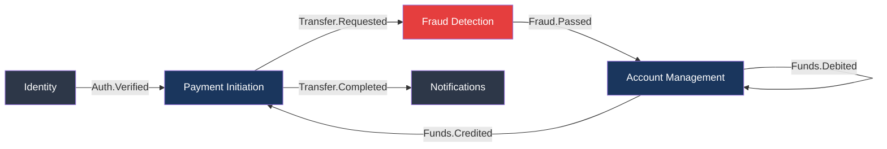
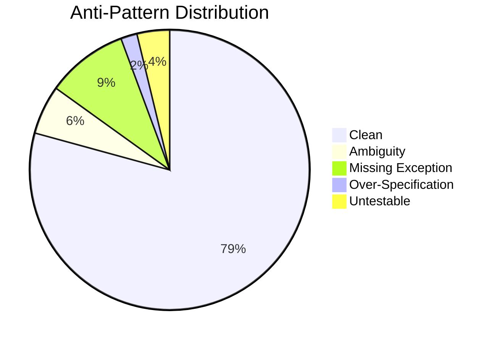

# Functional Toolbelt — Acme Corp Banking Modernization

Five tools applied to the core banking modernization domain: Event Storming, Business Rule Extraction, Acceptance Criteria, Traceability Matrix, and Anti-Pattern Detection. Focus area: real-time fund transfer flow serving 2.4M customers.

---

## Tool 1: Event Storming — Real-Time Fund Transfers

### Domain Events (Temporal Order)

| # | Event | Actor | Aggregate | Bounded Context |
|---|-------|-------|-----------|----------------|
| 1 | Transfer Requested | Customer | Transaction | Payment Initiation |
| 2 | Sender Authenticated | System | AuthSession | Identity |
| 3 | Fraud Screening Started | System | FraudCase | Fraud Detection |
| 4 | Fraud Screening Passed | System | FraudCase | Fraud Detection |
| 5 | Balance Verified | System | Account | Account Management |
| 6 | Funds Debited | System | Account | Account Management |
| 7 | Funds Credited | System | Account | Account Management |
| 8 | Transfer Completed | System | Transaction | Payment Initiation |
| 9 | Receipt Generated | System | Receipt | Notifications |
| 10 | Confirmation Sent | System | Notification | Notifications |

### Bounded Context Map



### Hot Spots

| Hot Spot | Context | Resolution Required From |
|----------|---------|------------------------|
| Fraud screening timeout (>3s) | Fraud Detection | Architecture -- fallback to async screening for low-risk transfers? |
| Partial credit failure | Account Management | Finance -- how to handle funds in limbo between debit and credit? |
| Cross-currency conversion timing | Payment Initiation | Product -- lock exchange rate at initiation or execution? |
| Duplicate transfer detection window | Payment Initiation | Business -- what constitutes a duplicate? Same amount + recipient within 5 min? |

---

## Tool 3: Business Rule Extraction — Transfer Limits

### Decision Table: Transfer Authorization

| Condition: Customer Tier | Condition: Transfer Amount | Condition: Recipient Type | Action | Exception |
|--------------------------|---------------------------|--------------------------|--------|-----------|
| Standard | <= $5,000 | Internal | Auto-approve | None |
| Standard | <= $5,000 | External (ACH) | Auto-approve + fraud screen | Flag if 3+ same-day transfers |
| Standard | $5,001 - $25,000 | Any | Require 2FA + fraud screen | Block if account < 30 days old |
| Standard | > $25,000 | Any | Manual review required | Compliance hold |
| Premium | <= $50,000 | Any | Auto-approve + fraud screen | None |
| Premium | $50,001 - $250,000 | Any | Require 2FA | Flag for AML review |
| Premium | > $250,000 | Any | Relationship manager approval | Compliance + AML hold |

### Rule Catalog

| Rule ID | Name | Classification | Severity |
|---------|------|---------------|----------|
| BR-001 | Daily transfer limit by tier | Constraint | Critical |
| BR-002 | New account cooling period (30 days) | Constraint | High |
| BR-003 | Duplicate transfer detection (5-min window) | Inference | High |
| BR-004 | Exchange rate lock duration (15 min) | Derivation | Medium |
| BR-005 | Overdraft protection threshold | Action-Enabling | Critical |
| BR-006 | AML threshold reporting ($10,000+) | Constraint | Critical |
| BR-007 | Weekend/holiday processing rules | Constraint | Medium |

---

## Tool 4: Acceptance Criteria — Fund Transfer

### Story: As a banking customer, I want to transfer funds between accounts so that I can manage my finances in real-time.

#### Scenario 1: Successful Internal Transfer (Happy Path)

```gherkin
Given the customer "Ana Rodriguez" is authenticated with session token
  And source account ACCT-001 has a balance of $12,500.00
  And destination account ACCT-002 is an internal Acme account
When the customer initiates a transfer of $3,000.00 from ACCT-001 to ACCT-002
Then the system debits $3,000.00 from ACCT-001 within 2 seconds
  And credits $3,000.00 to ACCT-002 within 2 seconds
  And ACCT-001 balance reflects $9,500.00
  And ACCT-002 balance reflects the prior balance plus $3,000.00
  And a receipt with reference TXN-2026-XXXXX is generated
  And event "Txn.Transfer.Completed" is published
```

#### Scenario 2: Insufficient Funds (Negative)

```gherkin
Given the customer has source account ACCT-001 with balance of $500.00
  And no overdraft protection is enabled
When the customer initiates a transfer of $750.00
Then the system displays "Insufficient funds. Available balance: $500.00"
  And no debit is performed
  And no event is published to the payment topic
```

#### Scenario 3: Transfer at Daily Limit Boundary (Boundary)

```gherkin
Given the customer tier is "Standard" with daily limit of $5,000.00
  And the customer has transferred $4,800.00 today
When the customer initiates a transfer of $200.00
Then the transfer is approved (cumulative $5,000.00 equals limit)
  And the system displays "Daily transfer limit reached: $5,000.00/$5,000.00"

Given the same customer attempts another transfer of $1.00
Then the system blocks the transfer
  And displays "Daily limit exceeded. Remaining: $0.00. Resets at 00:00 ET."
```

#### Scenario 4: Fraud Screening Timeout (Resilience)

```gherkin
Given the fraud screening service does not respond within 3 seconds
  And the transfer amount is $2,000.00 (below $5,000 threshold)
When the transfer is submitted
Then the system applies fallback rule: approve with post-transaction monitoring
  And flags the transaction for manual review within 24 hours
  And the customer receives the transfer confirmation without delay
```

#### Scenario 5: Concurrent Transfer Race Condition (Edge Case)

```gherkin
Given account ACCT-001 has a balance of $1,000.00
When two transfers of $800.00 each are submitted simultaneously
Then exactly one transfer succeeds with balance updated to $200.00
  And the second transfer is rejected with "Insufficient funds"
  And no partial debit occurs on either transaction
```

---

## Tool 5: Traceability Matrix — Fund Transfer MVP

### Matrix

| Req ID | Requirement | Use Cases | Flows | Test Cases | AC Covered |
|--------|-------------|-----------|-------|------------|------------|
| REQ-101 | Customer can transfer funds between internal accounts | UC-010 | FL-010, FL-011 | TC-101, TC-102, TC-103 | SC-1 |
| REQ-102 | System validates sufficient balance before debit | UC-010 | FL-012 | TC-104, TC-105 | SC-2, SC-5 |
| REQ-103 | System enforces daily transfer limits by tier | UC-010 | FL-013 | TC-106, TC-107 | SC-3 |
| REQ-104 | Fraud screening runs on every transfer | UC-011 | FL-014 | TC-108, TC-109 | SC-4 |
| REQ-105 | System generates transfer receipt | UC-010 | FL-010 | TC-110 | SC-1 |
| REQ-106 | AML reporting for transfers >= $10,000 | UC-012 | FL-015 | TC-111, TC-112 | -- |
| REQ-107 | Concurrent transfers maintain data integrity | UC-010 | FL-016 | TC-113 | SC-5 |

### Coverage Metrics

| Metric | Value | Target | Status |
|--------|-------|--------|--------|
| Requirements with Use Cases | 7/7 (100%) | 100% | PASS |
| Use Cases with Flows | 3/3 (100%) | 100% | PASS |
| Flows with Test Cases | 7/7 (100%) | 100% | PASS |
| Test Cases with AC | 11/13 (85%) | 80% | PASS |
| Requirements fully traced | 6/7 (86%) | 90% | GAP |

### Gap Analysis

| Gap | Items | Action | Owner |
|-----|-------|--------|-------|
| Missing AC for AML reporting (REQ-106) | No GWT scenarios for $10K+ threshold behavior | Write GWT covering exact threshold + structuring detection | Compliance Analyst |

---

## Tool 6: Anti-Pattern Detection — Transfer Requirements

### Scan Results



| ID | Requirement Text | Anti-Pattern | Severity | Fix |
|----|-----------------|-------------|----------|-----|
| AP-01 | "System should handle transfers appropriately" | Ambiguity | High | Specify: approve, reject, or queue with exact conditions |
| AP-02 | "Fraud checks should be fast" | Untestable | High | Define: fraud screening completes within 3 seconds at p99 |
| AP-03 | "Use PostgreSQL 16.2 for transaction storage" | Over-Specification | Medium | State: ACID-compliant RDBMS with row-level locking |
| AP-04 | "Customer logs in" (no failure path) | Missing Exception | High | Add: invalid credentials, locked account, MFA failure, session expired |
| AP-05 | "System notifies customer" (no channel specified) | Ambiguity | Medium | Specify: push notification + email within 60 seconds |

---

## Validation Checklist

- [x] Tool selection justified (5 tools for regulated financial domain)
- [x] Event storming covers critical transfer flow with bounded contexts
- [x] Business rules extracted with decision table and severity classification
- [x] Acceptance criteria cover happy path, negative, boundary, resilience, and concurrency
- [x] Traceability matrix shows 86% full coverage with gap action plan
- [x] Anti-patterns detected and categorized with specific remediation
- [x] Output format: `FORMATO=markdown`, `VARIANTE=tecnica`

---

**Autor:** Javier Montano | Sofka | 12 de marzo de 2026
