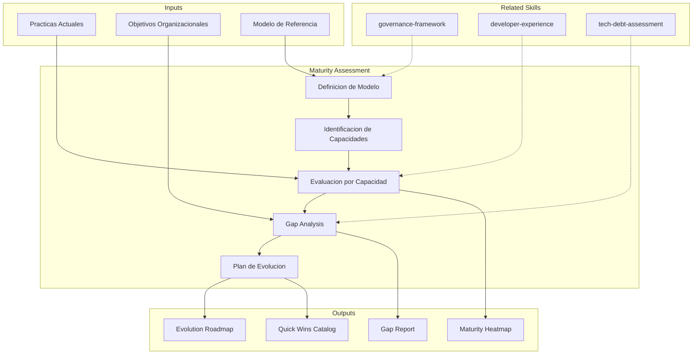

--- [EXPLICIT]
name: metodologia-maturity-assessment [EXPLICIT]
description:  [EXPLICIT]
  Capability maturity evaluation using CMMI and custom models, current vs target state scoring, [EXPLICIT]
  and improvement roadmap generation. Use when the user asks to "assess maturity", "evaluate capability", [EXPLICIT]
  "create maturity model", or mentions maturity heatmap, gap analysis, capability assessment, [EXPLICIT]
  or evolution plan. [EXPLICIT]
author: Javier Montaño · Comunidad MetodologIA [EXPLICIT]
argument-hint: "organizacion-o-equipo [dominios-a-evaluar]" [EXPLICIT]
model: opus
context: fork
allowed-tools:
  - Read
  - Write
  - Edit
  - Glob
  - Grep
  - Bash
  - WebFetch
---

# Evaluacion de Madurez

Evaluacion de madurez de capacidades usando modelos CMMI y custom, scoring de estado [EXPLICIT]
actual vs target, y generacion de roadmap de evolucion. [EXPLICIT]

## Grounding Guideline

> *You cannot improve what has not been honestly diagnosed.*

1. **Maturity is measured, not declared.** Optimistic self-assessments are the enemy of real progress. [EXPLICIT]
2. **Every level has its value.** Not every organization needs the maximum level — the goal is the right level for its objectives. [EXPLICIT]
3. **The gap is the opportunity.** The difference between the current and desired level is the improvement roadmap. [EXPLICIT]

## TL;DR

- Assess current maturity of key capabilities against reference model (CMMI or custom)
- Generate visual maturity heatmap per domain and capability
- Identify critical gaps between current and target state with root cause
- Design evolution plan prioritized by business impact
- Produce reproducible assessment with explicit criteria per level

## Inputs

Parse `$1` como **nombre de la organizacion/equipo**, `$2` como **dominios a evaluar**. [EXPLICIT]

**Parameters:**
- `{MODO}`: `piloto-auto` (default) | `desatendido` | `supervisado` | `paso-a-paso`
- `{FORMATO}`: `markdown` (default) | `html` | `dual`
- `{VARIANTE}`: `ejecutiva` (~40%) | `tecnica` (full, default)
- `{MODELO}`: `cmmi` (default) | `custom` | `devops` | `data` | `agile`

## Deliverables

1. **Maturity Heatmap** — Visual maturity map per domain (level 1-5)
2. **Gap Analysis** — Current vs target comparison with prioritized gaps
3. **Evolution Plan** — Improvement roadmap per quarter with milestones
4. **Assessment Report** — Detailed document with evidence for each scoring
5. **Quick Wins Catalog** — Low-effort, high-impact immediate improvements

## Process

1. **Model Definition** — Select or adapt maturity model:
   | Nivel | Nombre | Caracteristicas |
   |---|---|---|
   | 1 | Inicial | Ad-hoc, reactivo, dependiente de heroes |
   | 2 | Gestionado | Procesos basicos, repetible en proyectos similares |
   | 3 | Definido | Estandarizado, documentado, proactivo |
   | 4 | Cuantitativamente Gestionado | Medido, predecible, basado en datos |
   | 5 | Optimizado | Mejora continua, innovacion sistematica |
2. **Capability Identification** — Define capabilities to assess per domain:
   - Desarrollo: CI/CD, testing, code review, architecture
   - Operaciones: monitoring, incident response, capacity planning
   - Datos: data quality, governance, analytics, ML ops
   - Personas: skills, cultura, onboarding, retention
   - Procesos: agile practices, delivery, estimation
3. **Per-Capability Assessment** — Scoring 1-5 with explicit evidence and justification
4. **Gap Analysis** — Calculate current vs target delta, identify root causes of gaps
5. **Prioritization** — Order gaps by business impact x closure feasibility
6. **Evolution Plan** — Design roadmap with quarterly milestones, progress metrics, and success criteria

## Quality Criteria

- [ ] Modelo de madurez definido con criterios explicitos por nivel
- [ ] Todas las capacidades evaluadas con evidencia trazable
- [ ] Heatmap generado con visualizacion clara de estado
- [ ] Gap analysis con root cause por cada gap significativo
- [ ] Plan de evolucion con milestones realistas y medibles
- [ ] Quick wins identificados con impacto estimado
- [ ] Assessment reproducible por evaluador independiente

## Assumptions & Limits

- Scoring de madurez es cualitativo salvo que existan auditorias o metricas previas
- El modelo de 5 niveles es una simplificacion; realidad organizacional tiene matices entre niveles
- Evaluacion depende de la honestidad y representatividad de los informantes
- No reemplaza auditorias formales CMMI — produce assessment orientativo para mejora interna

## Edge Cases

| Escenario | Estrategia de Manejo |
|---|---|
| Organizacion con madurez muy desigual entre dominios (nivel 1 en datos, nivel 4 en CI/CD) | Evaluar cada dominio independientemente; plan de evolucion enfocado en elevar minimos sin frenar areas avanzadas |
| Equipo nuevo sin historia (greenfield) | Usar modelo como target design en lugar de assessment; definir nivel 3 como objetivo de 12 meses |
| Evaluacion politizada (stakeholders quieren inflar scores) | Exigir evidencia trazable por cada score; calibrar con assessment cruzado entre evaluadores |
| Modelo CMMI no aplica al dominio (e.g., data science, design) | Adaptar modelo custom con niveles equivalentes; documentar mapeo entre modelo custom y CMMI |

## Decisions & Trade-offs

| Decision | Habilita | Restringe | Justificacion |
|---|---|---|---|
| CMMI 5-level como modelo default | Framework reconocido con criterios establecidos | Puede ser rigido para contextos agiles | Es el referente mas adoptado; se adapta con modelo custom cuando no aplica |
| Evidencia obligatoria por score | Reproducibilidad y objectividad del assessment | Requiere mas tiempo de evaluacion | Sin evidencia, el scoring es opinion y pierde valor en assessments sucesivos |
| Quick wins como entregable separado | Impacto visible rapido que genera momentum | Puede distraer de mejoras estructurales | Quick wins generan buy-in para inversiones mayores en evolucion |

## Knowledge Graph

## Output Templates

**Formato 1 — Markdown (default)**
- Filename: `Maturity_Assessment_{org}_{WIP|Aprobado}.md`
- Estructura: Modelo > Heatmap > Gap Analysis > Quick Wins > Plan de Evolucion > Metricas de Progreso
- Incluye tablas de scoring con evidencia y diagramas Mermaid

**Formato 2 — XLSX (scoring y tracking)**
- Filename: `Maturity_Scorecard_{org}_{WIP|Aprobado}.xlsx`
- Estructura: Sheet 1 (Heatmap por dominio y capacidad) > Sheet 2 (Evidencia por score) > Sheet 3 (Plan de evolucion con tracking trimestral)
- Optimizado para assessments recurrentes y tracking de progreso

**Formato 3 — HTML (bajo demanda)**
- Filename: `Maturity_Assessment_{org}_{WIP|Aprobado}.html`
- Estructura: HTML self-contained branded (Design System MetodologIA v5). Light-First Technical. Incluye heatmap visual de madurez por dominio (niveles 1-5 con color coding), gap analysis con barras de progreso, y plan de evolucion con milestones trimestrales. WCAG AA, responsive, print-ready.

**Formato 4 — DOCX (bajo demanda)**
- Filename: `{fase}_Maturity_Assessment_{cliente}_{WIP}.docx`
- Generado via python-docx con MetodologIA Design System v5. Portada con logo y metadatos, TOC automatico, headers/footers con nombre del skill y numeracion, tablas zebra, titulos Poppins navy, cuerpo Trebuchet MS, acentos gold.

**Formato 5 — PPTX (bajo demanda)**
- Filename: `{fase}_{entregable}_{cliente}_{WIP}.pptx`
- Generado con python-pptx bajo MetodologIA Design System v5. Slide master con degradado navy, títulos Poppins, cuerpo Trebuchet MS, acentos dorados. Máx 20 slides variante ejecutiva / 30 variante técnica. Notas de orador con referencias de evidencia ([CODIGO], [DOC], [INFERENCIA], [SUPUESTO]).

## Evaluacion

| Dimension | Peso | Criterio |
|-----------|------|----------|
| Trigger Accuracy | 10% | Activa triggers correctos ante keywords de madurez, capability, CMMI, gap analysis |
| Completeness | 25% | Cubre modelo, evaluacion por capacidad, heatmap, gap analysis y plan de evolucion |
| Clarity | 20% | Criterios por nivel son explicitos; scoring es reproducible por evaluador independiente |
| Robustness | 20% | Maneja madurez desigual, equipos greenfield, scoring politizado |
| Efficiency | 10% | Proceso no repite evaluaciones entre dominios; escala con variante ejecutiva |
| Value Density | 15% | Quick wins son directamente accionables; plan de evolucion tiene milestones medibles |

**Umbral minimo**: 7/10 en cada dimension para considerar el skill production-ready.

## Cross-References

- **metodologia-governance-framework:** Gobernanza como dominio evaluable en maturity assessment
- **metodologia-developer-experience:** DX scorecard complementa evaluacion de madurez de desarrollo
- **metodologia-tech-debt-assessment:** Deuda tecnica como indicador de madurez en dimensiones de codigo y arquitectura

---
**Autor:** Javier Montaño · Comunidad MetodologIA | **Version:** 1.0.0

## Usage

Example invocations: [EXPLICIT]

- "/maturity-assessment" — Run the full maturity assessment workflow
- "maturity assessment on this project" — Apply to current context

