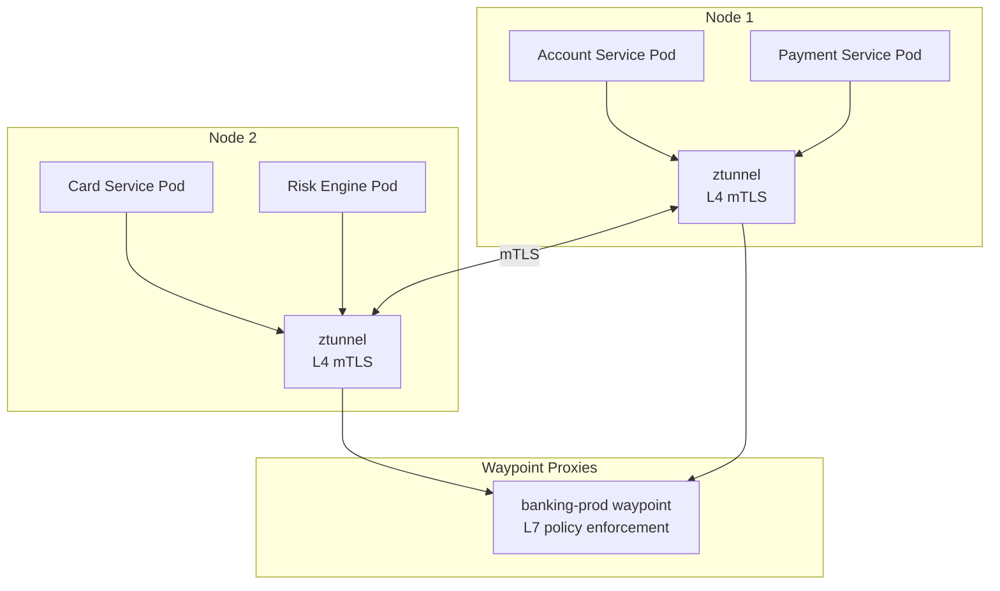

# A-01: Cloud-Native Architecture — Acme Corp Banking Modernization

**Cliente:** Acme Corp | **Fecha:** 12 de marzo de 2026 | **Variante:** Técnica

## Resumen Ejecutivo

Acme Corp está transformando su plataforma bancaria de una arquitectura monolítica en VMs on-premises a una arquitectura cloud-native sobre EKS. Este documento define el assessment de 12-factor compliance, estrategia de containers, arquitectura Kubernetes, service mesh, decisiones serverless, portabilidad multi-cloud, y prácticas FinOps para optimización continua de costos.

### Decisiones Clave

| Decisión | Selección | Rationale |
|----------|-----------|-----------|
| Orquestación | EKS + Karpenter | Provisioning 30-60s, spot/OD mix automático, bin-packing |
| Service Mesh | Istio Ambient Mode | mTLS sin sidecars (90% menos overhead), zero-trust banking |
| Serverless | Lambda para event-driven | Procesamiento de notificaciones, alertas fraude, ETL triggers |
| Ingress | Gateway API (Envoy Gateway) | Multi-tenancy, role-based, NGINX retiring Mar 2026 |
| GitOps | ArgoCD + Helm | Declarative, auditable, rollback automático (SOX compliance) |
| FinOps | OpenCost + Kubecost | Cost allocation por namespace/servicio, savings recommendations |
| CNI | Cilium | eBPF networking + L3/L4 mesh sin sidecars + Hubble observability |

---

## S1: Cloud-Native Assessment

### 12-Factor Compliance Audit

| Factor | Current State | Compliance | Remediation | Effort |
|--------|--------------|-----------|-------------|--------|
| 1. Codebase | Monorepo with 3 apps | Partial | Split to service repos | M |
| 2. Dependencies | Maven/Gradle managed | Compliant | N/A | — |
| 3. Config | Properties files in WAR | Non-compliant | Externalize to ConfigMaps + Vault | M |
| 4. Backing services | Hardcoded JDBC URLs | Non-compliant | Service discovery + env vars | S |
| 5. Build/release/run | CI builds, manual deploy | Partial | ArgoCD GitOps pipeline | M |
| 6. Processes | Session state in JVM | Non-compliant | Redis for session, stateless services | L |
| 7. Port binding | Embedded Tomcat | Compliant | N/A | — |
| 8. Concurrency | Vertical scaling (bigger VMs) | Non-compliant | HPA + Karpenter horizontal scaling | M |
| 9. Disposability | 45s startup, no graceful shutdown | Non-compliant | Spring Boot actuator, SIGTERM handler, <10s startup | M |
| 10. Dev/prod parity | 3 different configs per env | Partial | Helm values-per-env, same base image | S |
| 11. Logs | Log4j to local files | Non-compliant | Stdout → FluentBit → CloudWatch | S |
| 12. Admin processes | SQL scripts run manually | Non-compliant | K8s Jobs, Flyway migrations | M |

**Overall Score:** 3/12 compliant, 3/12 partial, 6/12 non-compliant. Remediation estimated at 8-10 sprints.

### Containerization Readiness

| Component | Stateful? | External Deps | Health Check | Graceful Shutdown | Container-Ready |
|-----------|-----------|---------------|-------------|-------------------|-----------------|
| Account Service | No (DB external) | Oracle RDS, Redis | /actuator/health | SIGTERM + 30s drain | Yes (after config) |
| Payment Service | No | Oracle RDS, Kafka | /health | SIGTERM + drain connections | Yes (after config) |
| Card Service | Yes (file cache) | HSM, Oracle RDS | Custom TCP check | Needs implementation | Requires refactor |
| Notification Service | No | SES, SNS | /health | N/A (stateless) | Yes |
| Risk Engine | Yes (model files) | S3, Redis | /predict/health | Model unload handler | Requires S3 migration |

---

## S2: Container & Orchestration Strategy

### Kubernetes Cluster Architecture

```mermaid
graph TB
    subgraph EKS Cluster — us-east-1
        subgraph System Namespace
            A[ArgoCD]
            B[Istio Ambient<br/>ztunnel + waypoint]
            C[OpenCost]
            D[FluentBit]
            E[Karpenter]
        end

        subgraph banking-prod
            F[Account Service<br/>3 replicas]
            G[Payment Service<br/>5 replicas]
            H[Card Service<br/>3 replicas]
            I[Risk Engine<br/>2 replicas]
        end

        subgraph banking-batch
            J[ETL Jobs<br/>Spot instances]
            K[Report Generator<br/>Spot instances]
        end

        subgraph monitoring
            L[Prometheus]
            M[Grafana]
            N[Jaeger / Tempo]
        end
    end

    O[Envoy Gateway<br/>Gateway API] --> F & G & H
    E --> P[Karpenter NodePool<br/>m6i + m7g + spot]
```

### Resource Configuration

| Service | CPU Request | CPU Limit | Memory Request | Memory Limit | Replicas | HPA Target |
|---------|-----------|----------|---------------|-------------|----------|-----------|
| Account Service | 500m | omit | 512Mi | 1Gi | 3-8 | CPU 70% |
| Payment Service | 1000m | omit | 1Gi | 2Gi | 5-15 | CPU 60% (latency-critical) |
| Card Service | 500m | omit | 768Mi | 1.5Gi | 3-6 | CPU 70% |
| Risk Engine | 2000m | omit | 2Gi | 4Gi | 2-4 | Custom (queue depth) |
| Notification Worker | 250m | omit | 256Mi | 512Mi | 0-10 | KEDA (SQS queue) |

---

## S3: Service Mesh & Networking

### Istio Ambient Mode Architecture



### Mesh Decision Rationale

| Option | Overhead | mTLS | L7 Traffic Mgmt | Decision |
|--------|----------|------|-----------------|----------|
| No mesh | 0 | Manual cert mgmt | None | Rejected — banking requires zero-trust |
| Istio Sidecar | 50-100MB/pod | Automatic | Full | Rejected — 23 services x 100MB = 2.3GB |
| Istio Ambient | Per-node ztunnel | Automatic (L4) | Waypoint on-demand | Selected — 90% less overhead |
| Linkerd | 10MB/pod sidecar | Automatic | Basic | Considered — simpler but less control |

### Traffic Management

| Pattern | Use Case | Configuration |
|---------|----------|--------------|
| Canary | Payment Service releases | 5% → 25% → 50% → 100% over 4 hours |
| Circuit Breaker | Risk Engine (credit bureaus) | Open at 50% error rate, half-open after 30s |
| Retry | Account Service reads | Max 3, exponential backoff, only on 503 |
| Rate Limit | External API consumers | 1000 req/min per client, 429 with Retry-After |

---

## S4: Serverless Decision Framework

### Workload Classification

| Workload | Traffic Pattern | Execution | State | Cold Start OK? | Decision |
|----------|---------------|-----------|-------|---------------|----------|
| Transaction notifications | Spiky (event-driven) | < 5s | Stateless | Yes | Lambda |
| Fraud alert processing | Spiky (event-driven) | < 10s | Stateless | Yes | Lambda |
| Nightly regulatory report | Scheduled batch | 15-45 min | Stateless | Yes | ECS Fargate |
| Account Service API | Steady (24/7) | Long-running | Stateful (DB) | No (<50ms p99) | EKS |
| Payment processing | Steady + spikes | Long-running | Stateful | No | EKS |
| PDF statement generation | Monthly burst | < 5 min | Stateless | Yes | Lambda + S3 |

### Lambda Cost Projection

| Function | Monthly Invocations | Avg Duration | Memory | Cost/Month |
|----------|-------------------|-------------|--------|-----------|
| Transaction Notification | 8.5M | 120ms | 256MB | $285 |
| Fraud Alert Processor | 450K | 800ms | 512MB | $145 |
| PDF Statement Generator | 180K | 3.2s | 1024MB | $92 |
| ETL Trigger (S3 events) | 12K | 200ms | 128MB | $3 |
| **Total** | **9.14M** | — | — | **$525** |

---

## S5: Multi-Cloud & Portability

### Portability Strategy: Tier 1 (Cloud-Agnostic App)

| Layer | Approach | Lock-in Risk |
|-------|----------|-------------|
| Compute | Kubernetes (EKS) | Low — same YAML on GKE/AKS |
| Database | PostgreSQL on RDS | Low — standard SQL |
| Messaging | Kafka on MSK | Low — open protocol |
| IaC | Terraform | Medium — provider-specific resources |
| Secrets | HashiCorp Vault | Low — cloud-agnostic |
| Observability | OpenTelemetry | Low — vendor-neutral |
| Serverless (Lambda) | AWS-specific | High — accepted for non-critical |

### Exit Cost Assessment

| Component | Effort | Data Transfer | Timeline |
|-----------|--------|---------------|----------|
| EKS → GKE | Low | 2-4 weeks | 3 months |
| RDS PostgreSQL → Cloud SQL | Medium | 2.3 TB, 48 hrs | 1 month |
| MSK → Confluent Cloud | Low | Topic replay | 2 weeks |
| Lambda → Cloud Functions | High | N/A | 2 months |

---

## S6: FinOps Integration

### Cost Allocation — Monthly Spend

| Namespace | Service | Compute | Storage | Network | Total | % |
|-----------|---------|---------|---------|---------|-------|---|
| banking-prod | Account Service | $2,400 | $180 | $95 | $2,675 | 18% |
| banking-prod | Payment Service | $4,200 | $320 | $210 | $4,730 | 32% |
| banking-prod | Card Service | $1,800 | $150 | $85 | $2,035 | 14% |
| banking-prod | Risk Engine | $2,100 | $280 | $120 | $2,500 | 17% |
| banking-batch | ETL + Reports | $800 | $90 | $45 | $935 | 6% |
| monitoring | Prometheus + Grafana | $600 | $240 | $30 | $870 | 6% |
| system | ArgoCD + Istio + Karpenter | $450 | $50 | $20 | $520 | 4% |
| serverless | Lambda functions | $525 | — | — | $525 | 3% |
| **Total** | | | | | **$14,790** | |

### Optimization Opportunities

| Action | Current | Optimized | Monthly Savings | Priority |
|--------|---------|-----------|----------------|----------|
| Spot for batch | $800 | $240 | $560 (70%) | P1 |
| Graviton (arm64) Java | $8,400 | $6,720 | $1,680 (20%) | P1 |
| KEDA scale-to-zero | $450 | $90 | $360 (80%) | P2 |
| Karpenter consolidation | $2,100 | $1,680 | $420 (20%) | P2 |
| Reserved Instances (1yr) | $14,790 | $10,350 | $4,440 (30%) | P3 |

### Unit Economics

| Metric | Value | Benchmark |
|--------|-------|-----------|
| Cost per transaction | $0.00018 | Industry: $0.0001-0.0005 |
| Cost per active customer | $0.082/mo | Industry: $0.05-0.15 |
| Infra cost / revenue | 2.1% | Target: < 3% |

---

## Conclusiones y Recomendaciones

1. **Priorizar remediación de 12-factor** en los 6 factores non-compliant antes de containerizar — migrar config a ConfigMaps/Vault y session state a Redis son los blockers principales.
2. **Adoptar Istio Ambient Mode** sobre Sidecar — ahorro de 2.3GB de overhead en 23 servicios justifica adopción del modelo ambient.
3. **Implementar Karpenter desde el día uno** — provisioning 30-60s vs 2-5 min de Cluster Autoscaler es crítico para Payment Service.
4. **Migrar a Graviton (arm64) en Sprint 1** para servicios Java — 20% de ahorro inmediato con zero code changes.
5. **Desplegar OpenCost** desde el primer cluster para establecer baseline de costos antes de optimizar.

---

**Autor:** Javier Montaño — Sofka Discovery Framework v6.0
