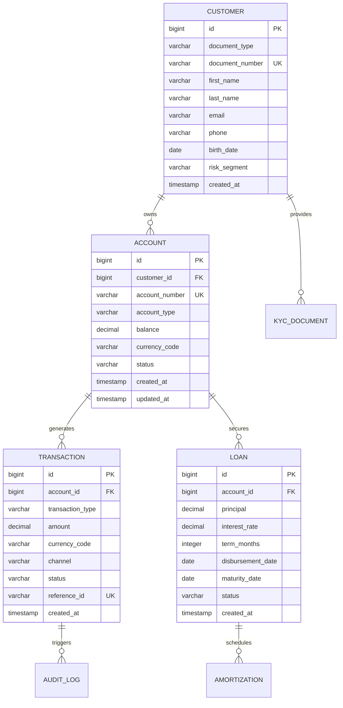
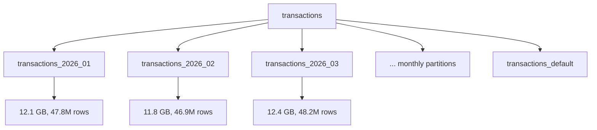
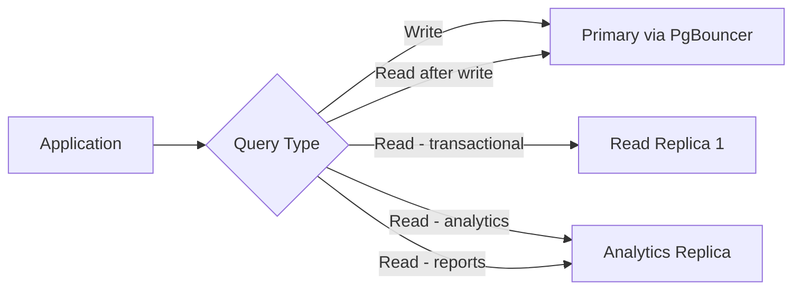
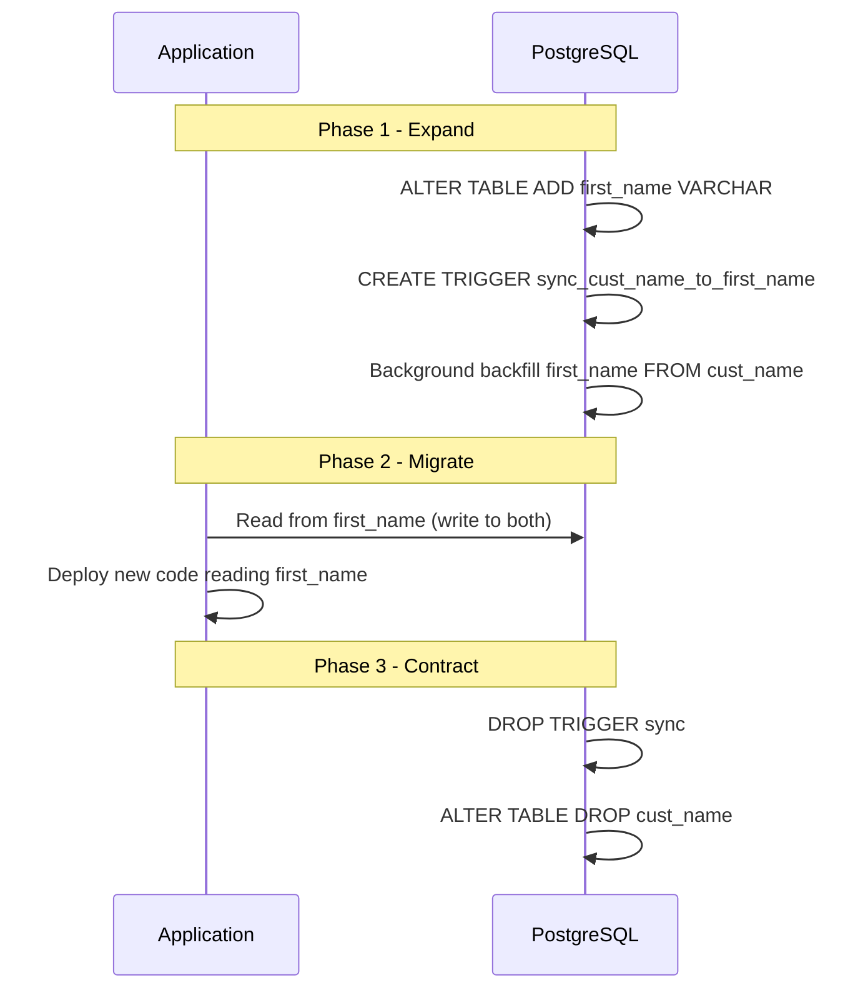

# Database Architecture — Acme Corp Banking Modernization

**Proyecto:** Acme Corp Banking Modernization
**Variante:** Tecnica (full)
**Fecha:** 12 de marzo de 2026
**Motor principal:** PostgreSQL 16 (AWS RDS) + Redis (cache) + TimescaleDB (audit trail)

---

## S1: Schema Design & Modeling

### Entity-Relationship Overview

The core banking schema consists of 6 primary entities supporting account management, transaction processing, lending operations, and regulatory reporting.



### Normalization Analysis

| Table | Normal Form | Denormalization | Justification |
|---|---|---|---|
| `customers` | 3NF | None | Master data; integrity paramount |
| `accounts` | 3NF | `balance` (derived) | Balance is cached; reconciled nightly against `SUM(transactions)` |
| `transactions` | 3NF | `account_balance_after` | Avoids expensive running-sum query for statements; write-time computation |
| `loans` | 3NF | None | Regulatory requirement for normalized loan records |
| `amortization_schedule` | 3NF | `remaining_balance` | Pre-computed for performance; recalculated on prepayment events |

### Naming Conventions

- Tables: `snake_case`, plural (`customers`, `transactions`, `audit_logs`)
- Columns: `snake_case`, singular descriptive (`account_id`, `created_at`, `is_active`)
- Primary keys: `id` (bigint, auto-increment)
- Foreign keys: `{referenced_table_singular}_id` (e.g., `customer_id`, `account_id`)
- Indexes: `idx_{table}_{columns}` (e.g., `idx_transactions_account_id_created_at`)
- Constraints: `chk_{table}_{rule}` (e.g., `chk_transactions_amount_positive`)

### Soft Delete Strategy

All customer-facing tables use soft delete (`deleted_at TIMESTAMP NULL`). Hard delete only via scheduled GDPR erasure pipeline (cryptographic erasure for PII columns).

---

## S2: Indexing Strategy

### Index Inventory

| Table | Index | Type | Columns | Rationale |
|---|---|---|---|---|
| `transactions` | `idx_transactions_account_created` | B-tree (composite) | `(account_id, created_at DESC)` | Account statement queries (most frequent) |
| `transactions` | `idx_transactions_reference` | B-tree (unique) | `(reference_id)` | Idempotency check on payment processing |
| `transactions` | `idx_transactions_created_brin` | BRIN | `(created_at)` | Time-range queries on 47M+ row table |
| `transactions` | `idx_transactions_status_partial` | B-tree (partial) | `(status) WHERE status = 'pending'` | Pending transaction processing queue |
| `customers` | `idx_customers_document` | B-tree (unique) | `(document_type, document_number)` | KYC lookup |
| `customers` | `idx_customers_email_gin` | GIN | `(email gin_trgm_ops)` | Fuzzy search in customer service portal |
| `accounts` | `idx_accounts_customer` | B-tree | `(customer_id)` | Customer dashboard loading |
| `loans` | `idx_loans_maturity` | B-tree | `(maturity_date) WHERE status = 'active'` | Loan maturity pipeline |

### Index Performance Validation

```sql
-- Top 5 queries by execution time (pg_stat_statements, 30-day window)
-- Query 1: Account statement (85% of read load)
EXPLAIN ANALYZE
SELECT * FROM transactions
WHERE account_id = $1 AND created_at BETWEEN $2 AND $3
ORDER BY created_at DESC LIMIT 50;
-- Result: Index Scan using idx_transactions_account_created
-- Execution time: 1.2ms (target: <5ms)
```

### Unused Index Audit

| Index | idx_scan (30d) | Size | Recommendation |
|---|---|---|---|
| `idx_transactions_channel` | 0 | 1.8 GB | **Drop** — channel filter not used in production queries |
| `idx_customers_phone` | 12 | 180 MB | Keep — low usage but supports regulatory lookup |
| `idx_accounts_status` | 3,400 | 45 MB | Keep — used by nightly reconciliation batch |

---

## S3: Partitioning & Sharding

### Partitioning Strategy

The `transactions` table is partitioned by **range on `created_at`** (monthly partitions). At 47.2M rows/month, this keeps each partition manageable (~50M rows, ~12 GB).



| Table | Strategy | Key | Partition Size | Retention |
|---|---|---|---|---|
| `transactions` | Range (monthly) | `created_at` | ~12 GB / partition | 10 years (then archive to S3 Glacier) |
| `audit_logs` | Range (weekly) | `logged_at` | ~2 GB / partition | 7 years (TimescaleDB continuous aggregates) |
| `sessions` | Hash (16 partitions) | `session_id` | ~500 MB / partition | 90 days (auto-drop) |

### Partition Maintenance

- **Auto-creation:** pg_partman creates next 3 months of partitions in advance
- **Archival:** Partitions older than 24 months detached and exported to S3 Parquet via `pg_dump --format=custom`
- **Query performance:** Partition pruning validated — `EXPLAIN` shows only relevant partitions scanned

### Sharding Assessment

Current transaction volume (47M/month, ~18K TPS peak) is within single-node PostgreSQL capacity on `db.r6g.4xlarge` (16 vCPU, 128 GB RAM). Sharding is **not recommended at this scale**. Revisit at >100K TPS sustained or >500M rows/month.

---

## S4: Replication & High Availability

### Replication Topology

| Component | Configuration | RPO | RTO |
|---|---|---|---|
| Primary | RDS PostgreSQL 16, `db.r6g.4xlarge`, Multi-AZ | 0 (sync standby) | < 60s (auto-failover) |
| Read Replica 1 | Same AZ, async, `db.r6g.2xlarge` | < 1s | N/A (read-only) |
| Read Replica 2 | Cross-region (disaster recovery), async | < 30s | < 15 min (manual promotion) |
| Analytics Replica | Dedicated for BI/reporting, async, `db.r6g.4xlarge` | < 5 min | N/A |

### Connection Management

| Parameter | Value | Rationale |
|---|---|---|
| `max_connections` | 200 | 16 vCPU * 2 + SSD = ~40 optimal; 200 for pooler headroom |
| PgBouncer pool size | 40 | Matches optimal connection count |
| PgBouncer mode | Transaction | Short transactions (avg 12ms); maximizes connection reuse |
| Application pool (HikariCP) | 20 per instance (4 instances) | 80 total < PgBouncer pool |
| `idle_in_transaction_session_timeout` | 30s | Prevents long-held connections blocking vacuum |

### MVCC Tuning

| Table | `autovacuum_vacuum_scale_factor` | `autovacuum_vacuum_threshold` | Rationale |
|---|---|---|---|
| `transactions` | 0.01 (1%) | 50 | High-write table; 47M rows; vacuum triggered at ~470K dead tuples |
| `accounts` | 0.05 (5%) | 50 | Moderate updates (balance changes) |
| `sessions` | 0.02 (2%) | 100 | High churn; short-lived records |
| `customers` | 0.20 (default) | 50 | Low update frequency |

### Read Replica Routing



- **Lag monitoring:** Alert at > 1s for replica 1, > 30s for analytics replica
- **Stale-read protection:** Post-write reads routed to primary for 5s window via application middleware

---

## S5: Migration & Evolution

### Migration Framework

- **Tool:** Flyway (version-controlled SQL migrations, sequential numbering)
- **Naming:** `V{version}__{description}.sql` (e.g., `V042__add_transaction_channel_column.sql`)
- **Policy:** Forward-only; rollback scripts maintained for critical changes only
- **Idempotency:** All DDL uses `IF NOT EXISTS` / `IF EXISTS`

### Planned Migrations (Q2 2026)

| Migration | Pattern | Downtime | Rollback Window |
|---|---|---|---|
| Add `channel` to `transactions` | Add nullable column (instant) | Zero | 72h |
| Rename `cust_name` to `first_name` | Expand-contract (3-phase) | Zero | 7 days |
| Add `risk_score` to `accounts` (NOT NULL) | Shadow column + backfill + swap | Zero | 48h |
| Partition `audit_logs` (existing 800M rows) | pg_partman + background migration | Zero | N/A (irreversible) |

### Expand-Contract Example: Column Rename



### Data Backfill Strategy

- **Batch size:** 5,000 rows per transaction (avoids long locks)
- **Throttling:** 100ms pause between batches during peak hours
- **Progress:** `backfill_progress` table tracks last processed ID per migration
- **Validation:** Row count comparison + checksum sampling (1% of rows) before cutover

---

## S6: Performance Tuning

### Memory Configuration

| Parameter | Value | Rationale |
|---|---|---|
| `shared_buffers` | 32 GB (25% of 128 GB) | Standard recommendation for dedicated DB server |
| `effective_cache_size` | 96 GB (75% of 128 GB) | Planner hint; includes OS page cache |
| `work_mem` | 32 MB | Moderate; max 200 connections * 32 MB = 6.4 GB worst case |
| `maintenance_work_mem` | 2 GB | Fast VACUUM and CREATE INDEX during maintenance |
| `wal_buffers` | 64 MB | High-write workload; reduces WAL contention |
| `checkpoint_completion_target` | 0.9 | Spreads checkpoint writes for smoother I/O |

### Slow Query Analysis (Top 3)

| Query | Avg Time | Calls/Day | Optimization Applied | After |
|---|---|---|---|---|
| Customer 360 join (5 tables) | 340ms | 12,400 | Materialized view + 15-min refresh | 8ms |
| Loan amortization schedule | 180ms | 3,200 | Covering index (INCLUDE remaining_balance) | 12ms |
| Monthly statement generation | 2.1s | 890 | BRIN index + partition pruning | 45ms |

### Caching Strategy

| Cache Layer | Technology | TTL | Invalidation | Hit Rate |
|---|---|---|---|---|
| Account balance | Redis | 30s | Write-through on transaction commit | 94.2% |
| Customer profile | Redis | 5 min | Event-driven (CDC) | 97.1% |
| Product catalog | Redis | 1 hour | Manual flush on catalog update | 99.3% |
| Statement PDF | S3 | 24 hours | Regenerate on new transaction | 88.7% |

### Monitoring Thresholds

| Metric | Warning | Critical | Current |
|---|---|---|---|
| Buffer cache hit ratio | < 97% | < 95% | 98.4% |
| Slow queries (> 100ms) | > 50/hour | > 200/hour | 12/hour |
| Connection pool utilization | > 70% | > 85% | 52% |
| Replication lag (replica 1) | > 500ms | > 2s | 120ms avg |
| Table bloat (transactions) | > 15% | > 25% | 8.2% |
| Deadlocks | > 0/day | > 3/day | 0 |

---

## Conclusions

### Architecture Decisions Summary

| Decision | Choice | Rationale |
|---|---|---|
| Primary database | PostgreSQL 16 (RDS) | ACID compliance, JSON support, mature ecosystem, partitioning |
| Time-series data | TimescaleDB (audit logs) | Continuous aggregates, compression, retention policies |
| Cache layer | Redis (ElastiCache) | Sub-ms latency, TTL, pub/sub for invalidation |
| Connection pooling | PgBouncer (transaction mode) | Proven, lightweight, transaction-mode for short queries |
| Migration tool | Flyway | Version-controlled, SQL-native, CI/CD integration |
| HA strategy | Multi-AZ RDS + cross-region replica | RPO=0 (sync), RTO < 60s, DR < 15 min |

### Estimated Infrastructure Cost

| Component | Instance | Monthly Cost |
|---|---|---|
| Primary (Multi-AZ) | db.r6g.4xlarge | $4,200 |
| Read Replica 1 | db.r6g.2xlarge | $1,400 |
| Cross-Region DR Replica | db.r6g.2xlarge | $1,600 |
| Analytics Replica | db.r6g.4xlarge | $2,100 |
| ElastiCache (Redis) | cache.r6g.xlarge (3 nodes) | $1,800 |
| Storage (GP3, 2 TB) | — | $320 |
| **Total** | | **$11,420/month** |

---

**Autor:** Javier Montano — Sofka Discovery Framework v6.0
