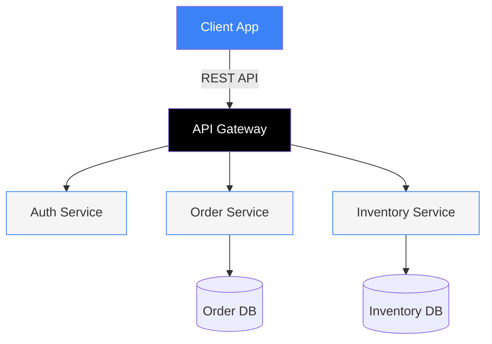

# Design System — Acme Corp

Token configuration and component reference for the Acme Corp engagement.

## 1. Brand Token Configuration

Source: `brand-config.json`

| Token | Value | CSS Variable |
|-------|-------|-------------|
| Primary | `#3B82F6` | `var(--brand-primary)` |
| Primary Light | `#60A5FA` | `var(--brand-primary-light)` |
| Primary Dark | `#2563EB` | `var(--brand-primary-dark)` |
| Primary Dim | `rgba(59,130,246,0.10)` | `var(--brand-primary-dim)` |
| Black | `#000000` | `var(--brand-black)` |
| White | `#FFFFFF` | `var(--brand-white)` |
| Background | `#F5F5F5` | `var(--brand-background)` |
| Muted | `#9CA3AF` | `var(--brand-muted)` |

### Font Stack

| Role | Family | Google Fonts URL |
|------|--------|-----------------|
| Display | `'Inter', system-ui, sans-serif` | `https://fonts.googleapis.com/css2?family=Inter:wght@300;400;500;600;700&display=swap` |
| Body | `'Inter', system-ui, sans-serif` | (same) |

## 2. Semantic Colors (Universal)

These never change per brand:

| State | Color | Dim | Border | Text |
|-------|-------|-----|--------|------|
| Positive | `#FFD700` | `rgba(255,215,0,0.12)` | `rgba(255,215,0,0.45)` | `#B8860B` |
| Warning | `#D97706` | `rgba(217,119,6,0.08)` | — | — |
| Critical | `#DC2626` | `rgba(220,38,38,0.07)` | — | — |
| Info | `#2563EB` | `rgba(37,99,235,0.07)` | — | — |

## 3. Sample Styled Section — Architecture Overview

> **Section Header Pattern:** 60x60px black box with brand-primary number

### 01 — Current State Assessment

The current architecture presents three critical findings:

**Finding 1: Monolithic coupling**
- Severity: `critical` — Red left border, red tint background
- Impact: Deployment frequency limited to 1x/month
- Recommendation: Decompose into 3 bounded contexts

**Finding 2: Missing observability**
- Severity: `high` — Orange left border
- Impact: MTTR averages 4 hours due to blind spots
- Recommendation: Implement distributed tracing

**Finding 3: Manual scaling**
- Severity: `medium` — Amber left border, BLACK text (WCAG AA)
- Impact: Peak traffic causes 30% error rate
- Recommendation: Auto-scaling policies on compute tier

### Component Usage in This Section

```
card-critical  → Finding 1 (monolithic coupling)
card-warning   → Finding 3 (manual scaling)
callout-info   → Architecture recommendation callout
badge          → Severity labels
badge-outline  → Impact category tags
```

## 4. Mermaid Diagram Integration

Architecture diagrams use Mermaid with brand-primary theming:



> **Note:** Mermaid node colors use brand tokens. `fill:#3B82F6` maps to `var(--brand-primary)`. In production HTML, these are injected from brand-config.json.

## 5. Validation Checklist

- [x] All colors reference CSS custom properties (no hex in components)
- [x] Semantic colors: positive=yellow, not green
- [x] Hero border: 8px solid brand-primary
- [x] WCAG AA contrast verified (severity-medium uses black text)
- [x] Font fallbacks: system-ui, sans-serif
- [x] Responsive: 3 breakpoints configured
