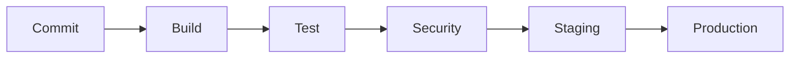
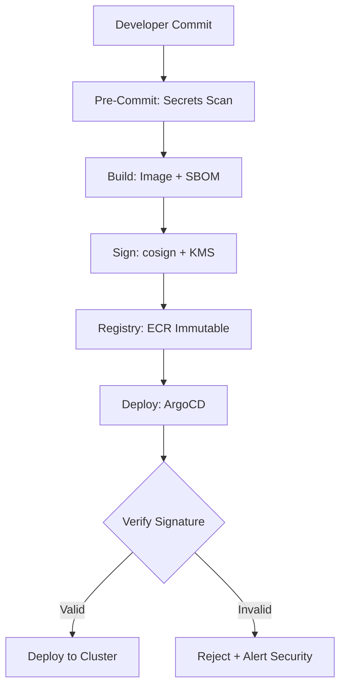
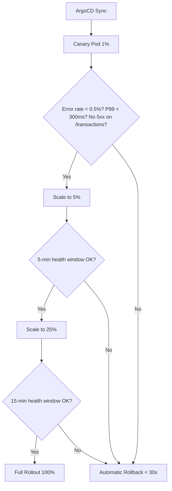

# DevSecOps Architecture — Acme Corp Banking Modernization

**Proyecto:** Acme Corp Banking Modernization
**Pipeline:** GitHub Actions + ArgoCD + Flagger
**Variante:** Tecnica (full)
**Fecha:** 12 de marzo de 2026

---

## Executive Summary

Acme Corp's banking platform requires a hardened delivery pipeline that integrates security into every stage -- from developer commit to production deployment. This architecture defines a 6-stage CI/CD pipeline with 7 automated security gates, supply chain integrity via SBOM and artifact signing, canary deployment with automated rollback, DORA metrics tracking, and compliance automation aligned with SFC (Superintendencia Financiera de Colombia) requirements. Pipeline target: <10 min commit-to-staging, <45 min commit-to-production for standard changes.

---

## S1: CI/CD Pipeline Architecture

### 6-Stage Pipeline

| Stage | Duration | Tools | Gate |
|---|---|---|---|
| **1. Commit** | ~3 min | GitHub Actions | Lint, unit tests (>85% coverage), secrets scan |
| **2. Build** | ~4 min | Docker, ECR | Container build, image scan, SBOM generation, artifact signing |
| **3. Test** | ~12 min | JUnit, Playwright, k6 | Integration tests, E2E smoke, contract tests, performance baseline |
| **4. Security** | ~6 min | Semgrep, Snyk, Checkov | SAST, SCA, IaC scan -- block on critical/high |
| **5. Staging** | ~8 min | ArgoCD, OWASP ZAP | Deploy to staging, DAST scan on critical banking endpoints |
| **6. Production** | ~12 min | ArgoCD, Flagger | Canary deploy (1% -> 5% -> 25% -> 100%), health checks |

**Total Pipeline Time:** ~45 min (commit to full production rollout)

### Branching Strategy

- **Trunk-based development:** `main` is always deployable
- Short-lived feature branches (<24h), squash merge to main
- Release tags (`v1.2.3`) trigger production deployment
- Hotfix branches: cherry-pick to main + expedited pipeline (security gates still mandatory)

### Artifact Management

- **Registry:** Amazon ECR (private, cross-region replicated to DR region)
- **Versioning:** `v{semver}-{git-sha-short}` (e.g., `v2.4.1-b3c7d8e`)
- **Immutability:** Tag-based immutability enabled -- published images cannot be overwritten
- **Retention:** 90 days for non-production tags; production tags retained indefinitely

### Environment Promotion

Same container image promoted through all environments (no rebuild):

| Environment | Trigger | Config Source | Approval |
|---|---|---|---|
| Dev | Push to `main` | ConfigMap (dev) | Automated |
| Staging | Security gates pass | ConfigMap (staging) | Automated |
| Production | Release tag | External Secrets Operator (Vault) | Manual (medium/high risk) |

---

## S2: Shift-Left Security

### Security Gates by Stage

| Tool | Type | Stage | Gate Policy | False Positive Strategy |
|---|---|---|---|---|
| **Semgrep** | SAST | Commit | Block merge on critical/high (SQLi, auth bypass) | `.semgrepignore` + security team triage weekly |
| **Snyk** | SCA | Build | Block on critical CVE with CVSS >= 9.0 | Snyk ignore with justification + 30-day expiry |
| **Trivy** | Image Scan | Build | Block if base image has critical CVE | Approved base image list (updated weekly by platform team) |
| **Checkov** | IaC Scan | Build | Block non-compliant Terraform (public S3, missing encryption) | `.checkov.yaml` skip list (quarterly review) |
| **GitGuardian** | Secrets | Pre-commit hook | Block commit + alert security team + auto-rotate | Pre-commit hook prevents push entirely |
| **OWASP ZAP** | DAST | Staging | Block on high-severity findings in banking endpoints | Tuned scan policy for financial APIs |
| **FOSSA** | License | Build | Block GPL/AGPL in proprietary banking code | Approved license allowlist |

### Banking-Specific Security Rules (Semgrep Custom)

| Rule ID | Description | Severity | Pattern |
|---|---|---|---|
| `acme-banking-001` | Hardcoded account numbers in source | Critical | `\d{10}` in string literals near "account" |
| `acme-banking-002` | Unencrypted PII in log statements | High | `log.*\b(ssn|cedula|credit_card)\b` |
| `acme-banking-003` | Missing rate limiting on transaction endpoints | Medium | Transaction controllers without `@RateLimit` |
| `acme-banking-004` | Direct DB query without parameterization | Critical | String concatenation in SQL contexts |

---

## S3: Supply Chain Security

### SBOM Generation

- **Format:** CycloneDX 1.5 (JSON)
- **Tool:** Syft (anchore/syft) at build stage
- **Storage:** S3 (`s3://acme-banking-sbom/`) with versioning, linked to container image SHA
- **Consumption:** Vulnerability tracking (Snyk), SFC audit evidence, incident response

### Artifact Signing & Verification

| Artifact | Tool | Key Storage | Verification Point |
|---|---|---|---|
| Container images | cosign (sigstore) | AWS KMS (HSM-backed) | ArgoCD admission controller |
| Helm charts | cosign | AWS KMS | ArgoCD pre-sync hook |
| SBOM attestation | cosign (in-toto) | AWS KMS | Compliance dashboard |
| Migration scripts | GPG signing | Vault | Pre-migration validator |

### Dependency Governance

- All dependencies pinned to exact versions (`=` in requirements.txt, exact in `pom.xml`)
- Lockfile committed and CI verifies integrity (`maven verify`, `pip check`)
- Dependabot: auto-merge patch updates (if all tests pass + no new CVEs); manual review for minor/major
- **Banned dependency list:** 14 packages with known banking-relevant vulnerabilities (reviewed monthly)

---

## S4: Release Management

### Deployment Strategy: Canary with Flagger

**Canary Configuration (Banking-Hardened):**

| Parameter | Value | Rationale |
|---|---|---|
| Initial weight | 1% | Lower than standard (banking risk tolerance) |
| Step interval | 5 minutes | Longer observation for financial transactions |
| Success: error rate | < 0.5% | Stricter than standard (< 1%) |
| Success: P99 latency | < 300ms | Transaction processing SLA |
| Guardrail: HTTP 5xx on `/api/transactions` | 0 allowed | Zero tolerance on transaction endpoint |
| Rollback time | < 30 seconds | Automatic via Flagger |

### Feature Flags (Unleash)

| Flag | Type | Scope | Kill Switch |
|---|---|---|---|
| `new-transfer-flow` | Gradual rollout | 1% -> 5% -> 25% -> 100% | Yes (< 1s) |
| `enhanced-fraud-scoring` | A/B test | 50/50 split | Yes |
| `swift-iso20022-migration` | Boolean | Internal testing only | Yes |
| `biometric-auth-v2` | Gradual rollout | 10% -> 50% -> 100% | Yes (< 1s) |

---

## S5: Pipeline Observability (DORA Metrics)

### Current Baseline vs. Targets

| Metric | Current | Target (6 months) | Elite Benchmark |
|---|---|---|---|
| **Deployment Frequency** | 1x/week | 3x/week | Daily |
| **Lead Time for Changes** | 5 days | 1 day | < 1 hour |
| **Change Failure Rate** | 18% | < 10% | < 5% |
| **MTTR** | 6 hours | < 1 hour | < 15 min |

### Pipeline Metrics Dashboard (Grafana)

| Metric | Source | Warning Threshold | Critical Threshold |
|---|---|---|---|
| Build duration | GitHub Actions | > 15 min | > 30 min |
| Build success rate | GitHub Actions | < 92% | < 85% |
| Security gate block rate | Snyk/Semgrep | > 25% PRs blocked | > 40% (review rules) |
| Canary rollback rate | Flagger | > 15% | > 25% (investigate) |
| DAST finding rate | OWASP ZAP | > 2 medium/release | > 1 high/release |
| SBOM drift (new deps) | Syft diff | > 5 new deps/release | > 10 (review) |

### Incident Correlation

- Every deployment tagged with version + timestamp in Datadog
- Deployment markers on Grafana dashboards (visual correlation with error rate, latency)
- PagerDuty integration: auto-link recent deployments to P1/P2 incidents
- **Banking-specific:** Transaction success rate tracked per deployment with 30-min lookback

---

## S6: Compliance Automation

### SFC Regulatory Alignment

| SFC Requirement | Control | Automation | Evidence |
|---|---|---|---|
| Circular 007: Change management | All changes via pipeline; no manual production access | ArgoCD + branch protection | Deployment audit log (immutable) |
| Circular 042: Information security | SAST + SCA + DAST on every release | Security gates in pipeline | Scan reports per release (S3) |
| Circular 008: Operational risk | Canary deployment + automatic rollback | Flagger metrics analysis | Rollback logs + incident timeline |
| Data sovereignty | All builds and deployments in Colombia region | Infrastructure policy (Checkov) | Cloud resource inventory |

### Policy-as-Code (OPA/Gatekeeper)

| Policy | Scope | Enforcement | Action on Violation |
|---|---|---|---|
| Container must use approved base image | All pods | Admission controller | Reject deployment |
| All pods must have resource limits | All namespaces | Admission controller | Reject pod |
| No `latest` tag in production | Production namespace | Admission controller | Reject deployment |
| All secrets must come from Vault | All namespaces | Admission controller | Reject pod |
| Network policies must exist per namespace | All namespaces | Quarterly audit | Alert platform team |

### Audit Trail

- **Storage:** CloudWatch Logs + S3 (immutable, 7-year retention per SFC Circular 007)
- **Per deployment:** timestamp, deployer (SSO identity), version, environment, all gate results, approval chain, SBOM reference
- **Integrity:** CloudTrail log file validation enabled; tamper detection via S3 Object Lock
- **Queryable:** Athena for ad-hoc compliance queries; pre-built queries for SFC audit

---

## S7: Minimum Controls & Risk Matrix

### Risk-Based Deployment Controls

| Risk Level | Examples | Deployment Strategy | Approval Required | Security Gates |
|---|---|---|---|---|
| **Low** | Documentation, UI copy, feature flag toggle | Auto-deploy, any time | Automated (CI pass) | Commit stage only |
| **Medium** | New features, dependency updates, config changes | Business hours, canary (1% -> 100%) | Engineer + tech lead | Commit + build + test + security |
| **High** | Authentication, transaction processing, DB schema, encryption | Canary (1% -> 5% -> 25% -> 100%), extended monitoring | Security + architect + CAB | All stages + penetration test + CAB review |

### Mandatory Controls (All Risk Levels)

- Code compiles and passes unit tests (> 85% coverage)
- No secrets in code (GitGuardian pre-commit)
- Container image scanned (Trivy, zero critical CVEs)
- Artifact signed (cosign + KMS)
- SBOM generated and stored

### Change Advisory Board (CAB) for High-Risk Changes

- **Composition:** CISO, VP Engineering, Domain Architect, Compliance Officer
- **Cadence:** Weekly (Tuesday, 2pm) for planned changes; emergency within 2 hours
- **Required artifacts:** Change request, security assessment, rollback plan, test evidence
- **Decision:** Approve, conditional approve, reject (with documented rationale)

---

## Conclusions

### Pipeline Security Posture

| Control | Coverage | Automation Level | Gap |
|---|---|---|---|
| SAST (static analysis) | 100% of commits | Fully automated | None |
| SCA (dependency scanning) | 100% of builds | Fully automated | None |
| Secrets scanning | 100% (pre-commit + post-commit) | Fully automated | None |
| Container image scanning | 100% of images | Fully automated | None |
| DAST (dynamic testing) | Critical banking endpoints only | Automated in staging | Expand to all API endpoints (Q3) |
| SBOM generation | 100% of releases | Fully automated | None |
| Artifact signing | 100% of production artifacts | Fully automated | None |
| Penetration testing | Quarterly (manual) | Manual | Automate subset in pipeline (Q4) |

### Implementation Roadmap

| Phase | Timeline | Deliverables | Effort |
|---|---|---|---|
| Phase 1: Core Pipeline | Weeks 1-4 | CI/CD stages, SAST, SCA, image scanning | 2 engineers, 4 weeks |
| Phase 2: Supply Chain | Weeks 5-8 | SBOM, artifact signing, dependency governance | 1 engineer, 4 weeks |
| Phase 3: Canary + DORA | Weeks 9-12 | Flagger canary, DORA dashboard, Grafana | 2 engineers, 4 weeks |
| Phase 4: Compliance | Weeks 13-16 | OPA policies, audit trail, SFC evidence collection | 1 engineer + compliance, 4 weeks |

---

**Autor:** Javier Montano — Sofka Discovery Framework v6.0
