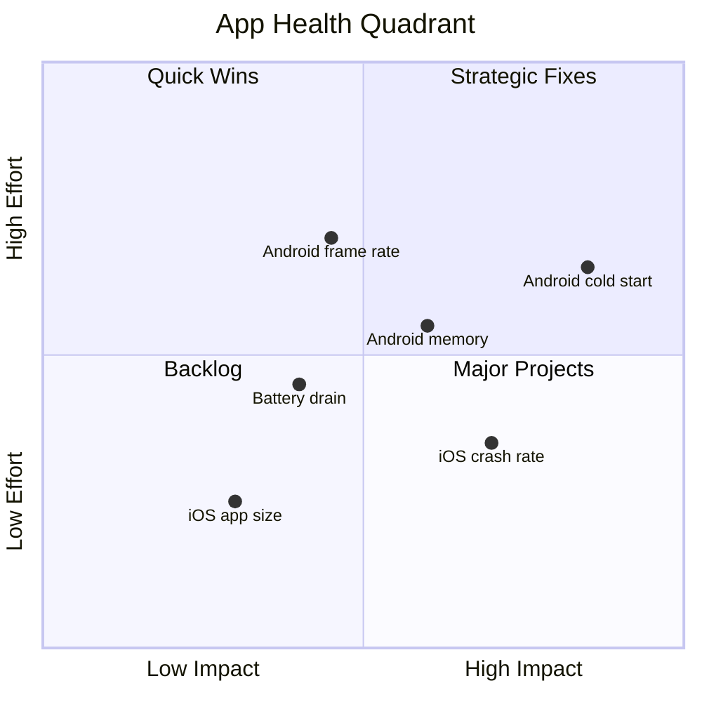
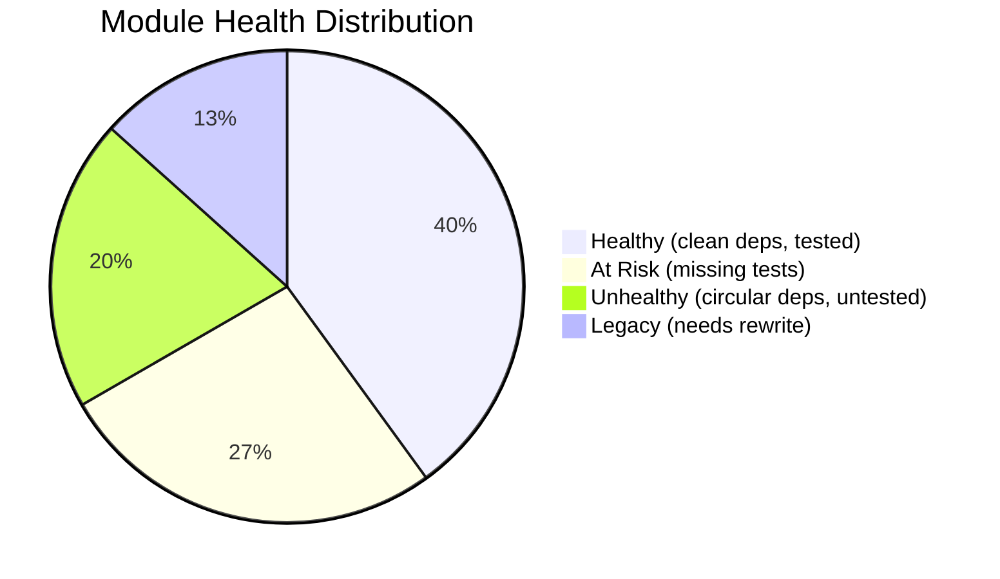
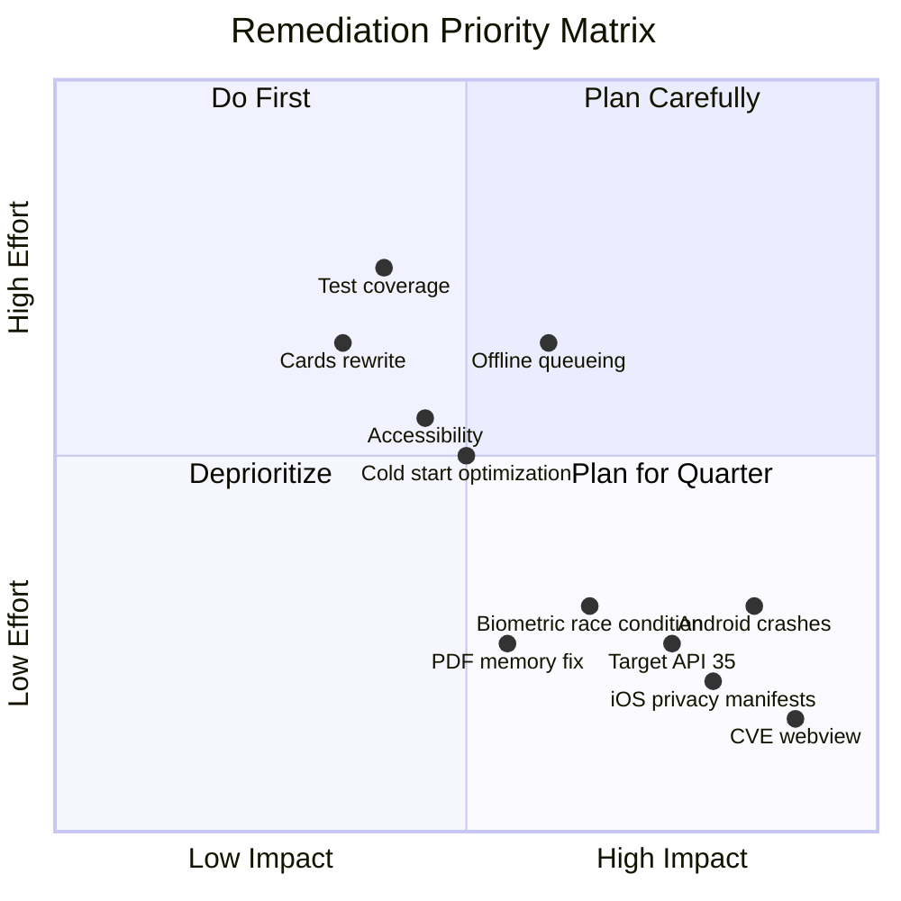

# Mobile Assessment — Acme Corp Banking Modernization

AS-IS assessment of the Acme Corp mobile banking app (v2.7.3) serving 1.8M monthly active users. This document evaluates app health, dependency security, platform compliance, code quality, user experience metrics, and provides a prioritized remediation roadmap.

---

## S1: App Health Profile

### Crash & Stability Metrics

| Metric | Current | Benchmark | Rating | Action |
|--------|---------|-----------|--------|--------|
| Crash-free sessions (iOS) | 99.82% | >99.95% | Poor | Prioritize top 3 crashes |
| Crash-free sessions (Android) | 99.71% | >99.95% | Poor | Critical -- below Play threshold |
| ANR rate (Android) | 0.38% | <0.47% | Acceptable | Monitor -- approaching threshold |
| Hang rate (iOS) | 0.12% | <0.10% | At Risk | Address main thread blocks |

### Top Crashes

| # | Crash | Platform | Frequency | Affected Users | Root Cause |
|---|-------|----------|-----------|---------------|------------|
| 1 | `NullPointerException` in TransactionListAdapter | Android | 847/week | 12,400 | Null response from legacy API endpoint |
| 2 | `EXC_BAD_ACCESS` in BiometricAuthModule | iOS | 312/week | 4,800 | Race condition in Keychain access |
| 3 | `OutOfMemoryError` in StatementPDFViewer | Android | 228/week | 3,200 | Uncompressed PDF rendered in-memory |
| 4 | `NSInternalInconsistencyException` in CardListVC | iOS | 156/week | 2,100 | Stale data source after background refresh |
| 5 | `IllegalStateException` in PaymentFormFragment | Android | 89/week | 1,400 | Fragment state loss on config change |

### Performance Vitals

| Metric | iOS | Android | Target | Status |
|--------|-----|---------|--------|--------|
| Cold start | 1.8s | 2.9s | <2.0s | Android CRITICAL |
| App size (download) | 42MB | 38MB (APK) | <40MB | iOS over budget |
| Memory (peak) | 195MB | 238MB | <200MB | Android over budget |
| Memory (baseline) | 120MB | 165MB | <150MB | Android over budget |
| Frame rate (accounts list) | 58fps | 42fps | 60fps | Android POOR |
| Battery drain (1hr active) | 4.2% | 6.8% | <5% | Android over budget |

### Performance Distribution

---

## S2: Dependency & Security Audit

### Dependency Overview

| Category | Count | Outdated | Abandoned | CVE |
|----------|-------|----------|-----------|-----|
| Direct dependencies | 47 | 12 | 3 | 2 |
| Transitive dependencies | 189 | 34 | 7 | 5 |
| Native modules (iOS) | 14 | 4 | 1 | 0 |
| Native modules (Android) | 16 | 6 | 2 | 1 |
| **Total** | **266** | **56** | **13** | **8** |

### Critical CVEs

| CVE | Library | CVSS | Exploitability | Fix |
|-----|---------|------|---------------|-----|
| CVE-2025-31842 | `react-native-webview` 12.1.0 | 9.1 (Critical) | Network | Update to 13.2.1 |
| CVE-2025-28910 | `axios` 0.27.2 | 7.5 (High) | Network | Update to 1.7.0 |
| CVE-2025-22847 | `lodash` 4.17.20 | 7.3 (High) | Network | Update to 4.17.25 |
| CVE-2025-19203 | `react-native-fast-image` 8.6.3 | 6.5 (Medium) | Local | Update to 9.0.1 |

### Abandoned Libraries (No updates >12 months)

| Library | Last Update | Purpose | Replacement |
|---------|------------|---------|-------------|
| `react-native-pdf` | Jan 2024 | PDF viewer | `react-native-pdf-light` or WebView |
| `react-native-device-info` 10.x | Mar 2024 | Device metadata | Update to 11.x (maintained fork) |
| `rn-fetch-blob` | Nov 2023 | File downloads | `react-native-blob-util` |

### License Risk

| License | Count | Risk |
|---------|-------|------|
| MIT | 198 | None |
| Apache 2.0 | 41 | None (attribution required) |
| BSD-3 | 18 | None |
| ISC | 6 | None |
| GPL-2.0 | 2 | HIGH -- incompatible with proprietary app |
| Unknown | 1 | Investigate |

---

## S3: Platform Compliance

### iOS Compliance Checklist

| Requirement | Status | Finding |
|------------|--------|---------|
| PrivacyInfo.xcprivacy (app) | PASS | Present with all required API declarations |
| PrivacyInfo.xcprivacy (SDKs) | FAIL | 3 SDKs missing manifests (analytics, crash, ad attribution) |
| ATT prompt | PASS | Shown after first successful login |
| Privacy nutrition labels | WARNING | "Location" declared but not used -- remove |
| Minimum deployment target | PASS | iOS 16.0 |
| Entitlements audit | WARNING | Push notification entitlement present but remote notification background mode unused |
| In-App Purchase | N/A | No digital goods sold |

### Android Compliance Checklist

| Requirement | Status | Finding |
|------------|--------|---------|
| Target API level (35) | FAIL | Currently targeting API 34 -- must update by August 2026 |
| Data Safety section | WARNING | Does not declare "Financial info" collection category |
| Background location | PASS | Not requested |
| Permissions at point of use | FAIL | Camera permission requested at startup, not at check deposit |
| COPPA/Families | N/A | Not targeting children |

### Accessibility Audit

| Check | iOS | Android | Standard |
|-------|-----|---------|----------|
| Screen reader labels | 72% coverage | 64% coverage | 100% required |
| Touch targets (44pt/48dp) | 89% pass | 78% pass | 100% required |
| Color contrast 4.5:1 | PASS | PASS | WCAG AA |
| Dynamic type support | Partial (clips on 3 screens) | Partial (clips on 5 screens) | No clipping |
| Focus order | Correct | 2 screens out of order | Logical sequence |

---

## S4: Code Quality & Architecture Fitness

### Code Metrics

| Metric | Value | Target | Status |
|--------|-------|--------|--------|
| Lines of code (JS/TS) | 142,000 | -- | -- |
| TODO/FIXME/HACK count | 87 | <20 | HIGH |
| Average cyclomatic complexity | 12.3 | <15 | PASS |
| Functions with complexity >20 | 14 | 0 | HIGH |
| Code duplication | 7.8% | <5% | MEDIUM |
| Dead code (unreachable) | ~3,200 lines | 0 | MEDIUM |
| Deprecated API usage | 23 instances | 0 | HIGH |

### Test Coverage

| Layer | Coverage | Target | Status |
|-------|----------|--------|--------|
| Business logic (use cases) | 71% | >80% | GAP |
| ViewModels | 58% | >70% | GAP |
| UI components | 34% | >50% | GAP |
| Integration (E2E) | 12 flows | 20 critical flows | GAP |
| Flaky test rate | 4.8% | <2% | HIGH |

### Architecture Fitness

| Module | Health | Issues |
|--------|--------|--------|
| `feature-accounts` | Healthy | Clean separation, 78% coverage |
| `feature-transfers` | At Risk | Business logic in ViewModel (should be Use Case) |
| `feature-payments` | Unhealthy | Circular dependency with `feature-accounts`, 22% coverage |
| `feature-cards` | Legacy | MVC pattern, no ViewModel layer, no tests |
| `feature-auth` | Healthy | Well-isolated, biometric abstracted |
| `core-network` | At Risk | Retry logic duplicated, no circuit breaker |

---

## S5: User Experience Metrics

### Load Time Metrics

| Screen | TTI (iOS) | TTI (Android) | Target | Status |
|--------|----------|---------------|--------|--------|
| Dashboard | 1.2s | 2.1s | <1.5s | Android SLOW |
| Account Detail | 0.8s | 1.4s | <1.0s | Android SLOW |
| Transaction History | 1.1s | 1.9s | <1.5s | Android AT RISK |
| Transfer Form | 0.6s | 0.9s | <1.0s | PASS |
| Card Management | 0.9s | 1.6s | <1.5s | Android AT RISK |

### Interaction Quality

| Metric | iOS | Android | Target |
|--------|-----|---------|--------|
| Scroll FPS (transaction list) | 58fps | 42fps | 60fps |
| Tap response time | 80ms | 140ms | <100ms |
| Pull-to-refresh latency | 1.2s | 1.8s | <1.5s |
| Keyboard input lag | None | 20ms | None |

### Offline Behavior Assessment

| Scenario | Result | Expected |
|----------|--------|----------|
| View cached balances | PASS | Shows last known with timestamp |
| Queue transfer offline | FAIL | App shows error instead of queueing |
| Resume after airplane mode | PARTIAL | Sync works but no retry for failed items |
| Background sync | FAIL | Not implemented on either platform |

### App Store Ratings

| Store | Rating | Reviews (90 days) | Top Complaint |
|-------|--------|-------------------|---------------|
| App Store | 3.8 / 5.0 | 1,240 | "App crashes when viewing statements" |
| Google Play | 3.4 / 5.0 | 2,890 | "Slow and laggy, especially account screen" |

---

## S6: Remediation Roadmap

### Critical (Fix Immediately)

| # | Finding | Impact | Effort | Owner |
|---|---------|--------|--------|-------|
| 1 | CVE-2025-31842 in react-native-webview | Security -- network exploitable | 1 day | Mobile Lead |
| 2 | Android crash rate 99.71% (below Play threshold) | Store visibility at risk | 3 days | Android Dev |
| 3 | 3 iOS SDKs missing PrivacyInfo.xcprivacy | App Store rejection risk | 2 days | iOS Dev |
| 4 | Android target API 34 (must be 35) | Play Store deadline Aug 2026 | 3 days | Android Dev |

### High (Fix Within 1 Sprint)

| # | Finding | Impact | Effort | Owner |
|---|---------|--------|--------|-------|
| 5 | Update axios, lodash (CVE patches) | Security | 1 day | Full Stack |
| 6 | iOS BiometricAuthModule race condition | 312 crashes/week | 3 days | iOS Dev |
| 7 | Android OutOfMemoryError in PDF viewer | 228 crashes/week | 2 days | Android Dev |
| 8 | Camera permission requested at startup | Play compliance | 1 day | Android Dev |
| 9 | GPL-2.0 licensed dependencies | Legal risk | 2 days | Tech Lead |
| 10 | ANR rate 0.38% (approaching 0.47% threshold) | Store visibility risk | 3 days | Android Dev |

### Medium (Plan Within Quarter)

| # | Finding | Impact | Effort | Owner |
|---|---------|--------|--------|-------|
| 11 | Replace 3 abandoned libraries | Maintenance risk | 2 weeks | Team |
| 12 | Implement offline transfer queueing | UX gap, 18% of users in low-connectivity areas | 2 weeks | Mobile Lead |
| 13 | Android cold start optimization (2.9s -> <2.0s) | 14% higher abandonment at >2.5s | 1 week | Android Dev |
| 14 | Accessibility: screen reader labels to 100% | Compliance, user reach | 1 week | UI Dev |
| 15 | Increase test coverage to 80% business logic | Quality, regression prevention | 3 weeks | Team |
| 16 | Rewrite `feature-cards` module (MVC -> MVVM) | Tech debt, untestable | 2 weeks | Mobile Lead |

### Prioritization Score

### Progress Tracking

| Metric | Current | Target (Q2) | Target (Q3) |
|--------|---------|-------------|-------------|
| Crash-free sessions (iOS) | 99.82% | 99.95% | 99.98% |
| Crash-free sessions (Android) | 99.71% | 99.90% | 99.95% |
| ANR rate | 0.38% | 0.25% | 0.15% |
| Cold start (Android) | 2.9s | 2.0s | 1.5s |
| Critical CVEs | 1 | 0 | 0 |
| Test coverage (business logic) | 71% | 80% | 85% |
| App Store rating (iOS) | 3.8 | 4.2 | 4.5 |
| Google Play rating | 3.4 | 3.8 | 4.2 |

---

## Conclusions

The Acme Corp mobile banking app has critical stability issues on Android (crash-free rate 99.71%, below Google Play's 1.09% threshold) and security vulnerabilities requiring immediate patching. iOS faces App Store rejection risk from 3 SDKs missing PrivacyInfo.xcprivacy manifests. The Android cold start time of 2.9s significantly exceeds the 2.0s target and correlates with 14% higher session abandonment.

The 16-item remediation roadmap prioritizes store compliance and security (items 1-4) for immediate action, crash fixes and legal risk (items 5-10) for the current sprint, and structural improvements (items 11-16) for the quarter. Addressing the top 4 items alone would eliminate App Store rejection risk and restore Google Play discoverability.

---

**Autor:** Javier Montano | Sofka | 12 de marzo de 2026
